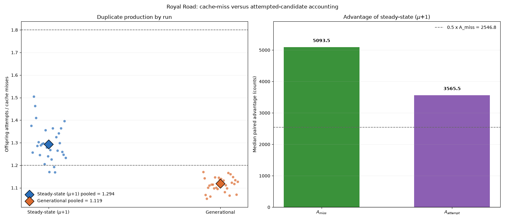

# The Specified Accounting-Reversal Criterion Was Not Met in the Tested Royal Road Genetic-Algorithm Comparison

## Abstract

This study operationally compared a steady-state \((\mu+1)\) genetic algorithm with a non-elitist generational genetic algorithm on one 64-bit Royal Road configuration. Thirty deterministic matched-seed runs used seeds 0 through 29 and the same stated selection, crossover, mutation, target, and cache-miss stopping rules. Seed matching did not synchronize random events after initialization because the algorithms consumed random numbers along different trajectories; the design was therefore a matched-seed comparison, not a tightly coupled common-random-number experiment.

For the reported outputs, the \((\mu+1)\) algorithm had a positive median paired advantage under both accounting systems. Its pooled offspring-attempt/cache-miss ratio was 1.294, and its attempted-candidate median advantage remained greater than half its cache-miss median advantage. Only two of the four report-defined threshold conditions held. Thus, the specified four-condition accounting-reversal criterion was not met for this implementation, configuration, budget, and seed set.

The original report described the design and thresholds as preregistered, but no timestamped archive, identifier, or link was supplied. Those elements are therefore described here as report-defined or prespecified in the available study description, not as independently verifiable preregistration. Executable code, exact dependency versions, and raw per-seed records were also not supplied, so the aggregate numerical results cannot presently be independently audited and the requested per-seed distributions, bootstrap intervals, and sensitivity analyses cannot be reconstructed from the available information.

## Background

Genetic algorithms maintain populations of candidate solutions and use selection and variation to search spaces in which exhaustive enumeration may be impractical. Their behavior can depend on representation, selection, variation, population updating, survivor selection, elitism, and the definition of computational cost.

Evaluation accounting is important when fitness values are memoized. A cache-miss budget measures newly evaluated genotypes, whereas an attempted-candidate budget charges every generated candidate, including candidates whose fitness is returned from a cache. These accounting systems can produce different operational performance scores when an algorithm repeatedly generates previously evaluated genotypes.

The comparison in this report bundles several algorithmic differences. The \((\mu+1)\) implementation updates the population after each child and uses minimum-fitness deletion, while the generational implementation selects from a frozen population and performs non-elitist wholesale replacement after a full generation. Consequently, the experiment compares the two complete implementations as defined; it does not isolate replacement timing, elitism, deletion policy, or any other single feature as a causal mechanism.

The citation placeholders in the original report—[1], [2], [4], [6], [7], [9], and [10]—were not accompanied by authors, titles, publication venues, years, or other identifying metadata. Supplying a bibliography for them would therefore require inventing information not contained in the available materials. The unsupported placeholders and claims tied to unidentified sources have been removed. No external works are cited in this revised report.

## Hypothesis

The available study description stated the following quantitative hypothesis:

> On a 64-bit Royal Road function with eight-bit blocks, population 64, one-point crossover, mutation rate \(1/64\), and seeds 0 through 29, a \((\mu+1)\) GA will generate at least 1.8 offspring attempts per cache-miss fitness evaluation, versus at most 1.2 for a generational GA; consequently, its median counted-evaluation advantage in reaching fitness 56 under cache-miss-only accounting will shrink by at least half when every attempted offspring, including cached duplicates, is charged to the 20,000-evaluation budget.

The original report called this hypothesis preregistered. However, no archived protocol, timestamped link, registration identifier, or other evidence was supplied to establish that the algorithms, seeds, thresholds, budget, failure penalty, and all-conditions decision rule were fixed before the results were observed. The hypothesis is therefore treated here as the report-defined decision rule. Its prospective status cannot be independently verified.

The prediction combined two operational claims:

1. The pooled offspring-attempt/cache-miss ratio would meet the specified lower or upper threshold for each algorithm.
2. Charging every attempted candidate would reduce the median paired advantage of the \((\mu+1)\) implementation by at least half.

The available report stated that support required all four conditions:

1. \(R_{\mu+1} \ge 1.8\);
2. \(R_{\text{generational}} \le 1.2\);
3. \(A_{\text{miss}} > 0\); and
4. \(A_{\text{attempt}} \le 0.5A_{\text{miss}}\).

Under that all-conditions rule, failure of any condition meant that the complete conjunction was not supported. Any resulting verdict applies only to this exact rule, implementation, configuration, budget, penalty, and seed schedule.

## Method

The available description states that the experiment used Python 3.11 or later with NumPy and Matplotlib. The exact Python patch release, NumPy version, Matplotlib version, operating system, hardware, and other environment details were not supplied. An executable source-code archive, lock file, environment specification, and machine-readable output were also not supplied. The study is therefore described below at the algorithmic level, but exact computational reproduction cannot be guaranteed from the available materials.

Each algorithm was reportedly run separately for seeds \(0,1,\ldots,29\). Every algorithm-seed run used a fresh `numpy.random.Generator(numpy.random.PCG64(seed))`. Matching the integer seed provided a deterministic matched-seed schedule, but it did not force the algorithms to receive corresponding random draws for corresponding events. Because the algorithms generated different numbers and sequences of selection, crossover, mutation, and deletion events, their random-number streams diverged along algorithm-dependent trajectories. The design should not be interpreted as a tightly coupled common-random-number experiment or as providing the variance reduction that such coupling can sometimes produce.

Each genotype was a length-64 NumPy `uint8` array. The genotype was divided into eight consecutive eight-bit blocks. Fitness was

\[
f(x)=8\sum_{j=0}^{7} I(\text{all eight bits in block }j\text{ are 1}),
\]

giving possible values \(0,8,\ldots,64\). Target attainment was defined as \(f(x)\ge 56\), meaning that at least seven blocks were complete.

A memoization dictionary was reportedly maintained within each algorithm-seed run. Keys were the eight-byte values produced by `numpy.packbits(x).tobytes()`. A previously unseen key caused fitness to be computed and the cache-miss counter to increase; an existing key returned the stored fitness without increasing that counter. Caching affected the reported accounting and did not alter fitness or population membership.

The initial population contained 64 independently sampled genotypes, with each bit drawn using `rng.integers(0,2,size=64,dtype=numpy.uint8)`. Candidates were passed through the cache in sampling order. All 64 counted as attempted candidates, including duplicate genotypes, and duplicates remained separate population members. If the target first appeared during initialization, its counters were recorded, although construction of the full population continued.

Both algorithms used the same stated parent-selection and variation procedures:

- One tournament sampled two population indices independently and uniformly with replacement.
- The fitter sampled individual was selected; ties were resolved in favor of the first sampled index.
- Two parents were selected independently, so they could be the same population member.
- One-point crossover was always applied. A cut point was sampled uniformly from integers 1 through 63, and one child was formed from the first parent before the cut and the second parent after it.
- Every child bit was independently mutated with probability \(1/64\) using an XOR mask generated by `rng.random(64) < 1/64`.
- Every resulting child counted as an offspring attempt, including a child identical to a parent or to a previously evaluated genotype.

For the \((\mu+1)\) GA, one child was generated and evaluated at a time. A child reaching the target ended the search immediately after its counters were recorded. Otherwise, the child was appended to the population, all individuals with minimum fitness among the resulting 65 members were identified, and one minimum-fitness member was selected uniformly at random and deleted.

For the generational GA, the current 64-member population was frozen while up to 64 children were generated sequentially. Parent selection for all children used only that frozen population. Children were evaluated immediately, allowing the run to stop as soon as a target child appeared. If no child reached the target, the 64 children replaced the parent population without elitism.

Four counters were reportedly maintained:

- `init_attempts`, fixed at 64;
- `init_cache_misses`;
- `offspring_attempts`;
- `offspring_cache_misses`.

Total attempted-candidate and cache-miss counts were

\[
C_{\text{attempt}}=64+\text{offspring attempts}
\]

and

\[
C_{\text{miss}}=\text{initialization misses}+\text{offspring cache misses}.
\]

After initialization, each trajectory continued until target attainment or until \(C_{\text{miss}}=20{,}000\). A child causing the miss count to become exactly 20,000 was fully evaluated and could attain the target. Runs were not stopped when \(C_{\text{attempt}}\) reached 20,000 because the same trajectory was used to derive both accounting outcomes.

For a target-reaching run, the cache-miss score \(S_{\text{miss}}\) was its target \(C_{\text{miss}}\) if no greater than 20,000, and otherwise 20,001. The attempted-candidate score \(S_{\text{attempt}}\) was defined analogously from target \(C_{\text{attempt}}\). A run that did not reach the target before the cache-miss stop received 20,001 under both rules. Thus, the available description defines 20,001 as a fixed failure penalty rather than treating failures as censored or excluding them.

The pooled duplicate-production ratio excluded initialization and was calculated separately for each algorithm:

\[
R=\frac{\sum_{s=0}^{29}\text{offspring attempts}_s}
        {\sum_{s=0}^{29}\text{offspring cache misses}_s}.
\]

A corresponding per-run ratio would be

\[
R_s=
\frac{\text{offspring attempts}_s}
     {\text{offspring cache misses}_s},
\]

provided the denominator is nonzero. The original report gave only the pooled ratios numerically. It did not provide the 30 per-run numerator-denominator pairs needed to report, verify, or summarize all \(R_s\) values.

Pooled ratios combine observations from runs of different lengths. Because runs stopped at target attainment or at the cache-miss boundary, an algorithm that reached the target earlier contributed less of its later search trajectory. The pooled ratio is therefore a descriptive ratio for the observed stopped trajectories, not a stopping-time-independent estimate of intrinsic duplicate-production propensity. A cleaner comparison would additionally compute duplicate ratios over common fixed search windows, such as the same first \(k\) offspring attempts or cache misses for every run. The raw trajectories needed for such an analysis were not supplied.

Paired seed-level advantages were defined as

\[
D_{\text{miss}}(s)
 =S_{\text{miss,generational}}(s)-S_{\text{miss},\mu+1}(s)
\]

and

\[
D_{\text{attempt}}(s)
 =S_{\text{attempt,generational}}(s)-S_{\text{attempt},\mu+1}(s).
\]

Positive differences favored the \((\mu+1)\) GA. The reported \(A_{\text{miss}}\) and \(A_{\text{attempt}}\) were ordinary NumPy medians of the 30 paired differences, including failure penalties. No runs were reported as excluded, and no significance test replaced the stated threshold decision.

For independent audit, the machine-readable per-seed file should contain, at minimum, the following fields for both algorithms:

- algorithm identifier;
- seed;
- initialization attempts;
- initialization cache misses;
- offspring attempts;
- offspring cache misses;
- target \(C_{\text{miss}}\), if attained;
- target \(C_{\text{attempt}}\), if attained;
- cache-budget failure status;
- attempted-budget failure status;
- \(S_{\text{miss}}\);
- \(S_{\text{attempt}}\);
- per-run offspring-attempt/cache-miss ratio.

It should also permit reconstruction of the identities of failed runs, success counts, pooled ratios, paired differences, medians, and target times. No such file was included in the materials available for this revision.

## Results

The aggregate pooled offspring-attempt/cache-miss ratios reported in the original study were:

- \((\mu+1)\) GA: \(R_{\mu+1}=1.2936863397955713\);
- generational GA: \(R_{\text{generational}}=1.1189073460700478\).

The generational pooled ratio met the report-defined upper-bound condition \(R_{\text{generational}}\le 1.2\). The \((\mu+1)\) pooled ratio did not meet the report-defined lower bound \(R_{\mu+1}\ge 1.8\).

The reported median paired advantages favoring the \((\mu+1)\) GA were:

- cache-miss accounting: \(A_{\text{miss}}=5093.5\);
- attempted-candidate accounting: \(A_{\text{attempt}}=3565.5\).

The positive \(A_{\text{miss}}\) met the condition that the \((\mu+1)\) implementation have a positive median paired cache-accounting advantage. However,

\[
0.5A_{\text{miss}}=2546.75,
\]

and the reported attempted-candidate advantage, \(3565.5\), exceeded that threshold. The difference between the two reported medians was

\[
5093.5-3565.5=1528.
\]

Relative to \(A_{\text{miss}}\), this is approximately a 30% reduction. Equivalently, the attempted-candidate median was approximately 70% of the cache-miss median. These values describe the operational change between the two scoring rules. Comparing the medians does not show that duplicate accounting mechanistically caused a particular fraction of the performance difference.

The following inline vector figure provides an accessible aggregate presentation of the four reported numerical summaries. It does not substitute for the unavailable per-seed paired distributions.

<figure aria-labelledby="fig-title" aria-describedby="fig-desc">
<svg xmlns="http://www.w3.org/2000/svg" viewBox="0 0 900 450" role="img" width="100%" style="max-width:900px;background:#ffffff;border:1px solid #777">
  <title id="fig-title">Reported pooled offspring ratios and median paired advantages</title>
  <desc id="fig-desc">The left panel shows pooled offspring-attempt per cache-miss ratios of 1.294 for the mu-plus-one algorithm and 1.119 for the generational algorithm, with reference thresholds at 1.8 and 1.2. The right panel shows median paired advantages of 5093.5 under cache-miss accounting and 3565.5 under attempted-candidate accounting, with half the cache-miss median equal to 2546.75.</desc>
  <rect x="0" y="0" width="900" height="450" fill="white"/>
  <text x="450" y="28" text-anchor="middle" font-family="Arial, sans-serif" font-size="20" font-weight="bold">Aggregate reported outcomes</text>

  <text x="225" y="58" text-anchor="middle" font-family="Arial, sans-serif" font-size="16" font-weight="bold">Pooled offspring attempts per cache miss</text>
  <line x1="70" y1="360" x2="410" y2="360" stroke="#222" stroke-width="2"/>
  <line x1="70" y1="80" x2="70" y2="360" stroke="#222" stroke-width="2"/>
  <line x1="70" y1="192" x2="410" y2="192" stroke="#b2182b" stroke-width="2" stroke-dasharray="7,5"/>
  <text x="405" y="186" text-anchor="end" font-family="Arial, sans-serif" font-size="12" fill="#8b0000">1.2 reference</text>
  <line x1="70" y1="108" x2="410" y2="108" stroke="#7b3294" stroke-width="2" stroke-dasharray="7,5"/>
  <text x="405" y="102" text-anchor="end" font-family="Arial, sans-serif" font-size="12" fill="#5b176e">1.8 reference</text>
  <rect x="125" y="179" width="85" height="181" fill="#2166ac"/>
  <rect x="275" y="203" width="85" height="157" fill="#67a9cf"/>
  <text x="167.5" y="169" text-anchor="middle" font-family="Arial, sans-serif" font-size="14">1.294</text>
  <text x="317.5" y="193" text-anchor="middle" font-family="Arial, sans-serif" font-size="14">1.119</text>
  <text x="167.5" y="384" text-anchor="middle" font-family="Arial, sans-serif" font-size="13">μ+1</text>
  <text x="317.5" y="384" text-anchor="middle" font-family="Arial, sans-serif" font-size="13">Generational</text>
  <text x="62" y="364" text-anchor="end" font-family="Arial, sans-serif" font-size="11">0</text>
  <text x="62" y="224" text-anchor="end" font-family="Arial, sans-serif" font-size="11">1</text>
  <text x="62" y="84" text-anchor="end" font-family="Arial, sans-serif" font-size="11">2</text>

  <text x="675" y="58" text-anchor="middle" font-family="Arial, sans-serif" font-size="16" font-weight="bold">Median paired advantages</text>
  <line x1="500" y1="360" x2="850" y2="360" stroke="#222" stroke-width="2"/>
  <line x1="500" y1="80" x2="500" y2="360" stroke="#222" stroke-width="2"/>
  <line x1="500" y1="241.1" x2="850" y2="241.1" stroke="#b2182b" stroke-width="2" stroke-dasharray="7,5"/>
  <text x="845" y="234" text-anchor="end" font-family="Arial, sans-serif" font-size="12" fill="#8b0000">0.5 × A_miss = 2546.75</text>
  <rect x="555" y="122.3" width="90" height="237.7" fill="#1b7837"/>
  <rect x="710" y="193.6" width="90" height="166.4" fill="#5aae61"/>
  <text x="600" y="112" text-anchor="middle" font-family="Arial, sans-serif" font-size="14">5093.5</text>
  <text x="755" y="184" text-anchor="middle" font-family="Arial, sans-serif" font-size="14">3565.5</text>
  <text x="600" y="384" text-anchor="middle" font-family="Arial, sans-serif" font-size="13">Cache-miss</text>
  <text x="755" y="384" text-anchor="middle" font-family="Arial, sans-serif" font-size="13">Attempted-candidate</text>
  <text x="492" y="364" text-anchor="end" font-family="Arial, sans-serif" font-size="11">0</text>
  <text x="492" y="224" text-anchor="end" font-family="Arial, sans-serif" font-size="11">3000</text>
  <text x="492" y="84" text-anchor="end" font-family="Arial, sans-serif" font-size="11">6000</text>

  <text x="450" y="426" text-anchor="middle" font-family="Arial, sans-serif" font-size="12">Aggregate values only; raw per-seed observations were not available for reconstruction.</text>
</svg>
<figcaption><strong>Figure 1.</strong> Aggregate pooled duplicate ratios and median paired accounting advantages reported for the tested configuration. Reference lines show the report-defined thresholds. The figure does not display the unavailable per-seed paired distributions.</figcaption>
</figure>

The original local figure reference is retained below exactly as supplied for provenance, but the referenced workspace artifact was not available for independent inspection:

The original report stated that the local figure’s left panel presented 30 individual offspring-attempt/cache-miss ratios for each algorithm. Those individual values were not included in the report text or supplied as machine-readable data. Consequently, this revision cannot reproduce the per-run duplicate-ratio distribution or verify the plotted points from the pooled ratios alone.

The reported success counts were:

| Algorithm | Successes within cache-miss budget | Successes within attempted-candidate budget |
|---|---:|---:|
| \((\mu+1)\) GA | 27 of 30 | 26 of 30 |
| Generational GA | 24 of 30 | 22 of 30 |

Charging cached duplicates was associated with one fewer reported success for the \((\mu+1)\) implementation and two fewer reported successes for the generational implementation under the 20,000-count attempted-candidate rule. These aggregate counts do not identify which seeds failed under either accounting rule.

The report-defined threshold decisions were:

| Condition | Reported value | Condition met? |
|---|---:|---|
| \(R_{\mu+1}\ge1.8\) | \(1.2936863397955713\) | No |
| \(R_{\text{generational}}\le1.2\) | \(1.1189073460700478\) | Yes |
| \(A_{\text{miss}}>0\) | \(5093.5\) | Yes |
| \(A_{\text{attempt}}\le0.5A_{\text{miss}}\) | \(3565.5 \le 2546.75\) | No |

Only two of the four conditions held. Under the report-defined all-conditions rule, the exact quantitative conjunction was not supported for the specified implementation, configuration, budget, failure penalty, and seeds 0 through 29. Because no timestamped registration was supplied, this should not be described as an independently verified preregistered rejection.

A complete per-seed results table cannot be reconstructed from the aggregate values. In particular, the supplied materials do not contain the 30 values of \(D_{\text{miss}}(s)\), the 30 values of \(D_{\text{attempt}}(s)\), per-run duplicate ratios, failure identities, cache counters, target counters, or the two scores for each algorithm and seed. Medians and aggregate success counts are insufficient to infer those observations uniquely.

For the same reason, the following requested analyses cannot be computed without new data:

- paired empirical distributions of \(D_{\text{miss}}\) and \(D_{\text{attempt}}\);
- bootstrap intervals over the 30 matched seeds;
- leave-one-seed-out or other seed-level robustness checks;
- recomputed medians under alternative failure penalties;
- sensitivity to alternative cache-miss or attempted-candidate budgets;
- per-run duplicate-ratio summaries;
- duplicate ratios over comparable fixed search windows;
- identification of which seeds changed success status under attempted accounting.

These unavailable robustness analyses are distinct from the report-defined threshold calculation. Their absence does not change the arithmetic of the four reported conditions, but it materially limits assessment of uncertainty, stability, and generalizability.

## Limitations

- **No verifiable preregistration archive.** The original report described the design, seeds, thresholds, 20,000 budget, 20,001 failure penalty, and all-conditions rule as preregistered, but it supplied no timestamped link, identifier, or archived protocol. Their prospective status cannot be verified. This revision therefore treats them as report-defined specifications rather than independently documented preregistration.

- **No executable code or exact environment.** The available materials do not include source code, tests, a version-controlled archive, a commit identifier, an environment lock file, or exact versions of Python, NumPy, Matplotlib, the operating system, and related dependencies. “Python 3.11 or later” is not an exact reproducibility specification.

- **No raw per-seed or trajectory data.** Initialization misses, offspring attempts, offspring misses, target counters, failure status, \(S_{\text{miss}}\), and \(S_{\text{attempt}}\) were not supplied for each algorithm-seed run. The central aggregate results therefore cannot presently be independently audited.

- **No per-seed paired distributions.** Only medians of the paired differences were reported numerically. The identities, signs, magnitudes, and possible outliers among the 30 values of \(D_{\text{miss}}\) and \(D_{\text{attempt}}\) are unavailable. The two medians do not characterize the full paired distributions.

- **No uncertainty intervals.** Bootstrap intervals over seeds cannot be calculated from medians and aggregate success counts alone. No independently selected replication seed set was reported. The 30 deterministic seeds evaluate the stated seed schedule but provide limited support for claims beyond it.

- **No budget or penalty sensitivity analysis.** The effect of replacing the 20,001 failure score with another penalty, or changing the 20,000 budget, cannot be determined from the supplied aggregates. Nonlinear changes in medians are possible when failures are assigned a fixed penalty. The report-defined threshold decision should therefore be kept separate from any unperformed robustness analysis.

- **Matched seeds are not synchronized random events.** Both algorithms reportedly started fresh PCG64 generators with the same integer seed, but their algorithm-dependent control flows caused them to consume random values differently. This is a deterministic matched-seed comparison, not a tightly coupled common-random-number design, and no strong variance-reduction implication should be attributed to the pairing.

- **Limited number and range of seeds.** The experiment used 30 fixed seeds, 0 through 29. The findings characterize the reported outcomes for those seeds and do not establish behavior across all possible initializations or independently selected seed sets.

- **Single problem configuration.** The findings are restricted to the stated 64-bit Royal Road function, eight-bit blocks, population size 64, target fitness 56, one-point crossover, mutation rate \(1/64\), budget of 20,000, and failure score of 20,001.

- **The algorithm comparison bundles multiple differences.** The \((\mu+1)\) implementation combined immediate population updating with minimum-fitness deletion. The generational implementation combined frozen-parent selection with non-elitist wholesale replacement. The experiment cannot isolate replacement timing as the cause of either performance or duplication differences.

- **Pooled duplicate ratios depend on stopping trajectories.** The pooled attempts-per-miss ratio combines runs that may have stopped at different times and search phases. Faster target attainment changes which parts of the trajectory contribute to the ratio. Without fixed-window analyses, the pooled ratio is not a clean standalone measure of intrinsic duplicate-production propensity.

- **Per-run duplicate ratios are unavailable.** Although the original local figure was described as containing individual ratios, their numerical values were not supplied. Pooled ratios can weight long runs more heavily than short runs and do not replace a per-run analysis.

- **Mechanistic attribution is unsupported.** The reduction from the reported median \(A_{\text{miss}}\) to \(A_{\text{attempt}}\) is an operational comparison between two scoring definitions. It does not establish that duplicate accounting mechanistically explains 30%, or any other fraction, of an underlying causal performance advantage.

- **Unequal trajectory treatment under attempted accounting.** Runs reportedly continued to the cache-miss boundary even after attempted-candidate counts passed 20,000. Attempted-budget outcomes beyond 20,000 were represented by the fixed failure score rather than by separately executed runs stopped at that budget.

- **Evaluation accounting is not wall-clock cost.** A cache hit can still require genotype packing, dictionary lookup, selection, crossover, mutation, and population management. Neither \(C_{\text{miss}}\) nor \(C_{\text{attempt}}\) directly measures execution time, memory use, energy consumption, or total computational work.

- **The conclusion is narrow.** The results do not refute a general proposition about Royal Road genetic algorithms, steady-state algorithms, generational algorithms, or replacement strategies. They show only that the specified four-condition conjunction was not met by the reported aggregate outputs for the exact implementation, configuration, budget, failure penalty, and seeds tested.

## Follow-up questions

- Can the original executable source code, exact dependency versions, environment specification, and timestamped machine-readable outputs be archived under a persistent identifier?

- Can a raw per-seed file be released containing initialization attempts and misses, offspring attempts and misses, target counters, failure indicators, both scores, and per-run duplicate ratios for both algorithms?

- What are the full paired empirical distributions of \(D_{\text{miss}}\) and \(D_{\text{attempt}}\), including the identities of failed seeds and seeds whose success status changes under attempted-candidate accounting?

- What bootstrap intervals over matched seeds accompany the pooled ratios, median paired differences, success-rate differences, and attenuation from \(A_{\text{miss}}\) to \(A_{\text{attempt}}\)?

- How do the conclusions change across alternative budgets and failure penalties, while retaining the original report-defined threshold decision as a separate analysis?

- How do pooled and per-run duplicate ratios compare when measured over common fixed windows, such as the first equal number of offspring attempts or cache misses in every run?

- Does \(R_{\mu+1}\) reach or exceed 1.8 at lower mutation rates, such as \(1/128\) or \(1/256\), when those configurations and their analysis rules are prospectively archived?

- How do \(A_{\text{miss}}\) and \(A_{\text{attempt}}\) change across targets 48, 56, and 64 under prospectively specified budgets and penalties?

- Does a factorial comparison that independently varies update timing, elitism, and deletion policy distinguish their operational contributions better than the bundled two-algorithm comparison?

- Are the findings stable with larger prospectively specified seed sets, such as 100 or 300 seeds, and with replication on an independently selected seed set?
