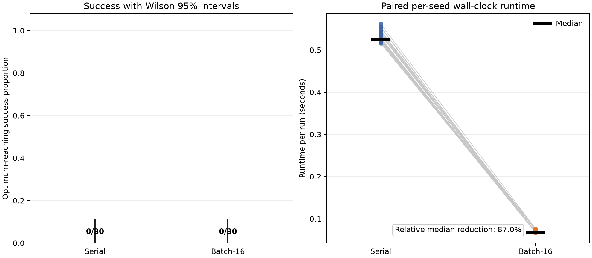

# End-to-End Runtime of Batch-16 Replacement on Trap-5, with No Observed Success Reduction Within 50,000 Evaluations

## Abstract

This study compared serial steady-state replacement with a vectorized batch-size-16 implementation on the 100-bit concatenated trap-5 benchmark. Thirty deterministic seeds were evaluated with shared initial populations, shared operator schedules, and a budget of 50,000 objective evaluations per run. Neither method reached the global optimum in any seed, so no success reduction was observed within the evaluation budget. This completely floored outcome does not establish that batching preserves optimization success in general or in a regime where the serial method has measurable success.

The complete batch implementation reduced median end-to-end runtime by 87.0%, from 0.524 seconds to 0.0680 seconds. This comparison jointly changed offspring vectorization, environmental-selection frequency, array-processing costs, and population snapshot semantics; objective-evaluation time was not measured separately. Under a model treating the seeds as exchangeable realizations from the specified initialization and variation process, a conservative exact paired 95% confidence interval for the population success loss was approximately −11.6 to 11.6 percentage points, excluding the prespecified loss of at least 15 percentage points. Because the actual seeds were fixed rather than randomly sampled, that inference is model-based rather than design-based. The prespecified conjunctive hypothesis was not supported: the runtime threshold was met, but the observed success-loss threshold was not. The study is therefore most appropriately interpreted as an end-to-end runtime comparison with an inconclusive broad comparison of optimization success.

## Background

Genetic-algorithm behavior can depend on selection, crossover, mutation, replacement, and the schedule by which population changes become available to later offspring. Batching can improve computational efficiency by applying array operations to multiple offspring at once, but it can also alter search behavior. In a serial steady-state algorithm, each accepted child can affect the parents selected for the next child. In a snapshot-based batch implementation, all children in a batch select parents from the same population state and cannot benefit from improvements generated earlier in that batch.

The present experiment compared immediate one-child-at-a-time processing with a batch-size-16 implementation. The comparison did not isolate a single computational or algorithmic factor. Relative to the serial baseline, the batch implementation vectorized offspring generation and fitness computation, called environmental selection less frequently, performed concatenation and sorting on different array sizes and schedules, and used stale-snapshot parent selection within each batch. Consequently, the runtime result concerns the complete batch implementation under the tested software, not objective evaluation alone and not an isolated effect of replacement frequency.

Trap-5 fitness is inexpensive to compute, so Python and NumPy overhead, array construction, sorting, and environmental-selection frequency may account for a substantial part of the observed speedup. No component-level timing was collected to separate these costs. The study therefore focuses on measured end-to-end execution and treats the optimization-success comparison cautiously because the serial baseline had no successful runs within the selected budget.

## Hypothesis

The prespecified hypothesis was:

> On the 100-bit concatenated trap-5 benchmark with population 100 and 50,000 evaluations, batched steady-state replacement with batch size 16, where all parents are selected from the same pre-batch population snapshot, will reduce optimum-reaching success by at least 15 percentage points relative to serial batch-size-1 replacement, while reducing median wall-clock time by at least 40% across 30 deterministic seeds.

The hypothesis was conjunctive: both the success-loss and runtime thresholds had to be met. With 30 seeds, an observed success difference of exactly 15 percentage points is impossible; the smallest qualifying observed difference is 5 of 30 seeds, or 16.67 percentage points.

This observed-effect rule should be distinguished from a population-level hypothesis. Failure to observe a difference of at least 5 seeds does not, by itself, prove that the population success loss is below 15 percentage points. A population-level conclusion requires a paired sampling model and an analysis of the paired outcomes. The paired analysis reported below treats runs generated by the specified initialization and operator-randomness mechanism as the target population. The fixed seeds 0 through 29 are intended as reproducible proxies for independent realizations from that stochastic run-generating process. Because those integer seeds were prespecified rather than randomly sampled from a defined distribution over seed labels, the resulting confidence statement is conditional on an exchangeability model and is not a design-based inference from random seed sampling.

No prospective power or precision calculation was performed when selecting 30 seeds. The original sample-size rationale addressed only the granularity of observed proportions. In addition, the configuration was poorly calibrated for detecting degradation because the serial method ultimately had a completely floored success rate.

## Method

### Objective and evaluation budget

The objective was the 100-bit concatenated trap-5 function. Each binary vector was divided into 20 consecutive, nonoverlapping blocks of 5 bits. For a block with \(u\) one-bits, block fitness was

\[
f(u)=
\begin{cases}
5, & u=5,\\
4-u, & u<5.
\end{cases}
\]

The 20 block scores were summed. The unique global optimum was the all-ones vector with fitness 100.

Each run used a population of 100 and exactly 50,000 objective evaluations, including evaluation of the 100 initial individuals. Runs continued to the full budget even if the optimum was found. The experiment measured end-to-end execution of each optimization implementation; it did not separately time the trap-5 objective function.

### Software and execution controls

The implementation used Python 3.11 or newer with NumPy and Matplotlib. Before importing NumPy, the following environment variables were set to 1:

- `OMP_NUM_THREADS`
- `OPENBLAS_NUM_THREADS`
- `MKL_NUM_THREADS`
- `VECLIB_MAXIMUM_THREADS`

No multiprocessing, explicit threading, GPU libraries, or just-in-time compilation was used. The experiment reportedly recorded Python, NumPy, operating-system, and processor information, but the resulting metadata were not included in the material available for this report. The exact Python patch version, NumPy version, BLAS implementation and version, operating-system version, processor model, and related build information therefore cannot be reported without new records.

Executable implementation code, raw per-seed outcome data, all three raw timing repetitions, and a separately auditable copy of the generated figure were also not included in the supplied materials. Their absence limits reproducibility and prevents additional runtime summaries from being calculated here.

### Seeds, initialization, and shared randomness

The experiment used exactly 30 seeds: the integers 0 through 29. For each seed, a `numpy.random.SeedSequence(seed)` spawned two child seed sequences. Two NumPy `Generator` instances using `PCG64` were then initialized: one generated the initial population, and the other generated all variation randomness.

For each seed, a population of 100 independently sampled 100-bit vectors was generated, with each bit sampled uniformly from \(\{0,1\}\). The serial and batch-size-16 conditions received identical copies of this initial population.

A complete operator schedule for all 49,900 post-initialization evaluations was generated before timing. Each offspring position had:

1. Four population indices sampled uniformly with replacement from 0 through 99, interpreted as two ordered size-2 tournaments.
2. Twenty independent Bernoulli(0.5) choices indicating which parent supplied each complete 5-bit block.
3. One hundred independent Bernoulli(0.01) mutation indicators.

The same pre-generated arrays were supplied to both methods. This paired control held the initial populations, tournament-index draws, crossover choices, and mutation indicators fixed across methods. The resulting offspring could nevertheless differ because tournament indices were interpreted against populations that evolved under different update schedules.

For model-based inference, the intended population is the collection of independent runs generated by the specified initialization and variation distributions under the two paired implementations. The seeds are deterministic labels used to reproduce realizations of that process. Generalization beyond these 30 labels relies on treating the generated runs as exchangeable samples from the intended stochastic process.

### Parent selection and variation

Each parent was selected through a size-2 tournament. The contestant with higher fitness was selected; ties were resolved in favor of the first-listed contestant.

Crossover operated on complete 5-bit blocks. For each of the 20 blocks, the pre-generated crossover choice selected the corresponding block from parent 1 or parent 2. Mutation then flipped every bit whose pre-generated mutation indicator was true.

In the serial implementation, these operations were executed for one child at a time. In the batch-size-16 implementation, they were vectorized across the children in each batch. Thus, the comparison changed both update semantics and the way computational work was expressed in Python and NumPy.

### Environmental selection

The environmental-selection rule was the same in both methods, although its invocation frequency differed. The current 100 incumbents were concatenated with the newly evaluated offspring, with incumbents listed first. Candidates were ranked by descending fitness, with ties broken by lower concatenated-array index. Consequently, incumbents defeated equal-fitness offspring. The first 100 ranked candidates became the new population and were stored in ranked order.

Serial processing invoked this rule after every child. Batch-size-16 processing invoked it once after each group of up to 16 children. The runtime comparison therefore includes the cost effect of reducing environmental-selection, concatenation, and sorting calls.

### Compared update schedules

In the **serial baseline**, offspring were processed individually. For each of the 49,900 offspring positions, both parents were selected from the current population, one child was generated and evaluated, and environmental selection was performed immediately before proceeding. Any population change could therefore influence the next parent-selection event.

In the **batch-size-16 condition**, the current population and fitness array were copied at the beginning of each batch. Every child in that batch selected its parents using the same pre-batch snapshot. Crossover, mutation, and fitness computation were vectorized across all 16 children in a full batch, after which environmental selection was performed once. The last batch contained 12 children because \(49{,}900 \bmod 16=12\).

No ablation conditions were run. In particular, the study did not include a nonvectorized batch-size-16 condition or a vectorized condition preserving serial update semantics as closely as possible. The available comparison therefore cannot separate the effects of vectorized offspring processing, reduced replacement frequency, and stale-snapshot parent selection.

### Outcomes and timing

A run was successful if fitness 100 appeared either in the initial population or among any evaluated offspring, regardless of whether that individual survived environmental selection. The first-hit evaluation was recorded, with 50,001 assigned when no optimum was found. Final-best fitness was also recorded during the experiment, but the raw paired values were not supplied. Because no paired effect estimate, distribution, or uncertainty analysis can be reconstructed from the reported medians alone, final-best fitness is not used as evidence in the main results.

Before measurement, one reduced-budget warm-up run of each method was performed with seed 10000 and 1,100 total evaluations. Each experimental seed-method combination was then timed three times using `time.perf_counter_ns`. Initial-population construction and schedule generation were outside the timed region; copying and evaluating the initial population, all offspring fitness computations, and all population-maintenance operations were inside it. Garbage collection was run immediately before each timing and disabled during the timed region.

Method order was alternated to limit ordering effects. Serial ran first on even seeds and batch-size-16 first on odd seeds during the first and third repetitions; this order was reversed for the second repetition. All three repetitions were required to produce identical success, first-hit, and final-best outcomes. The median of the three elapsed times was used as the runtime for that seed and method.

The primary summaries were paired success categories, median end-to-end runtimes, relative median time reduction, and the distribution of per-seed runtime ratios. Separate Wilson intervals shown in the figure describe each marginal success proportion but are not paired confidence intervals for the treatment effect. The paired success analysis instead uses the serial-only and batch-only categories directly.

## Results

Neither algorithm found the global optimum in any of the 30 seeds:

- Serial successes: **0/30**, or **0.0%**
- Batch-size-16 successes: **0/30**, or **0.0%**
- Observed success loss from serial to batch-size-16: **0.0 percentage points**
- Serial-only successes: **0**
- Batch-only successes: **0**
- Both successful: **0**
- Neither successful: **30**

Under the specified first-hit convention, all unsuccessful runs received the sentinel first-hit value of 50,001. Thus, no reduction in optimum-reaching success was observed within 50,000 evaluations. Because the serial success proportion was also zero, these data do not establish equivalence or demonstrate that batching cannot reduce optimization success under other budgets, configurations, or stochastic realizations.

For a paired population analysis, let

\[
L=P(\text{serial succeeds, batch fails})
  -P(\text{batch succeeds, serial fails}),
\]

so that positive \(L\) denotes a population success loss under batch-size-16. Both directional discordance counts were zero. Applying exact Clopper–Pearson upper bounds to each directional discordance probability and using a Bonferroni construction gives a conservative paired 95% confidence interval of approximately

\[
-11.6\text{ to }11.6\text{ percentage points}
\]

for \(L\). This interval excludes a population loss of at least 15 percentage points under the exchangeable-run model.

An exact conservative one-sided calculation gives the same qualitative result. If \(L\geq 0.15\), then the serial-only probability must be at least 0.15. The probability of observing zero serial-only outcomes in 30 independent pairs is then at most

\[
(1-0.15)^{30}=0.85^{30}\approx 0.0076.
\]

Accordingly, under the stated seed-sampling model, the paired outcomes provide statistical evidence against a population success loss of at least 15 percentage points. This is not the same as proving that the two methods have equal success probabilities: the paired interval still permits smaller losses or gains, and the complete floor in both marginal success rates leaves the broader optimization comparison poorly resolved. Because seeds 0 through 29 were fixed rather than randomly sampled from a formal distribution over seed labels, this inference is model-based and should not be interpreted as unconditional evidence across all possible seeds or configurations.

End-to-end runtime results favored the complete batch implementation:

- Serial median runtime: **0.524 seconds**
- Batch-size-16 median runtime: **0.0680 seconds**
- Relative reduction in median runtime: **87.0%**
- Median paired runtime ratio, batch-size-16/serial: **0.130**
- First quartile of paired ratios: **0.129**
- Third quartile of paired ratios: **0.131**
- Interquartile range of paired ratios: **0.00166**

Thus, the typical batch-size-16 run took approximately 13.0% of the corresponding serial runtime. The paired ratio distribution was narrow over the tested seeds. The plotted per-seed median runtimes provide the available distributional view of absolute runtime, but the raw numerical per-seed runtimes and the three individual repetitions were not supplied. Consequently, additional absolute-runtime quantiles, confidence intervals, or run-to-run variability estimates cannot be reported without new data.

The left panel shows the identical zero-success outcome for both methods, along with successful-seed counts and marginal Wilson 95% binomial confidence intervals. Those separate intervals do not quantify the paired treatment effect; the exact paired analysis above does. The right panel shows paired per-seed median end-to-end runtimes and their overall medians.

The runtime threshold required a reduction of at least 40%, and the observed reduction of 87.0% met that criterion. The prespecified observed success threshold required a loss of at least 5 successes out of 30, equivalent to 16.67 percentage points at this sample size. The observed loss was zero, so that empirical criterion was not met.

The conjunctive hypothesis is therefore **not supported**, rather than “refuted” solely because an observed threshold was missed. Separately, the exact paired model-based analysis provides evidence against a population loss of at least 15 percentage points for the specified stochastic run-generating process. The central optimization conclusion remains deliberately narrower: **no success reduction was observed within 50,000 evaluations in a regime where both methods had zero measured success**. The clear positive finding is an 87.0% reduction in end-to-end runtime for the complete batch implementation under the tested environment.

## Limitations

- **The optimization-success outcome was completely floored.** Neither method succeeded in any seed. The design therefore had no empirical resolution for detecting degradation from successful serial runs on these seeds. Although the exact paired analysis excludes a loss of at least 15 percentage points under the stated exchangeability model, the experiment does not establish equal success probabilities or rule out smaller effects.

- **The study was not calibrated in a nonsaturated success regime.** A stronger behavioral experiment would preregister a budget and parameterization under which the serial method has a measurable, nonsaturated probability of success. No such rerun was available. The present study is therefore framed primarily as an end-to-end runtime comparison, with a narrow and otherwise inconclusive optimization-success comparison.

- **The deterministic-seed inference is model-based.** Seeds 0 through 29 were fixed for reproducibility and were not randomly sampled from a defined distribution over integer seed labels. Population statements rely on treating the corresponding initial populations and operator schedules as exchangeable realizations from the specified stochastic mechanism. Without that assumption, the success results are strictly descriptive of these 30 paired runs.

- **No prospective power or precision analysis was performed.** The original sample-size justification noted only that 30 runs make observed proportions change in increments of 3.33 percentage points. It did not establish power to detect a 15-percentage-point paired loss under plausible baseline success and discordance probabilities.

- **The runtime comparison changes several factors simultaneously.** The batch implementation vectorized offspring generation and fitness computation, invoked environmental selection less often, changed concatenation and sorting frequency, and selected parents from stale pre-batch snapshots. The observed speedup therefore applies to the complete implementation and cannot be attributed specifically to objective evaluation, replacement timing, or any one source of overhead.

- **No runtime ablation was conducted.** The study lacks, at minimum, a nonvectorized batch-size-16 condition and a vectorized condition preserving serial update semantics as closely as possible. It consequently cannot separate vectorization from reduced replacement frequency or stale-snapshot parent selection.

- **Objective-evaluation time was not isolated.** Trap-5 fitness is inexpensive, and no component-level runtime breakdown was collected. The 87.0% reduction should be described as accelerated end-to-end execution under this implementation, not as independently demonstrated acceleration of trap-5 objective evaluation.

- **Absolute-runtime uncertainty is incompletely reported.** Per-seed medians are displayed in the figure, and paired-ratio quartiles are available, but the raw per-seed values and all three timing repetitions were not supplied. Run-to-run variation, absolute-runtime quantiles, and confidence intervals therefore cannot be reconstructed.

- **Only one objective and configuration were studied.** The findings apply to the specified 100-bit concatenated trap-5 problem, population size 100, tournament size 2, block crossover, mutation probability 0.01 per bit, elitist environmental selection, batch size 16, and 50,000-evaluation budget. They should not be generalized to other budgets, batch sizes, landscapes, operators, population sizes, or replacement rules without further evidence.

- **The fixed budget censors longer-term optimization behavior.** Every run completed 50,000 evaluations, but none reached the optimum. The study provides no evidence about whether either method would eventually succeed or whether their success probabilities would separate at larger budgets.

- **Final-best fitness lacks a paired analysis.** Final-best values were recorded, but only unpaired medians were supplied. The raw paired values, paired differences, dispersion, and uncertainty were unavailable, so the suggestive median comparison has been removed from the main results and is not interpreted as evidence of search-quality superiority.

- **Reproducibility artifacts are incomplete.** Executable code, raw per-seed success and final-fitness data, all three raw timing repetitions, and independently auditable figure files were not included in the supplied materials. These artifacts cannot be recreated faithfully from aggregate results alone and should be released with any archival version of the study.

- **Environment metadata are incomplete.** Exact Python and NumPy versions, the BLAS library and version, the operating-system version, processor model, and related build information were not available. Absolute runtimes therefore cannot be fully contextualized or independently reproduced.

- **The original bibliography was unavailable.** The supplied report contained citation placeholders but no corresponding reference metadata. Those citations cannot be reconstructed without inventing sources, so this revision does not rely on them for methodological or benchmarking claims. A publication version should restore a verified, complete reference list based on the actual sources used.

## Follow-up questions

- **Can the optimization comparison be repeated in a preregistered, informative regime?** Select the population size, mutation rate, and evaluation budget in advance using a separate calibration procedure so that serial success is measurable but nonsaturated. Then preregister the primary paired success effect, confidence interval, sample size, and decision rule before comparing batch-size-16.

- **Does a larger evaluation budget reveal a success-rate difference?** Repeat the paired experiment at 100,000, 250,000, and 500,000 evaluations while retaining shared initialization and operator-schedule controls. These should be treated as distinct, prospectively specified hypotheses rather than retrospective extensions of the present result.

- **How does success vary with batch size?** Compare batch sizes 1, 2, 4, 8, 16, and 32 under the same trap-5 configuration, measuring both optimum-reaching success and end-to-end runtime to estimate a search-quality/runtime trade-off curve.

- **How much speedup comes from vectorization alone?** Add a nonvectorized batch-size-16 condition that retains stale-snapshot parent selection and once-per-batch environmental selection but generates, mutates, and evaluates offspring with scalar or one-child-at-a-time operations. Comparing it with the existing vectorized batch-size-16 implementation would estimate the contribution of offspring vectorization under matching update semantics.

- **How much comes from reduced replacement frequency?** Add conditions that vary the number of offspring admitted per environmental-selection call while holding the offspring-generation implementation fixed. Component-level timing should separately measure parent selection, crossover and mutation, objective computation, concatenation, sorting, and other population-maintenance work.

- **How much comes from stale-snapshot parent selection?** Add a condition that preserves one-child-at-a-time parent selection and replacement while using NumPy-based computational kernels as consistently as possible. Compare it with snapshot-based variants to distinguish update freshness from array-processing effects, acknowledging that exact full-batch vectorization is incompatible with serial parent-selection dependencies.

- **Are the findings reproducible across systems?** Release executable code, raw per-seed outcomes, all timing repetitions, the generated figure and source data, and complete Python, NumPy, BLAS, operating-system, and processor metadata. Repeat the benchmark on multiple machines and report absolute-runtime distributions as well as paired ratios.
