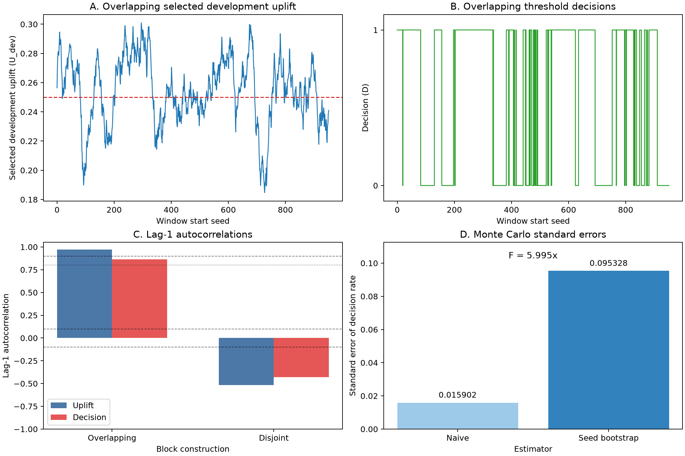

# Dependence and Selection Outcomes Across Overlapping and Disjoint 48-Seed Blocks

## Abstract

This experiment examined selected-rule uplift, held-out retention, rule identity, eligible sample size, and threshold decisions across prospectively defined 48-seed blocks. One thousand independently generated seed-level experiments were analyzed as 953 stride-1 overlapping windows and as 20 disjoint blocks. In the single master-seed realization studied, overlapping selected uplift and threshold decisions had lag-1 autocorrelations of 0.973485 and 0.862686, respectively. The corresponding disjoint-block autocorrelations were \(-0.515532\) and \(-0.430349\).

The realization-specific preregistered conjunction failed because both disjoint-series autocorrelations exceeded the stipulated absolute bound of 0.10. That outcome does not refute independence of disjoint blocks: with only 20 blocks and 19 adjacent pairs, realized sample autocorrelations can be far from zero under independence. The supplied output did not contain the observed overlapping threshold-decision count or rate, the naive standard error, the bootstrap standard error, or their unrounded ratio. Consequently, the claimed standard-error underestimation factor cannot be independently recomputed, its bootstrap uncertainty cannot be quantified, and the fifth preregistered condition is not auditable from the available material. This revised report therefore withdraws the earlier quantitative claim that the naive standard error was underestimated by at least a factor of three.

## Background

Uplift modeling and heterogeneous-treatment-effect analysis seek to identify subgroups for which treatment effects differ, sometimes with the goal of producing interpretable treatment rules rather than only estimating conditional effects. These settings distinguish estimation from selection: after multiple candidate rules are examined, the selected rule’s development-sample performance may be optimistic because selection favors candidates with favorable sampling variation.

Simulation studies often summarize procedures across blocks or repeated windows. Stride-1 windows of length 48 share 47 of their 48 seed-level records. For a simple rolling average of independent, identically distributed seed-level quantities, this overlap alone gives adjacent windows a correlation of \(47/48\). That calculation is a useful mechanical baseline, although selected uplift is a nonlinear statistic involving pooled treated and control means, eligibility filtering, maximization across rules, and tie-breaking. Threshold decisions add a further nonlinear transformation. Therefore, \(47/48\) is not an exact theoretical prediction for either reported series, but it shows that very high adjacent-window dependence is expected without any dependence among the underlying seed-level experiments.

Disjoint blocks contain no shared seed records and therefore avoid this mechanical overlap. They provide only 20 block-level observations from a sequence of 1,000 seeds, however, leaving only 19 adjacent pairs for estimating lag-1 autocorrelation. A realized autocorrelation from such a short series should not be treated as a direct test of independence without a calibrated null reference distribution or reported operating characteristics.

The present experiment is a deliberately simple, single-realization illustration of these issues. It does not establish a general result about uplift-model selection, and it does not determine the sampling distribution of the reported diagnostics across independently chosen master seeds. The numerical citations in the original background have been removed because no corresponding bibliographic information was included in the supplied material; a verifiable reference list cannot be reconstructed without inventing citations.

## Hypothesis

The preregistered hypothesis was that, for the deterministic sequence of 1,000 seed-level experiments generated from master seed `20250308`:

1. The lag-1 autocorrelation of selected development uplift across stride-1 overlapping windows would exceed 0.90.
2. The lag-1 autocorrelation of threshold decisions across overlapping windows would exceed 0.80.
3. The absolute lag-1 autocorrelation of selected uplift across disjoint blocks would be below 0.10.
4. The absolute lag-1 autocorrelation of threshold decisions across disjoint blocks would be below 0.10.
5. Treating the overlapping windows as independent would underestimate the Monte Carlo standard error of the threshold-decision rate by a factor of at least 3.00.

The hypothesis was defined conjunctively: all five conditions had to pass for this particular deterministic realization.

Conditions 3 and 4 were realization-specific numerical requirements, not well-calibrated tests of independence. The \(\pm 0.10\) bound was not accompanied by a prospective derivation, a null distribution for a 20-observation series, a type-I error rate, power calculations, or other operating characteristics. It should not be reused as a scientific test in future work without such calibration. A future protocol should instead use a confidence interval or formal test whose behavior has been evaluated for the actual number of blocks and for the statistic being analyzed.

Condition 5 also requires more than a point estimate if the phrase “at least 3” is to be supported. The observed overlapping rate, both standard errors, the unrounded ratio, and an uncertainty interval for that ratio are needed. Those quantities were not present in the supplied results excerpt, so condition 5 cannot be audited here.

## Method

The experiment was described as using Python 3 with NumPy, pandas, and matplotlib. Exact Python and package versions were not provided. A master seed of `20250308` was supplied to `numpy.random.SeedSequence`, from which 1,000 streams were spawned, one for each prospective seed-level experiment.

For each seed, independent development and held-out splits were generated, in that order, with 256 observations per split. Each observation contained six mutually independent binary features, \(X_1,\ldots,X_6\), each with success probability 0.5; a randomized binary treatment \(T\) with success probability 0.5; and independent standard-normal noise \(\epsilon\). The individual treatment effect and outcome were

\[
\tau = 0.15 + 0.10X_1,
\qquad
Y = T\tau + \epsilon.
\]

Six candidate subgroup rules were fixed before analysis: \(R_j=\{X_j=1\}\) for \(j=1,\ldots,6\). For each rule, split, and seed, the analysis retained eligible counts, treated and control counts, and corresponding outcome sums. No rule selection occurred within individual seeds.

For each 48-seed block, sufficient statistics were pooled before computing each rule’s development uplift:

\[
U_j=\bar Y_{j,T=1}-\bar Y_{j,T=0}.
\]

A candidate required at least 500 eligible treated and 500 eligible control observations in the pooled development data. Among eligible rules, the rule with the largest development uplift was selected, with exact ties resolved in favor of the lowest-numbered rule. The analysis then recorded:

- selected-rule identity;
- selected development uplift, \(U_{\text{dev}}\);
- the selected rule’s pooled development eligible count, \(N_{\text{eligible}}\);
- held-out uplift, \(U_{\text{hold}}\), for the already-selected rule;
- held-out retention, \(H=U_{\text{hold}}/U_{\text{dev}}\); and
- threshold decision, \(D=\mathbb{1}(U_{\text{dev}}\geq0.25)\).

Held-out data were never used for selection or threshold decisions.

Two block constructions were evaluated:

- **Overlapping:** 953 windows \(\{t,\ldots,t+47\}\), for \(t=0,\ldots,952\).
- **Disjoint:** 20 blocks \(\{48b,\ldots,48b+47\}\), for \(b=0,\ldots,19\). Seeds 960–999 were excluded from this analysis.

Lag-1 sample autocorrelation was calculated using:

```python
numpy.corrcoef(z[:-1], z[1:])[0, 1]
```

The naive standard error of the overlapping decision rate was defined as

\[
SE_{\text{naive}}
=
\sqrt{\frac{p_{\text{overlap}}(1-p_{\text{overlap}})}{953}}.
\]

A dependence-aware standard error was described as being estimated by bootstrapping the 1,000 seed-level records. Using bootstrap seed `8675309`, each of 2,000 replicates sampled 1,000 complete seed records with replacement, placed them in draw order, reconstructed all 953 stride-1 windows, and repeated rule selection and threshold decisions. The sample standard deviation of the replicate decision rates was designated \(SE_{\text{bootstrap}}\), and the underestimation factor was defined as

\[
F=\frac{SE_{\text{bootstrap}}}{SE_{\text{naive}}}.
\]

The supplied material does not specify whether the tabulated standard deviations used a sample or population divisor, and it does not identify the interpolation or quantile convention used for P05, P25, median, P75, and P95. Although the bootstrap standard error was described as a sample standard deviation, no executable source code or complete output was supplied to verify its implementation.

No uncertainty assessment was performed for \(SE_{\text{bootstrap}}\) or \(F\). In particular, the available analysis did not use repeated independent bootstrap runs, a bootstrap-of-bootstrap calculation, or enough reported replicate-level information to construct an uncertainty interval. It also did not validate the seed-record bootstrap against:

- many independently generated fresh 1,000-seed sequences;
- a heteroskedasticity-and-autocorrelation-consistent estimator;
- a moving-window or block-based variance estimator; or
- an analytically justified effective-sample-size calculation.

Likewise, the full experiment was not repeated over independently selected master seeds. Therefore, sampling distributions and pass probabilities for the five preregistered conditions are unavailable. No simulated or exact null reference distribution for lag-1 sample autocorrelation with 20 independent blocks was supplied.

Exact reproducibility also remains incomplete. Neither the executable code nor the seed-level sufficient-statistics file was included. A script that regenerated those statistics exactly would need to specify, among other details, the precise NumPy version, random-generation calls, call order, array shapes and dtypes, aggregation conventions, standard-deviation divisor, percentile method, and serialization format. Those details cannot be reconstructed reliably from the narrative alone.

## Results

All 953 overlapping windows and all 20 disjoint blocks had at least one eligible rule; the no-eligible-rule count was zero in both analyses.

**Selected development uplift**

| Analysis | Count | Mean | SD | Min | P05 | P25 | Median | P75 | P95 | Max |
|---|---:|---:|---:|---:|---:|---:|---:|---:|---:|---:|
| Overlapping | 953 | 0.254261 | Unavailable | 0.184728 | 0.214167 | Unavailable | Unavailable | Unavailable | Unavailable | 0.300906 |
| Disjoint | 20 | 0.253862 | 0.025139 | 0.200876 | 0.206661 | 0.242764 | 0.251323 | 0.273489 | 0.285464 | 0.291928 |

The mean selected uplift was nearly identical under the two block constructions: 0.254261 for overlapping windows and 0.253862 for disjoint blocks. The supplied output did not include the overlapping standard deviation or the P25, median, P75, and P95 values. Those routine summaries cannot be recovered from the mean, extrema, fifth percentile, and autocorrelation, so they are marked unavailable rather than inferred. Accordingly, this table remains incomplete pending release of the original window-level output or exact regeneration code.

No dependence-aware confidence interval or standard error was supplied for either mean. In particular, the 953 overlapping values cannot be interpreted as 953 independent observations. The small difference between the overlapping and disjoint means is therefore descriptive and was not subjected to an uncertainty-calibrated comparison.

**Held-out retention**

| Analysis | Count | Mean | SD | Min | P05 | P25 | Median | P75 | P95 | Max |
|---|---:|---:|---:|---:|---:|---:|---:|---:|---:|---:|
| Overlapping | 953 | 0.965386 | 0.141549 | 0.561558 | 0.769912 | 0.878554 | 0.959853 | 1.028410 | 1.227186 | 1.589507 |
| Disjoint | 20 | 0.959655 | 0.131556 | 0.651278 | 0.809510 | 0.881375 | 0.965318 | 1.029720 | 1.086485 | 1.317585 |

Mean held-out retention was below one in both analyses, at approximately 0.96. Descriptively, held-out uplift was therefore modestly lower on average than selected development uplift. Retention varied substantially: overlapping-window values ranged from 0.561558 to 1.589507, and disjoint-block values ranged from 0.651278 to 1.317585. Values above one indicate that the held-out estimate exceeded the selected development estimate; they do not imply that held-out data influenced selection.

These summaries do not include dependence-aware uncertainty. Consequently, the overlapping and disjoint means should not be interpreted as demonstrating a difference or equivalence between the two block constructions.

**Eligible sample size**

| Analysis | Count | Mean | SD | Min | P05 | P25 | Median | P75 | P95 | Max |
|---|---:|---:|---:|---:|---:|---:|---:|---:|---:|---:|
| Overlapping | 953 | 6140.196 | 60.802 | 6000 | 6041.0 | 6098.0 | 6138.0 | 6175.0 | 6257.0 | 6313 |
| Disjoint | 20 | 6138.850 | 74.123 | 6016 | 6023.6 | 6092.5 | 6138.5 | 6182.0 | 6250.55 | 6280 |

Eligible sample sizes were stable and far above the selection requirement. These values count all development observations satisfying the selected rule, whereas eligibility required only 500 treated and 500 control observations. No block failed that requirement.

Eligibility was therefore essentially nonbinding in this realization. The experiment primarily examined overlap, rule selection, and thresholding under abundant eligible samples; it did not meaningfully stress eligibility-driven selection or failure behavior.

**Selected-rule identity**

| Rule | Overlapping count | Overlapping proportion | Disjoint count | Disjoint proportion |
|---|---:|---:|---:|---:|
| R1 | 936 | 0.982162 | 19 | 0.950000 |
| R2 | 0 | 0.000000 | 0 | 0.000000 |
| R3 | 5 | 0.005247 | 1 | 0.050000 |
| R4 | 10 | 0.010493 | 0 | 0.000000 |
| R5 | 1 | 0.001049 | 0 | 0.000000 |
| R6 | 1 | 0.001049 | 0 | 0.000000 |

Rule R1 dominated selection, appearing in 98.22% of overlapping windows and 95% of disjoint blocks. This is consistent with the data-generating process because only \(X_1\) modified treatment effects. The occasional selection of R3–R6 reflects finite-sample variation among candidate uplift estimates. R2 was never selected.

**Threshold decisions and standard errors**

| Quantity | Overlapping | Disjoint |
|---|---:|---:|
| Number of blocks or windows | 953 | 20 |
| Positive-decision count | Unavailable | 12 |
| Observed decision rate | Unavailable | 0.600000 |
| Naive standard error of decision rate | Unavailable | Not defined for the preregistered comparison |
| Seed-record bootstrap standard error | Unavailable | Not estimated |
| Bootstrap-to-naive standard-error ratio | Unavailable | Not applicable |

The overlapping positive-decision count and observed rate were not included in the supplied results. Because the observed rate is missing, the exact naive standard error cannot be evaluated from its stated formula. The bootstrap standard error and unrounded ratio were also omitted.

Across the 2,000 bootstrap replicates, the mean overlapping decision rate was reported as 0.562183, with replicate rates ranging from 0.207765 to 0.894019. The bootstrap mean is not the observed decision rate and cannot be substituted for it. The replicate minimum and maximum also do not determine the replicate standard deviation.

It is therefore impossible to disclose or recompute the exact naive standard error, bootstrap standard error, or ratio from the supplied information. It is likewise impossible to determine whether a lower uncertainty bound for the ratio exceeds 3.00. The earlier statement that the factor was “at least 3” is not supported by auditable numerical output and is withdrawn.



Figure 1 was described as the preregistered four-panel summary. Panel A plotted overlapping selected uplift against window start and marked the 0.25 threshold. Panel B showed the corresponding binary decisions. Panel C compared the four lag-1 autocorrelations, while Panel D contrasted the naive and dependence-aware standard errors and annotated their ratio.

The referenced file uses the portable PNG format, but only a workspace-local relative path was supplied. The actual image file was not included with the report materials available for revision, so its contents and the annotation in Panel D cannot be independently inspected here. The exact original relative path has been retained as required. A reproducible release should include the PNG itself and, preferably, a vector export such as SVG or PDF generated from the same source.

As a mechanical baseline, adjacent length-48 stride-1 windows share \(47/48\) of their records. For a simple equal-weight rolling mean of independent seed-level quantities, the adjacent correlation is consequently \(47/48\). The observed selected-uplift autocorrelation of 0.973485 is close to that linear-overlap benchmark. This comparison is descriptive rather than an exact model because selected uplift is based on pooled ratios and maximization across rules. No corresponding analytic or simulation-based baseline was supplied for the threshold-decision autocorrelation or for the standard-error ratio.

The preregistered conditions can be evaluated as follows:

| Preregistered condition | Disclosed estimate | Requirement | Result from disclosed values |
|---|---:|---:|---|
| Overlapping uplift autocorrelation | 0.973485 | \(>0.90\) | Pass |
| Overlapping decision autocorrelation | 0.862686 | \(>0.80\) | Pass |
| Absolute disjoint uplift autocorrelation | 0.515532 | \(<0.10\) | **Fail** |
| Absolute disjoint decision autocorrelation | 0.430349 | \(<0.10\) | **Fail** |
| Standard-error underestimation factor | Unavailable | \(\geq3.00\) | Not auditable |

The signed disjoint autocorrelations were \(-0.515532\) for uplift and \(-0.430349\) for decisions. Their negative signs do not refute independence. Independent blocks can produce positive or negative sample autocorrelations, especially in a series this short. Without a null reference distribution for 20 independent blocks, these values cannot be classified as ordinary or unusual sampling fluctuations.

Conditions 1 and 2 passed, conditions 3 and 4 failed, and condition 5 cannot be recomputed. Because the preregistered hypothesis required all five conditions to pass, the realization-specific conjunction failed regardless of the unresolved fifth condition. This conclusion concerns the stipulated numerical claims for the deterministic master-seed realization `20250308`; it is not evidence that disjoint blocks are dependent, and it does not refute the underlying proposition that record overlap induces strong dependence among adjacent overlapping windows.

## Limitations

- **The central standard-error result is not auditable.** The observed overlapping decision count and rate, exact naive standard error, exact bootstrap standard error, and unrounded ratio were not included in the supplied output. The fifth preregistered condition therefore cannot be recomputed directly, and the earlier “at least 3” claim has been withdrawn.

- **Bootstrap uncertainty was not quantified.** The bootstrap used 2,000 replicates, but no repeated-bootstrap assessment, bootstrap-of-bootstrap interval, or replicate-level output was supplied. There is no uncertainty interval for either \(SE_{\text{bootstrap}}\) or \(F\), so no lower bound can be compared with the threshold of 3.00.

- **The seed-record bootstrap was not independently validated.** No benchmark based on many fresh 1,000-seed sequences was performed or supplied. No comparison with a HAC estimator, moving-window estimator, block estimator, or analytically justified effective sample size was reported. The accuracy of the reported bootstrap procedure is therefore unknown.

- **Only 20 disjoint blocks were available.** Lag-1 sample autocorrelation for the disjoint analysis was estimated from 19 adjacent pairs. A short independent sequence is not required to have a realized sample autocorrelation close to zero.

- **The \(\pm 0.10\) disjoint criterion was not prospectively justified.** No null distribution, confidence level, type-I error rate, power, or other operating characteristics accompanied this threshold. Its failure is a failure of a realization-specific numerical condition, not evidence against independence. Future work should replace it with a calibrated interval or test.

- **No null reference distribution was supplied.** The original experiment did not simulate independent 20-block sequences or otherwise provide the sampling distribution of lag-1 sample autocorrelation under the relevant null. Such a distribution cannot be reconstructed from the single reported realization without new computation.

- **A single deterministic master-seed realization was studied.** The results characterize the sequence generated from `MASTER_SEED = 20250308`, but they do not show how often any condition would pass across independently selected master seeds. Sampling distributions and pass probabilities for all five conditions remain unknown.

- **The overlapping uplift table is incomplete.** The standard deviation and the P25, median, P75, and P95 values were absent from the supplied output. They cannot be inferred exactly from the available summaries.

- **Summary-statistic conventions are incomplete.** The standard-deviation divisor and percentile interpolation convention were not stated. Exact Python, NumPy, pandas, and matplotlib versions were also absent.

- **Executable reproducibility materials were not supplied.** Neither source code nor seed-level sufficient statistics were included. The narrative is insufficient to guarantee bit-for-bit regeneration because exact random-number calls, call order, versions, dtypes, array layouts, aggregation details, and output conventions are unknown.

- **The figure was not distributed with the report.** Its relative PNG path has been retained, but the file itself was unavailable for inspection. A complete release should package the portable image and the code that creates it.

- **Eligibility was effectively nonbinding.** Selected-rule eligible counts were around 6,140, whereas only 500 treated and 500 control observations were required. This realization does not meaningfully evaluate eligibility-driven exclusion or selection behavior.

- **The dependence mechanism is largely mechanical.** Adjacent stride-1 windows share 47 of 48 records, so strong dependence is expected. The comparison with \(47/48\) provides a baseline for a linear rolling mean, but no exact analytic or simulation baseline was supplied for selected uplift, threshold decisions, or their variance inflation.

- **Descriptive overlapping summaries lack dependence-aware uncertainty.** Means for uplift, retention, and eligible counts were reported without valid confidence intervals or standard errors for the dependent sequence. Comparisons with disjoint-block means are therefore descriptive only.

- **The data-generating process was deliberately simple.** Features were independent and balanced, treatment was randomized at probability 0.5, outcomes had homoskedastic Gaussian noise, and only \(X_1\) modified treatment effects. The experiment has limited scope and does not establish a novel general property of uplift modeling.

- **The selected-rule distribution was highly concentrated.** R1 accounted for 98.22% of overlapping selections and 95% of disjoint selections. Dependence behavior could differ when candidate rules have more similar true effects and selection switches more frequently.

- **Retention is a ratio.** Although development uplifts were positive in all reported blocks, ratio-based retention is sensitive to variation in its denominator and should not be interpreted as an unbiased standalone measure of generalization.

- **No verifiable bibliography was supplied.** The original report used numbered citations without a reference list. The citations have been removed rather than matched to invented sources. A complete reference list requires the original source metadata.

- **No execution or runtime record was provided.** There is no evidence that a timeout affected the experiment, but computational completion and exact provenance cannot be independently verified from the available materials.

## Follow-up questions

- When the complete experiment is repeated across many independently selected master seeds, what are the sampling distributions and pass probabilities of all five preregistered conditions?

- Under independently generated 20-block sequences, what is the null distribution of the lag-1 sample autocorrelation computed by `numpy.corrcoef(z[:-1], z[1:])[0, 1]` for selected uplift and binary threshold decisions?

- What confidence interval or calibrated hypothesis test should replace the unvalidated requirement that disjoint autocorrelation fall within \([-0.10,0.10]\), and what are its type-I error and power for 20 blocks?

- What are the observed overlapping positive-decision count and rate, the exact naive standard error, the exact seed-record bootstrap standard error, and their unrounded ratio when regenerated from the archived seed-level sufficient statistics?

- How much Monte Carlo uncertainty remains in the bootstrap standard error and variance-inflation ratio, and does a lower confidence bound—not only the point estimate—exceed 3.00?

- Does the seed-record bootstrap agree with a benchmark distribution generated from many fresh 1,000-seed sequences? How does it compare with HAC, moving-window, block-based, or effective-sample-size estimators?

- What analytic or simulation-based dependence baseline applies to selected uplift and threshold decisions after accounting for the nonlinear effects of pooled ratios, rule maximization, and thresholding, beyond the \(47/48\) linear-moving-average benchmark?

- How do overlap stride and block length affect autocorrelation and standard-error inflation—for example, for strides of 1, 4, 12, 24, and 48 while holding seed-level data fixed?

- What occurs when eligibility becomes consequential, such as with rarer subgroup rules, smaller blocks, or materially larger treated/control eligibility requirements?

- Does weakening the true advantage of R1, or introducing multiple equally effective treatment modifiers, increase rule switching and materially change uplift autocorrelation, decision autocorrelation, held-out retention, and uncertainty?
