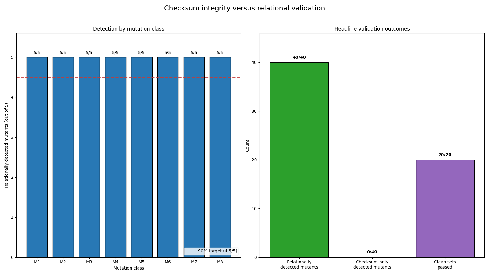

# Complete Reproducible Artifact Package with Cross-File Relational Validation

## Abstract

This study evaluated eight cross-file consistency rules on a deterministic synthetic data package containing four canonical CSV files and one NumPy matrix. The reported experiment generated 20 clean output sets with one generator implementation and 40 engineered mutants copied from one additional base dataset. Each mutant was designed to violate at least one of the implemented relational invariants while remaining parseable and receiving freshly recomputed manifest metadata and checksums. The reported validator rejected all 40 mutants and accepted all 20 clean sets; checksum-only validation rejected none of the mutants because their manifests had deliberately been regenerated.

These outcomes demonstrate deterministic coverage of the 40 specifically constructed contradictions. They do not establish a population-level 100% mutation-detection rate, effectiveness against unanticipated real-world corruption, acceptance of outputs from an independent implementation, or comprehensive artifact integrity. In addition, the material supplied with this report does not contain the source files, dependency lock contents, manifest and schema, Makefile, README, released outputs, mutation specifications, raw per-case results, execution logs, cryptographic artifact identifiers, or an accessible copy of the referenced figure. Consequently, the aggregate results and package-audit claims cannot be independently reproduced or verified from the report alone.

The intended repository structure and one-command interface are documented below, but fresh-checkout reproduction was not demonstrated. The reported lock pins only NumPy and Matplotlib even though execution also used `jsonschema`; direct and transitive dependencies, package hashes, and Python itself were therefore not shown to be fully locked. The contribution should be understood as a reproducible-example design for combining schema, manifest, and cross-file aggregate checks, rather than as a new relational-validation method.

## Background

A reproducible computational result requires more than final tables. It generally also requires executable generation and validation code, an explicit software environment, documented instructions, raw machine-readable results, and sufficient metadata to connect derived outputs to their sources. Prior work has discussed reproducible scientific artifacts using containerized environments [1], broader challenges in computational reproducibility [6], and methods for reading and evaluating research compendia [7]. Reproducibility has also been examined in specific empirical settings, including pattern-recognition research [2] and computational notebooks [9].

Environment specification is one component of this problem. Lockfiles are intended to constrain dependency resolution, although their design and integrity properties differ among package-management systems [3]. Related work has examined controlled software environments [4] and lockfile-based reconstruction of past releases [8]. A meaningful environment lock must account for direct and transitive runtime dependencies and, where practical, authenticate distributions with package hashes. It should also state the supported interpreter versions and ensure that the reproduction command invokes the interpreter from the environment it creates.

Schema and dataframe-validation systems can enforce types, required columns, ranges, uniqueness, and other local constraints. Relational and database validation can enforce keys and references across tables. Provenance and research-compendium tools can record how outputs were produced and package code, data, and environment metadata. Authenticated or externally anchored manifests can establish that files match a trusted release. Recomputing aggregates from raw data is also a conventional data-validation practice. The technical contribution evaluated here is therefore not a new class of invariant. It is the packaging of several standard checks into one synthetic example connecting raw observations, per-seed aggregates, a global summary, heatmap cells, and a NumPy matrix.

A manifest containing hashes, sizes, formats, and shapes can detect accidental changes when it is compared with an unchanged, trusted manifest. An unauthenticated manifest does not detect coordinated modifications when an actor can alter files and recompute the manifest. The checksum-only condition in this experiment illustrates that threat-model limitation; it is not a competitive empirical baseline because failure is expected by construction. More informative comparisons would include schema validation alone, validation without recomputation from raw observations, a conventional dataframe or relational validation framework, and a manifest authenticated or anchored outside the mutable package. Those comparisons were not conducted in the reported experiment.

## Hypothesis

The prespecified hypothesis was:

> Among 40 coordinated output mutations whose altered files have valid formats and freshly recomputed manifest checksums, relational validation rules linking seed identifiers, row counts, summary values, and heatmap cells across the four CSV files and matrix will detect at least 36 mutations, while all 20 unmodified output sets generated by the same implementation will pass.

The clean sets should not be described as independently implemented outputs. They were separate deterministic runs of the same generator and arithmetic policy used to define the validator’s expected relationships.

The decision rule was:

1. All 40 mutants had to parse successfully and pass checksum-only validation.
2. At least 36 of those mutants had to fail one or more relational rules.
3. All 20 clean output sets had to pass relational validation.

A mutant failing parsing or checksum-only validation would invalidate that case rather than count as a relational detection.

This decision rule defines deterministic test-suite coverage for 40 engineered cases. It does not define a sampling population of possible corruptions, and the mutants are not statistically independent observations from such a population. Therefore, the resulting fraction must not be interpreted as an estimate of a general relational-mutation detection probability. No population-level confidence interval is appropriate without a defensible mutation distribution and a randomized sampling procedure.

## Method

The intended repository was described as containing:

- `src/generate.py`
- `src/validate.py`
- `src/mutate.py`
- `src/run_experiment.py`
- `manifest.schema.json`
- `requirements.lock`
- `Makefile`
- `README.md`

The report submission did not include the contents of these files. It also did not include the generated output directories, complete mutation specifications, raw per-case validation records, execution logs, dependency-lock contents, or a repository archive. No repository commit identifier, tree hash, release-archive digest, manifest digest, or other cryptographic identifier for the reviewed artifact was reported. Although `manifest.json` was described as containing per-file SHA-256 values, those values were not reproduced in the report.

The intended package boundary has two levels:

1. **Repository-level artifact:** source code, schema, lock file, Makefile, README, generated experiment results, and `release_output/`.
2. **Release-output payload:** `release_output/`, described as a byte-for-byte copy of the generated `clean_00` output set.

Under that interpretation, `release_output/` contains:

- `observations.csv`
- `per_seed.csv`
- `summary.csv`
- `heatmap_cells.csv`
- `heatmap_matrix.npy`
- `manifest.json`

The four CSV files are the “four canonical release CSVs.” The NumPy matrix is an additional data output, and the manifest describes the payload. Source code, `requirements.lock`, `Makefile`, `README.md`, and `manifest.schema.json` belong to the repository-level artifact, not to the byte-for-byte copy of `clean_00`. This resolves the earlier ambiguity between saying that `release_output/` copied `clean_00` and saying that the broader repository package also included source code.

The manifest was described as covering the five data files—the four CSV files and `heatmap_matrix.npy`—and as not hashing itself. The report does not establish that repository-level files such as source code, the schema, lock file, Makefile, README, raw experiment results, logs, or the figure were covered by the manifest. Thus, even if the output manifest were available, it would not by itself authenticate the complete repository-level artifact.

The environment description reported pins for:

- `numpy==2.1.3`
- `matplotlib==3.9.2`

The recorded execution also used `jsonschema==4.23.0`, but the original description did not establish that `jsonschema` was present in `requirements.lock`. It likewise did not list or pin the transitive dependencies of NumPy, Matplotlib, and jsonschema, and it did not report package-distribution hashes. Python was described as requiring version 3.11 or newer, but only Python 3.12.9 was reported as tested. Accordingly, Python 3.12.9 is the only demonstrated interpreter version; Python 3.11 and other Python 3.12 patch versions remain intended rather than verified support targets.

The documented one-command interface was:

```bash
make reproduce
```

The Makefile target was described as creating `.venv` if absent, installing `requirements.lock`, and then running:

```bash
python -m src.run_experiment --output results
```

This inner command does not explicitly identify `.venv/bin/python` or its platform-specific equivalent. Without the Makefile contents or an execution trace, it is unknown whether activation occurred in the same shell, whether `PATH` was adjusted, or whether the command could accidentally invoke a system interpreter. A robust reproduction target would explicitly use the created environment’s interpreter, but the supplied evidence does not show that behavior.

No fresh isolated checkout, clean container, or virtual-machine reproduction was reported. The report therefore cannot provide an observed exit status, generated-file hash list, or byte comparison from such a run. The exact documented command is available, but the following required reproduction evidence is absent:

- checkout or release-archive identifier;
- container image digest or clean-machine description;
- complete installation command and dependency-resolution log;
- proof that the newly created environment’s interpreter was invoked;
- process exit status;
- generated-file SHA-256 values;
- comparison of those values with submitted reference outputs;
- raw stdout and stderr logs.

Runtime network access was described as prohibited except during package installation. Because installation relied on external package sources and the dependency closure was not shown to be completely pinned and hashed, the package should not be called self-contained or fully complete. It is an intended online-installable repository design, not a demonstrated offline-preservable artifact.

Each generated output set was described as containing exactly four CSV files and one NumPy matrix:

- `observations.csv`
- `per_seed.csv`
- `summary.csv`
- `heatmap_cells.csv`
- `heatmap_matrix.npy`

Each set also contained `manifest.json`.

For run identifier \(r\), the generator created data for seeds `S000` through `S019`. Each seed had 50 observations, identified as `O000` through `O049`. For seed index \(i\), values were drawn using:

```python
numpy.random.default_rng(1000000 + 1000*r + i)
```

The distribution was normal with location \(i/10\) and scale \(1 + 0.02i\). Every generated value was rounded to 12 decimal places before calculation or serialization.

`observations.csv` contained 1,000 data rows sorted by seed and observation identifiers. All derived statistics were computed from the persisted 12-decimal values. For each seed, `per_seed.csv` recorded the observation count, arithmetic mean, and sample standard deviation. Means used `math.fsum(values)/n`, and sample standard deviations used:

```python
sqrt(math.fsum((x - mean)**2 for x in values) / (n - 1))
```

Floating-point outputs were formatted to 12 decimal places. `summary.csv` contained one row recording 20 seeds, 1,000 observations, and the grand mean recomputed directly from all persisted observations.

`heatmap_cells.csv` represented each seed using three metrics in the order `n`, `mean`, and `sample_std`. Its values were copied from the persisted `per_seed.csv` fields. `heatmap_matrix.npy` was a float64 array with shape `(20, 3)`, using the same seed-row order and metric-column order.

The versioned manifest used schema version `1.0.0` and generator identifier `synthetic-cross-file-validation-v1`. Its schema required `schema_version`, `generator`, `files`, and `relational_rules`. File entries included relative paths, SHA-256 hashes, byte sizes, formats, declared CSV columns or NumPy dtype and shape, and data-row counts where applicable. Manifest metadata was generated only after the output files were complete, and the manifest did not hash itself.

Two validation modes were described:

- **`checksum_only`** validated the manifest against its JSON Schema, checked file existence, parsed each declared format, checked columns or dtype and shape, verified row counts, and compared SHA-256 hashes.
- **`relational`** first performed all checksum-only checks and then evaluated eight cross-file rules.

The relational rules were:

- **R1:** Observation keys were unique, and every seed had a nonempty group.
- **R2:** The seed sets in `observations.csv` and `per_seed.csv` were equal, with one per-seed row per seed.
- **R3:** Every persisted per-seed count equaled its corresponding observation count.
- **R4:** Every per-seed mean and sample standard deviation equaled values recomputed from observations.
- **R5:** Summary seed count, observation count, and grand mean equaled values recomputed directly from observations.
- **R6:** Heatmap cells formed exactly the required seed-by-metric Cartesian product and used the correct row mapping.
- **R7:** Every heatmap cell equaled its corresponding persisted `per_seed.csv` field.
- **R8:** The matrix had the required shape and equaled the heatmap-cell representation.

Identifiers and integer counts were compared exactly. Floating-point comparisons used an absolute tolerance of `5e-10`. No experiments were reported at discrepancies below, exactly at, or above this boundary. The report also did not provide a range analysis demonstrating that one absolute tolerance is appropriate for means, standard deviations, and matrix cells over all supported numerical magnitudes. Counts were exact and did not require this tolerance. Because serialization used 12 decimal places, `5e-10` is larger than the nominal half-unit rounding error at the final decimal place, but that observation alone does not justify the tolerance for every possible value scale or platform.

Twenty clean sets, `clean_00` through `clean_19`, were generated from run identifiers 0 through 19. A separate mutation base used run identifier 100. Forty mutants were created by copying that same base before each mutation. The mutants were separate filesystem cases, but they should not be called independent samples: all came from one base dataset, targeted only five early seeds, and used five hand-designed cases in each class.

The eight mutation classes were:

1. **M1, `raw_value_only`:** Changed one observation value without updating derived files.
2. **M2, `raw_seed_only`:** Changed one observation seed identifier to a new syntactically valid seed.
3. **M3, `per_seed_count_only`:** Increased one persisted per-seed count by 3.
4. **M4, `per_seed_mean_only`:** Increased one persisted per-seed mean.
5. **M5, `summary_only`:** Increased the persisted grand mean.
6. **M6, `heatmap_csv_only`:** Increased one heatmap mean cell.
7. **M7, `matrix_only`:** Increased one matrix sample-standard-deviation cell.
8. **M8, `coordinated_derived_files`:** Changed a seed mean consistently in `per_seed.csv`, `heatmap_cells.csv`, and the matrix while leaving raw observations and the summary unchanged.

CSV headers, data types, parseability, finite numeric values, matrix dtype, and matrix dimensionality were preserved. After every mutation, row counts, byte sizes, shapes, and SHA-256 hashes were regenerated in the manifest.

The repository layout placed generation, mutation, and validation in separate modules. However, module separation alone does not establish implementation independence. Because the source was not supplied, it is unknown whether the generator, mutator, and validator shared parsing, arithmetic, identifier-mapping, manifest, or comparison helpers. No independent implementation of key invariants, differential test, or separately authored oracle was reported. The report also does not contain a dated or cryptographically committed mutation specification showing that exact target locations, magnitudes, and expected rule failures were fixed before validator execution.

The campaign did not randomize mutation seeds, target rows, metrics, or magnitudes across multiple independently generated bases. It did not combine mutation classes or add structurally valid cases not directly mirrored by a named rule. It also omitted nominal and adversarial variations such as row reordering, alternative valid CSV formatting, signed zero, explicit NaN or infinity policy, extreme magnitudes, empty or singleton groups, Unicode identifiers, duplicate heatmap entries, altered metric ordering, and tolerance-boundary discrepancies.

The experiment was described as recording parsing, checksum-only outcomes, relational outcomes, failed rule identifiers, and validation time for every case. Those raw per-case records and logs were not included in the report, so only aggregate results are available.

## Results

According to the reported aggregate results, all 40 mutants parsed successfully and passed checksum-only validation after their manifests were regenerated. All 40 then failed at least one relational rule. All 20 clean sets generated by the same implementation passed relational validation.

These results correspond to:

- **40 of 40 engineered mutants detected by relational validation;**
- **0 of 40 engineered mutants rejected by checksum-only validation;**
- **20 of 20 same-generator clean sets accepted by relational validation.**

The 40-of-40 result exceeded the prespecified threshold of 36 cases. It demonstrates complete detection of this fixed test suite. It is not a general 100% relational-mutation detection rate because no population of possible mutations was defined, the cases were not random samples, and all were designed around the implemented invariants.



The report describes the referenced figure as showing five detections in each mutation class:

| Mutation class | Detected | Total |
|---|---:|---:|
| M1: raw value only | 5 | 5 |
| M2: raw seed only | 5 | 5 |
| M3: per-seed count only | 5 | 5 |
| M4: per-seed mean only | 5 | 5 |
| M5: summary only | 5 | 5 |
| M6: heatmap CSV only | 5 | 5 |
| M7: matrix only | 5 | 5 |
| M8: coordinated derived files | 5 | 5 |

The figure file itself was not supplied with the report, and the relative path does not provide an independently accessible image in the submitted material. Its reported dimensions of 1600 by 900 pixels therefore could not be checked.

M8 demonstrates a useful property of raw-data recomputation within the constructed design. Those mutations kept `per_seed.csv`, `heatmap_cells.csv`, and the matrix mutually aligned while leaving the raw observations unchanged. A validator that only compared those three derived representations could accept them, whereas recomputing the mean from observations exposed the contradiction. This is an implementation-coverage result for the raw-to-derived invariant; it is not evidence against a mutation that coherently changes both raw and derived values.

The reported failure counts by relational rule were:

| Rule | Number of mutants failing rule |
|---|---:|
| R1 | 0 |
| R2 | 5 |
| R3 | 10 |
| R4 | 20 |
| R5 | 15 |
| R6 | 0 |
| R7 | 15 |
| R8 | 10 |

These counts are not mutually exclusive because one mutant could violate several rules. R1 and R6 had no reported failures because the selected mutations did not create duplicate observation keys, empty groups, or malformed heatmap-cell coverage. Thus, the campaign did not exercise every implemented rule through a failing case. It also did not test valid variations that could reveal false positives in ordering or formatting assumptions.

The checksum-only outcome is best interpreted as a threat-model illustration. The manifests were unauthenticated and were intentionally recomputed after every mutation. Under those conditions, zero detections are expected by definition. The result does not show that relational validation competitively outperforms an unchanged or externally authenticated manifest. No results were reported for the following stronger baselines:

- JSON Schema and structural validation without file hashes;
- an authenticated or externally anchored manifest;
- a conventional dataframe or relational validation framework;
- validation of derived-file agreement without raw-data recomputation;
- an independent validator implementation.

The original package audit reported that the repository contained source code, four canonical CSV files, the matrix, schema, lock file, Makefile, README, and a relationally valid `release_output/`. It also reported that the released data outputs were byte-identical to `clean_00`. The revised package-boundary interpretation is that the repository contains source and infrastructure, while `release_output/` is the six-file output payload listed in the Method section. The output manifest covers the five data files, not the repository-level source and infrastructure and not itself.

These package-audit statements remain unverified because neither the files nor a machine-readable inventory and hash table were supplied. In particular, the available report does not permit confirmation of:

- source-file contents or executability;
- the exact release directory listing;
- schema validity;
- lock-file completeness;
- Makefile behavior;
- README instructions;
- byte identity between `release_output/` and `clean_00`;
- raw per-case outcomes;
- figure dimensions;
- timing measurements.

The recorded environment was reported as Python 3.12.9, NumPy 2.1.3, Matplotlib 3.9.2, and jsonschema 4.23.0. Total wall-clock time was reported as approximately 3.477 seconds. No execution log, exit status, machine specification, or raw timing record was supplied.

The narrow demonstrated claim is therefore:

> In the reported execution, the implemented R1–R8 validator detected all 40 specifically constructed contradictions in one synthetic package design and accepted 20 clean outputs generated by the same implementation.

The evidence does not support broader claims of comprehensive artifact integrity, portability across Python versions or operating systems, independent reproducibility, or a general 100% relational-mutation detection rate.

## Limitations

The most immediate limitation is artifact availability. The report submission does not include the complete artifact under review: source code, schema, full dependency lock, Makefile, README, released outputs, mutation specifications, raw per-case validation results, logs, and the figure are absent. No commit hash, archive digest, tree hash, or complete file-hash inventory identifies the reviewed state. As a result, the reported detections, timings, audit outcomes, and byte identities cannot be independently verified from the submitted material.

One-command reproduction was documented but not demonstrated. No run from a fresh isolated checkout, clean container, or virtual machine was reported. The report therefore lacks the exact isolated environment description, observed exit status, generated-file hashes, and comparison against submitted reference outputs. It is also unclear whether the Makefile invokes the `.venv` interpreter or the ambient `python` executable.

The dependency lock is incomplete as described. It names NumPy and Matplotlib pins, while execution also depended on jsonschema 4.23.0 and likely additional transitive packages. The report does not establish that all direct and transitive runtime dependencies were pinned or protected with package hashes. Python itself was not reproducibly constrained beyond the broad statement “3.11 or newer.” Only Python 3.12.9 was reported as tested, and no operating-system matrix was evaluated.

Dependency installation requires external package indexes. Consequently, the repository design is not a complete offline archive, and future reconstruction depends on continued availability of compatible interpreters, package distributions, indexes, build tools, and platform wheels or source builds.

The synthetic data and mutation campaign are narrow. All 40 mutants were copies of one base dataset generated with run identifier 100. Five hand-designed cases were used per mutation class, targeting seeds `S000` through `S004`. Mutation locations and magnitudes were not reported as randomized or cryptographically prespecified. There were no multiple mutation bases, combinations of mutation classes, randomized rows or metrics, or cases drawn from a defined corruption distribution.

The central result is constructed by design. The mutation classes were chosen to contradict the same R1–R8 relationships evaluated by the validator. Detecting these mutants is useful evidence that the implemented checks cover those intended cases, but it provides limited evidence about unanticipated corruption in real data. R1 and R6 were not exercised by failing cases at all.

Generation, mutation, and validation were assigned to separate source modules, but implementation independence was not established. The report does not state whether those modules shared helper functions or assumptions. It provides no independently authored oracle, second implementation, differential test, or evidence that expected per-case failures were fixed before execution. Circularity caused by shared parsing, arithmetic, or key-mapping logic therefore cannot be excluded.

The clean tests establish only same-implementation self-consistency. All 20 clean sets came from the same generator and arithmetic policy used to define expected validator behavior. No semantically equivalent output was produced by an independent implementation, and no clean acceptance tests were run across multiple claimed Python versions or operating systems.

The study omitted important nominal variations, including reordered rows, alternative valid CSV formatting, signed zero, NaN and infinity policy, extreme numerical magnitudes, empty or singleton groups, Unicode identifiers, duplicate heatmap entries, and altered metric ordering. It therefore does not establish that the validator accepts all semantically valid representations or rejects all relevant malformed ones.

No tolerance-boundary experiments were conducted. The numerical changes were described as large relative to `5e-10`, so the report does not establish behavior for discrepancies below, exactly at, and above that threshold. A single absolute tolerance may also be unsuitable across values with very different scales. Counts are compared exactly, but the appropriate tolerance for means and standard deviations depends on serialization, arithmetic order, numerical range, and portability requirements. The possible range was not systematically tested.

The checksum-only baseline is intentionally weak. Because each altered package received a freshly recomputed unauthenticated manifest, zero detections were expected. This confirms a definitional limitation of mutable manifests rather than establishing an empirical advantage over stronger integrity or validation systems. Schema-only validation, authenticated manifests, conventional dataframe validation, and validation without raw-data recomputation were not evaluated.

The reported 40-of-40 fraction is deterministic test-suite coverage, not a population estimate. The cases are neither random nor meaningfully independent samples from a defined mutation distribution. No uncertainty interval is reported because no defensible target population or sampling design was specified. An interval calculated by treating these 40 engineered cases as independent Bernoulli samples would be misleading.

The package cannot detect a fully coherent replacement in which raw observations, derived tables, matrix, manifest, schema, validator, and declared rules are all changed consistently. Cross-file validation detects contradictions among representations; it does not establish scientific authenticity or provenance. Externally anchored hashes, signatures, transparency logs, or trusted provenance records would be needed to address a different threat model.

Finally, recomputing derived values and enforcing key, referential, aggregate, and representation consistency are established validation practices. The report does not demonstrate a new algorithm or compare implementation ergonomics, expressiveness, or performance with existing relational, schema, provenance, research-compendium, or dataframe-validation tools. Its contribution is limited to the design of a compact synthetic integration example, and even that example requires release of the missing artifact before it can be assessed as reproducible.

## Follow-up questions

- Can the complete repository and release payload be published with a cryptographic archive digest, commit identifier, full file inventory, and SHA-256 table covering source, schema, lock file, Makefile, README, outputs, raw results, logs, mutation specifications, and figure?
- Can `make reproduce` be run from a fresh isolated checkout in a clean container or virtual machine, with the exact command, container or image identifier, interpreter path, exit status, stdout and stderr logs, generated hashes, and comparison against the released reference outputs reported?
- Can the lock file pin jsonschema and every direct and transitive runtime dependency, include package hashes, constrain Python precisely, and ensure that the Makefile explicitly invokes the created environment’s interpreter?
- Can independent mutation specifications be committed before validation, with expected outcomes recorded separately from the validator implementation?
- Can key invariants be checked by a second implementation or independent oracle, and can shared helpers among the generator, mutator, and validator be eliminated or explicitly documented?
- How does performance change when mutation bases, random seeds, target rows, target metrics, and mutation magnitudes are randomized under a prespecified distribution?
- What happens for combinations of mutations and structurally valid cases that are not direct inverses of one named rule?
- How does the validator behave for discrepancies below, exactly at, and above `5e-10`, including effects of 12-decimal serialization and different arithmetic orders?
- Can the tolerance be justified over tested numerical ranges for means and standard deviations, or replaced with a documented combination of absolute and relative tolerances?
- Does the validator accept semantically valid outputs produced by an independently written generator and across multiple Python versions and operating systems?
- How does it handle row reordering, valid CSV-format variations, signed zero, NaN, infinity, extreme magnitudes, empty and singleton groups, Unicode identifiers, duplicate heatmap entries, and altered metric ordering?
- How do the relational checks compare with schema validation alone, a conventional dataframe-validation framework, validation without raw-data recomputation, and an authenticated or externally anchored manifest?
- Can signatures, transparency logs, or independently maintained provenance records detect fully coordinated replacements that preserve all R1–R8 relationships?
