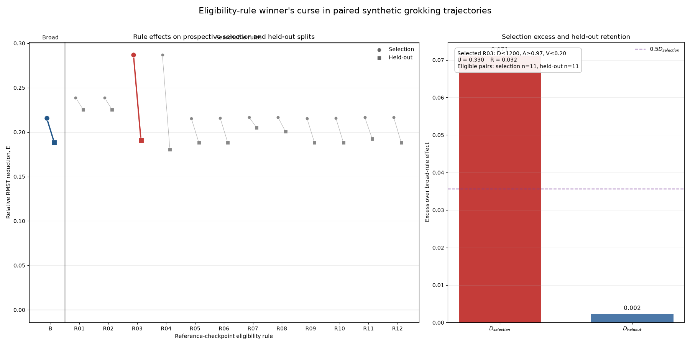

# An Illustrative Single-Realization Demonstration of Eligibility-Rule Search and Holdout Attenuation in Grokking-Time Estimates

## Abstract

This synthetic feasibility study illustrates a workflow for recording every attempted reference seed—including non-grokking runs and runs lacking eligible checkpoints—before defining an intervention sample, and examines how searching over reference-only checkpoint-eligibility rules can coincide with attenuation on a held-out split. One realization containing 48 paired synthetic trajectories was divided into 24 rule-selection and 24 held-out seeds. All reference attempts were recorded in a ledger, and one of 12 reference-only eligibility rules was selected by maximizing the estimated relative reduction in restricted mean grokking time among rules with at least six eligible selection pairs.

In this realization, the selected rule produced a selection-split effect of 0.2870, compared with 0.2158 under a fixed broad rule, corresponding to a 33.0% proportional uplift. The difference between the selected- and broad-rule effects was 0.0712 on selection seeds and 0.0023 on held-out seeds, so the descriptive retention ratio was 3.23%. These differences do not identify selection bias alone because the two rules define different eligible populations that may have genuinely different treatment effects. Moreover, only one 48-seed realization was analyzed, the selected rule retained 11 seeds per split, and no paired uncertainty analysis, repeated-block simulation, null analysis, or sensitivity analysis was available. The result therefore demonstrates the feasibility of complete attempt accounting and provides one example of rule-search followed by holdout attenuation; it does not establish an eligibility winner’s curse as a systematic phenomenon or estimate its frequency or magnitude.

## Background

Grokking describes training behavior in which strong training performance precedes a delayed transition to strong validation performance. Current work examines its conditionality and fragility [1], architectural influences [2], weight-norm and logit-scale mechanisms [3], embedding-layer mechanisms [4], broader conceptual interpretations [5], and theoretical learning dynamics [6]. These perspectives make trajectory-level reporting important because a single endpoint or selectively chosen checkpoint can conceal delayed transitions, censoring, or heterogeneous responses across seeds.

The associated reporting problem is not unique to grokking. Learning-curve methodology emphasizes that decisions can depend on how performance evolves during training [7], while validation recommendations stress explicit experimental design and transparent accounting of attempted analyses [8]. In this setting, searching across several plausible reference-defined eligibility thresholds can identify a subgroup with an unusually favorable estimated intervention effect. That possibility remains even when doubled-rate outcomes are not directly used to determine eligibility because the arms are paired and eligibility may correlate with heterogeneous intervention responses.

However, a selected rule and a broad rule generally identify different populations. Their estimated effects can differ for at least two reasons: sampling and specification-search overfitting, and genuine differences in intervention effects between the populations selected by the rules. A holdout can show whether a selected rule’s estimated advantage persists in another sample, but it cannot by itself decompose these components or establish that the entire selection-split difference was bias.

A complete attempted-reference ledger addresses a narrower reporting objective. It preserves non-grokking trajectories, censored outcomes, failed eligibility assessments, and seeds that would otherwise disappear from the analysis record. The ledger does not itself reveal or cause holdout attenuation; that evidence comes from applying a rule selected on one split to another split. Its role is to make the attempted reference population and subsequent eligibility decisions auditable, provided the ledger, executable code, and provenance information are actually made available.

## Hypothesis

The analysis evaluated the following stated criterion:

> For 48 paired reference and doubled-learning-rate trajectories split into 24 rule-selection and 24 held-out seeds, choosing from 12 threshold-based checkpoint-eligibility rules to maximize the apparent intervention reduction in restricted mean grokking time would yield a selected-sample effect at least 30% larger than that of a fixed broad rule on the selection seeds, but at least half of this excess would disappear when the chosen rule was applied unchanged to the held-out seeds.

The original analysis described this criterion as pre-specified. No timestamped protocol, immutable repository history, cryptographic commitment, or other independently verifiable pre-analysis artifact was included with the report. Consequently, the criterion should be regarded here as retrospectively documented rather than independently verified as prospectively registered. The exact seed range, rule thresholds, six-pair minimum, restriction horizon, and 30% and 50% decision thresholds cannot be treated as confirmatory pre-specifications without such evidence.

The criterion was scientifically motivated by the possibility that searching across reference-only eligibility rules could favor a subgroup whose paired intervention effect was unusually large in the selection sample. Nevertheless, crossing the criterion in a single realization is only a descriptive outcome. It is not a test with a calibrated false-positive rate, and the original binary **SUPPORTED** designation is not retained as an inferential conclusion.

## Method

The experiment was reported as using Python 3.11 or later with NumPy, pandas, and matplotlib, without network resources or external data. Exact Python and package versions were not recorded in the report. Checkpoints were fixed at \(t=100,200,\ldots,5000\), and the restriction horizon was \(\tau=5000\). Seed IDs 0–23 were assigned to rule selection, and IDs 24–47 were assigned to held-out evaluation.

For each seed \(i\), an independent generator was initialized as:

```python
numpy.random.default_rng(730000 + i)
```

Four standard-normal variables \(d,m,g,h\) were drawn in that order. The reference-arm locations were

\[
M_{\mathrm{ref}}
=\exp(\log(700)+0.25d+0.12m),
\]

\[
D_{\mathrm{ref}}
=\exp(\log(2200)+0.50d+0.35g),
\]

and

\[
G_{\mathrm{ref}}=M_{\mathrm{ref}}+D_{\mathrm{ref}}.
\]

For the doubled-learning-rate arm,

\[
M_{\mathrm{double}}=\frac{M_{\mathrm{ref}}}{2^{0.65}},
\]

\[
D_{\mathrm{double}}
=D_{\mathrm{ref}}\exp(-0.35+0.35h),
\]

and

\[
G_{\mathrm{double}}
=M_{\mathrm{double}}+D_{\mathrm{double}}.
\]

Thus, the synthetic data-generating process explicitly built in an average learning-rate benefit through the reductions in \(M_{\mathrm{double}}\) and \(D_{\mathrm{double}}\). It also built in shared seed-level difficulty, heterogeneous doubled-rate responses through \(h\), and a particular association between reference timing, reference eligibility, and paired outcomes. The analysis therefore evaluates rule search under this specific constructed model rather than under a model-free or null setting.

For each seed, 50 reference training noises, 50 reference validation noises, 50 doubled-rate training noises, and 50 doubled-rate validation noises were drawn in that exact order, each from a normal distribution with standard deviation 0.012. With \(\sigma(x)=1/(1+\exp(-x))\), arm-level trajectories were

\[
\operatorname{train}_a(t)
=\operatorname{clip}\left[
0.05+0.94\sigma\left(\frac{t-M_a}{120}\right)
+\epsilon^{\mathrm{train}}_a(t),\,0,\,1
\right],
\]

\[
\operatorname{validation}_a(t)
=\operatorname{clip}\left[
0.10+0.88\sigma\left(\frac{t-G_a}{180}\right)
+\epsilon^{\mathrm{validation}}_a(t),\,0,\,1
\right].
\]

The analysis description states that all 4,800 trajectory rows—48 seeds, two arms, and 50 checkpoints—were saved to `all_trajectories.csv.gz`. That file was not included with the report and therefore could not be independently inspected here.

An arm was classified as grokked if validation accuracy reached at least 0.90 at three consecutive checkpoints. The observed grokking time was the first checkpoint in the earliest qualifying run. Arms with no qualifying run were marked non-grokking and assigned a restricted time of 5000.

Eligibility depended only on reference trajectories. The fixed broad rule \(B\) required at least one checkpoint satisfying

\[
400\leq t\leq3000,\quad
\text{train accuracy}\geq0.80,\quad
\text{validation accuracy}\leq0.50.
\]

The 12 searchable rules were the Cartesian product of:

- deadline \(D\in\{1200,1800,2400\}\);
- training threshold \(A\in\{0.90,0.97\}\);
- validation ceiling \(V\in\{0.20,0.40\}\).

A searchable rule was satisfied if at least one reference checkpoint had \(400\leq t\leq D\), training accuracy of at least \(A\), and validation accuracy of at most \(V\). Rules were enumerated by ascending \(D\), then ascending \(A\), and then ascending \(V\), which also supplied the exact-tie order.

According to the analysis description, `attempted_reference_ledger.csv` was written before intervention effects were calculated or analysis samples were formed. It had one row for every seed and included the assigned split, latent reference locations, reference grok status, observed time or the literal `CENSORED`, restricted time, and eligibility and earliest qualifying checkpoint for the broad and all 12 searchable rules. Failed rules were represented by `FALSE` and `NA`. The intended requirement was that the ledger contain 48 unique seeds, including non-grokking seeds and any seed ineligible under every searchable rule.

Because the ledger, executable code, filesystem metadata, repository history, and cryptographic hashes were not provided, its creation time and immutability cannot be independently verified. “Recorded before effect calculation” should therefore be understood as a property of the reported workflow, not as an externally established fact.

For each rule and split, paired reference and doubled-rate restricted times were averaged over the same reference-eligible seeds. The relative intervention reduction was

\[
E(r,s)=
\frac{\operatorname{RMST}_{\mathrm{ref}}(r,s)
-\operatorname{RMST}_{\mathrm{double}}(r,s)}
{\operatorname{RMST}_{\mathrm{ref}}(r,s)}.
\]

On selection seeds, searchable rules with at least six eligible pairs were treated as valid. The valid rule with the largest selection effect was frozen as \(r_\star\) and applied unchanged to held-out seeds. Because ratio-based effects can be unstable in small samples and can be favored by advantageous denominators, the six-pair threshold is an important analysis choice rather than a guarantee of stable estimation.

The key derived quantities were

\[
D_{\mathrm{selection}}
=E(r_\star,\mathrm{selection})-E(B,\mathrm{selection}),
\]

\[
D_{\mathrm{holdout}}
=E(r_\star,\mathrm{heldout})-E(B,\mathrm{heldout}),
\]

\[
R=\frac{D_{\mathrm{holdout}}}{D_{\mathrm{selection}}},
\]

and

\[
U=\frac{E(r_\star,\mathrm{selection})}
{E(B,\mathrm{selection})}-1.
\]

Here, \(D_{\mathrm{selection}}\) and \(D_{\mathrm{holdout}}\) are differences between effects in different rule-defined populations. They are therefore called rule-effect differences or “excesses” descriptively, not estimates of bias. Likewise, \(R\) describes the retention of that observed difference and is not a bias-retention parameter.

The broad rule provides a predetermined, no-search comparison: its effect was evaluated without choosing among the 12 searchable rules. It does not, however, isolate specification-search bias because it defines a broader population than the selected rule. No fixed-rule population effects from a large simulation, homogeneous-treatment-effect control, Monte Carlo null distribution, randomization analysis, paired bootstrap, or repeated independent 48-seed blocks were performed.

The original decision criterion required adequate sample sizes in all four relevant samples, a positive broad-rule selection effect, \(U\geq0.30\), a positive selection excess, and \(R\leq0.50\). No confidence interval or inconclusive category was used. A more informative analysis would attach paired uncertainty intervals to restricted means, effects, excesses, uplift, and retention. To account for selection, a bootstrap or simulation would need to repeat the entire rule-selection procedure within each resample or independently generated block rather than condition only on the observed winning rule. Those analyses cannot be reconstructed from the aggregate values reported here.

The analysis description states that complete rule-by-split results and summary values were saved as `rule_results.csv` and `summary_metrics.json`. These files, the executable code, and hashes for the code and outputs were not supplied with the report.

## Results

The reported attempted-reference ledger contained all 48 seeds with 48 unique seed IDs, yielding nominal ledger coverage of 1.0. It retained 13 non-grokking reference trajectories. No seed in this realization was ineligible under every searchable rule, although the ledger schema was designed to retain such seeds. The reported trajectory file contained 4,800 rows, and the reported rule-results file contained 26 rows: 13 rules evaluated on each of two splits. These file-level assertions could not be independently verified because the underlying files were not provided.

The selected rule was \(R03\), with:

- deadline \(D=1200\);
- training threshold \(A=0.97\);
- validation ceiling \(V=0.20\).

The numerical results available for the broad and selected rules are summarized below. The original report did not provide the reference and doubled-rate restricted means themselves, standard errors, confidence intervals, or the remaining rule-level rows. Those values cannot be recovered uniquely from the reported relative effects.

| Split | Rule | Eligible pairs | Non-grokking reference arms | Non-grokking doubled-rate arms | Reference restricted mean | Doubled-rate restricted mean | Relative effect | Difference from broad rule | Uncertainty |
|---|---:|---:|---:|---:|---:|---:|---:|---:|---:|
| Selection | Broad \(B\) | 24 | 7 | 3 | Not reported | Not reported | 0.2157772622 | 0 | Not reported |
| Selection | \(R03\) | 11 | 0 | 0 | Not reported | Not reported | 0.2870090634 | 0.0712318013 | Not reported |
| Held-out | Broad \(B\) | 24 | 6 | 3 | Not reported | Not reported | 0.1883353584 | 0 | Not reported |
| Held-out | \(R03\) | 11 | 1 | 0 | Not reported | Not reported | 0.1906354515 | 0.0023000931 | Not reported |

The broad rule included all 24 selection seeds. Its relative reduction in restricted mean grokking time was

\[
E(B,\mathrm{selection})=0.2157772622.
\]

Rule \(R03\) included 11 selection seeds and produced

\[
E(R03,\mathrm{selection})=0.2870090634.
\]

The descriptive proportional uplift was therefore

\[
U=0.3301172725,
\]

or approximately 33.0%. The difference between the selected- and broad-rule effects on the selection split was

\[
D_{\mathrm{selection}}=0.0712318013.
\]

This crossed the stated 30% criterion. It should not be interpreted as a selection-bias estimate because \(R03\) and the broad rule included different groups of seeds. The difference may combine search-related overestimation, ordinary sampling variation, ratio instability, and genuine subgroup-effect differences induced by the eligibility definitions.

On the held-out split, the broad rule again included all 24 seeds and had an effect of

\[
E(B,\mathrm{heldout})=0.1883353584.
\]

The unchanged \(R03\) rule included 11 held-out seeds and had an effect of

\[
E(R03,\mathrm{heldout})=0.1906354515.
\]

The held-out rule-effect difference was

\[
D_{\mathrm{holdout}}=0.0023000931.
\]

Consequently, the descriptive retention ratio was

\[
R=0.0322902555,
\]

meaning that approximately 3.23% of the selection-split rule-effect difference was retained in this held-out split.



The figure’s left panel compares the reported selection and held-out effects for the broad rule and all 12 searchable rules. In this realization, \(R03\) had the largest valid selection-split effect and therefore was selected. Its advantage over the broad rule was much smaller when its thresholds were applied unchanged to the held-out seeds. The right panel displays the corresponding differences of 0.0712 and 0.0023.

The predetermined broad rule offers a limited no-search comparison. Its estimated effects were 0.2158 on the selection split and 0.1883 on the held-out split, showing that estimates varied across the two groups of 24 seeds even without searching over rules. Without paired uncertainty intervals or repeated seed blocks, the amount of variation expected for either the broad or selected rule is unknown.

All four relevant samples met the stated six-pair minimum: 24 and 24 under the broad rule and 11 and 11 under \(R03\). Meeting that minimum does not establish precision. In particular, both selected-rule estimates were based on only 11 paired seeds, and no standard errors or confidence intervals were available to determine whether the difference between 0.0712 and 0.0023 was unusual relative to sampling variation.

No distribution of selected-rule uplift, held-out retention, selected-rule identity, eligible sample size, false-positive rate, or decision rate can be reported because only one independently generated 48-seed block was analyzed. Likewise, the report cannot determine how often the 30% criterion would be crossed, how variable the 3.23% retention statistic is, or whether the observed attenuation is extreme under this data-generating process.

The complete 26-row rule table—including eligible counts, reference and doubled-rate restricted means, effects, excesses, and uncertainty on both splits—was not present in the source report. Although `rule_results.csv` was named as an output, its contents were not supplied. Reporting missing rows or restricted means here would require inventing results and is therefore not possible.

Under the original binary rule, this realization crossed the stated uplift and retention thresholds. Given the absence of independently verified pre-specification, uncertainty estimates, repeated simulations, and controls separating search inflation from subgroup heterogeneity, that crossing is reported only as a descriptive feature of this realization. It does not support a general conclusion that an eligibility winner’s curse has been established.

## Limitations

First, this was a synthetic feasibility study rather than an experiment on trained neural networks. The trajectories followed specified sigmoid functions with Gaussian noise. The model explicitly imposed a doubled-learning-rate benefit and a particular relationship among reference timing, reference eligibility, shared seed difficulty, and paired outcomes. The result may therefore reflect both generic specification-search behavior and features of this specific construction. No alternative data-generating processes were analyzed.

Second, only one 48-seed realization was examined, with 24 seeds assigned to rule selection and 24 to held-out evaluation. The selected rule included only 11 seeds per split. A single realization cannot establish an eligibility winner’s curse as a systematic phenomenon. The attenuation from a selection difference of 0.0712 to a held-out difference of 0.0023 could arise from ordinary sampling variation in two small groups, from selection overfitting, from genuine population differences between eligibility rules, or from a combination of these mechanisms.

Third, the requested repeated-block characterization was not performed. There is no distribution across independently generated, prospectively defined 48-seed blocks of:

- selected-rule uplift;
- held-out retention;
- selected-rule identity;
- eligible sample sizes;
- threshold-decision rates; or
- false-positive rates under a null or homogeneous-effect model.

Accordingly, the frequency and robustness of the observed behavior are unknown.

Fourth, no uncertainty estimates were reported. The available source does not contain seed-level paired restricted times or the referenced output files, so valid paired standard errors, bootstrap intervals, randomization intervals, or Monte Carlo distributions cannot be reconstructed. Inference should preserve pairing and account for the rule-selection procedure—for example, by repeating rule selection inside each bootstrap replicate or by evaluating the full procedure over independently generated seed blocks. An interval conditional only on \(R03\) being selected would not fully represent selection uncertainty.

Fifth, the selected-rule and broad-rule effects concern different eligible populations. Their difference is not purely a measure of bias. Eligibility can identify seeds with genuinely different doubled-rate effects, particularly under the present heterogeneous synthetic model. A holdout limits reuse of the selection observations but does not identify how much of the selection excess arose from overfitting versus true subgroup-effect differences. No simulation-based decomposition was performed, so the “winner’s curse” interpretation has been narrowed to an observation of rule search followed by holdout attenuation.

Sixth, controls needed to isolate specification-search bias were absent. The analysis did not compare each fixed rule’s selection estimate with a large-simulation population effect, repeat the full procedure under homogeneous treatment effects, or evaluate a fixed selected-population rule that was chosen independently of the observed data. The broad rule is a useful predetermined no-search comparison, but because it selects a different population, it does not by itself quantify search bias.

Seventh, the search space contained only 12 rules with a specific set of deadlines and thresholds. A larger, smaller, or differently structured search space could change the winning rule, eligible sample size, and apparent attenuation. The selected effect was ratio-based, and searchable rules with as few as six eligible pairs were permitted. Maximizing such an effect can favor unstable estimates or favorable reference-arm denominators.

Eighth, no sensitivity analysis was available for the six-pair minimum. The full procedure was not repeated with larger minimum eligible counts, and it is unknown whether \(R03\) would remain selectable or whether another rule would win. This is especially important because the observed winner retained only 11 eligible pairs.

Ninth, non-grokking outcomes were administratively restricted at 5000 checkpoints. Restricted mean effects depend on this horizon, and trajectories that might grok after checkpoint 5000 were treated as censored at that point. No sensitivity analysis used alternative restriction horizons, so the stability of the rule rankings, effects, and retention statistic to \(\tau\) is unknown.

Tenth, no sensitivity analysis varied the broad-rule definition. Because all reported excesses use the broad rule as the comparator, different deadlines, training thresholds, or validation ceilings for that rule could alter both the selection excess and held-out retention. The broad rule also included all 24 seeds in each split in this realization, which makes it functionally close to an all-seed analysis but does not establish that it would do so in repeated blocks.

Eleventh, the original analysis described the hypothesis, split, seeds, thresholds, and decision cutoffs as pre-specified, but no timestamped protocol, repository history, immutable artifact, or cryptographic commitment was supplied. The criterion is therefore retrospectively documented in this report. The fact that the observed uplift narrowly exceeded the 30% cutoff makes independent provenance particularly important.

Twelfth, the named files—`all_trajectories.csv.gz`, `attempted_reference_ledger.csv`, `rule_results.csv`, and `summary_metrics.json`—were not included, nor was executable code supplied. Exact Python and dependency versions and cryptographic hashes were also absent. Consequently, ledger completeness and immutability, random-number draw order, rule enumeration, grokking-time extraction, figure generation, and numerical outputs cannot be independently verified from the material provided.

Finally, the attempted-reference ledger should not be credited with revealing the attenuation. Its direct contribution is complete accounting of attempted reference runs and eligibility decisions. The holdout comparison is what displays attenuation in this realization. The study’s contribution is therefore a carefully instantiated feasibility example of transparent attempt accounting, reference-only rule search, and held-out evaluation, rather than a substantive empirical or methodological characterization of an eligibility winner’s curse.

## Follow-up questions

- Across many independently generated and prospectively defined 48-seed blocks, what are the distributions of selected-rule uplift, held-out retention, selected-rule identity, eligible sample size, and threshold-decision rate?
- Under a null model or an appropriate homogeneous-treatment-effect model, how often does the same search procedure cross the 30% uplift and 50% retention criteria?
- For each fixed eligibility rule, how do finite-sample selection and held-out estimates compare with population effects estimated from a sufficiently large simulation?
- How much of the selected-versus-broad difference can be attributed to specification-search overfitting, and how much to genuine differences between rule-defined eligible populations?
- What paired, selection-aware uncertainty intervals result from repeating the entire rule-selection procedure within bootstrap replicates or independent simulation blocks?
- How do the selected rule, estimated effects, and held-out retention change when the minimum eligible-pair requirement is increased above six?
- How do the estimated selection uplift and held-out retention change when the restriction horizon is prospectively varied, including observation beyond 5000 checkpoints?
- Are the conclusions robust to prospectively defined alternatives to the broad-rule deadline, training threshold, and validation ceiling?
- Does increasing the number or flexibility of reference-only eligibility rules systematically increase the gap between selection-split and held-out intervention effects?
- In real multi-seed grokking experiments, does publishing a timestamped pre-analysis protocol, executable code, complete attempted-reference ledger, generated data, software environment, and cryptographic hashes materially change reported effect sizes or conclusions compared with analyses that report only eligible checkpoints or successful runs?
