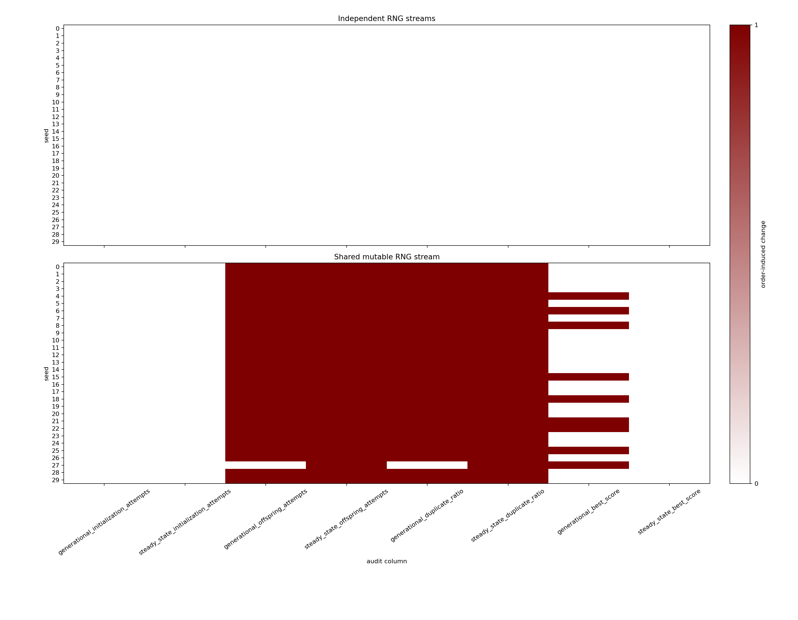

# Algorithm-and-Seed-Keyed RNG Streams Enable Order-Invariant Per-Seed Genetic-Algorithm Records

## Abstract

This artifact-validation study tested whether detailed per-seed records for generational and steady-state genetic algorithms (GAs) remain reproducible when algorithm execution order is reversed. Both algorithms were run on 64-bit OneMax for the 30 tested seed cases, seeds 0–29, using one master seed. The comparison used either separately initialized, algorithm-and-seed-keyed random-number streams or, for each seed, one mutable generator shared between the two algorithms. The keyed-stream mode reportedly produced byte-identical records for all 30 tested seeds and identical whole-file SHA-256 hashes. Under the per-seed shared-generator allocation policy, at least one audited field reportedly changed for every tested seed, and the steady-state offspring-attempt count changed for 30 of 30 seeds.

These findings are restricted to the tested implementation, master seed, and 30 seed cases. They demonstrate deterministic order invariance under one keyed RNG-allocation design and order dependence under one per-seed shared-generator design. They do not establish statistical independence between streams, nondeterministic scheduling effects, concurrent reproducibility, or broader platform reproducibility. Moreover, the executable source, four CSV artifacts, heatmap source matrix, environment lock file, and reproduction command were not included in the material available for this revision. The reported hashes and numerical comparisons therefore remain unverified assertions rather than independently audited artifact results.

## Background

Genetic algorithms are stochastic optimization methods whose recorded trajectories depend on initialization, selection, crossover, mutation, replacement, duplicate handling, and stopping rules. Materially different choices in these components can produce different computational effort and outcomes even when the objective and nominal seed are unchanged. A reproducible record should therefore preserve more than the final score.

Random-number allocation is part of the effective experimental design. If two algorithms consume values from the same mutable generator, changing their execution order changes which portions of the pseudorandom sequence they receive. A fixed master seed alone therefore does not make each algorithm’s result invariant to execution order. In this study, “shared” does not mean one global generator spanning all seeds. Instead, each seed receives its own generator, and that generator is shared only between the generational and steady-state algorithms for that seed.

Established reproducible-computing practice offers several ways to avoid mutable-stream coupling. These include formal stream-splitting methods with stated guarantees, deterministic child-stream creation such as spawning from a seed sequence, explicit algorithm or operator keys, counter-based generators, and deterministic output collection followed by sorted serialization. The present study evaluates only one design: creating a fresh `PCG64` generator from `SeedSequence([master_seed, seed, algorithm_id])`. This construction is described here as producing **separately seeded, algorithm-and-seed-keyed streams**. It is not described as producing independent substreams because the experiment supplies neither a formal disjoint-subsequence construction nor evidence of statistical independence.

The keyed-stream result is principally a deterministic software and artifact sanity check: when deterministic code is rerun with the same parameters and a freshly reconstructed generator bearing the same key, its serialized output should be identical. The contribution is therefore limited to illustrating how per-run RNG keys and detailed records can support artifact validation, and how sharing one mutable per-seed generator can make records depend on algorithm order. The study does not establish novelty over existing RNG-allocation or reproducible parallel-computing practices and does not compare the tested construction against spawning, counter-based RNGs, formal stream splitting, or explicit per-operator streams.

The original report contained numbered citation placeholders `[1]`, `[2]`, `[4]`, `[5]`, `[6]`, `[9]`, and `[10]`, but no corresponding bibliographic metadata was supplied. Assigning publications to those numbers would require inventing sources. The unsupported numbered citations have therefore been removed, and no citation-dependent priority or literature claim is made in this revision. A complete bibliography cannot be reconstructed without the missing source information.

A raw per-seed artifact can expose order effects directly. The records considered here include initialization attempts and misses, offspring attempts and misses, accepted-target counters, failure indicators, best scores, and duplicate ratios for both algorithms. Such records can audit computational effort and duplicate rejection in addition to endpoint performance. For a generally auditable reproducibility record, however, these result fields must be accompanied by implementation provenance, schema version, complete parameter configuration, and unambiguous RNG-key metadata.

## Hypothesis

The tested hypothesis was:

> For seeds 0 through 29 on 64-bit OneMax under the stated implementation and master seed, assigning each `(algorithm, seed)` pair a freshly reconstructed generator keyed by `[master_seed, seed, algorithm_id]` will produce byte-identical per-seed records when algorithm execution order is reversed. In contrast, assigning each seed one mutable generator shared between the two algorithms will cause order-dependent changes in at least 80% of the tested rows for one or more of initialization attempts, offspring attempts, duplicate ratio, or either score.

The 80% threshold was an operational decision rule intended to distinguish widespread order sensitivity from a small number of changed cases. No theoretical argument, prior empirical calibration, or external record of preregistration was supplied for that value. It should not be interpreted as a scientifically established boundary. The report states that the threshold was specified before the comparison, but the available material does not independently verify that chronology.

The hypothesis was treated as supported only if:

1. Keyed-stream forward and reverse execution produced 30 of 30 byte-identical per-seed lines and equal whole-file SHA-256 hashes; and
2. Under the per-seed shared-generator allocation policy, at least one of the eight audited columns changed for at least 24 of the 30 tested seeds.

The union of changes across columns was descriptive and was not permitted to replace the column-specific criterion. Any resulting verdict applies only to these 30 deterministic seed cases under the single tested master seed. It is not an estimate of behavior across all seeds, master seeds, implementations, platforms, or RNG-allocation methods.

## Method

The reported experiment used Python 3.11.13, NumPy 1.26.4, and Matplotlib 3.8.4. Algorithm executions were single-threaded and were not run concurrently or in parallel. The master seed was `20250308`.

The objective was OneMax on unsigned 64-bit integers:

\[
\operatorname{fitness}(x)=\operatorname{bit\_count}(\operatorname{int}(x)),
\]

with an optimum of 64. The population size and initialization target were 64 unique genomes, with an initialization cap of 10,000 attempts. Each run targeted 2,048 accepted offspring, with a cap of 100,000 offspring attempts.

Every pseudorandom generator was reported to be a `numpy.random.Generator` backed by `numpy.random.PCG64` and initialized from a `SeedSequence`. A genome was generated as:

```python
int(rng.bit_generator.random_raw()) & ((1 << 64) - 1)
```

Initialization repeatedly generated genomes until 64 distinct values had been accepted or the attempt cap was reached. Every generated genome counted as an initialization attempt; a genome already accepted counted as an initialization miss. Initialization failure was recorded when fewer than 64 unique genomes were accepted. If initialization failed, no offspring were generated, offspring failure was set, and the score was the best initialized fitness or zero if no genome had been accepted.

For each attempted child, each parent was selected through a separate two-way tournament. Two population indices were drawn independently, and the genome with higher fitness was selected; ties were resolved in favor of the first draw. Uniform crossover used a random 64-bit mask:

```text
(parent1 & mask) | (parent2 & ((~mask) & MASK64))
```

The mutation count was sampled as `binomial(64, 1/64)`. When the count was positive, that many distinct bit positions were selected without replacement and flipped.

In the generational GA, accepted children accumulated in a new generation of size 64. A child was rejected if it duplicated either a genome in the current population or an already accepted child in the pending generation. Once 64 children were accepted, they replaced the entire population. Execution stopped immediately upon reaching 2,048 accepted offspring or 100,000 attempts.

In the steady-state GA, a child was rejected if it duplicated a genome in the current population. Otherwise, it was appended to form a temporary population of 65. One individual with minimum fitness was then removed, chosen uniformly among all indices tied for the minimum. Execution again stopped upon reaching 2,048 accepted offspring or 100,000 attempts.

For both algorithms, `best_score` was the maximum fitness observed among all accepted initialization genomes and accepted offspring, including offspring later removed. The duplicate ratio was:

\[
\text{duplicate\_ratio} =
\frac{\text{initialization\_misses}+\text{offspring\_misses}}
{\text{initialization\_attempts}+\text{offspring\_attempts}},
\]

or `0.0` if the denominator was zero.

Seeds 0 through 29 were evaluated under two RNG-allocation modes:

- **Keyed-stream mode:** Each algorithm run received a fresh generator created from `SeedSequence([20250308, seed, algorithm_id])`, where `algorithm_id` was 0 for the generational GA and 1 for the steady-state GA. These were deterministically keyed, separately initialized streams. No formal substream-disjointness or statistical-independence guarantee was tested.
- **Per-seed shared-generator mode:** Each seed received one generator created from `SeedSequence([20250308, seed])`. That generator was shared between the two algorithms for that seed and passed first to one algorithm and then to the other. A new per-seed generator was reconstructed for each mode/order experiment; there was no single generator shared globally across all 30 seeds.

Each mode was run in forward order—generational followed by steady-state—and reverse order—steady-state followed by generational. All generators were recreated from their seed sequences for each mode/order experiment. Thus, the shared-generator comparison intentionally changed which segment of each seed’s pseudorandom sequence was allocated to each algorithm. It tested order dependence under that allocation policy, not thread scheduling, nondeterministic concurrency, or parallel execution.

The experiment reportedly produced four CSV files: `independent_forward.csv`, `independent_reverse.csv`, `shared_forward.csv`, and `shared_reverse.csv`. Each reportedly contained a header and exactly 30 seed-sorted rows. For each algorithm, the record included initialization target, accepted count, attempts, misses, and failure indicator; offspring target, accepted count, attempts, misses, and failure indicator; best score; and duplicate ratio. Ratios were reportedly serialized with exactly 12 digits after the decimal point. Files reportedly used UTF-8, comma delimiters, Unix newlines, and no timestamps, comments, indices, or platform-dependent metadata.

Forward and reverse records were reportedly compared using whole-file SHA-256 hashes and line-level byte identity. Eight serialized audit columns were compared per seed:

1. Generational initialization attempts
2. Steady-state initialization attempts
3. Generational offspring attempts
4. Steady-state offspring attempts
5. Generational duplicate ratio
6. Steady-state duplicate ratio
7. Generational best score
8. Steady-state best score

Because all reported runs successfully accepted exactly 64 initialization genomes and 2,048 offspring, the total number of misses satisfies:

\[
\text{initialization\_misses}+\text{offspring\_misses}
=
\text{initialization\_attempts}+\text{offspring\_attempts}-2112.
\]

Consequently, for every successful fixed-target run:

\[
\text{duplicate\_ratio}
=
1-
\frac{2112}
{\text{initialization\_attempts}+\text{offspring\_attempts}}.
\]

The duplicate ratio is therefore algebraically determined by the two attempt counts in these successful runs. Because initialization-attempt counts did not change between orders, the observed duplicate-ratio change patterns were induced by offspring-attempt changes, subject to serialization precision. Duplicate ratio and offspring attempts must not be treated as independent corroborating outcomes in this experiment.

The CSV schema as described is adequate for recording the reported run-level counters but is not, by itself, a complete general-purpose reproducibility schema. An auditable release would additionally need a schema version; source-code version or commit and source hash; implementation identifier; full dependency and platform provenance; complete named parameter configuration; objective and algorithm identifiers; RNG library, bit-generator type, and version; RNG-allocation mode; master seed; seed; algorithm ID; the complete `SeedSequence` key or equivalent unambiguous RNG-key metadata; serialization rules; and artifact hashes. A sidecar manifest could contain file-level fields that would otherwise be repeated in every row.

The complete executable source code, the four CSV files, the heatmap’s seed-by-column source matrix, a manifest, and an environment lock file were not included in the material available for this revision. No grounded executable reproduction command can be supplied without knowing the actual script name, package layout, or dependency specification. Consequently, the reported files could not be independently regenerated, and the stated hashes could not be verified against independently reproduced artifacts.

## Results

The reported keyed-stream comparison achieved exact order invariance for the 30 tested seed cases. All 30 of 30 per-seed lines were reported as byte-identical between forward and reverse execution, and the complete CSV files were reported to have the same SHA-256 digest:

```text
b49d29ff1ff73164509c486ff7bd4f20d0c63a9e78f0f0699ec63526e76855e0
```

Accordingly, `independent_whole_file_equal` was reported as true. None of the eight keyed-stream audit columns reportedly changed for any tested seed, and the union change count was 0 of 30.

The per-seed shared-generator comparison was reported as order-dependent. The shared forward and reverse files were reported to have different SHA-256 digests:

```text
shared forward: a44bc9c00c9f09b30d731abafe9460f464d1f76c2bc49002766e06bf4bd0787e
shared reverse: c4879ab96579e555b4d345fc96c4fd847728ca8a1638fa2ba56fb90aa1e4257e
```

The reported column-specific changes are shown below. The confidence intervals are 95% Wilson binomial intervals computed from the stated counts. They quantify uncertainty only under a hypothetical Bernoulli-sampling interpretation; the actual cases were the fixed deterministic seeds 0–29 under one master seed.

| Audit column | Keyed-stream changes | Shared-generator changes | 95% Wilson interval for shared rate |
|---|---:|---:|---:|
| Generational initialization attempts | 0/30 (0.0%) | 0/30 (0.0%) | 0.0%–11.4% |
| Steady-state initialization attempts | 0/30 (0.0%) | 0/30 (0.0%) | 0.0%–11.4% |
| Generational offspring attempts | 0/30 (0.0%) | 29/30 (96.7%) | 83.3%–99.4% |
| Steady-state offspring attempts | 0/30 (0.0%) | 30/30 (100.0%) | 88.6%–100.0% |
| Generational duplicate ratio | 0/30 (0.0%) | 29/30 (96.7%) | 83.3%–99.4% |
| Steady-state duplicate ratio | 0/30 (0.0%) | 30/30 (100.0%) | 88.6%–100.0% |
| Generational best score | 0/30 (0.0%) | 9/30 (30.0%) | 16.7%–47.9% |
| Steady-state best score | 0/30 (0.0%) | 0/30 (0.0%) | 0.0%–11.4% |

The largest reported shared-generator change rate was 100%, attained by steady-state offspring attempts and, algebraically, steady-state duplicate ratio. The steady-state offspring-attempt result exceeded the operational threshold of 80%, or 24 of 30 tested seeds. The reported union change count was 30 of 30, meaning that every tested seed changed in at least one audited field.



The heatmap reportedly summarizes the comparisons at seed resolution. The keyed-stream panel contains no reported order-induced changes across the 30 seeds and eight audit columns. In the shared-generator panel, changes are concentrated in offspring attempts and their derived duplicate ratios: steady-state offspring attempts changed for all tested seeds, and generational offspring attempts changed for all but one. Generational best scores changed less frequently, whereas initialization-attempt counts and steady-state best scores did not change.

The seed-by-column binary matrix used to generate the heatmap was not provided. The image and aggregate counts therefore cannot be checked against source data from the submitted material.

No initialization or offspring failures were reported in any mode, order, or algorithm: every corresponding failure count was zero. Thus, the reported differences were not attributed to attempt-cap failures. They occurred within successful fixed-target runs and were visible in offspring-attempt counts even when the final best score remained unchanged.

Duplicate-ratio changes do not constitute a second independent line of evidence. With fixed accepted totals of 64 initialization genomes and 2,048 offspring, duplicate ratio is a deterministic monotone function of total attempts. Because initialization attempts did not change between orders, the matching duplicate-ratio patterns follow algebraically from offspring-attempt changes. The primary effort result is therefore the offspring-attempt comparison; duplicate ratio is an alternative serialization of the same underlying information in these runs.

Under the stated decision rule, the reported results support the hypothesis for these 30 tested seed cases and the single master seed: keyed-stream mode reportedly produced 30 of 30 byte-identical lines and equal whole-file hashes, while the per-seed shared-generator mode changed steady-state offspring attempts in 30 of 30 cases. This conclusion is limited to order invariance under the tested allocation policies. It does not demonstrate statistical independence of the keyed streams, deterministic behavior under concurrent scheduling, reproducibility across platforms, or superiority over other robust RNG-allocation schemes.

Because the executable implementation and generated artifacts were not supplied, the numerical comparisons and hashes could not be independently audited. The strongest defensible interpretation is therefore that the report describes a plausible deterministic artifact-validation result, not that the submitted package itself has demonstrated reproducibility.

## Limitations

- The experiment used only the 30 deterministic seed cases from 0 through 29 and one master seed. All conclusions are restricted to those cases. The study does not establish shared-generator change rates for other seeds or master seeds.
- The 80% criterion was an operational threshold without a supplied theoretical or empirical justification. Although the reported point estimates for offspring attempts exceeded it, the threshold should not be treated as a general scientific boundary.
- The reported 95% Wilson intervals remain broad with only 30 cases. They also rely on a sampling interpretation that is not automatic for a fixed sequence of deterministic seed identifiers.
- The complete executable source code was not supplied. The implementation details in the prose are insufficient to guarantee reconstruction of every tie-breaking, data-structure, serialization, and control-flow detail.
- The four reported CSV artifacts—`independent_forward.csv`, `independent_reverse.csv`, `shared_forward.csv`, and `shared_reverse.csv`—were not supplied.
- The heatmap source data, artifact manifest, environment lock file, and executable reproduction command were not supplied.
- The reported SHA-256 hashes and all change counts could not be checked against independently regenerated files. The paper therefore cannot verify that independent regeneration reproduces the stated hashes.
- The original numbered citations lacked bibliographic metadata. This revision removes the unsupported citation numbers rather than inventing references, but a full literature bibliography and citation-based positioning remain unavailable until the missing source information is provided.
- The keyed construction uses `SeedSequence([master_seed, seed, algorithm_id])`. It creates deterministically keyed, separately initialized streams, not formally demonstrated disjoint substreams. The experiment does not establish statistical independence.
- Exact equality in keyed-stream mode is close to a deterministic software sanity check: recreating the same generator key and rerunning the same deterministic implementation should reproduce the same output. The result is most appropriately framed as artifact validation rather than a broad scientific advance.
- The study evaluates only one keyed allocation design. It does not compare `SeedSequence.spawn`, formal stream-splitting methods, counter-based RNGs, explicit per-operator streams, or other robust allocation schemes.
- The shared-generator comparison intentionally changes which pseudorandom-sequence segment each algorithm receives. It demonstrates order dependence under that per-seed allocation policy, not nondeterministic scheduling, multiprocessing behavior, or parallel reproducibility.
- Runs were single-threaded. No claim is made about concurrent execution, deterministic output collection, sorted concurrent serialization, hardware variation, or distributed execution.
- Duplicate ratio and offspring attempts are not independent outcomes in these successful fixed-target runs. The duplicate-ratio changes are algebraically induced by attempt-count changes and should not be counted as separate corroboration.
- The experiment used only one objective: 64-bit OneMax. Results may differ for continuous, constrained, noisy, multiobjective, or problem-specific representations.
- Only two GA update structures were evaluated, using one fixed configuration of population size, tournament selection, uniform crossover, mutation, duplicate rejection, and offspring budget. The study does not establish order-sensitivity rates for other GA designs.
- The experiment used one reported Python version, one NumPy version, one bit generator, and one serialization design. Exact reproduction may depend on preserving all of these details as well as the unavailable implementation.
- No runs reached initialization or offspring attempt caps. Consequently, the failure-recording branches were specified but not empirically exercised.
- Initialization-attempt counts did not change in the reported shared-generator comparison. The evidence does not imply that every random-dependent field is order-sensitive.
- The CSV rows omit or do not establish important general provenance fields, including schema version, implementation version or commit, source hash, complete parameter identifiers, and unambiguous per-run RNG-key metadata. The described CSV format detected differences in this experiment but has not been shown to be sufficient as a general auditable reproducibility record.
- The study verifies neither comparative optimization quality nor broad platform portability. Generational best scores reportedly changed for 9 seeds, steady-state best scores for none, and no cross-platform experiment was conducted.

## Follow-up questions

- Can a complete artifact package be released containing executable source code, the four CSV files, the heatmap source matrix, a schema-versioned manifest, an environment lock file, and a documented one-command reproduction procedure?
- When that package is independently executed in the locked environment, do the regenerated CSV files reproduce the three stated SHA-256 digests exactly?
- If the experiment is extended to substantially more seeds and multiple master seeds, what are the shared-generator offspring-attempt change rates and their confidence intervals?
- How does the tested keyed construction compare with `SeedSequence.spawn`, formal stream splitting, counter-based RNGs, and explicit per-operator RNG keys?
- Do algorithm-and-seed-keyed streams remain byte-identical when the algorithms are actually launched concurrently, results are collected deterministically, rows are sorted by seed and algorithm identifier, and serialization is performed only after collection?
- Which additional schema and manifest fields are necessary to make the per-seed artifacts independently interpretable across implementation revisions?
- How do population size, mutation rate, and duplicate-rejection policy affect shared-generator order changes in offspring attempts?
- Can deliberately constructed low-diversity initialization distributions exercise the failure branches and verify deterministic recording of partial initialization, zero-offspring runs, and failure indicators under keyed RNG allocation?

---
