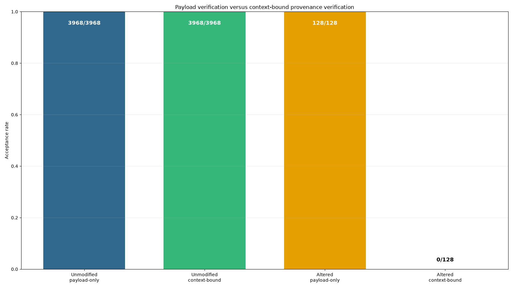

# Deterministic Validation of a Contextual-Hash Verifier Under Constrained Reference Swaps

## Abstract

This study evaluated a specific consistency check for deterministic provenance records. The test generated 128 baseline units and 3,840 case–mutant units in 3,968 fresh Python processes. It then exchanged complete, unchanged output references between 128 selected mutant bundles while retaining each donor reference’s payload digest, context digest, parent digest, stage, and schema metadata. Payload-only verification reportedly accepted all 128 altered bundles, whereas context-sensitive verification rejected all 128; both methods accepted all 3,968 unmodified bundles.

This result is deterministic rather than statistical. Because the context digest includes the unit identifier and source-parent digest, transplantation of an unchanged donor reference into a different target necessarily changes the verifier’s canonical context input. Rejection follows absent a SHA-256 collision or implementation error. The supported conclusion is therefore narrow: **under a trusted commitment to the original publication records, context-sensitive consistency checking detects transplantation of stale, unchanged donor references.** The construction does not by itself prevent a malicious party from rewriting provenance metadata and recomputing the unkeyed context digest.

The intended trust anchor was the SHA-256 hash of the final inventory bytes, obtained through an authenticated and immutable channel. That root would commit to the inventory, which in turn records the hashes of the published records and artifacts. However, the artifact package, executable source, exact environment specification, independent verifier, and literal final inventory root hash were not included in the material available for this report. The numerical results below are consequently reported run outcomes, not independently reproduced findings.

## Background

Mutation testing creates systematically modified program variants and compares their behavior with that of an original program. Prior work has examined mutation-testing infrastructure [4], mutation datasets [5], behavioral diversity measured through mutants [3], and methods for reducing the manual effort required to identify equivalent mutants [2]. Behavioral equivalence depends on the observation model: two artifacts may be equivalent under one behavioral lens while differing under another [1]. These concerns motivate publishing source representations, parser outcomes, semantic observations, and pairwise distances in addition to aggregate mutation results.

Reproducible artifacts require more than preserving executable code. Work on containerized scientific artifacts emphasizes repeatable environments and execution procedures [7], while provenance research examines workflow differencing [6], non-repudiable provenance [8], serialization formats [9], and unified access to provenance and version histories [10]. A conventional payload hash establishes that referenced bytes match a stated digest, but it does not establish that those bytes belong to the unit, stage, or dependency context in which they are presented.

The contextual digest used here is related to established provenance and software-supply-chain mechanisms rather than a replacement for them:

- A **signed manifest** authenticates a mapping from names or identifiers to payloads and metadata. If the signature and verification key are trusted, rewriting either a reference or its contextual digest invalidates the signature.
- A **Merkle DAG** binds objects to dependency digests and permits a trusted root to commit transitively to the graph. The ordered parent-digest list in this experiment performs a limited, record-level version of that structural binding.
- **Content-addressed build systems** identify artifacts by content and often represent dependencies as hash-linked graphs. They still require a trusted derivation or root when the claim concerns who authorized a particular association.
- **in-toto-style attestations, SLSA provenance, and signed-envelope mechanisms such as DSSE** authenticate statements about subjects, builders, inputs, and build steps. They address authorization and provenance authenticity beyond what an unkeyed contextual hash can provide.
- Provenance interchange formats can describe relationships and identities, but their security depends on how statements or roots are authenticated.

The construction evaluated in this report is standard domain-separated contextual hashing: it hashes a schema version, unit identifier, stage, ordered parents, and payload digest in a canonical representation. No new signature scheme, authenticated data structure, or general provenance-security mechanism is claimed. The study’s contribution is limited to a deterministic validation of one verifier implementation and one constrained stale-reference transplantation model.

## Hypothesis

The tested hypothesis was:

> In 128 seeded reference-swap cases that exchange valid same-type output references between case–mutant units while retaining each donor reference’s unchanged path, payload digest, context digest, parent digest, stage, and schema metadata, payload-only verification will accept the altered references, whereas context-sensitive consistency verification will reject them. Both methods will accept every unmodified bundle.

This hypothesis is conditional on a trust model that distinguishes an authenticated publication from an unauthenticated copy.

The intended authenticated publication root is the SHA-256 digest of the exact final inventory bytes. The inventory records the path, byte length, and SHA-256 digest of each published file under `artifacts/`, `fresh_process/`, `records/`, and `figures/`, excluding the inventory itself. If that root is acquired through an authenticated and immutable channel, it commits to the inventory bytes and thereby to the listed record and artifact bytes. The trusted commitment must cover, directly or through those file hashes, the original unit identifiers, artifact references, payload digests, context digests, stages, schemas, and ordered parent lists.

Under this model, an attacker may:

- copy, delete, replace, or redirect artifact files;
- edit paths, identifiers, parent lists, stage names, schema versions, payload digests, or context digests in an unauthenticated copy;
- transplant references between units;
- recompute any unkeyed SHA-256 context digest; and
- construct a different internally consistent manifest or inventory.

The attacker is assumed unable to:

- alter the externally authenticated inventory root without detection;
- replace the trusted root or its authenticated delivery channel;
- produce changed inventory or record bytes with the same SHA-256 digest; or
- exploit a verifier implementation bug.

The attacker cannot defeat the trusted-commitment model merely by recomputing the unkeyed context digest because changing the provenance metadata or digest also changes the committed record bytes, their inventory entry, or both. The resulting inventory no longer matches the authenticated root. In contrast, if the publication root is not externally authenticated, the attacker can recompute the contextual metadata, replace the manifest or inventory, and present a new internally consistent publication. The contextual digest alone does not prevent that attack.

The executed experiment tested only the stale-metadata branch of this model: donor references were transplanted without recomputing their context metadata. It did not experimentally test signature validation, external root delivery, manifest replacement, or adaptive rewriting.

The 128 cases are deterministic test vectors, not repeated statistical trials. They check implementation behavior over the selected corpus but do not increase confidence in an algebraic result in the manner that independent random security trials would.

## Method

The experiment used Python 3.11 or newer, the standard library, and matplotlib. Every process ran with `PYTHONHASHSEED=0`, and all cryptographic digests used SHA-256 through `hashlib.sha256`. Canonical JSON was defined as the UTF-8 encoding of:

```python
json.dumps(value, sort_keys=True, separators=(',', ':'), ensure_ascii=False)
```

followed by exactly one newline. Hashes covered the exact stored bytes, including that newline.

The supplied description did not identify the operating system, architecture, exact Python patch release, matplotlib version, locale, filesystem semantics, ZIP-library implementation version, or an environment lockfile. Those omissions prevent exact platform reconstruction from the report alone.

### Expression generation and semantics

Boolean expressions were represented exclusively as JSON arrays:

- Variable: `["var", k]`, where `k` was an integer from 0 through 7.
- Negation: `["not", child]`.
- Binary expression: `[op, left, right]`, where `op` was `"and"`, `"or"`, or `"xor"`.

A recursive parser rejected all other representations and returned the same normalized array structure for valid expressions. Expression generation used a dedicated `random.Random` instance and the specified recursive `gen_ast(rng, depth)` procedure. A variable was selected at depth zero or with probability 0.25; otherwise, an operator was selected uniformly from `not`, `and`, `or`, and `xor`.

For baseline case \(i\), where \(i=0,\ldots,127\), the generator was seeded with `710000+i` and invoked once at depth 4. Its unit identifier was `case-{i:03d}/baseline`.

Each baseline had 30 mutants. For mutant \(j\), where \(j=0,\ldots,29\), a depth-2 perturbation was generated with seed `910000 + 30*i + j`. The mutant was:

```text
[["and", "or", "xor"][j % 3], baseline_ast, perturbation]
```

and received the identifier `case-{i:03d}/mutant-{j:02d}`. This produced 128 baseline units and 3,840 pair units.

Every expression was evaluated over all 256 assignments to eight Boolean variables. Assignment \(a\) set variable \(x_k\) to `(a >> k) & 1`. The 256 outputs were packed into 32 bytes, with assignment \(a\) stored as bit `a % 8` of byte `a // 8`, and the exact bitset bytes were hashed with SHA-256. Pairwise behavioral distance was the Hamming distance between the baseline and mutant bitsets; normalized distance was that count divided by 256. Baseline units had distance zero.

### Parsing and fixed-point checks

Parser outcomes were recorded for every generated source expression. Each outcome included:

- `success`;
- `error_code`, which was null on success; and
- `canonical_ast_sha256`.

For each successful parse, the worker serialized the parsed AST canonically, reparsed those bytes, and serialized the result again. The fixed-point result was true only if the two serialized byte strings were identical.

All generated parser inputs were valid by construction. Consequently, these checks test conformance on generated valid inputs and serialization stability for already normalized arrays; they do not establish parser robustness or rejection behavior. No malformed JSON, invalid AST shape, out-of-range integer, excessive nesting, duplicate-key object, Unicode edge case, path manipulation, truncated archive, or adversarial ZIP input was included. Parser success rates are therefore not treated as central evidence for the provenance conclusion.

### Fresh-process execution and deterministic archives

A worker program processed exactly one unit per invocation. It received only a unit index or type and deterministic output paths; rather than receiving Python objects from the controller, it regenerated all expressions from the specified seeds. The controller launched 3,968 new Python interpreters with `subprocess.run`, one for each baseline or pair unit, and captured exact standard-output and standard-error bytes.

Worker standard output was canonical JSON containing the unit identifier, source AST hashes, parser and fixed-point outcomes, semantic bitset hashes, behavioral distances, and paths to written files. The bytes were stored unchanged under `fresh_process/` and hashed. Successful execution required exit code zero and empty standard error.

Each worker produced two deterministic ZIP archives:

1. A source archive containing `baseline.json` for baseline units or both `baseline.json` and `mutant.json` for pair units.
2. An output archive containing `outcome.json`, `semantic_baseline.bin`, and `semantic_candidate.bin`.

ZIP members were stored in lexicographic order with `ZIP_STORED`, timestamp `(1980,1,1,0,0,0)`, Unix mode 0644, no comment, and no extra fields. For baseline units, candidate semantics equaled baseline semantics. SHA-256 was computed over the exact bytes of each completed archive.

Three primary payload artifacts were recorded for every unit: its source archive, output archive, and captured fresh-process output. Across 3,968 units, this yielded 11,904 expected artifacts for separate-process hash recomputation.

“Fresh process” and “separate-process recomputation” do not mean independent verification. The workers, controller, and indexing processes used the same Python codebase, serialization assumptions, platform environment, and helper logic. Process isolation can reduce accidental state retention but does not detect shared logic errors, controller-worker agreement errors, or cross-platform discrepancies.

### Context digests and raw records

The schema version was `audit-provenance-v1`. For payload digest \(H\), unit identifier \(U\), stage \(S\), and ordered parent list \(P\), the context digest was SHA-256 over canonical JSON bytes for:

```json
{
  "ordered_parent_digests": P,
  "payload_digest": H,
  "schema_version": "audit-provenance-v1",
  "stage_name": S,
  "unit_identifier": U
}
```

Source archives used stage `source-archive` and an empty parent list. Output archives used stage `output-archive` and a one-element parent list containing the same unit’s source-archive context digest.

After worker completion, a separate fresh indexing process hashed every source archive, output archive, and captured worker payload. It also read the archives and checked the reported outcomes. It reportedly wrote 3,968 canonical JSON lines to `records/raw_records.jsonl`, ordered by case index, with the baseline preceding mutants and mutants ordered by index. Each record included identifiers and indices, artifact paths and hashes, context digests and parents, schema version, parser and fixed-point outcomes, semantic hashes, and behavioral distances.

Additional reported machine-readable publications were:

- `records/attack_results.jsonl`;
- `records/first_counterexamples.json`;
- `records/metrics.json`;
- the artifact inventory;
- source data and generation material for the figure; and
- the source and execution environment needed to reproduce the run.

A complete reproducibility package would need to contain, at minimum:

- controller, worker, parser, serializer, archive builder, indexer, verifier, and figure-generation source code;
- executable reproduction and verification commands;
- exact Python and matplotlib versions;
- operating-system, architecture, locale, filesystem, and ZIP implementation details;
- a dependency lockfile or equivalent environment specification;
- `records/raw_records.jsonl`;
- `records/attack_results.jsonl`;
- `records/metrics.json`;
- `records/first_counterexamples.json`;
- all counterexample and witness data;
- the final inventory;
- figure source data;
- all referenced archives and captured worker payloads; and
- the literal SHA-256 root of the final inventory bytes.

Those materials were not included in the material available for this revision. The omitted files and root hash cannot be reconstructed from aggregate values without fabricating data.

A genuinely independent verifier would need to be separately implemented from the written specification, preferably in another language and without importing shared helpers or generated intermediate values. It would need to test agreement on:

- UTF-8 and Unicode handling;
- JSON key ordering, separators, escaping, and the terminal newline;
- integer syntax, range, and Boolean-versus-integer distinctions;
- ZIP member order, timestamps, permissions, flags, extra fields, comments, and host metadata;
- path separators, normalization, traversal components, aliases, and case sensitivity;
- semantic assignment order and bit packing; and
- ordered parent lists and schema interpretation.

No such implementation was supplied. Therefore, canonical JSON, ZIP, Unicode, integer, path, and bit-packing discrepancies across independent implementations were not assessed and cannot be reported as absent.

### Verification and provenance attack

Each unmodified bundle referred to one source archive and one output archive. Payload-only verification recomputed the SHA-256 of each referenced path and compared it with the payload digest stored in that reference. It did not inspect the unit identifier, stage, parents, schema, or context digest.

Context-sensitive verification first required payload verification. It then recomputed each reference’s context digest using the target bundle’s unit identifier and dependency context. In particular, an output reference’s parent list had to contain the target source reference’s context digest rather than a parent digest inherited from a donor output.

All 3,968 unmodified bundles were reportedly tested with both methods. For the reference-swap test, one mutant unit per case was selected as:

```text
case-{i:03d}/mutant-{(i % 30):02d}
```

The 128 selected identifiers were shuffled once with `random.Random(20250308)`, divided into 64 adjacent pairs, and the complete output references were exchanged within each pair. Source references and target unit identifiers remained unchanged. No archive was copied, modified, or reserialized, and donor output references retained their original paths, payload digests, context digests, parent digests, stages, and schema versions.

Let the stored donor output context digest be:

\[
C_d =
\operatorname{SHA256}\!\left(
\operatorname{canon}(U_d,S,P_d,H_d,V)
\right),
\]

where \(U_d\) is the donor unit identifier, \(S\) is `output-archive`, \(P_d\) contains the donor source context digest, \(H_d\) is the donor output payload digest, and \(V\) is the schema version.

After transplantation into target unit \(t\), the verifier recomputes:

\[
C_t' =
\operatorname{SHA256}\!\left(
\operatorname{canon}(U_t,S,P_t,H_d,V)
\right),
\]

where \(U_t\) is the distinct target identifier and \(P_t\) contains the target source context digest. The canonical preimages differ because \(U_d \ne U_t\), regardless of whether the source-parent digests happen to match. Therefore \(C_d \ne C_t'\) unless SHA-256 collides on these distinct inputs. Every correctly implemented verifier must reject every such unchanged donor reference. The 128 cases test that the implementation follows this rule; they do not constitute a statistical estimate of general attack-detection probability.

Adaptive substitutions were not executed, but the specification permits the following characterization:

| Substitution | Stale donor metadata | Metadata and context digest adaptively recomputed | Effect of an authenticated root |
|---|---|---|---|
| Output swap | Rejected because target unit or parent context differs | Internally consistent and potentially accepted by context checking alone | Changed record or manifest fails the trusted commitment |
| Paired source-and-output swap | Rejected if donor identifiers and contexts are retained | Can be made internally consistent for the target by recomputing all contexts | Changed committed records are detected |
| Source swap | Rejected because the source context includes the target unit identifier | Can pass context checking if the source context and dependent output context are recomputed | Changed committed records are detected |
| Cross-stage swap | Rejected because the expected stage differs | Can pass only if stage and dependent metadata are rewritten consistently and accepted by policy | Changed committed records are detected |
| Parent reordering | Rejected because parent order is part of the canonical input | Recomputed digest can represent the new order | Changed committed records are detected |
| Schema substitution or downgrade | Stale digest is rejected | Recomputed digest can pass unless the verifier separately enforces an allowed schema | Commitment detects record changes; schema policy is still required |
| Path alias to identical bytes | Not necessarily rejected because path is not part of the defined context digest | May pass both payload and context checks | Detected only if the committed manifest treats the reference path as immutable |
| Manifest replacement | Not addressed by contextual hashing | Attacker can construct an internally consistent replacement | Prevented only when the original root is externally authenticated |
| Attack on unauthenticated root | No security guarantee | Attacker may replace records, manifest, and root together | Not applicable |
| Attack on authenticated root | Stale changes fail contextual or manifest checks | Adaptive changes alter committed bytes | Requires breaking root authentication or SHA-256 assumptions |

This table is a specification-level analysis, not a report of additional experiments.

## Results

The reported run met the narrow deterministic condition specified above.

| Condition | Accepted | Total | Acceptance rate |
|---|---:|---:|---:|
| Unmodified, payload-only | 3,968 | 3,968 | 1.0 |
| Unmodified, context-sensitive | 3,968 | 3,968 | 1.0 |
| Stale-reference swaps, payload-only | 128 | 128 | 1.0 |
| Stale-reference swaps, context-sensitive | 0 | 128 | 0.0 |



The two verification methods reportedly agreed on all unmodified bundles. They diverged on the altered bundles because each donor path still addressed the unmodified bytes whose SHA-256 appeared in the transplanted reference, while the donor’s stored context digest did not match the digest recomputed from the target unit identifier and target source-parent context.

This is not evidence that an unkeyed contextual digest resists general malicious provenance rewriting. An attacker who can edit a reference can also recompute the digest after editing its unit, parent, stage, or schema metadata. Such rewriting is detectable only when the original record or manifest is committed by an authenticated root that the attacker cannot replace.

The reported context-rejection count was 128 of 128 stale-reference swaps. The significance of that count is conformance, not statistical coverage: all 128 outcomes were predetermined by the verifier equation absent a collision or implementation error. A single correctly constructed mismatched test demonstrates the basic branch, while multiple cases can expose indexing, pairing, or implementation defects but do not establish broader attack resistance.

The reported execution and audit outcomes were:

- Fresh worker successes: **3,968/3,968**.
- Fresh workers with empty standard error: **3,968/3,968**.
- Valid generated parser inputs accepted: **7,808/7,808**.
- Serialization fixed-point checks on normalized valid inputs: **7,808/7,808**.
- Artifacts subjected to separate-process hash recomputation: **11,904/11,904 expected**.
- Reported matching artifact hashes: **11,904/11,904**.
- Unexpected deviations reported: **0**.

The 7,808 valid-input parser and fixed-point checks comprise one baseline expression for each of 128 baseline units plus two expressions for each of 3,840 pair units:

\[
128 + 2(3{,}840) = 7{,}808.
\]

These parser figures are implementation-conformance counts only. Because every tested input was valid by construction, they provide no evidence about malformed-input rejection or adversarial parser robustness. Likewise, the artifact hashes were recomputed in separate Python processes, not by an independently developed verifier.

The reported artifact and semantic uniqueness counts were:

- Unique source archive hashes: **3,789**.
- Unique output archive hashes: **3,968**.
- Unique semantic bitset hashes: **3,158**.

These are byte-level counts and should not be interpreted as direct measures of computational or semantic diversity. Source archives can repeat when their complete stored member bytes repeat, even if they occur in different processing units. Conversely, source archives can differ because of syntactic differences without differing semantically.

All output archive hashes were unique, but the supplied description does not fully enumerate the fields stored in each `outcome.json`. If that file contains the unit identifier, unit-specific paths, or other per-unit metadata, output-archive uniqueness may be structurally guaranteed or nearly trivial even when semantic bitsets repeat. The count therefore establishes only that the completed ZIP byte strings differed; it does not show that all units had distinct behavior or computation. The separate semantic count of 3,158 is the relevant reported measure of distinct truth-table bitsets.

Across the 3,840 baseline–mutant pairs, normalized behavioral distance reportedly had:

- Mean: **0.32964986165364585**.
- Median: **0.25**.
- Minimum: **0.0**.
- Maximum: **1.0**.

A minimum of zero indicates that some generated mutants had the same complete eight-variable truth table as their baselines. A maximum of one indicates that at least one pair differed on every assignment. These behavioral values do not affect the stale-reference consistency argument, which depends on the unit and parent context rather than semantic similarity.

No empirical comparison was performed against signed manifests, Merkle DAG implementations, content-addressed build systems, in-toto attestations, SLSA provenance, DSSE envelopes, or other provenance standards. Conceptually, those mechanisms can supply the authenticated commitment missing from an unkeyed context digest. The reported experiment therefore supports no claim of superiority over established supply-chain or attestation systems.

## Limitations

The conclusion is limited to deterministic validation of a particular contextual-hash verifier under a constrained unchanged-reference transplantation model.

First, the authenticated trust anchor was specified as the SHA-256 hash of the final inventory bytes, but the literal root hash was not included in the material available for review. Nor was there evidence here of how that root was signed, timestamped, published in a transparency log, or otherwise delivered through an authenticated immutable channel. The experiment consequently did not demonstrate root authentication. Its security conclusion is conditional: if the root is not authenticated, an attacker can replace the records, inventory, and root with a new internally consistent publication.

Second, the context digest is unkeyed and publicly recomputable. It detects stale or inconsistent metadata but does not authenticate who authorized that metadata. An adaptive attacker who can modify a reference can recompute its context digest after changing the unit identifier, parent list, stage, schema, or payload digest. Only a signature, authenticated manifest, transparency-log entry, trusted Merkle root, or equivalent external commitment prevents undetectable replacement of the complete provenance statement.

Third, the executed substitution family exchanged complete output references while intentionally retaining donor metadata. It did not empirically test output swaps with recomputed context metadata, paired source-and-output swaps, source swaps, cross-stage swaps, parent reordering, schema substitution or downgrade, path aliases, manifest replacement, or attacks against authenticated and unauthenticated roots. Their expected behavior was analyzed from the specification, but no additional result counts can be supplied without new data.

Fourth, no independently implemented verifier was available. Fresh Python processes and separate indexing processes reduce some state coupling but share the same implementation, canonicalization rules, archive assumptions, and environmental behavior. They do not protect against shared helper-code defects, common serialization errors, controller-worker agreement mistakes, or platform-specific behavior. No cross-language canonical JSON, Unicode, integer, ZIP, path, or bit-packing discrepancies were measured.

Fifth, all parser inputs were valid by construction. The run did not test malformed syntax, incorrect array arity, invalid operators, out-of-range variables, non-integer indices, excessive nesting, Unicode ambiguities, duplicate JSON keys, archive corruption, ZIP path traversal, duplicate ZIP members, inconsistent metadata, or resource-exhaustion inputs. Parser and fixed-point success counts cannot be used as evidence of adversarial robustness.

Sixth, the full artifact and reproduction package was not included in the material available for this report. Missing materials include executable source, exact dependency and platform specifications, an environment lockfile, `records/raw_records.jsonl`, `records/attack_results.jsonl`, `records/metrics.json`, counterexample files, the final inventory, figure source data, underlying archives and process captures, independent-verifier source, and the final inventory root hash. Therefore, the exact acceptance counts, uniqueness counts, behavioral statistics, archive bytes, and hash claims cannot be independently checked from this report alone.

Seventh, the corpus contained 128 seeded baselines and 3,840 seeded mutants from a small Boolean-expression language with eight variables and a maximum baseline generation depth of four. Complete truth-table evaluation was possible because the semantic domain contained only 256 assignments. The findings do not establish behavior for larger programs, nondeterministic systems, external services, floating-point computations, concurrent workloads, stateful workflows, or heterogeneous toolchains.

Eighth, the 128 reference swaps are not a statistical sample supporting a general attack-detection rate. Rejection follows directly from the digest definition because each unchanged donor reference contains a different unit identifier from the target. The test vectors can identify implementation or indexing errors, but repetition does not broaden the proved security property.

Ninth, output-archive uniqueness cannot be interpreted without the complete `outcome.json` schema. If unit identifiers or paths are embedded in that member, unique archive hashes may be a trivial consequence of unit-specific metadata. Source and output uniqueness counts establish byte diversity only, while semantic bitset hashes more directly measure behavioral diversity under the complete truth-table observation model.

Tenth, the construction’s novelty is limited. Binding a payload digest to a typed stage, identifier, schema, and ordered dependencies is an application of canonical, domain-separated contextual hashing and resembles standard Merkle and authenticated-manifest designs. No novel cryptographic primitive or general provenance framework was evaluated.

Finally, no timeout, throughput, memory-use, storage-size, indexing-time, or verification-throughput measurements were provided. The report makes no claim that the method is practical or scalable beyond this small deterministic corpus.

## Follow-up questions

- **Can the publication root be made operationally trustworthy?** Publish the literal inventory root through a signed release, transparency log, or equivalent authenticated channel, and specify exactly how a verifier obtains and validates it.
- **How do adaptive substitutions behave in executable tests?** Add output swaps with recomputed context metadata, paired source-and-output swaps, source swaps, cross-stage swaps, reordered multi-parent lists, schema substitutions and downgrades, path aliases, manifest replacement, and separate authenticated-root and unauthenticated-root conditions.
- **Can a genuinely independent implementation reproduce every digest?** Implement the written specification in another language without shared helper code, then compare canonical JSON, Unicode, integer handling, ZIP headers and metadata, path semantics, assignment order, bit packing, archive hashes, context digests, and final inventory roots.
- **How does the scheme compare experimentally with established mechanisms?** Apply signed manifests, a Merkle DAG with an authenticated root, and in-toto- or SLSA-style attestations to the same records, distinguishing contextual consistency from authentication, authorization, transparency, and non-repudiation.
- **How robust are the parsers and archive readers?** Add malformed JSON, invalid ASTs, Unicode edge cases, extreme integers and nesting, duplicate or traversing ZIP paths, duplicate members, corrupt archives, schema conflicts, and resource-exhaustion cases.
- **What explains archive uniqueness?** Publish the complete `outcome.json` schema and recompute uniqueness after removing unit identifiers, paths, and other unit-specific metadata, while separately reporting syntactic, payload, and semantic equivalence classes.
- **What is the cost at larger scales?** Repeat the protocol with increasing numbers of cases, mutants, variables, and AST depths while measuring wall-clock time, peak memory, artifact size, indexing time, and verification throughput.
- **Can semantic identity be represented without weakening provenance identity?** For units sharing a semantic bitset hash, record semantic equivalence classes while retaining distinct authenticated provenance statements for each unit, stage, and dependency chain.
