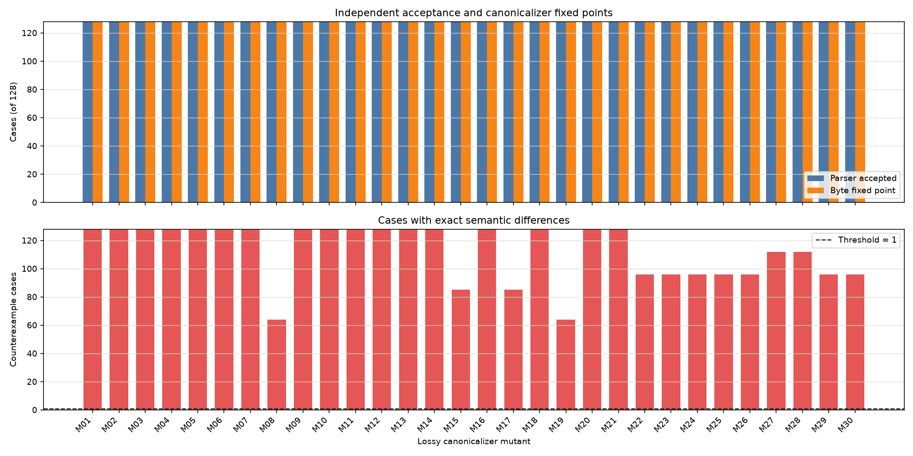

# Separating Canonicalization from Structural and Semantic Policy Validation

## Abstract

This exploratory study examined whether structural acceptance, canonical byte stability, and exact policy semantics can be evaluated separately for a finite policy language. A deterministic construction produced 128 allow-valued policies and evaluated one baseline canonicalizer and 30 deliberately lossy mutants. According to the reported aggregate results, all 3,840 mutant case pairs passed parser acceptance and tested byte fixed-point checks, while the finite-domain semantic oracle found differences in 3,370 pairs and at least one difference for every mutant.

These results are best interpreted as a controlled demonstration rather than a confirmatory empirical test. The mutants were designed to remain syntactically valid, deterministic, and idempotent while losing information, and the highly regular corpus exercised every targeted field. The supplied material does not establish that the mutant set or the 27-of-30 threshold was preregistered. It also does not include the executable source, complete mutant definitions, raw case records, archive hashes, fresh-process payloads, dependency lock data, or elapsed times needed to reproduce and audit the numerical claims. No behavior-preserving mutants, alternate correct canonicalizers, malformed controls, non-idempotent controls, nondeterministic controls, or independently developed second implementation were evaluated.

The demonstrated conclusion is therefore narrow: for the specified finite policy language, constructed corpus, and seeded lossy mutants, parser acceptance and observed fixed points did not imply exact semantic preservation. The study does not establish the correctness of canonical archives generally, measure false-positive behavior, or validate the protocol across broader policy languages and implementations.

## Background

Canonical serialization provides a stable representation of an object, but representation stability and semantic preservation are distinct properties. A transformation may produce valid syntax, return the same bytes when reapplied, and nevertheless alter the decisions represented by a policy. In the finite language studied here, these properties were separated into three checks:

1. **Structural acceptance:** whether an independently separated parser accepted the archive.
2. **Byte fixed point:** whether applying the same canonicalizer again reproduced the same bytes.
3. **Semantic equivalence:** whether the source and archived policies produced identical decisions for every request in a finite request domain.

This distinction is already familiar from work on canonical serialization, differential testing, mutation testing, and semantic-equivalence checking. Canonical serialization focuses on stable representation; mutation testing introduces controlled defects to assess detection; differential testing compares independently produced outcomes; and semantic-equivalence checking compares behavior rather than representation. The present experiment does not introduce a new general theory in any of these areas. Its contribution is limited to a concrete, finite mutation-testing illustration in which structural, fixed-point, and semantic checks were applied separately.

The original report referred to prior work through numbered citations `[1]`, `[2]`, `[3]`, `[4]`, `[7]`, and `[8]`, but the supplied report did not contain the corresponding bibliographic entries or enough metadata to reconstruct them reliably. This revision therefore removes claims tied to those unidentified citations rather than fabricating a bibliography. A complete bibliography cannot be provided from the supplied material and remains a required artifact for any publication version.

Implementation separation was limited to modules within one project. Import restrictions prevented direct reuse of canonicalizer code by the parser and verifier, but all components were developed from the same schema description and apparently within the same project. This is intra-project implementation separation, not evidence of independently derived semantics, separate development teams, or cross-language replication.

## Hypothesis

The original report stated the following hypothesis:

> Among 30 seeded lossy canonicalizer mutants that delete, merge, truncate, or default a policy field while remaining deterministic, idempotent, and accepted by an independent parser, all 30 will pass structural acceptance and fixed-point checks, but exact finite-domain policy-equivalence checking will reject at least 27.

The supplied material does not state when the 30-mutant set or the 27-of-30 threshold was selected, and it provides no preregistration, dated protocol, version-control record, or other evidence showing that either was fixed before results were observed. The hypothesis must therefore be treated as an **exploratory operational expectation**, not as a preregistered confirmatory hypothesis.

The threshold of 27 mutants is retained here only because it was part of the original report’s decision rule. Meeting it is not independent confirmatory evidence. All mutants were intentionally selected to be lossy, syntactically valid, deterministic, and idempotent, and every mutated field was exercised by the regular source corpus. Consequently, successful semantic detection was substantially encouraged by the experimental design.

A stronger and more falsifiable evaluation would have included behavior-preserving mutants, independently implemented correct canonicalizers, mutants targeting fields not uniformly exercised by the corpus, and negative controls designed to fail each validation layer. Those evaluations were not performed in the reported experiment.

## Method

### Reported execution design

The reported environment used Python 3.11 or newer, the Python standard library, and Matplotlib. Randomized operations used `random.Random(20250308)`. Fresh subprocesses reportedly ran with `PYTHONHASHSEED=0` and without network access. The implementation was described as being divided into:

- `policy_generator.py`
- `canonicalizers.py`
- `independent_parser.py`
- `independent_verifier.py`
- `run_once.py`
- `run_experiment.py`

Import restrictions reportedly prevented the parser and verifier from importing or invoking canonicalization code, and prevented the canonicalizer from importing the independent modules. No source files, import-checking mechanism, package lock file, operating-system description, container image, exact Python patch version, exact Matplotlib version, launch command, working-directory assumption, locale setting, or filesystem assumptions were included in the supplied material.

Accordingly, this report does not constitute a complete executable artifact. The following items required for exact reproduction are unavailable:

- Source code for all six described modules
- Exact executable definitions of all 30 mutants
- Complete generator logic rather than the summarized formulas below
- Parser and verifier implementations
- Exact dependency versions or a lock file
- Installation and execution commands
- Operating-system and platform assumptions
- Environment-variable configuration beyond `PYTHONHASHSEED=0`
- The mechanism used to disable network access
- Raw archives and their hashes
- The two fresh-process payloads and their hashes
- Machine-readable records for all case–mutant pairs
- Figure-generation code and the original plotting-data file
- Actual elapsed-time measurements

These omissions cannot be repaired from the report text without inventing code or data.

### Archive and policy language

An archive consisted of UTF-8 JSON followed by exactly one newline. Its top-level form was:

```json
{"version":1,"policy":{...}}
```

Every policy required a string `policy_id`. Optional fields were:

- `effect`
- `subjects`
- `actions`
- `resources`
- `time_slots`
- `regions`
- `min_clearance`
- `require_mfa`
- `max_amount`

The finite universes were:

- Subjects: `s0` through `s3`
- Actions: `a0` through `a3`
- Resources: `r0` through `r3`
- Time slots: integers 0 through 3
- Regions: `g0` through `g3`
- Clearances: integers 0 through 3
- MFA request values: `false` and `true`
- Amounts: integers 0 through 3

Missing selectors defaulted to their complete four-element universes. Other defaults were:

- `effect="deny"`
- `min_clearance=0`
- `require_mfa=false`
- `max_amount=3`

The independent parser was described as using `json.loads` followed by explicit validation. It reportedly rejected malformed JSON, unknown keys, versions other than integer 1, invalid or missing policy IDs, incorrect types, duplicate or unsorted selector members, out-of-universe values, and bounded integers outside 0–3. Empty selector lists and omitted optional fields were accepted by the parser design, although neither occurred in the generated source corpus.

Parser normalization and validation code were reported as not being shared with the canonicalizers. Because the implementation is unavailable, that separation and the exact behavior on all edge cases cannot be independently inspected.

### Baseline canonicalization

Canonical bytes were reported as being produced with:

```python
json.dumps(
    obj,
    sort_keys=True,
    separators=(",", ":"),
    ensure_ascii=False
).encode("utf-8") + b"\n"
```

Every present selector was sorted and deduplicated before serialization. Missing optional fields remained missing rather than being populated with parser defaults. The baseline canonicalizer, C0, preserved every field present in the generated source policy and otherwise normalized and serialized it.

The report does not provide the executable implementation needed to establish how non-JSON inputs, duplicate object keys, booleans used where integers were expected, Unicode edge cases, or other Python/JSON boundary conditions were handled.

### Generated corpus

Exactly 128 policies were reported as generated. Integers 0 through 127 were shuffled once using the fixed random generator and assigned in order to cases `T000` through `T127`. For each assigned integer \(x\), the policy had `effect="allow"` and:

- `subjects` selected from \(x \bmod 4\) and a bit-dependent successor;
- `actions` selected similarly using \(\lfloor x/4\rfloor \bmod 4\);
- `resources` selected using \(\lfloor x/16\rfloor \bmod 4\);
- `time_slots` selected from \(x \bmod 4\) and a bit-dependent successor;
- `regions` selected using \(\lfloor x/8\rfloor \bmod 4\);
- `min_clearance = 1 + (x \bmod 3)`;
- `require_mfa` equal to bit 5 of \(x\);
- `max_amount = x \bmod 3`.

The phrases “bit-dependent successor” and “selected similarly” do not completely specify the generator. The executable generator or a full mathematical definition would be needed to reconstruct the exact 128 source policies.

The shuffle did not create 128 statistically independent random samples. It permuted the assignment of all integers from 0 through 127 to case labels. Thus, the corpus was a deterministic constructed enumeration with randomized labeling, not a random sample supporting population-level statistical generalization.

The corpus did not include:

- `effect="deny"`
- Omitted optional fields
- Empty selectors
- Selector cardinalities zero, one, three, or four
- `min_clearance=0`
- `max_amount=3`
- Multiple independently selected seeds
- Exhaustive coverage of all valid policies in a reduced schema

No expanded-corpus results are available. Adding such results would require a new experiment.

### Mutants

The first 14 mutants are specified by the supplied text with enough detail to identify their principal transformation:

| Mutant | Reported transformation |
|---|---|
| M01 | Delete `subjects`. |
| M02 | Delete `actions`. |
| M03 | Delete `resources`. |
| M04 | Delete `time_slots`. |
| M05 | Delete `regions`. |
| M06 | Delete `effect`. |
| M07 | Delete `min_clearance`. |
| M08 | Delete `require_mfa`. |
| M09 | Delete `max_amount`. |
| M10 | Retain only the first normalized `subjects` member. |
| M11 | Retain only the first normalized `actions` member. |
| M12 | Retain only the first normalized `resources` member. |
| M13 | Retain only the minimum normalized `time_slots` member. |
| M14 | Retain only the first normalized `regions` member. |

For M15–M30, the supplied report gives only the following class-level descriptions:

- **M15–M20:** coarsen or default clearance, amount, MFA, or effect values.
- **M21–M30:** merge adjacent categorical values into pairs or intersect selectors with specified two-element subsets.

The Results section further identifies M19 as forcing the MFA requirement to its default value. It does not provide enough detail to reconstruct the complete executable behavior of M15–M18 or M20–M30. In particular, the following information is missing:

- The mutant-to-field mapping for most of M15–M30
- The exact coarsening functions
- The exact default-replacement conditions
- The exact adjacent-value merge mappings
- The exact two-element intersection subsets
- Behavior when the targeted field is absent
- Behavior when a selector is empty or has cardinality other than two
- Whether transformations operate on source objects, parsed normalized objects, or serialized archives in every case
- Exact error handling and type handling

The report states that each mutant parsed its input internally, normalized present lists, applied its transformation, and canonically serialized the result without adding missing fields. That description is insufficient to reproduce M15–M30. Exact mutant definitions cannot be supplied without the missing source or protocol.

No behavior-preserving mutants or alternate correct canonicalizers were included. Therefore, the experiment measured sensitivity to selected lossy transformations but did not measure specificity or false-positive behavior.

### Semantic oracle

The semantic oracle reportedly enumerated all

\[
4 \times 4 \times 4 \times 4 \times 4 \times 4 \times 2 \times 4
= 32{,}768
\]

possible requests in lexicographic product order.

A policy matched a request when:

- All five categorical request values were selected;
- The request clearance met the minimum;
- Any MFA requirement was satisfied; and
- The amount did not exceed the maximum.

A matching request received the policy’s effect. Every nonmatching request was denied.

The complete allow/deny decision vector was encoded as a Python integer bitset. Semantic equivalence was defined as exact integer equality. Behavioral distance was the population count of the XOR of two bitsets. For unequal vectors, the verifier decoded the lowest-index differing request as a first counterexample.

The source code defining the precise product order, bit numbering, default application, matching operations, and counterexample decoding is unavailable. No second independently developed verifier reproduced these decisions. The parser and verifier were separated from the canonicalizer within the project, but this did not protect against a common conceptual or transcription error shared through the same specification.

### Checks and controls

For each baseline case, the experiment reportedly checked:

1. Parser acceptance
2. The byte fixed point `C0(C0(source)) == C0(source)`
3. Exact semantic equivalence between the source policy and the independently parsed archive

For each of the 30 mutants and 128 C0 archives, it reportedly checked:

1. Mutant-output parser acceptance
2. Mutant byte fixed point
3. Exact equivalence with the parsed C0 policy

This produced 3,840 reported checks of each mutant criterion.

The experiment did not include negative controls designed to demonstrate rejection by each layer. In particular, it included no reported:

- Malformed archives that the parser should reject
- Well-formed but schema-invalid archives
- Deterministic but non-idempotent transformations
- Nondeterministic canonicalizers
- Behavior-preserving representation transformations
- Independently implemented correct canonicalizers

Consequently, the experiment showed that the parser and fixed-point layers accepted the deliberately valid and idempotent mutants, but it did not directly demonstrate that those layers reject malformed, non-idempotent, or nondeterministic defects within their stated scopes.

### Reproducibility protocol and unavailable raw artifacts

`run_once.py` was described as constructing a deterministic payload without timestamps, process identifiers, temporary paths, or platform-dependent values. `run_experiment.py` reportedly executed it twice in fresh subprocesses and required byte-for-byte equality of the payloads and equality of all archive hashes. Results were reportedly written through a flushed and `fsync`-protected temporary file followed by atomic replacement, then reopened and checked for required record counts.

The supplied material contains neither payload, neither payload hash, no archive hashes, and no machine-readable case records. It also contains no exact launch commands or elapsed-time fields. Therefore, the following reported protocol outcomes cannot be independently audited from this report:

- Equality of the two fresh-process payloads
- Equality of archive hashes across runs
- Presence and uniqueness of all 128 baseline records
- Presence and uniqueness of all 3,840 mutant records
- Per-record parser and fixed-point outcomes
- Per-record semantic distances
- Per-record first counterexamples
- Actual elapsed times
- Satisfaction of any runtime threshold

## Results

The following values are the aggregate results stated in the original report. They are not accompanied by the raw records, hashes, or payloads required for independent recalculation.

All baseline checks were reported as successful:

- C0 parser acceptance: **128/128**
- C0 byte fixed points: **128/128**
- C0 semantic equivalence: **128/128**
- C0 case records reported present: **128**

Across the 30 mutants and 128 cases per mutant, the report stated:

- Mutant parser acceptances: **3,840/3,840**
- Mutant byte fixed points: **3,840/3,840**
- Mutants with at least one semantic counterexample: **30/30**
- Exploratory decision threshold: **at least 27/30**
- Case–mutant pairs with a counterexample: **3,370/3,840**
- Semantically equivalent case–mutant pairs: **470/3,840**

The complete aggregate values underlying the displayed figure are recoverable from the original report and are reproduced below. Parser acceptance and fixed-point counts were 128 for every mutant.

| Mutant | Parser acceptances | Byte fixed points | Cases with a semantic counterexample |
|---|---:|---:|---:|
| M01 | 128 | 128 | 128 |
| M02 | 128 | 128 | 128 |
| M03 | 128 | 128 | 128 |
| M04 | 128 | 128 | 128 |
| M05 | 128 | 128 | 128 |
| M06 | 128 | 128 | 128 |
| M07 | 128 | 128 | 128 |
| M08 | 128 | 128 | 64 |
| M09 | 128 | 128 | 128 |
| M10 | 128 | 128 | 128 |
| M11 | 128 | 128 | 128 |
| M12 | 128 | 128 | 128 |
| M13 | 128 | 128 | 128 |
| M14 | 128 | 128 | 128 |
| M15 | 128 | 128 | 85 |
| M16 | 128 | 128 | 128 |
| M17 | 128 | 128 | 85 |
| M18 | 128 | 128 | 128 |
| M19 | 128 | 128 | 64 |
| M20 | 128 | 128 | 128 |
| M21 | 128 | 128 | 128 |
| M22 | 128 | 128 | 96 |
| M23 | 128 | 128 | 96 |
| M24 | 128 | 128 | 96 |
| M25 | 128 | 128 | 96 |
| M26 | 128 | 128 | 96 |
| M27 | 128 | 128 | 112 |
| M28 | 128 | 128 | 112 |
| M29 | 128 | 128 | 96 |
| M30 | 128 | 128 | 96 |

These aggregate counterexample counts sum to the reported **3,370** unequal case–mutant pairs. Seventeen mutants reportedly changed behavior in all 128 cases. M08 and M19, respectively described as deleting and forcing the MFA requirement to its default value, produced counterexamples in 64 cases each.



The figure and table show the intended controlled contrast: all seeded mutant outputs were reported as accepted and fixed points on the tested corpus, while each lossy mutant produced at least one semantic difference. Because validity and tested idempotence were design constraints on the mutant set, the upper-panel result was largely built into the experiment rather than an unexpected empirical discovery. Because every source policy included every targeted field and used regular two-element selectors, semantic rejection was also made comparatively predictable.

The reported aggregate outcome exceeded the historical 27-of-30 threshold. However, the threshold’s pre-execution status is unknown, so this revision does not label the hypothesis “supported” in a confirmatory sense. The result is an exploratory observation about the selected corpus and mutants.

No actual elapsed time is available. The original assertion that the supported decision implied satisfaction of a 1,800-second limit is therefore removed. This report makes no claim that the runtime threshold was verified.

No behavioral-distance values or first counterexamples are available beyond the aggregate number of unequal pairs. No archive-level or payload-level hashes are available. Consequently, the exact numerical results cannot be reproduced or independently verified from the supplied report alone.

The narrow demonstrated finding is that, in this constructed finite setting, reported parser acceptance and observed byte fixed points did not distinguish the seeded lossy transformations, whereas the reported exhaustive semantic comparison did. This does not establish correctness criteria for canonical archives broadly, quantify false positives, or show that the method generalizes beyond the specified language, corpus, and mutants.

## Limitations

- **No complete executable artifact.** The source files, exact commands, dependency lock data, complete environment specification, and executable definitions of all mutants were not supplied. The reported experiment therefore cannot be rerun exactly from this document.

- **Incomplete mutant specification.** M15–M30 are not defined precisely enough for reproduction or independent audit. Terms such as “coarsen,” “default,” “merge adjacent values,” and “specified two-element subsets” omit the required transformation functions, field mappings, subsets, and edge-case behavior.

- **No machine-readable raw results.** The report does not contain records for all 3,840 case–mutant pairs, archive bytes or hashes, parser outcomes, fixed-point outcomes, semantic bitsets, behavioral distances, or first counterexamples. It also omits the 128 complete baseline records.

- **Fresh-process evidence is absent.** The two purported fresh-process payloads and their hashes are unavailable. Their equality and the equality of archive hashes cannot be independently confirmed.

- **Elapsed times are absent.** No actual elapsed time is reported. Satisfaction of the 1,800-second runtime threshold is not established and is not claimed in this revision.

- **Exploratory rather than preregistered.** The supplied material does not show that the mutant set or the 27-of-30 threshold was fixed before execution. The threshold must not be interpreted as confirmatory evidence.

- **The main contrast was designed into the mutants.** The mutants were deliberately intended to be syntactically valid, deterministic, idempotent, and lossy. Demonstrating that structural and tested fixed-point checks accept them while a semantic oracle detects losses is a controlled illustration of the distinction among those properties, not a strong test of whether arbitrary real-world canonicalizer defects evade structural validation.

- **Severe corpus coverage bias.** Every source policy was allow-valued, included every optional field, used two-element selectors, and drew scalar values from restricted ranges. The corpus did not evaluate deny policies, omitted fields, empty selectors, selector cardinalities zero through four, or all default and non-default scalar values.

- **The reported shuffle did not provide statistical sampling.** Shuffling integers 0 through 127 changed their assignment to case labels but did not create independent random policies. The results do not support statistical generalization beyond the deterministic constructed corpus.

- **Only one seed was used.** No multiple-seed replication was reported. Nor was exhaustive small-schema policy coverage performed.

- **No specificity or false-positive measurement.** There were no behavior-preserving mutants or independently implemented correct canonicalizers. The experiment therefore did not test whether the semantic oracle accepts alternative representations or transformations that preserve behavior.

- **No negative controls.** There were no malformed, schema-invalid, non-idempotent, or nondeterministic controls. The study did not demonstrate that the parser, fixed-point check, and fresh-process comparison reject defects within their respective intended scopes.

- **Restricted policy language.** The language contained a single policy and a finite request domain of 32,768 requests. The findings do not establish behavior for policy composition, conflict resolution, obligations, priorities, recursive rules, unbounded values, external attributes, stateful decisions, or other features of realistic policy systems.

- **Implementation independence was limited.** Import separation prevented direct code reuse, but the parser, verifier, generator, and canonicalizers were all based on the same project specification. No independently developed implementation, separate team, or second programming language reproduced the parser or semantic decisions.

- **Potential shared-specification error.** All components may have inherited the same conceptual or transcription error. Module boundaries alone do not rule out such correlated defects.

- **Fixed-point checking was empirical.** Each mutant reportedly reached a fixed point on the 128 tested archives. Universal idempotence over all valid archives was neither tested nor proved.

- **The generator is not fully specified.** Phrases such as “bit-dependent successor” and “selected similarly” do not uniquely define the source corpus. The exact 128 policies cannot be reconstructed from the text alone.

- **Bibliography is unavailable.** The supplied report invoked numbered references but omitted their bibliographic entries. A complete bibliography and a citation-supported comparison with prior work cannot be reconstructed without additional source information.

- **Novelty is limited.** The separation of syntactic validity, idempotence, and semantic preservation is well known in concept. Without a realistic application, reusable artifact, broader corpus, negative controls, specificity tests, or independently developed replication, this study remains an illustrative mutation-testing exercise.

- **Conclusion is intentionally narrow.** The evidence applies only to the specified finite policy language, the deterministic 128-policy construction, and the seeded lossy mutants. It does not validate canonical archives generally or establish that the same checks are sufficient for arbitrary canonical serialization systems.

## Follow-up questions

- **Can the complete artifact be recovered and published?** Release the exact source for all modules, complete definitions of M01–M30, dependency versions, installation steps, commands, environment assumptions, container or reproducible build description, and figure-generation code.

- **Can all raw records be made auditable?** Publish machine-readable records for all 128 baseline cases and all 3,840 case–mutant pairs, including source and output archive hashes, parser outcomes, fixed-point outcomes, semantic bitsets or stable hashes of those bitsets, behavioral distances, and first counterexamples. Include both fresh-process payloads and cryptographic hashes for every published artifact.

- **What were the actual protocol runtimes?** Rerun or recover the protocol with explicit monotonic elapsed-time fields for each process and the complete experiment. Report measured values rather than inferring runtime compliance from a final decision flag.

- **Does the result persist across a broader corpus?** Include both allow and deny policies; present and omitted optional fields; empty selectors; selector cardinalities zero through four; and default-valued and non-default-valued scalars. Use multiple independently selected seeds or exhaustively enumerate all policies for a reduced schema.

- **How specific is the semantic oracle?** Add behavior-preserving mutants and independently implemented correct canonicalizers. Measure whether structural, fixed-point, and semantic checks accept them, thereby quantifying false-positive behavior rather than only sensitivity to intentionally lossy mutations.

- **Does each validation layer reject its intended defects?** Add malformed and schema-invalid archives for the parser, deterministic non-idempotent canonicalizers for the fixed-point layer, and nondeterministic canonicalizers for fresh-process comparison. Define expected outcomes before execution.

- **Can the findings be preregistered and replicated?** Fix the corpus-generation protocol, mutant set, thresholds, controls, exclusions, and analysis rules before observing results. Preserve a dated or hashed preregistration so that later results can be interpreted confirmatorily.

- **Can an independent implementation reproduce the decisions?** Implement the parser and semantic verifier in another language, such as Rust or Java, without reusing the Python code. Require agreement on parser outcomes, normalized policies, decision vectors, behavioral distances, and first counterexamples for every archive.

- **Can canonicalization correctness be established over all small valid archives?** Exhaustively enumerate the valid archive space for a reduced universe and test structural acceptance, universal idempotence, and exact semantic preservation for every archive rather than only the generated cases.

- **Can the technique be evaluated in a realistic application?** Apply the layered checks to a deployed or representative policy format with policy composition and real canonicalization requirements. Include naturally occurring defects or independently authored implementations rather than only seeded lossy transformations.

- **Can the related-work basis be completed?** Recover the identities of the original numbered references and provide a complete bibliography. Explicitly compare the artifact and evidence with prior work on canonical serialization, differential testing, mutation testing, reproducible experimentation, and semantic-equivalence checking.
