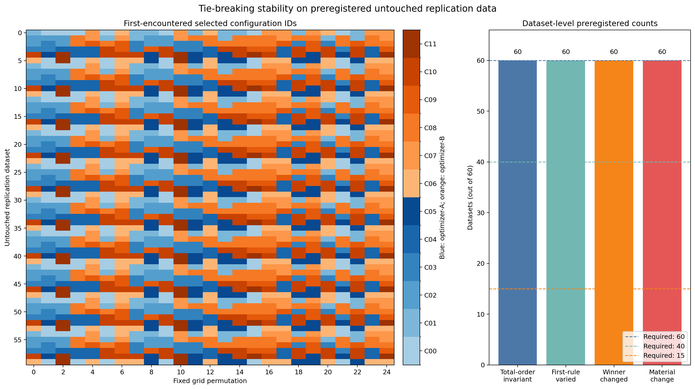

# Prespecified Tie-Breaking Rules in a Deterministic Permutation-Invariance Test

## Abstract

This study implemented a deterministic property test of two tie-breaking rules in a deliberately constructed, tie-rich synthetic setting. Sixty deterministic datasets were evaluated under 25 fixed permutations of a 12-configuration grid. For each dataset, four configurations were forced to have exactly equal maximum tuning scores; the tied configurations were also constructed to span two optimizer labels and to have distinct post-selection synthetic evaluation accuracies. Choosing the minimum configuration ID among exact maximizers was invariant to enumeration order in all 60 datasets, as required by the definition of that rule. The first-encountered-maximum rule selected multiple tied configurations, changed the reported optimizer label, and produced a material estimate change in all 60 datasets. These outcomes verify the implementation and illustrate consequences that can arise under the engineered test conditions; they do not estimate the prevalence or practical importance of ties in real machine-learning pipelines.

The protocol was prespecified in a local JSON workflow, but no trusted public commit, registry record, or independent cryptographic timestamp was supplied to establish that it predated execution or outcome inspection. Accordingly, this report does not describe the study as independently preregistered or the generated evaluation data as an external or untouched replication sample.

## Background

When multiple configurations have exactly equal maximum scores, a first-encountered implementation of `argmax` can make the selected identifier depend on the order in which an otherwise unchanged candidate grid is enumerated. By contrast, selecting the minimum configuration ID—or applying any other fixed total order—among the exact maximizers is invariant to enumeration order by definition. This is an elementary algorithmic property rather than an empirical regularity.

The present experiment should therefore be interpreted primarily as a deterministic implementation or property test. It asks whether the supplied implementation exhibits the mathematically required invariance of the total-order rule and the expected order sensitivity of the first-encountered rule under deliberately favorable test conditions. Repeating the test over 60 constructed dataset IDs and 25 permutations can reveal implementation errors and illustrate the resulting selections, but it does not strengthen the underlying mathematical guarantee in the manner that repeated random empirical observations would.

The construction also separates three distinct issues:

1. **Identifier instability:** whether different grid orders select different members of an exact tie.
2. **Optimizer-label instability:** whether the selected identifiers carry different optimizer labels.
3. **Evaluation instability:** whether the selected tied configurations differ on a subsequent synthetic evaluation sample.

Only the first issue follows directly from encounter-order tie-breaking. The latter two require additional properties of the tied configurations. In this experiment those properties were engineered: every tie set contained configurations from both optimizer families, and configuration-level post-selection accuracies were deliberately separated. The experiment therefore demonstrates possible consequences under the construction, not their frequency in naturally occurring model-selection pipelines.

The supplied source report cited references [1] through [10] but did not include the corresponding bibliographic records. Because those records cannot be recovered reliably without inventing citations, the unsupported citation markers have been removed from this revision. A complete submission would need to restore a verifiable reference list from the original source materials.

## Hypothesis

The locally prespecified implementation criteria were:

1. For all 60 constructed datasets, the total-order rule would select one configuration across all 25 grid permutations and produce a maximum-minus-minimum range in the corresponding final 120-split estimate of no more than \(10^{-12}\).
2. At least 40 of 60 constructed datasets would show more than one first-encountered selection across the 25 permutations.
3. At least 15 of 60 constructed datasets would have at least one first-encountered permutation whose optimizer label differed from the total-order optimizer label.

These criteria were recorded in the supplied workflow before the reported execution, but independent evidence establishing that timing was not provided. A timestamp stored inside a local JSON file and a SHA-256 digest establish file identity only if the file itself is available; they do not prove when the file was created or that it preceded outcome inspection. The criteria are therefore described as prespecified in the supplied workflow rather than preregistered.

Criterion 1 is a property of the rule: if the exact maximizer set is unchanged and the rule always chooses its minimum numeric ID, enumeration order cannot affect the result. Criteria 2 and 3 test the behavior of the implementation within the finite constructed design. They are not hypotheses about a population of datasets, permutations, optimizer families, or real model-selection pipelines.

The construction made first-rule variation highly likely. Under a uniformly random ordering of the grid, each of the four tied configurations has exact probability \(1/4\) of being encountered first. For 25 independently randomized orders, the selection-count vector would have the exact distribution

\[
(N_1,N_2,N_3,N_4)\sim\operatorname{Multinomial}
\left(25;\frac14,\frac14,\frac14,\frac14\right).
\]

The probability that all four tied configurations appear at least once is

\[
1-4\left(\frac34\right)^{25}
+6\left(\frac12\right)^{25}
-4\left(\frac14\right)^{25},
\]

which is approximately 0.997. Thus, 25 independent uniform permutations are generally sufficient to expose all four choices in this engineered four-way tie, but this does not justify 25 permutations for estimating effects in a broader population. Moreover, the same 25 permutations were reused across datasets, so the resulting dataset-level outcomes are structurally dependent.

## Method

The reported execution used Python 3.11.13 with NumPy 1.26.4, pandas 2.2.2, scikit-learn 1.4.2, and Matplotlib 3.8.4. Execution was reported as single-threaded by setting `OMP_NUM_THREADS=1`, `MKL_NUM_THREADS=1`, and `OPENBLAS_NUM_THREADS=1`; the resulting environment check was reported to have passed.

Before arrays were generated, the protocol, constants, rules, and implementation version 1.0.0 were written locally to `preregistration.json` with the internal UTC timestamp `2026-07-19T16:18:22.305972Z`. Its reported SHA-256 digest was:

`9a6cf696cda5e536eec2462f3e15fe0ff48559ddf84aead584edadf847ede77e`

The source report states that no protocol parameter was subsequently changed. However, `preregistration.json` was not supplied with the report, and no trusted public-repository commit, registry record, signed archive, or independent cryptographic timestamp was identified. The digest is therefore not presently verifiable and does not independently establish temporal precedence.

A fixed grid contained 12 deterministic configurations, `C00` through `C11`. Configuration `Cj` predicted the binary values in feature column `X[:, j]`. Configurations `C00`–`C05` were labeled optimizer-A, and `C06`–`C11` were labeled optimizer-B. The total order specified in the workflow was ascending numeric configuration ID.

Twenty-five grid permutations were generated once and reused for every dataset. Permutation \(k\) was reportedly produced by:

```python
numpy.random.default_rng(400000 + k).permutation(12)
```

The source report states that the complete permutation matrix was saved before tuning data were generated, but that matrix was not included with the submitted report. Consequently, the exact per-permutation orders and their digests cannot currently be audited.

For each dataset \(d=0,\ldots,59\), the tuning sample contained 400 observations, exactly 200 from each class. Labels began as 200 zeros followed by 200 ones and were permuted using seed \(100000+d\). The exact maximum-score set was constructed as

\[
T_d=\{d,\ d+1,\ d+6,\ d+7\}\pmod{12}.
\]

For each configuration and class, error positions were sampled independently without replacement using seed \(110000+100d+j\). Configurations in \(T_d\) had exactly 50 errors among each class’s 200 observations, yielding balanced accuracy of 0.75. Every other configuration had 60 errors per class, yielding balanced accuracy of 0.70. Predictions were constructed as the class label XOR the error indicator; no model was fit, and scores were not rounded.

A mandatory regime check required every dataset to have exactly four configurations tied at 0.75, all other configurations at 0.70, and the exact maximum set \(T_d\). All 60 constructed datasets were reported to have passed. Because these conditions were imposed by construction, this check verifies implementation consistency rather than discovering an empirical pattern.

Each dataset-permutation pair was then evaluated under two rules:

- **Total-order rule:** identify the exact maximum score and choose the tied configuration with the smallest numeric ID, independent of encounter order.
- **First-encountered rule:** scan configurations in permutation order, replacing the incumbent only for a strictly greater score and never for an equal score.

All \(60\times25\) selections were reportedly saved before the post-selection synthetic evaluation arrays were generated. The reported digest of `selections.csv` was:

`43a9fc5b316b046f5e14aaf86da77948dcac2c7f8599821e5f355768bee4a87f`

The recorded number of evaluation-generation calls before this freeze was reported as zero. This ordering prevents direct computational use of already-generated evaluation arrays when making the selections. It does not make the evaluation mechanism epistemically independent of the study design: the mechanism was fully specified by dataset and configuration IDs and was deliberately designed to differentiate tied configurations.

Only after selections were frozen was a synthetic evaluation dataset generated for each dataset ID. Each sample contained 1,200 observations, with 600 observations per class, permuted using seed \(200000+d\). For configuration \(j\),

\[
q=(j+5d)\bmod 12,\qquad p=0.55+0.01q.
\]

Within each class, the number of errors was \(600-(330+6q)\), with positions sampled independently using seed \(210000+100d+j\). The 12 configurations therefore had distinct full-sample balanced accuracies ranging from 0.55 through 0.66. There were reportedly 60 evaluation-generation calls in total.

The design thus excluded two important baselines: tied configurations with equal held-out performance and tied configurations with narrower or randomly generated performance separations. It also forced each tie set to contain two optimizer-A and two optimizer-B configurations. Under a uniformly random grid order, the engineered optimizer composition gives an exact probability of \(1/2\) that the first-selected tied configuration has an optimizer label different from the total-order selection. By comparison, if the six optimizer-A and six optimizer-B labels were assigned uniformly at random across the 12 configuration IDs, the probability that two distinct configurations had different labels would be \(6/11\). Combining this with the \(3/4\) probability that first encounter selects a configuration other than the total-order choice gives an unconditional random-label baseline of

\[
\frac34\cdot\frac6{11}=\frac9{22}\approx0.4091.
\]

This mathematical baseline distinguishes instability induced by the deliberately balanced tie-set composition from instability expected under random balanced label assignments. It does not replace an empirical baseline from real optimizer pipelines.

For each dataset, exactly 120 shared stratified shuffle splits were created using:

```python
StratifiedShuffleSplit(
    n_splits=120,
    test_size=0.25,
    random_state=300000 + d
)
```

Every test set contained 300 observations, 150 per class. All configurations were evaluated on the same test indices. Because the configurations were fixed deterministic predictors, training indices were not used. A configuration’s reported final estimate was the arithmetic mean of its 120 test-set balanced accuracies, with unrounded `float64` values used for all decisions.

The 120 test sets overlap and do not constitute 120 independent evaluation samples. The split average is a Monte Carlo resampling summary of fixed predictions on one 1,200-observation synthetic sample. Since full-sample accuracies were fixed by construction and known to range from 0.55 to 0.66, direct full-sample evaluation would have provided a simpler primary analysis without split-induced Monte Carlo variation. The source materials do not report a comparison between the 120-split averages and the corresponding full-sample values or repeated runs sufficient to characterize Monte Carlo variability, so such results cannot be added here without new computation.

The robustness interval, or ROPE, was the total-order estimate plus or minus 0.005 balanced-accuracy units. A constructed dataset was classified as having a material estimate change if at least one first-rule estimate fell outside that interval. Because post-selection accuracies were deliberately separated in increments of 0.01 before split averaging, this outcome is strongly determined by the construction and should not be interpreted as an estimate of consequential instability in ordinary applications.

The original analysis also performed a dataset-level nonparametric bootstrap using seed 987654 and 10,000 replicates. Each replicate sampled 60 dataset IDs with replacement and recomputed the proportions with first-rule configuration variation, reported-winner change, and material estimate change. Percentile 95% intervals used `numpy.quantile` at 0.025 and 0.975 with `method='linear'`.

No defensible sampling population was defined for these 60 dataset IDs. Dataset ID deterministically controlled the tie set and post-selection accuracy mapping, and the same permutation matrix was reused across IDs. The bootstrap is therefore retained only as a record of the original computation; it is not used for population inference. All substantive results below are finite-design descriptive quantities.

A complete reproducibility package was not supplied with the report. To make the results auditable, the package would need to contain, at minimum, the exact `preregistration.json`, source code, a dependency lockfile or container specification, the complete permutation matrix, `selections.csv`, all generated tuning and evaluation outputs or deterministic generation scripts, `workspace/figures/tie_breaking_results.png`, execution logs, hardware and environment information, and a verification script that regenerates the analysis and checks every reported digest and numerical result. Because those files are absent, this revision cannot claim computational reproducibility from the report alone.

## Results

Within the reported execution, the single-thread environment check passed, all 60 constructed tuning datasets passed the imposed exact tie-regime check, and no synthetic evaluation-generation function was reported to have been called before the selection file was frozen. These statements cannot currently be independently checked because the code, logs, permutation matrix, selection file, and generated outputs were not supplied.

The three prespecified finite-design criteria produced the following reported results:

| Prespecified criterion | Observed constructed datasets | Required threshold | Criterion met |
|---|---:|---:|---|
| Total-order invariance | 60 of 60 | 60 of 60 | Yes |
| First-rule configuration variation | 60 of 60 | At least 40 of 60 | Yes |
| Reported-winner change | 60 of 60 | At least 15 of 60 | Yes |

The total-order rule selected the same configuration and therefore the same final 120-split estimate under every tested permutation for every constructed dataset. This is the required consequence of choosing the minimum configuration ID from an unchanged exact-maximizer set; the observed result is best understood as a successful implementation check.

Every constructed dataset had multiple first-encountered selections, and every dataset had at least one permutation that changed the optimizer label relative to the total-order rule. All three prespecified workflow criteria were therefore satisfied. The appropriate conclusion is that the implementation behaved as specified within this deterministic test design, not that a broader empirical hypothesis about machine-learning replication was established.

Every dataset reportedly had exactly four distinct first-rule selected configurations across its 25 permutations: the minimum, median, and maximum numbers of distinct selections were all 4. Thus, the fixed permutation collection exposed all four exact tuning maxima within every constructed dataset. Under 25 independent uniform orders, the probability of exposing all four members of a four-way tie is approximately 0.997, so this observation is unsurprising under the design.

The complete per-permutation selection-frequency table was not included in the source report. Therefore, the number of times each tied configuration was selected within each dataset, and the corresponding balance across permutation indices, cannot be reported or checked from the aggregate results alone. Under independently uniform grid orders, each tied configuration has expected count \(25/4=6.25\), and the complete four-count vector follows the multinomial distribution stated above. The supplied aggregates establish only that every tied configuration appeared at least once; they do not show how closely the observed counts followed the exact uniform-order distribution.

Across the 1,500 constructed dataset-permutation cases, the reported finite-design counts were:

- 1,170 selected a different configuration ID from the total-order rule, a fraction of 0.78.
- 790 selected a different optimizer label, a fraction of 0.5266666666666666.
- 1,168 produced a material estimate change under the specified \(\pm0.005\) interval, a fraction of 0.7786666666666666.

For a four-way tie under a uniformly random grid order, the exact probability of selecting a configuration other than the total-order choice is \(3/4\). Across 1,500 independent cases, this would correspond to an expectation of 1,125 different-ID selections. The observed count was 1,170. However, the 1,500 cases were not independent because the same 25 permutations were reused across datasets and the tie sets followed a deterministic cycle. No population-style significance claim is therefore attached to that comparison.

Because every engineered tie set contained two configurations from each optimizer family, a uniformly random first encounter has probability \(1/2\) of choosing the optimizer family opposite to the total-order choice. Across 1,500 independent cases, that would correspond to an expectation of 750 optimizer-label changes; 790 were reported. Again, this comparison is descriptive because the actual finite design contains shared permutations and deterministic tie-set structure.

All 60 constructed datasets had at least one material estimate change. The within-dataset range of first-rule final estimates had a reported median of 0.06983333333333341, an interquartile range of 0.06787499999999957 to 0.07273611111111145, and a maximum of 0.07644444444444454. These ranges exceed the specified robustness half-width of 0.005, but their magnitude reflects the deliberate assignment of distinct post-selection accuracies from 0.55 to 0.66. The design did not include a null baseline in which tied configurations had equal post-selection performance or a stochastic baseline with narrower, non-engineered separations.

The reported sensitivity counts were:

| Absolute estimate-change threshold | Dataset-permutation cases above threshold | Constructed datasets with any case above threshold |
|---|---:|---:|
| \(>0\) | 1,170 | 60 |
| \(>0.0025\) | 1,168 | 60 |
| \(>0.005\) | 1,168 | 60 |
| \(>0.01\) | 1,034 | 60 |

These are descriptive counts for the fixed construction. They should not be interpreted as estimates of the probability that tie-breaking changes held-out performance in real model-selection pipelines.

The originally computed dataset-ID bootstrap proportions for configuration variation, reported-winner change, and material estimate change were all 1.0, with percentile intervals of [1.0, 1.0]. These intervals are structurally degenerate because all 60 observed indicators equal one. They do not provide meaningful uncertainty quantification for a population of datasets, permutations, tie structures, or learning pipelines and are not used to support the conclusions.



The referenced figure was described as follows in the source report. The left panel shows the first-rule selected configuration ID for each of the 60 constructed datasets under each of the 25 permutations, with optimizer-A and optimizer-B IDs represented by separate palettes. Variation across columns visualizes the dependence of first-encountered selection on grid ordering. The right panel summarizes the finite-design counts: total-order invariance, first-rule configuration variation, reported-winner change, and material estimate change each occurred in all 60 constructed datasets.

The figure file itself was not included in the supplied text, so its contents and correspondence to the reported data cannot currently be independently verified. It must be distributed at the exact relative path `workspace/figures/tie_breaking_results.png` as part of the reproducibility package.

## Limitations

- **Deterministic property test rather than empirical replication evidence.** Selecting the minimum configuration ID among exact maximizers is invariant to grid enumeration by definition. The 60-by-25 evaluation verifies the implementation of that rule but does not provide substantive empirical evidence for the mathematical property.

- **No independently verified preregistration.** The local timestamp and SHA-256 digest do not establish that the protocol predated execution or outcome inspection. No trusted repository commit, registry record, signed archive, or independent cryptographic timestamp was supplied. The study can therefore be described only as prespecified in the supplied workflow.

- **Incomplete reproducibility materials.** The exact JSON file, source code, dependency lockfile or container, permutation matrix, `selections.csv`, generated arrays and outputs, figure file, execution logs, and an end-to-end digest and numerical verification script were not supplied. The two reported hashes and all numerical results remain unauditable from the report alone.

- **Synthetic and deliberately tie-rich setting.** Exact four-way ties were forced in every tuning dataset. The study does not estimate how often exact ties, cross-optimizer ties, or consequential differences among tied configurations occur in actual machine-learning pipelines.

- **Engineered post-selection differences.** The synthetic evaluation accuracy was a deterministic function of configuration ID and dataset ID, ranging from 0.55 to 0.66. This made estimate changes likely whenever the selected identifier changed. The design did not include equal-performance tied configurations, narrower or null separations, or a stochastic mechanism not constructed to favor a material-change result.

- **Engineered optimizer composition.** Every tie set contained two optimizer-A and two optimizer-B configurations. Under uniform grid order this produces an exact optimizer-label disagreement probability of \(1/2\), compared with the unconditional random balanced-label baseline of \(9/22\). The observed winner changes therefore demonstrate the consequences of the construction rather than an uncertain prevalence in real optimizer comparisons.

- **No non-engineered evaluation.** The report contains neither a prespecified stochastic data-generating process in which ties and evaluation differences arise without being forced nor a set of real model-selection pipelines. Adding such an evaluation requires new data and computation and cannot be supplied honestly from the existing results.

- **No defined sampling population.** The 60 dataset IDs were not sampled independently from a specified population. Dataset ID deterministically controlled the tie set and evaluation mapping. The reported proportions and counts are therefore finite-design descriptions, not estimates with a broader population target.

- **Permutation dependence and incomplete frequency reporting.** The same 25 permutations were reused across all datasets, creating structured dependence. Although 25 independent uniform permutations would expose all four members of a four-way tie with probability approximately 0.997, no prospective precision, power, or broader combinatorial justification was provided. The complete per-dataset and per-permutation selection-frequency table was not supplied.

- **Limited permutation coverage.** The experiment used 25 fixed permutation seeds and did not enumerate all \(12!\) possible grid orders. Exact combinatorial analysis establishes uniform first-selection probabilities among tied configurations under uniformly random order, but the observed fixed permutation matrix must be released to assess its actual balance and reuse structure.

- **No model fitting or hyperparameter learning.** Configurations were fixed predictor columns, and training indices were unused. This isolates tie-breaking from fitting variability but limits generalization to pipelines in which models are trained, optimized, and selected using finite validation data.

- **The synthetic evaluation was not epistemically independent.** Freezing selections before array generation prevents direct computational leakage from generated arrays into selection. It does not make the evaluation external, untouched in the ordinary replication sense, or independent of the study design. The deterministic mechanism was known in advance and constructed to separate configuration performance.

- **Unnecessary and dependent 120-split estimator.** The 120 stratified shuffle test sets overlap and do not create 120 independent evaluation observations. Since the predictors and full-sample accuracies were fixed, full-sample evaluation would have been simpler. The source report does not characterize the split estimator’s Monte Carlo variability or compare it with the full-sample values.

- **Bootstrap lacks a population target.** Resampling deterministic dataset IDs does not quantify uncertainty over alternative datasets, tie structures, permutations, optimizer labels, or data-generating mechanisms. The [1.0, 1.0] intervals are mechanically implied by all observed indicators being one.

- **No realistic practical-importance baseline.** There is no evidence here about the prevalence of exact ties, cross-optimizer ties, or held-out performance differences among tied configurations in real applications. Practical importance cannot be inferred from the engineered case counts.

- **Limited novelty and scope.** Order sensitivity of first-encountered `argmax` and invariance of a fixed total-order `argmax` are elementary algorithmic properties. The present contribution is limited to documenting a deterministic implementation test and illustrating constructed consequences.

- **Missing bibliography.** The original report cited references [1] through [10] without supplying bibliographic entries. Those references cannot be reconstructed without risking fabricated citations and must be recovered from the original study records before publication.

- **Figure availability.** The figure reference has been retained at `workspace/figures/tie_breaking_results.png`, but the file was not provided with the submitted text and is not currently independently reviewable.

- **No timing, hardware, or timeout evidence.** The source report states that execution completed with specified software versions but does not provide execution logs, run time, hardware details, resource use, or timeout behavior.

## Follow-up questions

- Under a genuinely prespecified stochastic data-generating process, how often do exact or practically indistinguishable tuning ties arise without forcing their number, optimizer composition, or post-selection performance ordering?

- In real model-selection pipelines, how frequently does first-encountered tie-breaking change only an internal identifier, an optimizer-family conclusion, or held-out performance?

- If tied configurations have equal full-sample evaluation performance, does encounter-order instability remain purely nominal, as expected?

- If tied configurations’ evaluation accuracies are generated from narrower, null, or randomly signed separations, how often do first-encountered choices exceed robustness half-widths of 0.0025, 0.005, and 0.01?

- How do observed per-configuration selection counts under the fixed 25-permutation matrix compare with the exact multinomial distribution expected under independently uniform grid orders?

- Does total-order invariance remain exact in a full training-and-validation implementation in which configurations are fitted models, while separately accounting for numerical near-ties and nondeterministic training?

- Across independently randomized tie sets, optimizer-label assignments, datasets, and permutations, what is the distribution of optimizer-label changes relative to the \(9/22\) random balanced-label baseline derived here?

- Would direct evaluation of fixed predictors on the full synthetic evaluation sample materially differ from the reported average over 120 overlapping shuffle splits, and what is the Monte Carlo variability of that split average?

- How do alternative fixed tie rules—such as secondary-metric ordering, complexity-based ordering, or seeded random tie-breaking—compare in identifier stability, optimizer-label stability, and held-out performance when evaluated in non-engineered pipelines?
