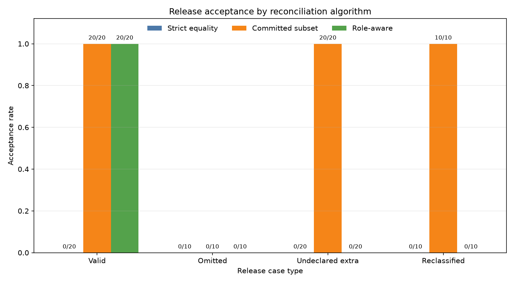

# Deterministic Role-Aware Repository Release Verification: A Synthetic Mutation-Test Specification

## Abstract

This report specifies and evaluates a deterministic rule for reconciling a declared source-file table with a release archive that may also contain explicitly declared generated outputs. The evaluation used a fixed seed to construct 20 synthetic valid cases and 40 synthetic mutations involving an omitted committed file, an undeclared extra file, or a tracked file falsely labeled as generated. The role-aware verifier produced the expected outcome for all 60 constructed cases. Strict path-set equality rejected all 20 valid cases because they contained generated outputs, while committed-subset checking accepted all 20 mutations containing undeclared extras.

These results are conformance-test results for a narrow synthetic specification, not evidence of broad classification accuracy. The valid and invalid cases were derived directly from the verifier’s set and role rules, shared a common repository structure, and were generated by the same experimental implementation. The study did not use actual Git repositories or real commit and tree identifiers, did not test authenticity, did not independently generate its mutations, and did not evaluate heterogeneous projects or credible production alternatives. Moreover, the implementation, generated repositories, archives, manifests, raw results, exact reproduction commands, and an independent reproduction record were not included in the supplied materials. Consequently, the reported results establish only that the implementation passed the specified synthetic tests as reported; they are not independently auditable from this report alone.

## Background

A release payload may contain both source-controlled material and generated publication outputs. For example, source files, schemas, dependency locks, build instructions, documentation, and mutation specifications may be tracked in a repository, while results, logs, and figures may be generated for a particular release. A verifier that requires exact path equality between a source snapshot and a release archive will reject any release containing legitimate generated outputs. Conversely, a verifier that checks only that every source path appears in the archive will not reject undeclared additions.

This report examines a straightforward composition of established packaging and integrity techniques:

1. an explicit table of source-controlled files;
2. an explicit allowlist and hash table for generated files;
3. an exact inventory of archive members;
4. reconciliation of those path sets and roles; and
5. SHA-256 checks for content consistency.

The contribution should therefore be understood as a deterministic verifier specification and a small mutation-test evaluation of that specification. It is not presented as a new cryptographic protocol, a general provenance solution, or a substantial new reconciliation algorithm. In particular, hashing an archive or manifest establishes integrity relative to a trusted reference value; it does not establish who published the artifact or whether the reference value is authentic.

Several more mature approaches are relevant to the same problem space but were not experimentally compared here. A practical baseline could combine a real `git archive` or checked-out Git tree with an explicit generated-file allowlist. Artifact-manifest and research-object systems can represent packaged files and their metadata. RO-Crate can describe research artifacts and workflow provenance. Software-archive systems can provide persistent source references. Software bills of materials, supply-chain attestation formats, signed provenance statements, transparency logs, and established archive-integrity validators address overlapping inventory, provenance, authentication, or parsing concerns. The present experiment did not implement or benchmark any of these alternatives, so it cannot establish comparative novelty or superiority.

The original report referred to ten sources using numeric citations, but the supplied report contained no corresponding bibliographic entries or source metadata. A complete bibliography cannot be reconstructed without inventing authors, titles, publication venues, or identifiers. The unsupported numeric citation markers have therefore been removed. Literature coverage and novelty relative to specific publications remain unverified limitations of the supplied materials.

### Integrity, authenticity, and provenance scope

The experiment checked two forms of consistency:

- whether a manifest’s declared file hashes agreed with the corresponding bytes; and
- whether a declared archive digest agreed with the archive bytes.

Those checks concern integrity relative to the manifest. The sidecar manifest was not reported as being digitally signed, timestamped by a trusted service, included in a transparency log, or authenticated through a trusted publication channel. An attacker able to replace both the archive and the unsigned sidecar could recompute all hashes. The experiment therefore did not establish publisher authenticity, nonrepudiation, trusted release time, or an authenticated connection between the payload and an upstream repository owner.

The synthetic identifier called a “commit identifier” in the original report was a digest of a JSON file table. It was not a Git commit object identifier and did not bind a Git commit graph, tree objects, parent commits, author or committer metadata, annotated tags, file modes, symbolic-link targets, submodule entries, or Git LFS pointer/object relationships. This revised report calls it a **synthetic source-table identifier**.

## Hypothesis

The original hypothesis precisely predicted the consequences of the three algorithms on cases constructed from those algorithms’ own rules. It is more accurately treated as a prespecified conformance expectation than as a statistical or distributional hypothesis:

> For 20 synthetic valid cases in which the payload path set is exactly the union of the declared source and generated path sets, and for 40 mutations that each violate one selected reconciliation rule, the role-aware implementation is expected to accept every valid case and reject every mutation. Strict source/payload equality is expected to reject every valid case containing generated outputs, while committed-subset checking is expected to accept mutations that add undeclared paths without removing source paths.

Formally, let:

- \(C\) be the declared source-controlled path set;
- \(G\) be the declared generated-output path set;
- \(E\) be the declared exclusion set; and
- \(P\) be the set of regular-file paths read from the archive.

Within the experiment’s restricted input domain, a valid case was constructed to satisfy:

\[
C\cap G=\varnothing,
\]

\[
P=C\cup G,
\]

\[
E\cap(C\cup G\cup P)=\varnothing,
\]

and the declared size and SHA-256 value for each member of \(C\cup G\) matched its archived bytes.

Under these definitions, the expected outcomes are largely set-theoretic consequences rather than empirical discoveries. Repeating the same templates across 20 repository indices tests deterministic implementation consistency but supplies little evidence about performance across a population of real repositories, archive formats, path conventions, parsers, or attack techniques. No confidence interval, generalization claim, or population-level accuracy interpretation is warranted.

## Method

The reported experiment was implemented for Python 3.11 or later using the standard library plus `matplotlib`. Work was reported as being performed in a fresh directory named `artifact_reconciliation_experiment`, with the global seed fixed to `20250308`.

The supplied report did not include the implementation, an artifact URL, generated repositories, release archives, manifests, source tables, raw per-case records, environment lock file, invocation script, or executable reproduction instructions. Exact commands cannot be reconstructed safely from prose alone because doing so would require inventing filenames, command-line interfaces, and implementation details. No independent reproduction was reported. The method below is consequently an executable-specification outline only to the extent that the stated canonicalization and verification rules are complete; it is not a substitute for the missing artifact package.

### Synthetic source tables

Twenty synthetic repository-like workspaces, indexed 0 through 19, were created. They were not initialized or reconciled as actual Git repositories. Each had the following six paths represented in a declared source table:

- `src/main.py`, designated as source;
- `schema/schema.json`, designated as schema;
- `requirements.lock`, designated as a lock file;
- `Makefile`, designated as the Makefile;
- `README.md`, designated as the README; and
- `mutations/spec.yaml`, designated as a mutation specification.

Each workspace also had two uncommitted paths, `.DS_Store` and `build/tmp.bin`. Both were declared as exclusions. Deterministic, repository-specific content for the source-table and excluded files was generated from the fixed seed and repository index.

Four generated outputs were declared for every case:

- `outputs/summary.json`;
- `results/raw.csv`;
- `logs/run.log`; and
- `figures/result.png`.

Their bytes were generated deterministically from the repository index and source-file hashes. The PNG was reported as being produced by a deterministic standard-library writer with fixed dimensions, pixels, compression settings, and no timestamps or variable metadata.

### Synthetic source-table identifier

SHA-256 was computed for every source-table file. A synthetic source-table identifier was formed as `sha256:` followed by the SHA-256 digest of canonical compact JSON containing the sorted source-file entries. Each entry contained exactly:

- `path`;
- `size`; and
- `sha256`.

JSON keys were sorted, separators were `(',', ':')`, and UTF-8 encoding was used. Generated outputs and excluded workspace files did not contribute to this identifier.

This construction binds only the listed path strings, sizes, and byte hashes. It does not represent or verify a Git commit. In particular, the experiment did not obtain tracked paths from a Git index or tree and did not use real commit, tree, blob, or tag identifiers.

### Release-member semantics

Every tested archive was a deterministic, uncompressed POSIX tar archive. Within the tested domain:

- every payload member was a regular file;
- member paths were the listed ASCII, forward-slash-separated relative paths;
- members were added in lexicographic path order;
- modification time, user ID, and group ID were zero;
- user and group names were empty; and
- every member mode was `0644`.

The tested mapping therefore treated each declared source or generated path as one regular archive member containing the corresponding bytes. Empty directories were not represented because tar members were created only for files.

The experiment did not define or test a mapping for:

- executable files or preservation of executable bits;
- symbolic or hard links;
- submodules or Git mode `160000`;
- Git LFS pointer files versus externally stored LFS object content;
- Git tree entries and directory metadata;
- empty directories, which Git itself does not track as tree content without a tracked file;
- devices, FIFOs, sockets, or other special files;
- sparse checkouts;
- absolute paths;
- `.` or `..` path components;
- repeated separators or trailing separators;
- duplicate archive-member names;
- Unicode normalization;
- case-folding filesystems;
- Windows drive prefixes or backslash separators; or
- platform-dependent reserved names.

Accordingly, inputs containing these features were outside the evaluated domain. The report does not establish whether the implementation rejects them, normalizes them, silently aliases them, or interprets them inconsistently with another parser. A production specification would need to define a canonical path grammar, reject ambiguous or noncanonical encodings before set comparison, define duplicate-member handling, and specify acceptable tar entry types and modes.

### Archive and manifest construction

The archive SHA-256 was computed over the final tar bytes.

A canonical `release_manifest.json` sidecar was stored outside each tar archive to avoid recursive archive hashing. It contained:

- a format version;
- repository index;
- synthetic source-table identifier;
- archive filename and SHA-256;
- the sorted source-file table;
- the sorted declared-generated table;
- the exact exclusion list `[".DS_Store","build/tmp.bin"]`; and
- a complete sorted payload inventory, including path, size, SHA-256, and declared role for every tar member.

The sidecar was unsigned. Its integrity could be checked only if its expected bytes or digest were obtained through a separate trusted mechanism. No such external authentication mechanism was specified or evaluated.

### Trust model

The role-aware verifier assumed the following inputs or components were trusted:

1. the declared source-file table;
2. the process that created that table;
3. the generated-output declarations;
4. the process or person authorized to declare generated outputs;
5. the exclusion list and the claimed set of uncommitted workspace paths;
6. the verifier implementation and runtime;
7. the archive and JSON parsing behavior used by that implementation;
8. the canonicalization rules; and
9. SHA-256 for ordinary collision and second-preimage resistance.

These assumptions place substantial provenance work outside the verifier. In particular, an independent verifier was not shown how to derive the source table from an authenticated Git commit or how to determine that the generated-output and exclusion declarations were authorized by the publisher. A forged but internally consistent source table and manifest would satisfy the reported integrity checks if the attacker could replace all unauthenticated inputs.

### Threat model

The intended logical threat model allowed a release candidate to contain:

- a missing declared source file;
- an undeclared additional regular file; or
- a source path mislabeled as generated.

The verifier specification also included recomputation of file and archive hashes, which would in principle address some byte-level corruption. However, the reported mutation suite did not exercise adversarially inconsistent archive hashes, stale file hashes, or altered bytes. All mutation manifests were reported as honestly describing their resulting archives except where a role or set relation was intentionally violated.

The evaluated threat model did not include an attacker who:

- replaced both the unsigned manifest and archive;
- forged the source or generated declarations;
- exploited parser disagreement;
- used duplicate, normalized, case-colliding, or Unicode-confusable paths;
- inserted traversal or absolute paths;
- manipulated symlink, hard-link, special-file, or tar-header semantics;
- exploited truncation or malformed archive recovery behavior; or
- created a practical SHA-256 collision or second preimage.

Authenticity and authorization were outside scope.

### Cases

The dataset contained exactly 60 cases:

| Case type | Count | Ground truth under the specification |
|---|---:|---|
| Valid | 20 | Accept |
| Undeclared extra | 20 | Reject |
| Omitted source-table file | 10 | Reject |
| Source-table file falsely reclassified as generated | 10 | Reject |

A valid payload contained exactly the six source-table files and four declared generated outputs. Excluded workspace files were absent.

Each undeclared-extra case added `extras/undeclared_<index>.txt` to the corresponding valid archive without adding it to either the source or declared-generated table. The extra was nevertheless recorded honestly in the payload inventory, and the archive digest was recomputed.

For repository indices 0 through 9, each omitted-file case removed one source-table path selected by `index mod 6`. The source table and synthetic source-table identifier were left unchanged, while the payload inventory and archive digest accurately described the reduced archive.

For repository indices 10 through 19, each reclassification case preserved the valid archive bytes but selected one source-table path using `index mod 6`, added it to the generated table, and labeled it as generated in the payload inventory. Its bytes and hash remained correct, while the source table and synthetic source-table identifier were unchanged.

Before classification, the construction process asserted the expected case counts, agreement between each manifest inventory and its actual tar members, and verification of every archive digest. This construction-integrity check established that the generated manifests honestly described the generated archives. It did not test the verifier’s response to stale hashes, forged manifests, malformed archives, or archive/manifest inconsistencies.

### Evaluated algorithms

Three algorithms were evaluated:

1. **Strict equality:** Accept exactly when \(C=P\).

2. **Committed subset:** Accept exactly when \(C\subseteq P\), without inspecting generated declarations, exclusions, or undeclared paths.

3. **Role-aware reconciliation:** Recompute the synthetic source-table identifier, archive digest, and actual tar inventory, then require all of the following:
   - the manifest source-table identifier matches the recomputed identifier;
   - the manifest archive digest matches the recomputed archive digest;
   - the manifest inventory exactly matches the parsed archive inventory;
   - source-role payload hashes match the source table;
   - generated-role payload hashes match their declarations;
   - source and generated path sets are disjoint;
   - exclusions belong to the assumed known uncommitted-workspace set;
   - no exclusion belongs to the source or generated sets;
   - no excluded path occurs in the payload; and
   - \(P=C\cup G\).

Predictions and outcomes were reported as being written per case and algorithm to `outputs/per_case_results.csv`; aggregate metrics were reported as being written to `outputs/metrics.json`; and the prespecified decision was reported as being written to `outputs/decision.json`. These files were not included in the supplied material and therefore could not be inspected.

The strict-equality and committed-subset checks were diagnostic contrasts, not credible production baselines. Their failures were known from their definitions and from the construction of the cases. No empirical comparison was made against Git archive verification with a generated-file allowlist, artifact-manifest validators, RO-Crate tooling, supply-chain attestation formats, or established archive-integrity validators.

The same experimental system appears to have generated the cases, manifests, and expected outcomes used to test the verifier. No independently implemented oracle, property-based generator, differential parser, or separately authored mutation suite was reported. Shared assumptions between generator and verifier could therefore conceal errors.

## Results

The construction-integrity assertions passed for **60 of 60** cases: each generated manifest inventory was reported to agree with its corresponding archive, and all 60 declared archive digests were reported to verify. Because those manifests and digests were deliberately regenerated after most mutations, this result confirms consistency of the generated fixtures rather than resistance to adversarial manifest/archive disagreement.

The role-aware implementation produced the expected result for every specified case:

- **20/20 valid cases accepted**;
- **40/40 specified mutations rejected**;
- **10/10 omitted-file mutations rejected**;
- **20/20 undeclared-extra mutations rejected**;
- **10/10 reclassification mutations rejected**; and
- **60/60 outcomes matched the constructed expectations**.

The value **1.0** is a pass rate over this fixed conformance suite. It should not be interpreted as estimated classification accuracy over real releases or adversarial archives. The cases were highly correlated, shared one layout, and were generated from the same rules whose implementation they tested.

The diagnostic path-set checks behaved as follows:

| Algorithm | Valid accepted | Omitted accepted | Undeclared extra accepted | Reclassified accepted |
|---|---:|---:|---:|---:|
| Strict equality | 0/20 | 0/10 | 0/20 | 0/10 |
| Committed subset | 20/20 | 0/10 | 20/20 | 10/10 |
| Role-aware reconciliation | 20/20 | 0/10 | 0/20 | 0/10 |

Strict equality rejected all **20/20 valid cases** because each valid payload included four declared generated outputs in addition to the six source-table files. This outcome follows directly from \(P=C\cup G\), nonempty \(G\), and \(C\cap G=\varnothing\).

Committed-subset checking accepted all **20/20 valid cases** and all **20/20 undeclared-extra mutations**. It rejected the 10 omitted-file cases because a required source path was absent. It accepted the 10 reclassification cases because their archives still contained all source paths and the baseline did not inspect declared roles. These outcomes likewise follow directly from the algorithm definitions and fixture construction.

The figure summarizes the observed conformance outcomes for the three specified checks. It does not compare the role-aware verifier with production manifest validators, authenticated provenance systems, Git-aware release tools, RO-Crate validators, supply-chain attestation verifiers, or hardened archive parsers.

All four prespecified decision components were reported as true:

- role-aware reconciliation accepted all constructed valid cases;
- role-aware reconciliation rejected all constructed mutations;
- strict equality rejected all constructed valid cases; and
- committed-subset checking accepted all undeclared-extra mutations.

Thus, the implementation passed the prespecified synthetic conformance suite. This result does not validate the general repository-release packaging problem, demonstrate broad defect-detection accuracy, establish Git reconciliation, or establish cryptographic authenticity.

## Limitations

The implementation and research artifacts required for audit and reproduction were not supplied. The report contains no source-code listing or artifact location and does not provide the generated repositories, archives, manifests, source tables, per-case result files, environment specification, exact commands, or hashes of the experimental artifact itself. Although several output paths are named, their contents are unavailable. Exact reproduction commands cannot be supplied without inventing an unreported command-line interface. No independent party was reported to have reproduced the headline results. The numerical results should therefore be treated as reported but not independently verified.

The study did not use actual Git repositories. Its synthetic source-table identifier was not a Git commit identifier, and the source table was not derived from a Git tree. The experiment consequently did not test real commit and tree identifiers, commit graphs, tags, Git file modes, executable bits, symlink targets, submodules, Git LFS objects, empty-directory behavior, or tracked-path extraction. Resolving this limitation requires new implementation work and new data based on real repositories.

The trusted source table, generated declarations, and exclusion list contain much of the provenance decision that an independent verifier would need to establish. The experiment assumed these inputs rather than authenticating or deriving them. It did not specify who was authorized to create the generated declarations, who approved exclusions, or how a verifier could distinguish an authorized table from a forged but internally consistent one.

The sidecar manifest was not authenticated. SHA-256 can detect changes only relative to a separately trusted digest or manifest. Because the report specified no signature, trusted timestamp, transparency-log inclusion, authenticated tag, signed attestation, or externally authenticated publication channel, it did not establish publisher authenticity. The phrase “cryptographically verifiable” would overstate the demonstrated property and has therefore been removed from the title and principal claims.

Only three semantic mutations were tested. No reported case covered:

- altered source or generated bytes;
- stale or forged per-file hashes;
- a forged source table;
- an inconsistent synthetic source-table identifier;
- missing or extra inventory entries independent of archive membership;
- archive/manifest filename confusion;
- duplicate archive paths;
- path traversal;
- absolute paths;
- `.` or `..` components;
- slash or separator normalization collisions;
- Unicode normalization variants or confusables;
- case-folding collisions;
- executable-bit or permission changes;
- symbolic links or hard links;
- submodules or Git LFS behavior;
- special files;
- malformed tar headers;
- archive truncation;
- conflicting tar metadata;
- parser ambiguity; or
- discrepancies between independent archive parsers.

The reported construction-integrity checks made every mutated manifest accurately describe its archive. This was useful for isolating the three role and set violations, but it removed many adversarial inconsistencies that an integrity verifier should detect.

The tests were not reported as being generated independently from the verifier implementation. There was no property-based testing, differential testing, independently authored oracle, alternate tar or JSON parser, fuzzing campaign, or cross-language implementation. Successful results may therefore reflect shared assumptions between fixture generation and verification.

The repositories were synthetic and homogeneous. Every case used the same six source categories, four generated outputs, two exclusions, regular-file-only tar representation, and mode `0644`. No heterogeneous real-world repositories or release archives were evaluated, including projects with nested generated content, executable files, symlinks, large files, submodules, Git LFS content, unusual filenames, or project-specific exclusion rules.

The two path-set baselines were intentionally simple and weak. Strict equality was guaranteed to reject valid cases containing generated files, while committed-subset checking was guaranteed to permit undeclared extras. No credible production alternative was implemented or measured. Consequently, the report provides no comparative evidence against Git archive verification plus an explicit generated-file allowlist, artifact-manifest or RO-Crate tooling, supply-chain attestations, SBOM-related mechanisms, software-archive references, or hardened archive-integrity validators.

No runtime, peak memory, I/O, streaming, or archive-size scaling measurements were reported. The inventories were small, and there was no evaluation involving tens of thousands or millions of files, large generated objects, compressed archives, constrained-memory execution, or one-pass streaming validation. Operational scalability remains unknown.

There was no statistical or distributional evaluation. The 60 cases were deterministic and highly correlated, and the 20 repository indices did not represent independently sampled real projects. The observed suite pass rate cannot be used to estimate false-accept or false-reject rates in a broader population.

Finally, the original report supplied numeric citations without a bibliography. Because the underlying bibliographic metadata was absent, a complete bibliography could not be added without fabrication. This report therefore does not claim comprehensive related-work coverage. A publication-ready revision would need the original source list and a substantive comparison with prior work in packaging, provenance, software archiving, research-object description, SBOMs, and software supply-chain attestation.

## Follow-up questions

- Can the verifier be implemented against actual Git repositories, deriving tracked paths, blob identities, tree modes, symlinks, executable bits, submodules, and Git LFS semantics from an authenticated commit or tag?
- What canonical path grammar and archive policy should be used to reject duplicate names, traversal, absolute paths, Unicode normalization collisions, case-folding collisions, platform-specific aliases, and ambiguous parser behavior?
- Does an independently generated mutation suite detect altered bytes, stale hashes, forged tables, inconsistent identifiers, missing and extra inventory entries, archive/manifest filename confusion, duplicate paths, links, special files, malformed headers, truncation, and conflicting metadata?
- Do property-based tests, fuzzing, differential archive parsing, and a separately implemented oracle produce the same decisions as the reference verifier?
- How does the verifier perform on heterogeneous real-world projects with nested generated content, executable files, symlinks, large files, submodules, Git LFS content, and project-specific exclusion policies?
- How does the approach compare empirically with Git archive verification plus an explicit generated-file allowlist, artifact-manifest or RO-Crate validators, supply-chain attestation formats, and established archive-integrity validators?
- What runtime, memory, I/O, and archive-size scaling behavior occurs for inventories containing tens of thousands or millions of files, and can validation be performed safely in a streaming implementation?
- Which party is authorized to create the source table, generated declarations, and exclusion policy, and how should those declarations be authenticated?
- Should the manifest be bound to a publisher through a digital signature, signed Git tag, trusted timestamp, transparency log, signed supply-chain attestation, or another explicitly scoped external trust mechanism?
- Can the complete implementation, fixture generator, repositories, archives, manifests, raw results, artifact hashes, exact reproduction commands, and independent reproduction record be published so that the reported conformance results can be audited?
