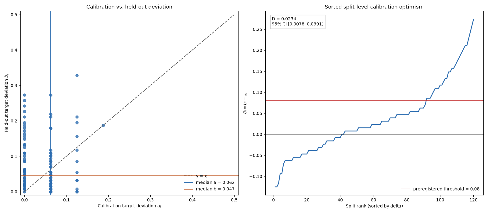

# Calibration and Frozen-Parent Batch-Size Comparison on 20-Bit OneMax

## Abstract

This study examined whether selecting genetic-algorithm parameters on calibration seeds makes serial success appear closer to a target rate of 0.50 than it does on held-out seeds. It also compared serial replacement with a frozen-parent batch-size-16 implementation at parameters selected specifically for serial replacement. Population size, mutation rate, and evaluation budget were selected independently within 120 fixed calibration-validation splits from an 18-setting grid, followed by validation on disjoint seeds and paired bootstrap analysis. The supplied hypothesis description specified 40 splits, whereas the implemented analysis used 120, and no time-stamped preregistration or locked-protocol archive was supplied to establish when or why this change occurred. The 120-split analysis must therefore be treated as exploratory rather than as a verified preregistered test.

The observed median paired increase in target deviation was \(D=0.0234375\), with a percentile-bootstrap interval of \([0.0078125, 0.0390625]\). Thus, a positive calibration-validation gap was observed, but the stated large-effect threshold \(D\ge 0.08\) was excluded by this interval. This refutes the hypothesized magnitude, not the existence of calibration optimism. In the secondary parameter-transfer comparison, serial replacement had a substantially higher success rate than frozen-parent batch size 16 on 20-bit OneMax under equal evaluation budgets and settings selected for serial performance. Because batch size 16 was not independently calibrated, this result does not establish general superiority of serial replacement, wall-clock superiority, or inferiority of batching in general.

## Background

Genetic algorithms combine population-based selection, mutation, and replacement, and their behavior can depend materially on algorithmic and parameter choices. Parallel execution can improve computational throughput, but batching need not preserve the search trajectory of serial execution. In particular, freezing a population while several offspring are generated prevents later offspring in a batch from selecting parents that incorporate improvements found earlier in that batch.

Parameter calibration raises a separate inferential concern. If population size, mutation rate, and evaluation budget are chosen because they produce a desired success rate on a small calibration sample, the same sample will generally give an optimistic account of how closely the selected setting matches the target. Evaluation on disjoint validation seeds can measure an operational calibration-validation gap, although the validation proportion remains a finite-sample estimate rather than the selected setting’s true success probability.

The experiment addressed these issues on deterministic 20-bit OneMax with a small parameter grid. It first measured the difference between calibration and validation target deviations for serial-selected settings. It then transferred those serial-selected settings unchanged to a frozen-parent batch-size-16 implementation. The second analysis is therefore a parameter-transfer comparison, not an independently calibrated comparison of serial and batch algorithms.

The supplied report cited references [1–7], but no bibliographic metadata was provided. Those citations cannot be reconstructed responsibly without inventing sources, so unsupported citation markers have been removed. A complete revision intended for publication would require the original reference list or a newly documented literature review. The experiment’s novelty should also be interpreted narrowly: selection optimism and stale-parent effects are established general concerns, while the present evidence is confined to a toy objective, one batching rule, and a small parameter grid.

## Hypothesis

The stated hypothesis was that the median paired increase in absolute deviation from the target success rate would be at least 0.08 on validation seeds:

\[
D=\operatorname{median}_{i}\left(
\left|v_i-0.50\right|-\left|c_i-0.50\right|
\right)\ge 0.08,
\]

where \(c_i\) was the selected setting’s success proportion on its calibration seeds and \(v_i\) was its success proportion on held-out validation seeds.

This threshold concerned the magnitude of the calibration-validation gap. It did not define calibration optimism as present only when \(D\ge 0.08\). Consequently, an interval below 0.08 can refute the hypothesized large magnitude while remaining consistent with a smaller positive gap.

Each setting was selected from 18 candidates using 16 calibration runs. The stated decision rule supported the large-effect hypothesis only if the lower endpoint of the 95% bootstrap interval was at least 0.08 and rejected that magnitude if the upper endpoint was below 0.08.

The supplied hypothesis description refers to 40 splits, but the implemented protocol and reported analysis used 120 splits. No time-stamped preregistration, checksum, archived protocol, or documented amendment was supplied to explain whether 120 was chosen before or after outcomes were inspected. The discrepancy therefore cannot be resolved from the available materials. In particular, the available report does not establish that the use of 120 splits, the bootstrap procedure, the informative-regime check, or the secondary batch analysis was locked before outcome inspection. The numerical results below describe the implemented 120-split analysis, but that analysis is labeled exploratory rather than verified as preregistered. A confirmatory claim would require either a time-stamped protocol showing that 120 splits and all analysis rules were fixed before inspection or repetition on a genuinely untouched replication set.

## Method

The execution environment was reported as Python 3.14.6 with NumPy 2.5.1, pandas 3.0.3, and Matplotlib 3.11.1. These version strings were not accompanied by an environment lockfile, package inventory, executable artifact, or console output and therefore could not be independently verified. The overall runtime was recorded as 51.51292262499919 seconds, but no hardware configuration, processor count, operating system, timing method, or method-specific timing was supplied. The runtime is consequently not scientifically interpretable and is not used to support any performance conclusion.

No executable code, tests, machine-readable split-level outcomes, selected-setting records, bootstrap resample indices, environment archive, or preregistration checksum accompanied the report. The procedure below describes the reported implementation, but exact random-number consumption and evaluation-budget termination cannot be independently audited from the supplied materials.

### Objective and serial algorithm

The objective was deterministic 20-bit OneMax,

\[
f(x)=\operatorname{bit\_count}(x),
\]

with genomes represented as unsigned integers. The unique successful state was the all-ones bit string. A run counted as successful if that state was evaluated at least once before or at the evaluation budget.

For each run, a separate `numpy.random.Generator(numpy.random.PCG64(seed))` was reported to have been initialized. A population of \(P\) genomes was sampled independently and uniformly from all \(2^{20}\) bit strings, and those \(P\) evaluations counted toward the total evaluation budget \(B\). For each subsequent offspring, the reported order of operations was:

1. Sample two population indices independently and uniformly with replacement.
2. Select the fitter sampled genome as the parent, resolving fitness ties in favor of the first sampled index.
3. Independently mutate each of the 20 bits with probability \(p\).
4. Evaluate the child and count that evaluation toward \(B\).
5. If the child’s fitness was at least the current minimum population fitness, replace a uniformly selected member of the minimum-fitness set; otherwise discard the child.

A serial run was reported to end immediately upon evaluating the optimum or after exactly \(B\) evaluations. Initial-population evaluations were included in \(B\), and no offspring was to be evaluated after the budget was exhausted. Genomes were bit-packed, and per-evaluation histories were not retained.

This description specifies the intended ordering of random draws and budget accounting, but no executable tests were supplied to verify tie handling, mutation draws, minimum-set replacement, immediate success termination, or exact evaluation counts. It also does not establish that serial and batch executions consumed corresponding random variates after their population states diverged; using the same seed alone is insufficient to guarantee such correspondence.

### Calibration design

The candidate grid contained 18 settings:

- Population size \(P\in\{4,12\}\)
- Mutation probability \(p\in\{0.5/20,1/20,2/20\}\)
- Evaluation budget \(B\in\{80,160,320\}\)

The target serial success rate was 0.50.

The implemented analysis contained 120 fixed, mutually disjoint splits indexed from 0 through 119. For split \(i\),

\[
\text{base}_i=10000000+10000i.
\]

Its 16 calibration seeds were \(\text{base}_i+j\) for \(j=0,\ldots,15\), and its 128 validation seeds were \(\text{base}_i+1000+j\) for \(j=0,\ldots,127\). Seeds were reused across candidate settings within a split as common random numbers. Calibration and validation sets were disjoint, and no seed appeared in multiple splits.

All 18 settings were evaluated on all 16 calibration seeds in every split. The setting minimizing absolute deviation from 0.50 was selected. Ties were reportedly resolved by:

1. Smaller \(B\)
2. Smaller \(P\)
3. Mutation-multiplier order \(1,\ 0.5,\ 2\)

No validation result was reported as having been used for selection or retuning. The calibration stage comprised 34,560 runs.

For each selected setting, the serial algorithm was evaluated on the split’s 128 held-out validation seeds, yielding 15,360 serial validation runs. The split-level quantities were

\[
a_i=|c_i-0.50|,\qquad
b_i=|v_i-0.50|,\qquad
\delta_i=b_i-a_i.
\]

Here, \(c_i\) and \(v_i\) are success proportions estimated from 16 and 128 runs, respectively. In particular, \(v_i\) is not the selected setting’s true success probability. The primary statistic combines selection effects with finite-sample error in both proportions, and the unequal sample sizes imply substantially coarser and more variable calibration estimates than validation estimates. It should therefore be interpreted as an operational calibration-validation statistic under this sampling design, not as a direct estimate of the difference between calibration error and deviation from a known true success probability.

The primary effect was \(D=\operatorname{median}(\delta_i)\). The reported percentile bootstrap used PCG64 seed 20250308, 20,000 resamples of 120 split indices with replacement, and NumPy linear quantiles at 0.025 and 0.975. The bootstrap resampled entire splits and therefore preserved the within-split pairing.

The seed blocks were fixed, deterministic, and adjacent according to the formula above, rather than randomly sampled from a formally defined population. Consequently, the bootstrap interval is most defensibly interpreted as a resampling-stability interval under an assumption that the 120 observed splits are exchangeable. It is not a design-based confidence interval for all possible PCG64 seeds. A broader population interpretation would require defining and randomly sampling a population of eligible seed blocks or replicating the experiment with independently specified blocks.

Because the split-level outcomes were not supplied, an order-statistic, sign-based, or other distribution-free interval for the discrete median could not be calculated or compared with the percentile-bootstrap interval. Such a check is particularly relevant because \(\delta_i\) is discrete and contains ties. The reported interval is far below 0.08, but its coverage properties were not independently assessed.

The informative-regime check required at least 96 of the 120 selected calibration rates to lie in \([0.25,0.75]\). Failure would have overridden the primary decision and rendered the analysis inconclusive. As with the other analysis rules, the available materials do not verify that this check was locked before outcome inspection.

### Batch-size-16 comparison

The secondary analysis used the same initialization, objective, validation seeds, and selected \(P\), \(p\), and \(B\) as the serial analysis. Importantly, these parameters were selected solely according to serial calibration performance. Batch size 16 was not independently calibrated using an equal calibration budget and a separate untouched validation set.

At the beginning of each batch, the population was frozen. Up to 16 offspring—or only the number permitted by the remaining evaluation budget—were generated, with all tournament parents selected from that snapshot. After evaluation, offspring were processed in generation order against the live population using the serial replacement criterion. Evaluating the optimum counted as success whether or not the optimum was retained.

The batch size of 16 exceeded both tested population sizes, \(P=4\) and \(P=12\). The batching rule therefore generated an entire batch from stale parent information even when the batch contained more offspring than the population contained members. Because useful feedback was deliberately delayed, a substantial penalty on this objective is not unexpected.

Batch-size-16 was run only on the 15,360 held-out validation cases. For split \(i\),

\[
q_i=\operatorname{mean}(\text{batch success}-\text{serial success}),
\]

and the secondary effect was

\[
Q=\operatorname{mean}_i(q_i).
\]

Its reported 95% percentile cluster-bootstrap interval used the same 20,000 split resamples as the primary analysis. The stated decision rule called batch superior if the lower bound exceeded zero, serial superior if the upper bound was below zero, and the comparison indecisive otherwise.

This procedure assesses what happened when settings selected for serial replacement were transferred unchanged to frozen-parent batch size 16. It is not a fair general comparison between independently calibrated serial and batch algorithms. Such a comparison would require batch size 16 to receive the same calibration budget, batch-specific setting selection, and evaluation on an untouched validation set.

## Results

The informative-regime check passed: all 120 selected calibration success rates were within \([0.25,0.75]\), exceeding the required count of 96. This establishes that the implemented data met the stated regime condition, although the absence of a time-stamped protocol prevents the condition from being treated as verified preregistered.

The median calibration target deviation was 0.0625, while the median validation target deviation was 0.046875. These marginal medians should not be subtracted to obtain the paired effect: the implemented statistic first calculated \(b_i-a_i\) within each split and then took its median. That paired statistic was

\[
D=0.0234375,
\]

with a reported 95% percentile-bootstrap interval of

\[
[0.0078125,\ 0.0390625].
\]

The observed median was positive, and the reported interval was entirely above zero. At the same time, its upper endpoint, 0.0390625, was below the stated large-effect threshold of 0.08. The appropriate conclusion is therefore that the hypothesized magnitude \(D\ge 0.08\) was refuted under the stated decision rule. The result does not show an absence of calibration optimism; rather, it shows a positive observed calibration-validation gap whose estimated median magnitude was substantially smaller than 0.08.

Across the 120 splits, validation deviation exceeded calibration deviation in 78 splits, was equal in 2 splits, and was smaller in 40 splits. Thus, positive differences were more common than negative differences. These counts reinforce the distinction between rejecting the large-effect threshold and claiming that no calibration optimism occurred.

The left panel compares each split’s calibration deviation \(a_i\) with its held-out validation deviation \(b_i\), including the equality line and their respective medians. The right panel displays the sorted paired differences \(\delta_i\), together with zero and the 0.08 threshold. The figure is consistent with the reported numerical result: positive paired differences are common, but the median and its reported bootstrap interval remain below the threshold required for the hypothesized large effect. The retained relative path is the only figure reference supplied; no accessible publication archive or externally resolvable figure URL was available for this revision.

In the secondary parameter-transfer comparison, serial replacement achieved an aggregate validation success rate of 0.5041015625, whereas frozen-parent batch size 16 achieved 0.16197916666666667. The paired batch-minus-serial effect was

\[
Q=-0.3421223958333333,
\]

with a reported 95% cluster-bootstrap interval of

\[
[-0.35592447916666664,\ -0.3279947916666667].
\]

Of the 15,360 paired validation cases, only serial succeeded in 6,302 cases, while only batch succeeded in 1,047 cases. Under the stated secondary rule, this was classified as a serial advantage.

That classification must be scoped to the implemented comparison: frozen-parent batch size 16 on deterministic 20-bit OneMax, under equal evaluation budgets, using \(P\), \(p\), and \(B\) selected for serial replacement and then transferred unchanged to batch. The result does not establish that serial replacement is generally superior to an independently calibrated batch algorithm, that smaller or feedback-aware batches are inferior, or that serial execution is faster in wall-clock time.

The report did not supply the frequency with which each of the 18 settings was selected, nor split-level identifiers for selected \(P\), \(p\), and \(B\). The batch effect therefore could not be stratified by selected population size, mutation probability, or evaluation budget. It remains possible that the aggregate secondary effect was dominated by particular serial-selected configurations. Selection frequencies and stratified effects are necessary for interpreting that possibility but cannot be reconstructed from the aggregate results alone.

## Limitations

- **Unverified preregistration and unexplained split-count change.** The hypothesis description specified 40 splits, while the implemented analysis used 120. No time-stamped preregistration, locked protocol, amendment history, checksum, or archive was supplied, so the reason and timing of this change cannot be established. The 120-split bootstrap, regime check, and secondary analysis must therefore be treated as exploratory. A confirmatory analysis requires documentary evidence that these choices preceded outcome inspection or repetition on an untouched replication set.

- **The large-effect hypothesis, not calibration optimism itself, was rejected.** The observed paired median was positive, the reported interval was above zero, and 78 splits had positive differences compared with 40 negative differences and 2 ties. The result excludes the stated threshold \(D\ge0.08\) under the reported interval; it does not support a conclusion that calibration optimism was absent.

- **Validation deviation is estimated rather than known.** Each validation rate was based on 128 runs and remains an estimate of the selected setting’s success probability. The statistic \(b_i-a_i\) combines parameter-selection effects with finite-sample errors in a 16-run calibration proportion and a 128-run validation proportion. Unequal sample sizes make calibration rates coarser and noisier than validation rates, so \(D\) is an operational design-specific estimand rather than a direct comparison with true target deviation.

- **No independent batch calibration.** The secondary analysis transferred serial-selected \(P\), \(p\), and \(B\) unchanged to batch size 16. It therefore shows poor performance of this frozen-parent batch implementation at serial-calibrated settings, not general superiority of serial replacement over independently calibrated batch replacement.

- **Narrow batch conclusion.** The evidence concerns frozen-parent batch size 16 on deterministic 20-bit OneMax under equal evaluation budgets and the tested serial-selection procedure. Batch size 16 exceeded both candidate population sizes, 4 and 12, and delayed all within-batch parent feedback. No conclusion follows about smaller batches, asynchronous updates, alternative batching rules, larger populations, other objectives, or batching in general.

- **No wall-clock comparison.** The experiment compared success under equal evaluation budgets. It did not report method-specific timings, hardware, processor count, parallel execution, communication overhead, or equal-time results. It therefore provides no evidence that serial execution is superior in elapsed time or practical parallel throughput.

- **Missing setting-selection frequencies and stratified effects.** The supplied results do not show how often each of the 18 settings was selected. They also do not stratify the batch-minus-serial effect by selected \(P\), \(p\), or \(B\). Without the split-level records, these required summaries cannot be computed, and the degree to which particular configurations dominate the aggregate batch result remains unknown.

- **Missing robustness interval for the median.** The percentile bootstrap was not checked against an order-statistic, sign-based, or other distribution-free interval appropriate for a discrete median with ties. The aggregate counts are insufficient to reconstruct such an interval because the ordered split-level \(\delta_i\) values were not supplied.

- **Limited bootstrap population interpretation.** The 120 seed blocks followed a deterministic adjacent schedule rather than a random sampling design. Treating splits as exchangeable bootstrap units provides a conditional resampling-stability analysis of the observed splits, but it does not by itself justify population inference to all seeds, alternative seed schedules, or other random-number generators.

- **No auditable artifacts.** No executable code, split-level calibration and validation outcomes, selected settings, bootstrap resample indices or generation specification beyond the prose description, environment lockfile, tests, machine-readable result archive, or preregistration checksum was supplied. Exact numerical reproduction and implementation-equivalence checks are therefore not possible from this report alone.

- **Unverified software and runtime details.** The reported software versions and highly precise runtime were not supported by environment metadata or hardware information. Runtime cannot be interpreted scientifically, and the version claims remain unverified.

- **Implementation behavior was not independently tested.** The prose specifies intended random-draw ordering and evaluation-budget accounting, but no tests demonstrate that serial execution terminates immediately at success, that no method exceeds \(B\), that initialization counts toward \(B\), that batch generation respects the remaining budget, or that tie and replacement rules were implemented as described. Same-seed pairing also does not imply equivalent random-variate consumption after serial and batch states diverge.

- **Figure accessibility.** The only supplied figure reference is the local relative path `workspace/figures/calibration_optimism.png`. No accessible publication artifact or archived figure was available, and changing the path without an actual hosted replacement would fabricate availability.

- **Missing bibliography.** The original citation markers [1–7] had no associated bibliographic entries. A bibliography cannot be reconstructed reliably from citation numbers alone, so the unsupported markers were removed rather than matched to invented sources.

- **Narrow objective scope.** The experiment used only deterministic 20-bit OneMax. Its smooth fitness structure, unique optimum, and small representation do not establish that the same calibration gap or stale-parent penalty occurs on multimodal, noisy, constrained, deceptive, or higher-dimensional problems.

- **Small calibration samples.** Each setting was selected using only 16 calibration seeds. This made calibration success rates discrete in increments of \(1/16\) and made selection sensitive to a small number of outcomes.

- **Restricted parameter grid.** Only two population sizes, three mutation rates, and three evaluation budgets were considered. The findings do not establish how calibration would behave with a denser grid, adaptive tuning, different operators, or batch-specific parameter ranges.

- **Fixed seed construction.** Calibration and validation sets were disjoint, but the conclusions are conditional on the deterministic seed schedule and reported PCG64 implementation. Replication with independently specified seed blocks is needed to assess stability beyond this schedule.

- **Modest novelty and external validity.** Selection optimism and degradation caused by stale parent information are not novel general phenomena. The contribution here is limited to quantifying them under one small experimental design, and the extreme batch penalty has limited external validity because the batch was larger than either tested population and intentionally withheld within-batch feedback.

- **No timeout censoring assessment was needed.** Runs ended by success or a fixed evaluation budget rather than an external timeout. This avoids timeout censoring but confines the conclusions to equal evaluation budgets rather than equal elapsed-time limits.

## Follow-up questions

- Can the 120-split analysis be repeated on a genuinely untouched replication set under a time-stamped protocol that fixes the split count, grid, tie-breaking rules, regime check, bootstrap, robustness interval, and secondary analyses before any outcomes are inspected?
- Does the paired calibration effect reach or exceed 0.08 when selection is performed over a substantially larger locked parameter grid while retaining 16 calibration seeds per split?
- How does \(D\) change when the number of calibration seeds is fixed in advance at 8, 32, or 64 while the candidate grid and 128-seed validation sets remain fixed?
- How do percentile-bootstrap intervals for the discrete median compare with distribution-free sign- or order-statistic intervals when all split-level differences are released?
- Which of the 18 settings are selected most frequently, and how do both \(\delta_i\) and the batch-minus-serial effect vary by selected \(P\), \(p\), and \(B\)?
- How does independently calibrated frozen-parent batch size 16 compare with independently calibrated serial replacement when both receive equal calibration budgets and are evaluated on a new untouched validation set?
- Does the observed parameter-transfer penalty persist for batch sizes 2, 4, and 8, and is it monotonic in batch size under the same paired validation design?
- How do asynchronous or feedback-aware parallel implementations compare with the frozen-parent batching rule under both equal evaluation budgets and documented equal wall-clock conditions?
- On preregistered multimodal, deceptive, noisy, constrained, or higher-dimensional objectives, how large are calibration-selection effects and stale-parent penalties relative to those observed on 20-bit OneMax?
