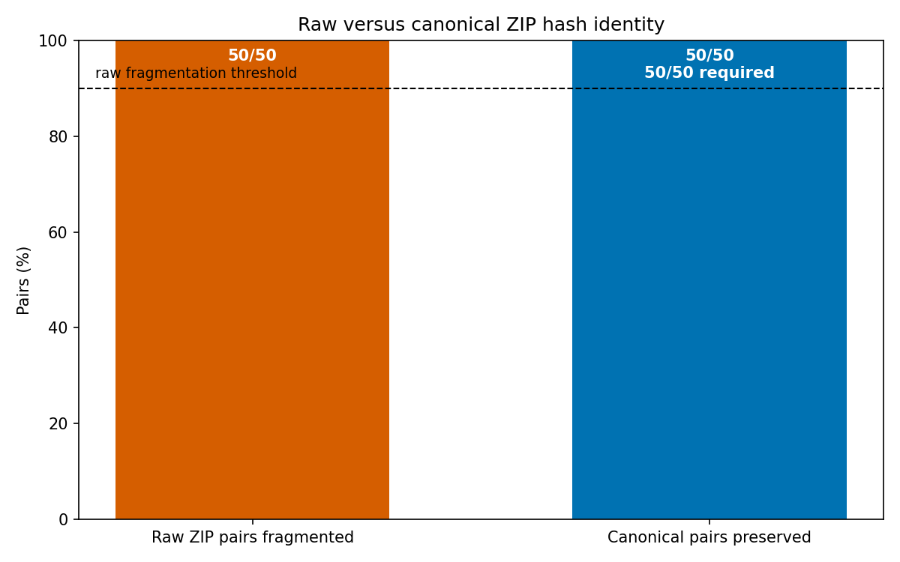

# A Deterministic Packaging and Canonicalization Prototype for Stable Identifiers of Restricted RO-Crate Bundles

## Abstract

This constructed conformance experiment tested whether a narrowly defined packaging policy could assign the same content-derived identifier to pairs of restricted RO-Crate bundles that differed only in selected JSON serialization and ordering features. Fifty synthetic pairs were generated with randomized JSON object-key order, `@graph` entity order, single-key `{"@id": ...}` reference order, whitespace, and indentation. The paired bundles were equivalent under the specified normalization policy; this is not a claim of general JSON-LD, RDF, or research-object semantic equivalence.

SHA-256 identifiers computed from the raw ZIP bytes differed for all 50 pairs. This result was deterministic by construction because each pair was forced to contain different metadata bytes. After both variants were processed by the same metadata-normalization and deterministic ZIP-writing implementation, identifiers matched for all 50 pairs. The result is therefore evidence that this implementation behaved consistently on its own synthetic corpus, not a statistical estimate or an independently validated interoperability result.

The experiment did not include systematic negative controls, externally produced RO-Crates, adversarial path and encoding cases, an independent verifier, a second implementation, or cross-platform ZIP production. The complete source, exact runtime version and invocation, generated corpus, archives, digests, result tables, and figure source were also not supplied with the report. Consequently, the reported results are not independently reproducible from the presented evidence. The demonstrated contribution is limited to a deterministic packaging and canonicalization prototype for a restricted profile.

## Background

Computational research packages can contain source code, dependency declarations, environment descriptions, input data, outputs, and provenance-related metadata. Packaging these materials can support inspection and preservation, but merely including them does not establish that the archived program was executed in the declared environment or that its outputs can be regenerated byte-for-byte. The bundles studied here should therefore be described as containing reproducibility-related materials rather than as demonstrated reproducible research artifacts.

RO-Crate uses JSON-LD metadata to describe research objects. Several distinct notions of equivalence are relevant when assigning identifiers to such packages:

- **Raw archive identity:** two ZIP files have identical bytes.
- **Canonical package identity:** two inputs map to identical bytes under a specified packaging policy.
- **JSON structural equivalence:** parsed JSON values are equal after explicitly defined transformations.
- **JSON-LD or RDF equivalence:** documents represent equivalent RDF datasets after JSON-LD processing and, where necessary, RDF dataset canonicalization.
- **Research-object semantic identity:** two packages represent the same research object for a particular scientific or preservation purpose.

This experiment established only the second notion for its generated examples. More precisely, it tested **equivalence under the specified normalization policy**. The policy recursively sorted JSON object keys, sorted `@graph` entities by `@id`, sorted arrays consisting exclusively of single-key `{"@id": ...}` references, preserved all other array order, normalized selected path syntax, and rebuilt a ZIP with fixed archive properties. It did not perform JSON-LD expansion, RDF conversion, RDF dataset canonicalization, blank-node canonicalization, context-alias resolution, datatype normalization, language-map processing, or general reasoning about equivalent IRIs. Equality after the prototype’s sorting rules must therefore not be described as unrestricted semantic equivalence.

Established approach categories address related but different layers:

- **Canonical JSON approaches** can make supported JSON values deterministic at the serialization layer, but do not by themselves establish JSON-LD or RDF equivalence.
- **RDF dataset canonicalization** can address graph-level equivalence and blank nodes, but does not determine the identity of non-metadata files, archive paths, permissions, or ZIP representation.
- **Reproducible archive conventions** can constrain timestamps, entry order, permissions, compression, and archive metadata, but do not necessarily define metadata semantics.
- **Manifest-based systems**, including preservation-package approaches, can identify files by normalized paths and digests without requiring byte-identical archive containers.
- **Merkle-tree and other content-addressed systems** can provide component-level identity and efficient verification while avoiding dependence on the exact bytes produced by a ZIP writer.
- **Source-code content identifiers and archival identifiers** address preservation and reference to source trees, but are not automatically identifiers for an entire RO-Crate package.

The prototype combined restricted JSON normalization with deterministic ZIP reconstruction. It did not establish a new general canonical JSON, JSON-LD, RDF, archive, manifest, or content-identifier standard. Nor did the experiment demonstrate why hashing canonical ZIP bytes is preferable to hashing a canonical manifest or Merkle root. Hashing the canonical ZIP covers the complete reconstructed container, but it also makes interoperability depend on exact ZIP-writing behavior. A canonical manifest could separate logical package identity from transport-container representation and may be a more portable design.

The original report used numbered citations without supplying the corresponding bibliographic entries. Those references cannot be reconstructed reliably without inventing citation data. This revision therefore narrows the associated claims rather than treating the missing citation numbers as adequate support. A publication-ready version still requires a complete, traceable bibliography for RO-Crate, JSON and RDF canonicalization, reproducible archives, preservation manifests, content-addressed identifiers, Software Heritage, computational reproducibility, and dependency management.

## Hypothesis

The original threshold hypothesis is better characterized as a two-part implementation conformance check:

1. the two raw ZIP files in each pair should have different SHA-256 identifiers because their `ro-crate-metadata.json` bytes were deliberately forced to differ; and
2. the two variants should produce identical canonical ZIP bytes after application of the same normalization and ZIP-reconstruction policy.

The previously stated threshold of at least 45 raw-identifier differences among 50 pairs did not have a statistical interpretation. The protocol deliberately assigned one variant compact JSON and the other pretty JSON, with additional forced graph-order differences if necessary. Because those differing metadata bytes were embedded in otherwise identically constructed ZIP files, different raw ZIP hashes were an expected deterministic consequence rather than an empirical estimate of fragmentation across naturally varying serializers or archive tools.

Likewise, equality of the canonical identifiers was an expected conformance property of the implementation: both variants were processed using the same normalization and deterministic ZIP-writing code. The meaningful question was whether the implementation satisfied its policy on these generated cases. The experiment did not estimate how frequently independent serializers, ZIP libraries, platforms, or canonicalizer implementations would agree.

The intended conformance claim was therefore:

> For the 50 generated pairs, variants equivalent under prototype normalization policy version `prototype-policy-0` should be transformed by the tested implementation into byte-identical canonical ZIP files.

The name `prototype-policy-0` is a retrospective descriptive label introduced to discuss the tested rules precisely. It was not embedded in the reported identifiers or canonical bytes. The actual identifier format was only `sha256:<digest>`, with no policy-version field or cryptographic domain separation. Consequently, those identifiers are unsafe for interoperable use across future policy revisions: the same prefix could denote digests produced under different normalization rules.

## Method

The experiment was described as using a single `experiment.py` implementation under CPython 3.11 or newer. Python standard-library facilities handled JSON processing, pseudorandom generation, ZIP construction, SHA-256 hashing, filesystem operations, and CSV output. The only permitted third-party package was reported as `matplotlib==3.9.2`, used for the figure. The master pseudorandom seed was `20250308`.

The exact Python runtime version used to produce the reported results was not recorded. The `environment.json` files inside the generated bundles declared CPython `3.12.8`, but that declaration does not demonstrate that the experiment itself ran under that version. Exact standard-library component versions were also not recorded; they would ordinarily be tied to the exact Python build. The operating system, architecture, Python build information, ZIP implementation details, and command-line invocation were not supplied. It is therefore not possible to report an exact execution command or runtime fingerprint without inventing information.

Exactly 50 synthetic bundle pairs, indexed 0 through 49, were generated. Variants A and B within each pair contained the same five non-metadata byte sequences and metadata equivalent under the prototype policy. Different indices represented different generated bundles. Each variant contained:

- `src/run.py`: an ASCII Python program intended to read `data/input.json`, compute the sum of squares of its `values` array, and write JSON containing the pair index, result, and fixed timestamp `2025-01-01T00:00:00Z`;
- `data/input.json`: compact, sorted-key JSON containing the pair index and values `[i, i+1, i+2]`;
- `outputs/results.json`: compact, sorted-key JSON containing the pair index, computed sum of squares, and fixed generation timestamp;
- `requirements-lock.txt`: the exact text `# No third-party runtime dependencies; Python standard library only\n`; and
- `environment.json`: compact, sorted-key JSON declaring Python `3.12.8`, implementation `CPython`, operating system `any`, and architecture `any`.

The report did not establish that `src/run.py` was executed from the declared environment during validation or that its generated output was compared byte-for-byte with `outputs/results.json`. The files are therefore evidence of packaged source, declarations, inputs, and precomputed outputs, not evidence of successfully reproduced execution.

The metadata was an RO-Crate JSON-LD object using the RO-Crate 1.1 context. Its `@graph` contained a metadata descriptor, a root dataset, and one entity for each of the five files. The root referenced all files through `hasPart`. Each file entity recorded byte length and a lowercase hexadecimal SHA-256 checksum.

Variants A and B were generated from the same in-memory metadata object using pseudorandom generators seeded with `20250308 + 2*i` and `20250308 + 2*i + 1`. Object keys were recursively shuffled. The `@graph` array and arrays consisting exclusively of single-key `{"@id": ...}` references were independently shuffled. If the two generated graph orders matched, variant B was rotated by one position. One variant was serialized as compact JSON without a final newline and the other as pretty JSON with either two- or four-space indentation and one final newline. Both were encoded as UTF-8 with `ensure_ascii=False` and `allow_nan=False`.

Before archive construction, both serializations were parsed and normalized by the same implementation that later canonicalized the archives. The checks were:

1. recursively sort object keys;
2. sort `@graph` entities by `@id`;
3. sort arrays composed exclusively of single-key `{"@id": ...}` references by `@id`;
4. preserve all other array order; and
5. require the five non-metadata files to be byte-for-byte identical.

The experiment aborted if a pair failed these checks. This established equality under the implementation’s normalization policy, but it did not provide an independent oracle. Test generation, equivalence checking, and canonicalization shared the same implementation and assumptions. A shared defect—for example, an incorrect assumption that a particular JSON-LD array was unordered—could therefore have affected generation, validation, and canonicalization without being detected.

Raw archives were created with six entries in lexicographic path order and with `ZIP_STORED` compression. Both variants used forward-slash paths, empty archive and entry comments, empty extra fields, Unix `create_system=3`, timestamp `(1980, 1, 1, 0, 0, 0)`, mode `0100755` for `src/run.py`, and mode `0100644` for every other entry. The intended within-pair raw difference was restricted to the bytes of `ro-crate-metadata.json`. A raw identifier was `sha256:` followed by the SHA-256 digest of the complete ZIP byte sequence.

The tested canonicalization rules can be documented as the following incomplete descriptive specification, `prototype-policy-0`:

1. **Input container**
   - Read entries from a ZIP archive.
   - Do not preserve input ZIP comments, entry comments, extra fields, timestamps, compression choices, platform fields, or central-directory ordering.
   - Reject duplicate normalized paths.
   - Behavior for malformed ZIP structures, encrypted entries, unsupported compression, overlapping entries, ZIP bombs, and inconsistent local and central headers was not specified.

2. **Path processing**
   - Replace each backslash with `/`.
   - Split paths on `/`.
   - Discard empty components and components equal to `.`.
   - Reject any `..` component.
   - Reject absolute paths.
   - Reject an empty normalized name.
   - Join remaining components with `/`.
   - No Unicode normalization form was specified.
   - Windows drive-letter, UNC-path, control-character, trailing-space, reserved-name, and visually confusable-name behavior was not specified.

3. **Name encoding**
   - The normalized path string was supplied to Python’s ZIP-writing facilities.
   - Exact filename-byte encoding and general-purpose-bit-flag behavior were not independently specified.
   - Consequently, the policy did not establish interoperable handling of non-ASCII filenames across ZIP implementations.

4. **Metadata parsing**
   - Parse `ro-crate-metadata.json` as JSON using the Python standard library.
   - Generated inputs disallowed NaN and infinity.
   - Duplicate JSON object keys, integer-size limits, negative zero, exponent forms, floating-point canonicalization, and arbitrary-precision numeric behavior were not formally specified.
   - The generated profile used integers rather than general JSON numbers.

5. **Metadata normalization**
   - Recursively sort object keys.
   - Sort `@graph` entities by their `@id`.
   - Sort an array by `@id` only when every element is an object containing exactly one key, `@id`.
   - Preserve every other array in its input order.
   - Do not perform JSON-LD expansion, compaction comparison, RDF conversion, blank-node canonicalization, datatype normalization, language processing, or inference.

6. **Metadata serialization**
   - Serialize as compact, sorted-key JSON.
   - Encode as UTF-8 with non-ASCII characters emitted directly.
   - Append exactly one newline.
   - Exact escaping behavior was inherited from the Python JSON implementation rather than defined independently.

7. **File content**
   - Preserve the bytes of every non-metadata file.
   - No content transformation, line-ending normalization, decompression-based equivalence, or media-type-specific normalization was applied.

8. **Entry ordering**
   - Write normalized paths in lexicographic order using the implementation’s string ordering.
   - Cross-language ordering for non-ASCII names was not specified or tested.

9. **Permissions and file types**
   - Assign mode `0100755` to `src/run.py`.
   - Assign mode `0100644` to every other entry.
   - Input permission changes were intentionally discarded.
   - Executable status was inferred from the special path rather than preserved from the source archive.
   - Symlinks, devices, hard links, explicit directory entries, and other file types were not specified.

10. **ZIP construction**
    - Use `ZIP_STORED`.
    - Set timestamp `(1980, 1, 1, 0, 0, 0)`.
    - Set `create_system=3`.
    - Use empty comments and extra fields.
    - ZIP64 selection, version-needed fields, filename flags, external attributes beyond the stated modes, data-descriptor use, and library-specific header choices were not fully specified independently of Python’s ZIP writer.

11. **Errors**
    - The implementation was reported to reject absolute paths, `..` components, empty normalized names, and duplicate normalized paths.
    - A complete error taxonomy and required behavior for all malformed or unsupported inputs was not supplied.

12. **Identifier**
    - Compute SHA-256 over the complete canonical ZIP byte sequence.
    - Format the identifier as `sha256:<64 lowercase hexadecimal characters>`.
    - The implementation did not include `prototype-policy-0` in the identifier and did not apply domain separation. A production design should do so, but changing the identifier format now would create results not reported by the experiment.

Canonical archives were stored under their 64-character hexadecimal digest. Coincident A and B paths were retained as a single deduplicated file only after byte equality was checked.

Per-pair identifiers, equality indicators, validation status, and archive sizes were reportedly written to `results/pair_metrics.csv`. Aggregate metrics and a fixed experiment timestamp were reportedly stored as sorted, indented JSON. However, the report did not supply:

- `experiment.py`;
- exact invocation instructions;
- the exact Python executable and standard-library build;
- the generated test corpus or a complete generation package;
- raw ZIP archives;
- canonical ZIP archives;
- `results/pair_metrics.csv`;
- the aggregate JSON file;
- the source data and script for the figure;
- expected SHA-256 digests for released artifacts; or
- machine-verifiable provenance linking the reported figure and summary values to a particular execution.

No systematic negative-control suite was reported. In particular, the experiment did not isolate changes to non-metadata bytes, metadata scalar values, reference membership, normalized paths, filenames, ordered-array elements, or executable status and then verify that each policy-significant change altered the identifier. It also did not perform collision-oriented tests for backslash/slash conversion, discarded empty or `.` components, Unicode normalization, filename encodings, case sensitivity, permissions, ZIP metadata, ZIP64 behavior, or duplicate-name handling.

## Results

All 50 within-pair validations passed under the prototype’s normalization policy. In each pair, the normalized metadata structures were equal according to the shared implementation, and the five non-metadata files were byte-for-byte identical. This should be reported as a **policy-equivalence validation rate of `1.0`**, not as proof of general semantic equivalence.

Raw ZIP identifiers differed in **50 of 50 pairs**. Across the 100 variants, there were **100 unique raw identifiers**. Raw archive sizes ranged from **2,503 to 3,373 bytes**, reflecting the deliberately different compact and pretty metadata serializations.

This raw result was guaranteed by the construction rather than estimated from a variable population. Each pair was forced to contain different metadata bytes, while all other archive-construction settings were held constant. Cryptographic hashes of the complete raw ZIP files were therefore expected to differ. The historical 45-of-50 threshold does not add inferential value and should not be interpreted as a measured fragmentation rate for independently produced RO-Crates.

Canonical identifiers were equal in **50 of 50 pairs**. Across the 100 canonicalized variants, there were **50 unique canonical identifiers**, one per pair index. Canonical archive sizes ranged from **2,504 to 2,513 bytes**, and both variants in every pair had equal canonical sizes and SHA-256 identifiers.

The figure reports the two implementation outcomes on a 0–100% scale. Its dashed 90% raw-fragmentation line reflects the original threshold, but that threshold should not be read as a statistical decision boundary. The raw 100% result followed from deliberately different metadata bytes. The canonical 100% result shows that the tested implementation mapped each generated pair to the same canonical ZIP bytes under its own policy.

The observed conformance checks were:

- policy-equivalence validation: **50/50 passed**;
- raw identifiers different: **50/50**; and
- canonical identifiers equal: **50/50**.

The result is appropriately summarized as follows:

> The single prototype implementation was consistent on 50 pairs generated specifically to exercise selected JSON formatting and ordering transformations.

The **50 distinct canonical identifiers across indices** do not constitute a systematic sensitivity test. Each index changed several fields and file contents simultaneously, so these cases do not isolate which distinctions the canonicalizer preserves. They cannot rule out accidental collisions caused by path normalization, metadata normalization, discarded permissions, ZIP reconstruction, or unsupported encoding behavior.

The experiment also provides no independent interoperability evidence. Both variants were processed by the same Python implementation, and no independently written parser or verifier checked the canonical output. No second implementation or language produced the same canonical bytes. The results therefore do not establish that another ZIP library, Python version, operating system, or programming language would reproduce the reported identifiers.

Within these restrictions, the bundles contained source code, dependency-related text, an environment declaration, input data, and timestamped machine-readable outputs. The experiment assigned them deterministic identifiers under one implementation-defined archive policy. It did not verify execution from the declared environment, demonstrate byte-for-byte reproduction of the output, establish general RO-Crate identity, register identifiers with a persistent service, or demonstrate long-term availability.

## Limitations

- **Narrowly constructed corpus:** The 50 pairs were generated specifically for this test and varied only selected JSON serialization and ordering features. No externally produced RO-Crates were included, so the experiment does not establish compatibility with packages created by existing RO-Crate tools.

- **Outcome largely guaranteed by design:** Raw variants were forced to contain different metadata bytes, making raw-hash differences expected. Both variants were then processed by the same normalization and ZIP-writing implementation, making canonical equality the intended result. The pair count and original 90% threshold do not provide a meaningful statistical estimate.

- **No independent oracle:** Test generation, normalization-based validation, and canonicalization appear to share code and assumptions. No independently written parser, verifier, standards-based conformance suite, or second implementation was used. A shared implementation defect could pass every reported check.

- **No systematic negative controls:** The study did not modify one meaningful feature at a time. It therefore did not establish that changes to non-metadata bytes, metadata scalar values, reference membership, filenames, policy-significant paths, or ordered-array elements always change the identifier.

- **Executable status is discarded:** The canonicalizer assigns executable mode based on the path `src/run.py` and fixed modes elsewhere. An input archive’s executable bit is not preserved. A permission-only or executable-status-only input change can therefore be intentionally conflated by the current policy. This prevents the requested executable-status negative control from succeeding unless the policy is revised.

- **Potential normalization collisions:** Backslashes are converted to slashes, and empty and `.` path components are discarded. Thus, names such as `a\b`, `a/b`, `a//b`, and `a/./b` may map to the same normalized path. These distinctions were intentionally discarded to obtain a simplified path representation, but the experiment did not justify that choice against a defined threat model or test whether it is safe for all RO-Crate uses.

- **Incomplete Unicode and filename policy:** No Unicode normalization form was specified. Filename encoding, UTF-8 ZIP flags, case sensitivity, visually confusable names, and platform-specific name behavior were not tested. The implementation may distinguish canonically equivalent Unicode strings while conflating other path spellings.

- **Restricted JSON-LD handling:** The policy performs syntactic normalization of a constrained JSON profile. It does not establish equivalence across context aliases, expansion and compaction forms, equivalent IRIs, blank nodes, datatype forms, language maps, graph representations, or other RDF-level equivalences. General arrays are preserved, while selected reference arrays are treated as unordered based on shape rather than JSON-LD semantics.

- **Incomplete numeric specification:** Generated metadata excluded non-finite numbers and apparently used integers, but the policy did not fully specify floating-point serialization, exponent forms, negative zero, integer limits, or arbitrary-precision behavior. It is not a general canonical JSON specification.

- **Archive distinctions are discarded:** Input timestamps, compression method, comments, extra fields, platform metadata, entry order, and permissions are replaced. This is intentional for deterministic packaging, but it means the identifier denotes policy-defined canonical package identity rather than original archive identity.

- **ZIP behavior is underspecified:** ZIP filename flags, external attributes, version fields, ZIP64 behavior, data descriptors, duplicate raw names, malformed archives, and exact header encoding were not comprehensively defined. Byte-identical results may depend on the Python runtime and ZIP library behavior.

- **Unsupported package features:** Symlinks, hard links, explicit directories, devices, encrypted entries, large files requiring ZIP64, external references, and other adversarial archive structures were not evaluated.

- **No cross-version or cross-platform testing:** The study used one unrecorded Python build and one ZIP-writing implementation. It did not compare multiple Python versions, operating systems, architectures, ZIP libraries, command-line archive tools, or independent language implementations.

- **No comparison experiment:** Canonical JSON, RDF dataset canonicalization, reproducible archive conventions, manifest-based preservation packages, Merkle representations, and established content-identifier systems were not implemented as baselines. The experiment therefore does not demonstrate comparative novelty or that canonical ZIP hashing is preferable to a canonical manifest.

- **Policy version absent from identifiers:** The reported `sha256:` identifiers contain neither a canonicalization-policy version nor domain separation. If the rules change, identifiers from different policies may be indistinguishable by syntax even though they represent different equivalence relations.

- **No complete released artifact:** The source, invocation, corpus, raw and canonical archives, CSV, aggregate JSON, figure source, expected digests, and provenance record were not supplied. The numerical results and figure cannot be independently checked from the report.

- **Exact runtime not recorded:** “CPython 3.11 or newer” is not an exact runtime description. The bundled declaration of CPython `3.12.8` does not prove that this was the runtime used. Exact Python, standard-library, operating-system, architecture, and build versions cannot be recovered from the information provided.

- **Missing bibliography:** The original numbered citations had no accompanying bibliographic entries. A complete bibliography cannot be reconstructed without source information and must be supplied before publication. Claims concerning RO-Crate, Software Heritage, reproducibility, dependency management, canonical JSON, RDF canonicalization, reproducible archives, manifests, and content-addressed identifiers require traceable references.

- **No persistent-identifier service:** The identifiers were local SHA-256 content identifiers. The experiment did not deposit the bundles in an archival service or test resolution, retention, replication, governance, or long-term availability.

- **Environment portability was declared, not demonstrated:** The environment file used operating system `any` and architecture `any`, which are broad compatibility assertions rather than exact environment information. No multi-platform execution was performed.

- **Outputs were not independently reproduced:** The report did not establish that the archived program was executed from the declared environment or that its output matched `outputs/results.json` byte-for-byte. The bundles therefore contain reproducibility-related materials but are not demonstrated reproducible executions.

## Follow-up questions

- Can the complete artifact be released with `experiment.py`, exact command-line instructions, an exact runtime and platform fingerprint, the generated corpus, raw and canonical archives, `results/pair_metrics.csv`, aggregate JSON, figure source, and a signed manifest of expected SHA-256 digests?

- Can test generation, policy-equivalence checking, and canonicalization be separated so that an independently written parser and verifier validate every canonical archive?

- Can at least two independent implementations—preferably in different languages and using different ZIP libraries—produce byte-identical canonical ZIPs and identifiers from the same conformance corpus?

- Can the policy be revised into a complete, versioned specification covering path encoding, Unicode normalization, JSON encoding, numeric representation, JSON-LD processing, array semantics, permissions, executable status, symlinks, directories, compression, ZIP flags, ZIP64, duplicate names, malformed inputs, resource limits, and error handling?

- Should the identifier use explicit domain separation and a policy-bearing form such as a scheme that distinguishes canonical ZIP policy versions, rather than the unqualified `sha256:` prefix?

- Can systematic negative controls alter exactly one policy-significant feature at a time—including non-metadata bytes, metadata scalar values, reference membership, paths, filenames, executable status, and ordered-array elements—and confirm that every such change alters the identifier?

- Can collision-oriented controls test backslash versus slash names, empty and dot components, Unicode normalization forms, filename encodings, case distinctions, permission changes, ZIP comments, extra fields, timestamps, compression, filename flags, ZIP64, and duplicate names?

- Which discarded distinctions are justified by the intended threat model and use cases, and which should instead be included in package identity?

- Can the corpus include externally produced RO-Crates, multiple RO-Crate authoring tools, multiple JSON serializers, multiple ZIP libraries, command-line archive programs, adversarial inputs, Unicode paths, nested directories, large binary files, external references, blank nodes, and order-sensitive arrays?

- Would a recognized canonical JSON standard be sufficient for the restricted metadata profile, or should metadata identity instead be based on JSON-LD expansion and RDF dataset canonicalization?

- Would hashing a canonical manifest or Merkle representation provide better portability than hashing complete canonical ZIP bytes while still covering file paths, content digests, metadata, and relevant permissions?

- How does the prototype compare experimentally with canonical JSON, RDF dataset canonicalization, reproducible archive conventions, BagIt- or OCFL-style manifests, Merkle-tree identifiers, and established source or object content identifiers?

- Can archived `src/run.py` programs be executed in fully specified reconstructed environments on multiple operating systems and architectures, with `outputs/results.json` regenerated and verified byte-for-byte?

- After canonical objects are deposited in a preservation service, do service-assigned identifiers remain resolvable and continue to map to the same policy-versioned content digest over repeated checks?
