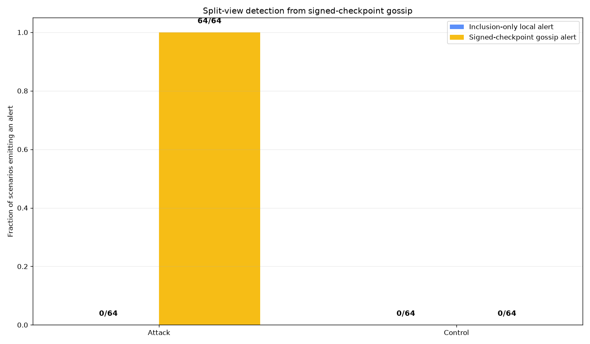

# Detection of Equal-Size Signed-Checkpoint Equivocation Under Guaranteed Authenticated Exchange

## Abstract

This study evaluated a narrowly defined checkpoint-comparison predicate: if two checkpoints are valid under the same out-of-band pinned Ed25519 public key, have equal tree sizes, and contain unequal Merkle roots, comparison emits an equivocation alert. The reported implementation exercised that predicate in 64 deterministic split-view scenarios and 64 deterministic identical-checkpoint controls, all using 64-leaf Merkle trees. In every attack scenario, isolated inclusion-only verification accepted both locally valid views, while authenticated comparison of the two delivered checkpoints emitted an alert. Neither method alerted on the identical-checkpoint controls.

These outcomes are implementation-conformance results, not statistical evidence about operational detection rates. The attack scenarios were constructed to satisfy the detector’s decisive predicate, and the experiment guaranteed that both conflicting checkpoints reached the comparison step. The work therefore demonstrates only that the reported implementation applied the specified equal-size equivocation predicate in the generated cases. It does not establish that signed publication roots are generally operationally trustworthy, that conflicting checkpoints will be exchanged in a real network, or that the log is complete, correct, fresh, available, or append-only.

The supplied materials do not include executable source code, dependency versions or a lockfile, generated test vectors, raw machine-readable outputs, artifact hashes, an independently distributable rendering of the figure, independent implementations, or complete bibliographic metadata. Consequently, the reported run cannot be independently reproduced or checked from this report alone.

## Background

A Merkle root is a compact commitment to an ordered collection of records. In the construction used here, changing a committed record changes its leaf hash and propagates through the internal hashes to the root. An inclusion proof can show that one record occupies a claimed position under a particular root. Neither a root nor an inclusion proof, however, establishes by itself who authorized the root, whether the committed inventory is complete or correct, whether the tree grew append-only, whether the checkpoint is current, or whether other verifiers received the same checkpoint.

A signature under a pinned key addresses only part of this problem. It authenticates a checkpoint as a statement made under that key, provided that the verifier uses an independently configured public key, validates the exact signed bytes, and rejects malformed encodings. A valid signature does not make the signer honest and does not prevent the signer from authorizing conflicting statements.

This distinction is central to transparency-log threat models. A split-view or equivocation attack can present different, internally valid log views to different parties. Each isolated party may receive a valid checkpoint and valid proofs within its assigned view. Detecting such behavior requires additional information or coordination. Relevant transparency mechanisms include:

- **Checkpoint gossip:** participants exchange authenticated checkpoints so that conflicting statements can be compared.
- **Persistent checkpoint histories:** monitors retain previously observed checkpoints, allowing rollback, replay, and contradictory-history checks rather than comparing only the latest pair.
- **Append-only consistency proofs:** when checkpoints have different sizes, a proof can show that the smaller tree is a prefix of the larger tree under the specified Merkle construction. A consistency proof addresses tree growth between particular roots; it does not, by itself, guarantee that all clients were shown the same history.
- **Monitors and auditors:** dedicated parties can retain checkpoints, verify proofs, inspect entries, and compare observations over time.
- **Witnesses or cosigners:** additional parties can validate or record checkpoints before accepting or cosigning them, reducing reliance on a single log signer.
- **Cross-logging:** one log’s checkpoints can be submitted to another independently operated log, creating an additional record against which equivocation may be checked.
- **Multiple-peer gossip:** exchanging checkpoints with several peers can increase opportunities for incompatible views to meet, although the result depends on topology, delivery, peer behavior, and adversarial isolation.
- **Certificate Transparency split-view defenses:** the broader Certificate Transparency literature treats gossip, monitoring, consistency proofs, witnesses, and related mechanisms as ways to expose or constrain inconsistent log behavior.

The predicate tested in this report is a standard observation from that body of work: two authenticated checkpoints from the same log identity cannot both describe one tree state if they have the same size but different roots. No new split-view-detection algorithm or general operational-trust result is claimed here. The limited contribution is a concrete checkpoint serialization and a deterministic conformance exercise for that specific predicate.

The experiment must also be understood as conditional on a **detection opportunity**. Detector correctness and detection opportunity are different properties:

1. **Detector correctness:** given two authenticated checkpoints with equal sizes and unequal roots, does the implementation alert?
2. **Detection opportunity:** do conflicting checkpoints actually reach a common verifier, peer, monitor, witness, or other comparison point?

The simulation directly constructed the first condition and guaranteed the second. It did not estimate how often a real communication system would create such an opportunity.

The source report used numbered citation placeholders `[1]` through `[10]` but supplied no authors, titles, venues, dates, URLs, or other bibliographic records. Those placeholders are not a complete bibliography and cannot be resolved without adding information absent from the supplied material. To avoid inventing citations, this revision does not assign identities to them. A publication-ready version requires a complete, verified bibliography covering Certificate Transparency split views, checkpoint gossip, consistency proofs, witnesses, monitors, cross-logging, and transparency-log threat models.

## Hypothesis

The core claim is recast as the following formal proposition.

**Proposition — equal-size checkpoint-equivocation conformance predicate.**

Let a checkpoint be:

\[
C=(n,r,\sigma),
\]

where \(n\) is the tree size, \(r\) is a 32-byte Merkle root, and \(\sigma\) is an Ed25519 signature over the specified checkpoint serialization. Let \(K\) be the same public key pinned independently by the comparing verifier. Define:

\[
\operatorname{Valid}_K(C)
\]

to mean that the checkpoint is well formed and that \(\sigma\) verifies under \(K\) over the exact serialization of \(n\) and \(r\). Define the comparison predicate:

\[
\operatorname{Alert}(C_1,C_2)
=
\operatorname{Valid}_K(C_1)
\land
\operatorname{Valid}_K(C_2)
\land
(n_1=n_2)
\land
(r_1\ne r_2).
\]

Therefore, whenever two delivered checkpoints are valid under the same pinned key, have equal tree sizes, and have unequal roots, a conforming implementation of this predicate emits an alert.

This proposition is true from the definition of the predicate. The experiment is consequently an executable-conformance exercise for the reported implementation, not an empirical discovery that repeated trials make statistically more likely. The 64 deterministic attacks vary generated records, target positions, and mutation positions, but they are not independent samples from a defined population of transparency-log attacks.

For the generated cases, the predeclared implementation expectations were:

- every locally valid attack view would pass signature and membership verification;
- both isolated verifiers would therefore accept their respective attack views;
- authenticated comparison would alert on every delivered attack pair because the pair was constructed to have equal sizes and unequal roots; and
- neither method would alert on controls consisting of identical copies of one checkpoint.

The experiment distinguishes the following security properties:

1. **Local checkpoint authentication:** whether a checkpoint signature verifies under the pinned key.
2. **Record membership:** whether one supplied record has a valid inclusion proof under that checkpoint root.
3. **Append-only consistency:** whether a later, differently sized checkpoint extends an earlier checkpoint without rewriting history.
4. **Inventory completeness and semantic correctness:** whether all required records, and only correct records, are represented.
5. **Freshness and anti-replay:** whether a checkpoint is sufficiently recent and has not been replayed or rolled back.
6. **Eventual fork exposure:** whether conflicting views will eventually reach a common comparison point despite network or adversarial interference.

The reported experiment exercises the first two properties and the equal-size comparison rule. It does not establish properties three through six. In particular, it demonstrates conditional detection after conflicting checkpoints are successfully delivered, not reliable fork exposure in an operational network.

## Method

The reported implementation used Python 3.11 or later, the standard library, `cryptography`, and `matplotlib`, with Matplotlib configured to use the noninteractive `Agg` backend. It used no network access, external datasets, clocks, or nondeterministic randomness.

Exact Python patch versions, operating-system details, `cryptography` and `matplotlib` versions, transitive dependencies, and a dependency lockfile were not supplied. Thus, “Python 3.11 or later” is not a complete reproducible environment specification.

### Deterministic key and verifier trust configuration

The master seed was defined as:

```text
SHA256(b"publication-root-gossip-experiment-v1")
```

Its reported hexadecimal value was:

```text
776a10ed6588b7ed1f268c318d7e683e229c8ba55119f614c6be685a84ad3d43
```

The report does not include executable code or an independently generated digest record with which to verify this value.

The transparency service’s Ed25519 private-key seed was derived as:

```text
HMAC-SHA256(MASTER_SEED, b"ed25519-private-key")
```

An Ed25519 private key was constructed from these 32 bytes, and its public key was derived. The public key was treated as verifier configuration pinned out-of-band. Release artifacts could carry signatures but were not permitted to supply or replace the verifier’s trusted public key.

This setup tests checkpoint authentication under one fixed key. It does not test key distribution, rotation, revocation, compromise recovery, multiple signers, or interoperability across Ed25519 implementations.

### Merkle-tree construction

Each scored tree contained exactly 64 records. A record byte string was hashed as:

```text
SHA256(b"\x00" + record)
```

An internal node was hashed as:

```text
SHA256(b"\x01" + left_hash + right_hash)
```

Adjacent nodes were paired at every level. Because 64 is a power of two, no odd-node handling rule was required. The final 32-byte hash was the inventory root for the generated tree.

Each inclusion proof contained exactly six sibling hashes, ordered from the leaf level to the root, with a side marker for each sibling. If the sibling was on the left, verification computed:

```text
SHA256(b"\x01" + sibling + current)
```

If the sibling was on the right, verification computed:

```text
SHA256(b"\x01" + current + sibling)
```

A proof was accepted only if the leaf index was in `[0,63]`, exactly six siblings were supplied, every side marker matched the position implied by the index at that level, and the reconstructed root equaled the authenticated checkpoint root.

This fixed complete-binary-tree construction does not define behavior for arbitrary tree sizes, odd numbers of leaves, empty trees, or append-only consistency proofs. It therefore cannot be assumed interoperable with other Merkle-tree specifications without separate test vectors and cross-implementation checks.

### Checkpoint publication and validation

A checkpoint was serialized for signing as the exact byte sequence:

```text
b"INVCHKPT-v1\n" + tree_size.to_bytes(8, "big") + root
```

Here, `tree_size` was 64, and `root` was exactly 32 raw bytes. The transparency service signed this serialization with Ed25519.

Each release artifact contained:

- the integer tree size;
- the root as lowercase hexadecimal;
- the signature as lowercase hexadecimal;
- the target leaf index;
- the target record as UTF-8 text; and
- six proof siblings with side markers.

A verifier obtained and authenticated the checkpoint root through the following procedure:

1. Read the artifact’s root field.
2. Hex-decode it and require exactly 32 bytes.
3. Read and validate the checkpoint tree size and signature encoding.
4. Reconstruct the exact `INVCHKPT-v1` checkpoint serialization.
5. Verify the Ed25519 signature using the independently pinned public key.
6. Only after successful signature verification, treat the decoded value as an authenticated statement by that key.
7. Hash the supplied record and validate its six-level inclusion proof against that root.

Authentication in step 6 does not establish inventory truth or completeness. It establishes only that the key signed the specified tree size and root.

For checkpoint comparison, each verifier additionally obtained the other verifier’s tuple `(tree_size, root, signature)`, independently verified its signature with the same pinned public key, and applied:

```text
alert =
    valid(checkpoint_A, pinned_key)
    and valid(checkpoint_B, pinned_key)
    and checkpoint_A.tree_size == checkpoint_B.tree_size
    and checkpoint_A.root != checkpoint_B.root
```

Equal sizes with different roots caused an alert. Equal sizes with equal roots did not. The implementation did not define an alert rule for unequal sizes, because no append-only consistency-proof format or checkpoint-history policy was implemented.

### Record generation and scenarios

Records were canonical compact JSON encoded as UTF-8, with sorted keys and separators `(',', ':')`. For class `kind`, scenario `s`, and record index `i`, ordinary records had the fields:

```json
{
  "index": i,
  "kind": "attack or control",
  "nonce": "deterministically derived HMAC-SHA256 hexadecimal value",
  "scenario": s
}
```

The nonce was derived from:

```text
HMAC-SHA256(MASTER_SEED, f"record|{kind}|{s}|{i}".encode())
```

Every generated scenario was asserted to contain exactly 64 distinct record byte strings.

For each of 64 attack scenarios numbered 0 through 63:

- Fork A contained the 64 ordinary attack records.
- The target index was `t = (13*s + 5) % 64`.
- The mutation index was `m = (17*s + 3) % 64`.
- If `m == t`, `m` was replaced by `(m + 1) % 64`.
- Fork B differed only at index `m`, where the record included `"mutation":"fork-B"` and a nonce derived from `mutation|attack|s|m`.
- The target record at index `t` was therefore identical in both forks.
- The two roots were required to differ.
- Both size-64 checkpoints were signed.
- Each verifier received a valid proof for the common target record within its own fork.

For each of 64 control scenarios, one 64-record control tree was constructed and signed. Both verifiers received identical copies of its checkpoint and a valid proof for the same selected target record.

These controls establish only that duplicate copies of the same valid checkpoint did not trigger the unequal-root predicate. They are not strong operational controls. They do not exercise benign unequal-size checkpoints, independently serialized artifacts, stale but valid checkpoints, duplicate or retransmitted messages, key rotation, parser interoperability, or consistent tree growth.

### Compared methods and scoring

The **inclusion-only baseline** independently checked each artifact’s encoding, signed checkpoint, record hash, and inclusion proof. It had no access to any second checkpoint or retained checkpoint history. Artifact rejection counted as a local alert, and a scenario had dual acceptance when both isolated verifiers accepted.

This baseline illustrates the information limitation of local membership verification. It is not a competitive substitute for a realistic transparency deployment using retained histories, append-only consistency proofs, monitors, witnesses, cross-logging, or multiple gossip peers. Those mechanisms were discussed conceptually but were not implemented or compared empirically.

The **checkpoint-comparison method** performed the same local checks and then received the two latest checkpoints through a guaranteed exchange. It emitted an equivocation alert only when two independently authenticated checkpoints had equal tree sizes and different roots.

The scored scenarios consisted of 64 deterministic attacks and 64 deterministic identical-checkpoint controls. The number 64 was not derived from a power calculation or population model. No confidence interval, significance test, or statistical independence claim is appropriate.

Two additional sanity checks, excluded from scoring, required that:

- changing one bit of a signed root while retaining its signature failed signature verification; and
- changing one proof sibling while retaining the signed checkpoint failed inclusion verification.

The experiment was required to abort if either tampered artifact was accepted or if any generation assertion failed. These checks do not cover noncanonical encodings, malformed signature lengths, alternate integer encodings, duplicate JSON fields, Unicode ambiguity, truncation, appended bytes, proof-index manipulation, replay, rollback, signature malleability assumptions, or parser differentials.

The predeclared conformance outcomes were:

- attack dual acceptance under inclusion-only verification: 64/64 scenarios;
- checkpoint-comparison alerts on attacks: 64/64 scenarios;
- inclusion-only local alerts on attack views: 0/128 individual views;
- inclusion-only local alerts on control views: 0/128 individual views;
- control dual acceptance: 64/64 scenarios; and
- checkpoint-comparison alerts on controls: 0/64 scenarios.

### Reproducibility-artifact status

A complete reproducibility artifact should contain at least:

1. all source code used to generate records, trees, proofs, checkpoints, scenarios, results, and the figure;
2. the exact runtime and operating-system specification;
3. exact direct and transitive dependency versions, preferably in a lockfile;
4. invocation instructions from a clean environment;
5. the generated public key and all public test vectors;
6. serialized records, checkpoints, signatures, roots, inclusion proofs, and tampered inputs;
7. raw scenario-level outputs for all attacks, controls, and negative tests;
8. cryptographic hashes of every source, input, output, and rendered artifact;
9. the plotting source and independently distributable rendered figure; and
10. independent implementations or published cross-language vectors for serialization, signature verification, Merkle roots, proof validation, and checkpoint comparison.

None of those files, apart from the procedural descriptions and aggregate values printed in this report, were supplied for revision. No source hash, lockfile hash, vector hash, raw-output hash, or figure hash can therefore be reported without fabrication. The procedural specification may assist a future reimplementation, but it is not a substitute for the exact artifact that produced the reported results.

## Results

The reported run met all predeclared deterministic conformance thresholds.

| Metric | Definition | Reported result |
|---|---|---:|
| Attack scenarios | Constructed pairs of valid size-64 checkpoints with unequal roots | 64 |
| Control scenarios | Pairs containing identical copies of one valid size-64 checkpoint | 64 |
| Inclusion-only attack dual acceptance | Attack scenarios in which both local artifacts were accepted, divided by 64 attack scenarios | 64/64 |
| Inclusion-only local alerts on attack views | Rejected local attack artifacts, divided by 128 individual attack views | 0/128 |
| Checkpoint-comparison attack alerts | Delivered attack pairs satisfying the comparison alert predicate, divided by 64 attack scenarios | 64/64 |
| Control dual acceptance | Control scenarios in which both local artifacts were accepted, divided by 64 controls | 64/64 |
| Inclusion-only local alerts on control views | Rejected local control artifacts, divided by 128 individual control views | 0/128 |
| Checkpoint-comparison control alerts | Control pairs satisfying the alert predicate, divided by 64 controls | 0/64 |
| Absolute observed attack-alert-rate difference | Checkpoint-comparison attack alert proportion minus inclusion-only attack-scenario alert proportion | 1.0 |

In all 64 constructed attack scenarios, both isolated verifiers reportedly accepted their respective artifacts. The attack dual-acceptance proportion was therefore `64/64 = 1.0`. The inclusion-only attack-scenario alert proportion was `0/64 = 0.0`, and the local artifact-rejection proportion among attack views was `0/128 = 0.0`.

After guaranteed delivery and authentication of both checkpoints, all 64 attack pairs reportedly emitted alerts. Each pair had been constructed to contain valid checkpoints under the same key, equal tree sizes of 64, and unequal roots. The observed checkpoint-comparison attack alert proportion was therefore `64/64 = 1.0`.

All 64 identical-checkpoint controls were reportedly accepted by both verifiers. The local control-view rejection proportion was `0/128 = 0.0`, and the checkpoint-comparison control alert proportion was `0/64 = 0.0`.

The value formerly labeled “detection-rate improvement” is more precisely an **absolute observed attack-alert-rate difference**:

```text
(64 checkpoint-comparison alerts / 64 delivered attack pairs)
-
(0 inclusion-only alerts / 64 attack scenarios)
=
1.0
```

This difference has no inferential or statistical interpretation. It compares two deterministic predicates under constructed inputs, one of which lacks the second checkpoint required to evaluate equivocation. It does not estimate improvement over a realistic monitor, witness, consistency-proof verifier, cross-logging system, persistent-history verifier, or multi-peer gossip network.



The figure is a graphical restatement of the aggregate deterministic outcomes. It does not add uncertainty analysis because the scenarios were not sampled from a population model. The referenced path is workspace-relative, and the rendered file and its hash were not supplied as an independently available artifact.

Both reported sanity checks passed: a one-bit modification to a signed root was rejected by signature verification, and a modification to one inclusion-proof sibling was rejected by inclusion verification. These two outcomes provide limited evidence that those particular rejection paths were exercised; they are not a comprehensive malformed-input, canonicalization, or interoperability test suite.

The main result should therefore be read narrowly:

> For the reported deterministic cases, the implementation conformed to the predicate that two delivered checkpoints valid under the same pinned key trigger an alert when their tree sizes are equal and their roots differ.

The 64/64 result does not estimate robustness or operational detection probability. The attack generator guaranteed the condition to which the detector was defined to respond, and the exchange model guaranteed that both checkpoints reached the comparison step. Repetition across 64 scenarios checks that the implementation continued to apply the rule across the generated inputs, but it provides little evidence beyond a correctly constructed example about networks, diverse implementations, different tree sizes, or other attack classes.

The experiment also separately supports only the following limited observations within the reported run:

- the checkpoint signatures authenticated the generated size-and-root statements under the configured key;
- the supplied inclusion proofs established membership of one target record under each local root; and
- comparison exposed the constructed equal-size conflict after both authenticated checkpoints were brought together.

It does not support claims of inventory completeness, semantic correctness, append-only operation, freshness, availability, or eventual fork exposure.

## Limitations

- **The result is true largely by construction:** Each attack was defined to contain two valid checkpoints with equal sizes and unequal roots, while the detector was defined to alert on precisely that condition. The reported 64/64 outcome is an implementation-conformance result, not a substantive estimate of real-world robustness or performance.

- **No statistical interpretation:** The 64 attacks are deterministic scenarios rather than independent trials sampled from a justified population. They share one master seed, one signing key, one tree size, one implementation, one signer, one mutation model, and the same decisive predicate. No statistical significance, confidence interval, or population-level detection claim follows from their repetition.

- **Guaranteed detection opportunity:** Both conflicting checkpoints were deliberately delivered to the comparison step. The study did not estimate whether real verifiers would exchange incompatible views. It therefore tests detector behavior conditional on an opportunity, not the probability of obtaining that opportunity.

- **Narrow equal-size predicate:** Every scored checkpoint had tree size 64. The experiment did not evaluate differently sized consistent checkpoints, differently sized inconsistent checkpoints, append-only consistency proofs, tree growth, rollback, or policies for accepting a newer checkpoint.

- **No stale or replay analysis:** The implementation did not test stale but valid checkpoints, replayed checkpoints, retained checkpoint histories, rollback detection, freshness windows, monotonic counters, or trusted time. It cannot establish freshness or anti-replay properties.

- **No realistic network model:** The study did not model message loss, delayed delivery, reordering, duplicate delivery, retransmission, selective isolation, partitions, multiple peers, peer churn, malicious relays, unavailable relays, or relays that selectively suppress one fork. Consequently, it does not establish eventual fork exposure or availability.

- **Information-starved baseline:** The inclusion-only baseline had no second checkpoint, consistency proof, monitor state, witness statement, cross-log record, or retained history. Its failure to detect equivocation is pedagogically useful but does not constitute a competitive evaluation against realistic transparency mechanisms.

- **Weak controls:** Both control verifiers received identical copies of the same checkpoint. The controls did not include benign unequal-size checkpoints, valid append-only growth, stale checkpoints, duplicate or reordered messages, independently generated artifacts, independent parsers, or key rotation. False-positive behavior outside the exact identical-checkpoint case remains untested.

- **No append-only consistency implementation:** A consistency-proof format and verifier were not defined. Differently sized checkpoint pairs therefore cannot be classified as consistent or inconsistent by this experiment.

- **No persistent monitor or witness:** The implementation compared only one delivered checkpoint pair. It did not retain checkpoint histories, operate a monitor, require witness cosignatures, or cross-log checkpoints. No empirical comparison with those transparency mechanisms is available.

- **Single deterministic construction:** All keys, records, mutations, and target positions came from one deterministic master seed. The run did not test other seeds, keys, tree sizes, mutation patterns, serializers, proof generators, or cryptographic libraries.

- **Shared implementation confound:** The generator, signer, parser, Merkle implementation, proof generator, and verifiers were not shown to be independent. A shared defect could make generation and verification agree incorrectly. No independent implementation or published cross-language test vectors were supplied.

- **Incomplete malformed-input coverage:** Only a one-bit root modification and one altered proof sibling were tested. The study did not cover malformed or noncanonical hexadecimal, truncated or oversized signatures, alternate integer encodings, unexpected trailing bytes, duplicate fields, Unicode edge cases, invalid UTF-8, inconsistent side markers beyond the ordinary validation path, proof-index manipulation, missing siblings, extra siblings, zero or extreme sizes, replay, or parser differentials.

- **Fixed tree shape:** The tree had exactly 64 leaves, so no odd-node rule, empty-tree rule, or arbitrary-size tree rule was exercised. The resulting vectors cannot establish interoperability with other Merkle specifications.

- **Pinned-key distribution was assumed:** The public key was configured out-of-band. The experiment did not test initial key distribution, key rotation, revocation, recovery, signer migration, local configuration compromise, or unauthorized key substitution outside the artifact-processing rule.

- **Signer compromise and signer dishonesty remain possible:** A valid signature proves only that the pinned key authorized the checkpoint bytes. It does not establish that the inventory is complete, truthful, policy-compliant, or derived from an authoritative source. The comparison predicate identifies conflicting equal-size statements but cannot determine which statement is correct.

- **Membership is not completeness:** Each proof established membership of one target record in one committed tree. The experiment did not enumerate the complete inventory, prove absence of omitted records, verify every record, or compare the tree with an external authoritative dataset.

- **No complete reproducibility artifact:** Source code, exact dependency versions, a lockfile, invocation instructions, generated vectors, raw scenario-level outputs, artifact hashes, and an independently available figure were not supplied. The reported aggregate values and master-seed digest therefore cannot be independently checked against the exact original execution.

- **Figure availability:** The figure is referenced through the workspace-relative path `workspace/figures/checkpoint_gossip_results.png`, but the file and its cryptographic hash are not included in the supplied report. Its contents cannot be independently verified here.

- **Incomplete bibliography:** The original numbered placeholders did not include bibliographic metadata. A complete bibliography and citation-level comparison with Certificate Transparency split-view, gossip, witness, monitor, cross-logging, consistency-proof, and threat-model literature cannot be reconstructed without adding sources that were not supplied.

- **Limited novelty:** Equal-size signed-checkpoint conflict detection by comparison is a standard transparency-log observation. The experiment does not demonstrate a new detection algorithm. Its limited value is as a concrete, deterministic conformance specification, subject to the reproducibility and independence deficiencies above.

## Follow-up questions

- Can a fully published reproducibility bundle provide source code, a locked environment, invocation instructions, generated test vectors, raw scenario-level outputs, artifact hashes, and the rendered figure?

- Do independently developed implementations in different languages produce identical checkpoint bytes, Merkle roots, signatures, inclusion-proof decisions, and equal-size conflict alerts for published cross-language vectors?

- How should the format define arbitrary tree sizes, odd-node handling, empty trees, and append-only consistency proofs, and do independent implementations agree on those rules?

- How does the verifier classify benign unequal-size checkpoints with a valid append-only consistency proof, unequal-size checkpoints with an invalid proof, and equal-size checkpoints with identical roots?

- Can retained checkpoint history detect stale checkpoints, replay, rollback, and contradictions that are not present in a single latest-checkpoint comparison?

- What fork-exposure behavior results under explicit models of message delay, loss, duplication, reordering, selective isolation, partitions, and malicious or unavailable relays?

- How does exposure change when verifiers gossip with multiple peers, monitors retain global histories, witnesses cosign checkpoints, or checkpoints are cross-logged?

- What adversarial network or peer-selection assumptions are required before eventual fork exposure can be claimed?

- Can a broader malformed-input suite cover noncanonical encodings, malformed signatures, duplicate fields, invalid UTF-8, truncation, trailing data, proof-index manipulation, missing or extra proof nodes, extreme tree sizes, and parser differentials?

- Can controls generated by an implementation independent of the verifier meaningfully measure false positives and interoperability failures?

- Can a reproducible key-rotation protocol preserve checkpoint identity across signing-key changes without allowing an artifact or relay to substitute an unauthorized key?

- How do the specified mechanism and threat model compare, with complete citations, to Certificate Transparency gossip, monitors, witnesses, consistency proofs, cross-logging, and established split-view defenses?
