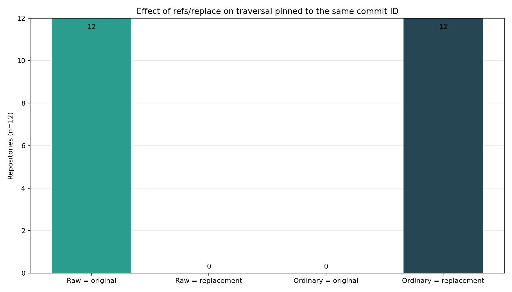

# Verifying Pinned Git Commits Despite `refs/replace` and Checkout-State Divergence

## Abstract

This experiment evaluated a loose-object SHA-1 verifier intended to preserve the binding between a trusted literal commit object ID and the inventory derived from that object, without consulting replacement refs, branch refs, the index, the working tree, or sparse-checkout state. Twelve deterministic fixtures exercised twelve distinct mutation classes involving content, paths, modes, symlinks, gitlinks, pointer-shaped blobs, and attribute-file content. These fixtures are deterministic coverage cases, not independent statistical trials.

For every fixture, the prototype’s raw-object traversal returned the inventory associated with the original commit, ordinary replacement-aware Git traversal returned the replacement commit’s inventory, and ordinary Git traversal with replacements disabled returned the original inventory. This demonstrates the documented effect of replacement objects and provides preliminary engineering evidence that literal loose-object access can isolate a verifier from that mechanism.

The experiment does not establish full parser correctness or production readiness. The original expected inventory was snapshotted with the same raw-object implementation later evaluated, no complete reproducibility artifact was supplied with the report, and no malformed-object or resource-exhaustion tests were run. The implementation is therefore a loose-object SHA-1 prototype, not a production repository verifier.

## Background

Git distinguishes object names from revision interpretation. Revision-processing commands can resolve names through refs and other repository mechanisms [2], while `refs/replace` instructs replacement-aware Git commands to use one object in place of another [1]. Repository layout also includes refs, loose objects, packfiles, alternates, the index, and worktree-specific state [4][6]. A literal reader that directly opens the loose object named by a hexadecimal hash, without invoking revision parsing or consulting replacement refs, is expected not to honor `refs/replace`. Consequently, replacement-object behavior itself is established Git functionality rather than a new experimental discovery.

The engineering question considered here is narrower: what contract should a verifier enforce after an external process has selected a trusted commit digest? The proposed verifier design treats the literal digest as the only repository identifier crossing the trust boundary. It then reads and validates the corresponding object graph without consulting refs or checkout state. The intended security property is object-selection integrity: repository-controlled naming or checkout mechanisms must not substitute a different commit, tree, or inventory after the caller has selected the digest.

The threat model assumes that an attacker may control the repository’s refs, including `refs/replace`; branch and tag names; index; sparse-checkout configuration; working-tree files; and the object bytes presented for verification. The trusted inputs are the literal pinned digest, the verifier implementation and runtime, and the cryptographic assumptions associated with the object format. Recomputing an object hash establishes consistency between the supplied bytes and the trusted digest; it does not authenticate who selected that digest or establish publisher identity.

For the prototype, the intended parsing invariants were:

- accept a literal SHA-1 object ID rather than a revision expression;
- locate the corresponding loose object without resolving refs;
- require a valid `<type> <size><NUL>` object header;
- require the declared size to equal the decompressed payload length;
- recompute `SHA1(header || payload)` and require it to equal the requested object ID;
- require the root object to be a commit with a parseable tree header;
- parse tree entries as mode, raw path bytes, a NUL delimiter, and exactly 20 object-ID bytes;
- recurse only through tree entries and preserve blobs, symlinks, executable modes, and gitlinks as distinct inventory records;
- avoid resolving gitlinks as objects in the containing repository; and
- fail without accepting a partial inventory if an integrity or parsing invariant is violated.

The experiment exercised the positive-path subset of these invariants. It did not test whether the parser safely rejects adversarial encodings, duplicate paths, unsupported modes, excessive nesting, oversized objects, or decompression bombs. Those omissions materially limit any security claim.

Git’s commit representation, repository storage formats, attributes system, and SHA-256 transition impose additional requirements beyond this prototype [5][6][9][10]. In particular, effective attributes depend on precedence and path context [9]. The experiment did not implement that evaluation. Its LFS-related result is therefore limited to syntactic recognition of a narrowly defined pointer-shaped blob; it does not establish that a path is effectively classified as LFS-managed.

The contribution of this report is thus not the discovery that replacement refs affect Git commands. It is a preliminary specification and deterministic positive-path evaluation of a verifier boundary that deliberately excludes revision resolution and checkout state. A hardened implementation of that design would additionally need complete storage support, independent expected-value generation, adversarial parser testing, resource limits, race resistance, and stronger object-format support.

**Bibliography**

[1] Git Project, “git-replace — Create, list, delete refs to replace objects,” *Git Documentation*. https://git-scm.com/docs/git-replace

[2] Git Project, “gitrevisions — Specifying revisions and ranges for Git,” *Git Documentation*. https://git-scm.com/docs/gitrevisions

[4] Git Project, “gitrepository-layout — Git Repository Layout,” *Git Documentation*. https://git-scm.com/docs/gitrepository-layout

[5] Git Project, “gitformat-commit — Git commit format,” *Git Documentation*. https://git-scm.com/docs/gitformat-commit

[6] Git Project, “gitformat-pack — Git pack format,” *Git Documentation*. https://git-scm.com/docs/gitformat-pack

[9] Git Project, “gitattributes — Defining attributes per path,” *Git Documentation*. https://git-scm.com/docs/gitattributes

[10] Git Project, “hash-function-transition — Git Hash Function Transition,” *Git Documentation*. https://git-scm.com/docs/hash-function-transition

## Hypothesis

The experiment used twelve deterministic fixtures, each targeting a distinct verifier property. The fixtures were not twelve independent trials of an uncertain phenomenon, and the resulting 12/12 counts must not be interpreted as a statistical replication rate or an estimate of behavior across repositories.

The tested expectations were:

- for each mutation class, a verifier that opened the loose object named by the literal original SHA-1, validated its identity, and traversed its tree without consulting refs would return the original inventory;
- ordinary replacement-aware Git traversal of that same textual object ID would return the replacement inventory; and
- ordinary Git traversal with replacement processing disabled would return the original inventory.

The twelve mutation classes and the verifier properties they exercised were:

1. **Changed regular-file content:** binding of a path to the original blob object ID.
2. **Path rename:** binding of the complete path set rather than content alone.
3. **Executable-bit removal:** preservation of mode semantics independently of blob content.
4. **Changed symlink target:** preservation of the blob bytes representing a symlink target.
5. **Symlink-to-regular-file conversion:** preservation of entry type and mode, not merely path and bytes.
6. **Changed executable-file content:** simultaneous preservation of executable mode and blob identity.
7. **Changed gitlink object ID:** preservation of mode-`160000` entries without resolving them as local blobs.
8. **Changed pointer-shaped blob metadata:** syntactic extraction of the pointer-shaped blob’s declared SHA-256 OID and size.
9. **Changed `.gitattributes` content:** detection of an ordinary tracked inventory-content change; this did not test effective LFS attribute semantics.
10. **Deleted subtree:** detection of recursive path-set removal.
11. **Added path:** detection of an unexpected inventory entry.
12. **Combined mutation:** consistent handling of simultaneous path, content, executable-mode, and gitlink changes.

The security-relevant question was not whether Git replacement behavior exists—that behavior is documented—but whether the proposed verifier boundary remained tied to the literal object selected outside the repository’s ref and checkout mechanisms.

## Method

The experiment ran with Python 3.12.9, Git 2.50.1 (`git version 2.50.1 (Apple Git-155)`), and matplotlib 3.8.4. The environment fixed `LC_ALL=C`, `TZ=UTC`, `PYTHONHASHSEED=0`, and Python’s random seed to 20250308. Inherited system and user Git configuration was disabled, terminal prompting was disabled, and every Git command was invoked with an argument array rather than through a shell. The execution budget was 1,800 seconds.

Twelve repositories, `case-00` through `case-11`, were initialized explicitly as SHA-1 repositories. Automatic garbage collection was disabled. Objects were constructed with `git hash-object -w --stdin`, `git mktree --missing`, and `git commit-tree`, rather than from the working tree.

Each original root commit contained:

- `README.md`, `visible/case.txt`, and `nested/data.txt` as mode-`100644` blobs with case-specific content;
- `bin/run.sh` as a mode-`100755` executable blob;
- `links/readme-link` as a mode-`120000` symlink whose blob contained `../README.md`;
- `vendor/dependency` as a mode-`160000` gitlink naming `1111111111111111111111111111111111111111`;
- `.gitattributes` containing an LFS-related declaration for `assets/model.bin`; and
- `assets/model.bin` as a mode-`100644` blob containing the three-line pointer-shaped content used by the experiment, with a SHA-256 OID of 64 `a` characters and size 12345.

A distinct replacement commit was then created in each repository. The twelve replacement mutations covered:

1. changed regular-file content;
2. a path rename;
3. removal of an executable bit;
4. a changed symlink target;
5. conversion of a symlink into a regular file;
6. changed executable-file content;
7. a changed gitlink object ID;
8. changed pointer-shaped blob OID and size;
9. changed `.gitattributes` content;
10. deletion of a subtree;
11. addition of a new path; and
12. simultaneous deletion, content, executable-mode, and gitlink changes.

Before replacement refs were installed, a Python raw-object reader authenticated and snapshotted each original commit. Given a literal object ID, it opened `.git/objects/<prefix>/<suffix>`, decompressed the object, checked the `<type> <size><NUL>` header and declared size, and recomputed `SHA1(header || payload)`. It parsed the raw commit’s `tree` header, then parsed binary tree entries of the form `<mode> <path><NUL><20-byte object ID>`. It recursed only into mode-`040000` trees, validated every referenced blob, and treated mode-`160000` entries as gitlinks without attempting to open the named submodule object.

Inventories were sorted by raw path bytes. Each canonical record included the hexadecimal path bytes, six-digit mode, inferred kind, and lowercase object ID. Mode-`100644` blobs were additionally recognized as pointer-shaped blobs only when their complete content exactly matched the experiment’s three-line grammar: the required version line, a lowercase 64-hex-character SHA-256 OID, and a decimal size. Canonical JSON was serialized with sorted keys and compact separators, then fingerprinted with SHA-256.

This recognition was purely syntactic. The verifier did not calculate effective Git attributes, apply attribute precedence, or prove that `assets/model.bin` was LFS-managed. The `.gitattributes` mutation was tested only as a tracked content mutation.

The checkout state was deliberately made divergent before activating the replacement ref:

- sparse checkout projected `/visible/`;
- an index-only file was added with `git update-index --cacheinfo`;
- `visible/case.txt` was modified only in the working tree; and
- an untracked `visible/worktree-only.txt` was created.

The stage-0 index and physical working-tree inventories were recorded. The fixture required the original, replacement, index, and working-tree fingerprints to be pairwise distinct, and the sparse projected path set to differ from each complete inventory. These checks established that distinct repository views had been constructed. Neither the raw verifier nor either decisive Git traversal used the index, working tree, or sparse projection as input, so this separation does not by itself demonstrate resistance to a realistic path in which a verifier accidentally consumes checkout state.

Only after constructing these states did the experiment run `git replace O_k R_k`. Three traversals were then compared:

1. the tested raw verifier, given the repository path and literal pinned original commit ID;
2. ordinary `git ls-tree -r -z --full-tree O_k`, with replacement behavior enabled; and
3. the same ordinary traversal with `GIT_NO_REPLACE_OBJECTS=1`.

Ordinary traversal records were converted to the same canonical representation. Referenced blobs were read using `git cat-file` to attach the same syntactically extracted pointer fields.

The no-replacement Git control supplied an implementation-independent traversal of the original object graph after replacement installation. It reduced the likelihood that the observed separation was caused solely by the raw reader’s tree traversal. It was not, however, a complete independent oracle for every expected field. The expected original snapshot and the tested raw traversal shared the same raw-object implementation, and the report did not preserve explicit per-case fixture manifests from which every expected path, mode, object ID, kind, and pointer field could be independently derived. Nor did the supplied record include a pre-installation Git traversal for every field. Parser or canonicalization defects shared by the snapshot and tested traversal could therefore have gone undetected.

A complete reproducibility artifact should contain, at minimum:

- the exact verifier source;
- the fixture generator source;
- explicit machine-readable original and replacement manifests for every case;
- the complete argument-array command transcript;
- captured environment variables and Git configuration;
- tool and platform version output;
- raw stdout, stderr, and exit status for every command;
- raw per-case verifier and Git traversal outputs;
- canonical expected and observed inventories;
- the derivation of every aggregate validation count;
- the figure-generation source and input data; and
- cryptographic hashes of all source files, manifests, repositories, outputs, inventories, and generated figures.

That artifact was not supplied with the original report, and it cannot be reconstructed from the narrative without inventing missing commands, manifests, outputs, or hashes. The commands named above are therefore methodological descriptions, not a complete executable transcript.

No adversarial malformed-object or resource-limit suite was executed. In particular, the experiment did not test malformed object headers, invalid or inconsistent sizes, invalid commit headers, truncated tree entries, invalid path delimiters, duplicate paths, unsupported modes, excessive tree depth, oversized blobs, trailing compressed data, extreme compression ratios, or decompression bombs.

## Results

All twelve deterministic fixtures met the stated fixture-divergence checks. The decisive inventory comparisons were:

| Comparison | Matching deterministic fixtures |
|---|---:|
| Raw verifier equals snapshotted original | 12/12 |
| Raw verifier equals adversarial replacement | 0/12 |
| Ordinary traversal equals snapshotted original | 0/12 |
| Ordinary traversal equals adversarial replacement | 12/12 |
| Ordinary traversal with replacements disabled equals original | 12/12 |
| Raw commit tree ID equals snapshotted original tree ID | 12/12 |

The table and figure summarize deterministic coverage of twelve mutation classes. They do not represent twelve independent replications or support a statistical generalization. The figure contains the same aggregate information as the table; moreover, the referenced workspace-relative image was not included in the supplied report package and is therefore not independently inspectable here.

For each class, the raw verifier returned the inventory recorded for the original commit and did not return the replacement inventory. Ordinary replacement-aware traversal showed the inverse outcome. Passing the same textual SHA-1 to the two mechanisms therefore produced different traversals when a replacement ref was active, as expected from Git’s documented replacement-object semantics.

The `GIT_NO_REPLACE_OBJECTS=1` control matched the recorded original inventory for every fixture. This cross-implementation control supports the narrower conclusion that the difference between the two Git traversals was caused by replacement processing. It also provides some corroboration of the raw traversal’s positive-path output. It does not eliminate the circularity in using the raw reader to create the original snapshot, nor does it establish an independent oracle for every canonicalized field.

The original run summary reported 635 object validations, zero integrity failures, zero parsing failures, and zero command failures. Because the verifier source, raw per-case outputs, command transcript, validation-count derivation, expected inventories, and artifact hashes were not supplied, those aggregate counts cannot be independently audited from this report. They should be treated as reported execution outcomes rather than reproducible evidence.

The experiment made no defensible performance measurement. The original single-run timing values lacked a hardware description, warm-up policy, repetition count, variance, cache-state control, and uncertainty estimate, so they have been removed. No claim about throughput, latency, scalability, or comparative performance is supported.

The deterministic positive-path result supports only the following limited conclusion: for the tested well-formed, tool-generated, loose-object SHA-1 fixtures, a reader that opened and hash-checked the literal loose objects without consulting refs remained isolated from commit replacement refs, while ordinary replacement-aware Git traversal did not. This result demonstrates the prototype’s intended selection boundary across the twelve mutation classes; it does not validate the implementation as a hardened repository parser.

## Limitations

- **Incomplete reproducibility artifact:** The supplied material does not contain the verifier source, fixture generator, exact command transcript, complete environment capture, raw per-case outputs, machine-readable expected inventories, validation-count derivation, figure source, or hashes of generated artifacts. The exact counts and zero-failure claims cannot be independently audited. A complete artifact is required before the experiment can be considered reproducible.

- **Circular original snapshot:** The original inventory was snapshotted with the same raw-object implementation used for the tested traversal. The no-replacement Git control is useful cross-implementation evidence, but there was no independently generated per-field oracle based on preserved fixture manifests. Shared parsing or canonicalization defects may therefore remain undetected.

- **Deterministic class coverage, not statistical replication:** The twelve repositories are closely related fixtures using the same replacement mechanism. The 12/12 result means that all twelve specified mutation classes produced the expected deterministic comparison; it does not estimate reliability across a repository population.

- **Known Git behavior rather than a new replacement-ref discovery:** Git replacement-object behavior is documented, and a literal loose-object reader that does not inspect refs is expected not to honor `refs/replace`. The report’s limited engineering contribution is the proposed verifier boundary, threat model, positive-path parser contract, and mutation-class test design—not the replacement behavior itself.

- **Loose-object SHA-1 prototype only:** The implementation directly opened loose SHA-1 objects. It did not support or test packfiles, pack indexes, multi-pack indexes, cruft packs, alternates, partial clones, promisor objects, or SHA-256 repositories. It also did not perform general repository discovery. It must not be treated as a production repository verifier until these storage and discovery mechanisms are handled safely.

- **No adversarial parser tests:** Only well-formed, Git-generated objects were exercised. There were no negative tests for malformed headers, missing NUL delimiters, nondecimal or inconsistent sizes, invalid object types, malformed or duplicate commit headers, absent or invalid tree headers, truncated tree entries, missing object-ID bytes, invalid path encodings, duplicate names, unsupported modes, unsorted entries, or trailing garbage.

- **No resource limits:** The prototype was not evaluated against excessive tree depth, oversized blobs, extreme object counts, memory exhaustion, CPU exhaustion, pathological zlib streams, or decompression bombs. A production verifier would need explicit compressed-size, decompressed-size, object-count, depth, path-length, total-byte, and time limits, with deterministic fail-closed behavior.

- **No race resistance:** The repository remained stable during verification. Concurrent object replacement, loose-object rewriting, deletion, repacking, alternates changes, or filesystem substitution could produce inconsistent reads. Secure implementation would require a defined snapshot strategy and protection against time-of-check/time-of-use races.

- **Checkout-state divergence was not a decisive input:** The index, working tree, and sparse-checkout state were made pairwise distinct from the commit inventories, but neither decisive traversal consumed those states. The result demonstrates fixture construction, not resistance to an implementation path that accidentally verifies the index or worktree.

- **Syntactic pointer recognition only:** The verifier recognized only complete blobs matching the experiment’s three-line pointer grammar. It did not evaluate `.gitattributes`, nested attribute files, precedence, negative patterns, or path-specific effective attributes. The `.gitattributes` mutation was detected as ordinary tracked content, not as a verified change in LFS semantics.

- **No LFS payload verification:** The experiment did not contact an LFS server, authenticate or download an LFS object, or recompute the payload’s declared SHA-256. A syntactically valid pointer-shaped blob does not prove that the referenced payload exists or is authentic.

- **Weak authentication model:** Recomputing SHA-1 establishes consistency with the trusted digest under the hash function’s assumptions. It does not authenticate the party that selected the digest or prove publisher authorization. Signed commits, signed or annotated tags, certificate chains, transparency logs, and authenticated distribution of the pinned digest were not tested.

- **SHA-1 security limitations:** The experiment used SHA-1 and did not analyze collision attacks or chosen-prefix collision implications. Hash recomputation alone cannot provide stronger security than the underlying object format. A production design should support Git’s SHA-256 object format and explicitly define how SHA-1 repositories are accepted, rejected, or isolated by policy.

- **Tags were not exercised:** The experiment tested root commit objects only. It did not parse or peel annotated tags, verify tag signatures, or test replacement and revision-resolution behavior involving tags.

- **Restricted commit graph:** Original and replacement commits had no parents. Merge commits, malformed parent headers, parent traversal, history verification, graft-like effects, and replacements of trees or blobs rather than commits were outside the experiment.

- **Submodules were represented but not resolved:** Mode-`160000` entries and gitlink IDs were preserved, but the referenced repositories and commits were not fetched or authenticated. The inventory therefore attested only to the superproject’s recorded gitlink value.

- **Limited platform coverage:** The run used one Git build on an Apple platform and one Python version. Filesystem behavior, symlink support, executable-bit behavior, Unicode handling, path restrictions, and object-storage behavior may differ across platforms.

- **No performance evidence:** The original timing values came from an inadequately specified run. Without repeated measurements, hardware and storage details, warm-up and cache policies, variance, and workload scaling, no meaningful performance conclusion can be drawn.

- **Missing figure artifact:** The file referenced as `workspace/figures/refs_replace_traversal_counts.png` was not included with the supplied report. Because the table already presents the aggregate values, the missing figure does not alter the stated comparisons, but it is another reproducibility defect.

## Follow-up questions

- Can a complete reproducibility artifact be produced containing the verifier and generator source, explicit fixture manifests, exact argument-array transcript, environment capture, raw outputs, canonical inventories, validation-count derivation, generated figure, and hashes of every artifact?

- Can expected records be generated independently from declarative fixture manifests and compared against both Git traversal before replacement installation and Git traversal with replacements disabled afterward, without using the tested parser to construct the oracle?

- Does a hardened parser reject malformed object headers and sizes, malformed commit headers, truncated or invalid tree entries, duplicate paths, unsupported modes, pathological nesting, oversized blobs, and decompression bombs under explicit resource limits?

- Can the verifier correctly process both SHA-1 and SHA-256 repositories when commits, trees, and blobs reside in packfiles, multi-pack indexes, cruft packs, alternates, or promisor storage, without becoming replacement-ref aware?

- Can repository discovery and object access be implemented without trusting attacker-controlled configuration, alternates, environment variables, or worktree metadata?

- Under concurrent adversarial mutation—such as replacement-ref changes, repacking, loose-object deletion, object substitution, or alternates changes—can the verifier return either one consistent authenticated inventory or a deterministic failure rather than a mixed snapshot?

- When given an authenticated annotated or signed tag, can the verifier parse and peel the literal raw tag object, verify the applicable signature, and reject ref retargeting, replacement processing, and ambiguous revision expressions?

- Can pointer recognition be extended to effective `.gitattributes` evaluation with correct precedence, followed by authenticated retrieval and SHA-256 validation of the referenced LFS payload?

- Can index, worktree, and sparse-checkout confusion be tested through realistic negative controls in which deliberately unsafe verifier variants consume each state, while the hardened verifier demonstrably excludes them?

- What acceptance policy should a production verifier apply to SHA-1 repositories in light of collision risk, and how should that policy interact with signatures or other authentication mechanisms that bind a publisher to the selected object ID?
