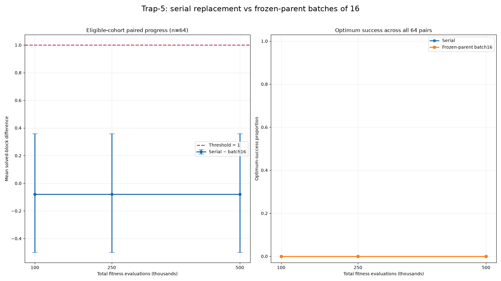

# No Evidence of a One-Block Serial-Update Advantage for Batch Size 16 in One 100-Bit Trap-5 Configuration

## Abstract

This narrowly scoped reproducibility experiment compared immediate serial population updates with frozen-parent batches of 16 for one concatenated deceptive trap-5 configuration: a 100-bit genome, population size 256, size-2 tournaments, block-boundary crossover, exactly one bit flip per offspring, and elitist target-slot replacement. Sixty-four paired replicates shared their initial populations, tie priorities, and complete operator schedules and were measured at 100,000, 250,000, and 500,000 evaluations.

The primary estimand was the unconditional population mean of the paired serial-minus-batch difference in fully solved blocks under the specified seed-generating procedure. The observed mean difference was \(-0.078125\) blocks at every checkpoint. The corresponding 90% paired-bootstrap confidence interval was \([-0.5, 0.359375]\); equivalently, the upper endpoint provides a one-sided 95% percentile-bootstrap upper confidence bound of \(0.359375\). Because this upper bound is below one block, a population mean serial advantage of at least one solved block is unsupported and excluded at the stated bootstrap confidence level for this exact configuration. This does not establish equivalence near zero.

Neither algorithm reached the optimum in any of the 64 runs. For each algorithm, the exact two-sided 95% binomial confidence interval for its marginal success probability was approximately \([0,0.0560]\). Thus, the experiment was inconclusive about small or rare success-rate differences. The archived summary available for this revision does not contain the claimed executable source, replicate-level checkpoint records, absolute outcome summaries, or transition diagnostics. Consequently, the repeated checkpoint aggregates cannot be independently verified or attributed to population absorption from the report alone.

## Background

Genetic algorithms can vary substantially in their selection, variation, replacement, and population-update structures [1]. These implementation choices may affect evolutionary dynamics even when algorithms use the same fitness function and nominal operators. In particular, parallel or batched genetic algorithms can evaluate multiple offspring using a frozen population state, whereas serial implementations can make each accepted offspring immediately available for subsequent parent selection. Parallel genetic-algorithm research demonstrates the practical relevance of such execution structures [4], while broader evolutionary-optimization work emphasizes that altered evolutionary dynamics can influence search behavior [2].

A direct comparison of serial and batched updates can be confounded by differences in initial populations or random operator draws. The present experiment therefore used paired runs with identical initialization and complete shared operator schedules. The only intended algorithmic difference was whether parent selection and child construction observed population replacements made during preceding events within a 16-offspring batch.

The benchmark was a concatenated deceptive trap-5 problem. Each five-bit block rewards the all-ones configuration with a score of 5 but otherwise assigns a score of \(4-u\), where \(u\) is the number of one-bits. Thus, movement toward the globally optimal all-ones block can initially reduce fitness.

This work should be interpreted as a narrowly scoped computational reproducibility note. It examines only one problem size, population size, batch size, replacement mechanism, crossover scheme, and mutation scheme. It does not test whether larger evaluation budgets generally reveal—or fail to reveal—a serial-update advantage across genetic algorithms or deceptive optimization problems.

## Hypothesis

For each evaluation budget \(B \in \{100{,}000, 250{,}000, 500{,}000\}\), let

\[
d_{r,B}
=
\text{solved blocks}_{\text{serial},r,B}
-
\text{solved blocks}_{\text{batch16},r,B}
\]

denote the paired difference for replicate \(r\). The primary estimand is

\[
\mu_B = E[d_{r,B}],
\]

where the expectation is over paired initializations and shared schedules generated by the specified pseudorandom procedure. The primary analysis includes all 64 prospectively generated pairs, without conditioning eligibility on algorithm outcomes.

The threshold question is whether the population mean serial advantage is at least one fully solved block:

\[
H_{0,B}: \mu_B \ge 1
\qquad\text{versus}\qquad
H_{1,B}: \mu_B < 1.
\]

A sample mean below one is not, by itself, sufficient to reject or “refute” \(H_{0,B}\). Threshold inference instead uses the upper confidence bound for \(\mu_B\). The reported 90% two-sided percentile-bootstrap interval has its upper endpoint at the 95th bootstrap percentile, which is also used as a one-sided 95% percentile-bootstrap upper confidence bound. An effect of at least one block is considered unsupported at a checkpoint only if that upper bound is below \(1.000\).

The originally specified fixed non-success cohort—pairs in which neither algorithm had reached the optimum by 100,000 evaluations—is retained as a secondary estimand. Such eligibility is based on outcomes from both algorithms and would define a selected population if any early successes occurred. In the observed experiment, all 64 pairs qualified, so the secondary cohort and unconditional primary sample are numerically identical. That coincidence does not make post-outcome eligibility an appropriate general primary estimand.

No equivalence margin around zero was prospectively specified. Therefore, the analysis can exclude a mean advantage of at least one block at the stated confidence level, but it cannot establish that the algorithms are equivalent or that their population mean difference is exactly zero.

## Method

The reported computational environment used Python 3.11.13 with NumPy 2.4.6, Numba 0.66.0, SciPy 1.17.1, pandas 3.0.3, and Matplotlib 3.11.1. The evolutionary loops and trap-score operations were reported as compiled with `numba.njit` after one untimed warm-up compilation.

These package versions do not constitute a complete reproducible environment. The archived report does not identify the operating system, processor architecture, package source, dependency lock file, environment file, compiler or LLVM details, or Numba configuration. More importantly, the executable source and generated CSV and JSON files claimed by the original report were not included or linked in the material available for this revision. Their contents therefore cannot be reconstructed without rerunning a verified implementation, and this revision does not fabricate them.

### Benchmark and representation

The synthetic genome consisted of 20 nonoverlapping five-bit blocks, for a total length of 100 bits. Blocks were represented by integers from 0 through 31. For a block containing \(u\) one-bits, its score was

\[
f_{\text{block}}(u)=
\begin{cases}
5, & u=5,\\
4-u, & u<5.
\end{cases}
\]

Individual fitness was the sum across all 20 blocks. The unique global optimum was therefore the 100-bit all-ones genome with fitness 100. A fully solved block was a block with integer value 31.

### Paired replicates and initialization

There were 64 prospectively fixed paired replicates, indexed from 0 through 63, with population size \(N=256\). For replicate \(r\), the initial population was generated by drawing each bit independently from Bernoulli(0.5) using

```text
numpy.random.Generator(numpy.random.PCG64(10000 + r))
```

The same initialized population was supplied to both algorithms. Each initial individual also received an independent unsigned 64-bit tie priority from the same generator. A larger tie priority won equal-fitness comparisons.

### Shared operator schedules

Each replicate used one shared schedule of 499,744 offspring events, corresponding to 500,000 total evaluations after counting the 256 initialized individuals. The schedule was generated using

```text
numpy.random.Generator(numpy.random.PCG64(20000 + r))
```

For each event, random values were drawn in the following fixed order:

1. Four population indices for two size-2 parent tournaments.
2. One crossover boundary, uniformly selected from block boundaries 1 through 19.
3. One mutation block, uniformly selected from 0 through 19.
4. One mutation bit, uniformly selected from 0 through 4.
5. One replacement-target index, uniformly selected from 0 through 255.
6. One unsigned 64-bit offspring tie priority.

The identical schedule arrays were given to both members of the pair. Schedules were generated and discarded one replicate at a time to control memory use. No schedule rejection redraws were reported.

The prose description does not fully specify the exact NumPy calls, array shapes, integer endpoint conventions, or whether draws were scalar, vectorized by field, or vectorized by event. Those details can change a seeded pseudorandom stream. Accordingly, the description is sufficient to define the intended experiment conceptually but is not a substitute for the original executable source.

### Selection, variation, and replacement

Each parent was selected by a size-2 tournament. The higher-fitness individual won, with a larger tie priority breaking fitness ties. A child copied blocks before the scheduled boundary from parent 1 and blocks at or after the boundary from parent 2. The scheduled bit in the scheduled mutation block was then flipped.

Both algorithms used target-slot replacement. At the scheduled target index, the child replaced the incumbent if it had higher fitness or if it had equal fitness and a higher tie priority. Otherwise, the child was discarded.

The **serial algorithm** selected parents from the current population and applied replacement immediately after every offspring evaluation.

The **frozen-parent batch-size-16 algorithm** divided events into consecutive groups of exactly 16. At the beginning of each group, it froze a population snapshot. All parent selections and child constructions for those 16 events used that snapshot. After all children had been constructed and evaluated, their target-slot replacements were applied sequentially, in event order, to the live population. Thus, the intended difference between algorithms was limited to whether parent selection and child construction could observe replacements made within the current 16-event group.

### Checkpoints and recorded variables

Measurements were taken at exactly 100,000, 250,000, and 500,000 total fitness evaluations. All checkpoints aligned with completed batches because the number of offspring evaluations before each checkpoint—99,744, 249,744, and 499,744—was divisible by 16.

At each checkpoint, the population’s best individual was identified by fitness and then tie priority. A complete audit record should contain, for every replicate and checkpoint:

- replicate index and checkpoint;
- primary-analysis inclusion;
- fixed-cohort eligibility;
- serial best absolute fitness;
- batch-16 best absolute fitness;
- serial best solved-block count;
- batch-16 best solved-block count;
- serial optimum-success indicator;
- batch-16 optimum-success indicator;
- paired solved-block difference;
- paired best-fitness difference;
- whether each population changed since the preceding checkpoint;
- accepted replacement counts for each algorithm in each checkpoint interval; and
- a defined diagnostic for an absorbing or nearly absorbing state.

The material available for this revision contains only the aggregate results quoted in the original report. It does not contain the complete replicate-level records, accepted-replacement counters, population hashes, or state-transition traces. Consequently, those records cannot be reproduced here without new computation.

### Primary threshold inference

All 64 pairs were used in the unconditional primary analysis. Uncertainty in the mean paired difference was evaluated using the reported 20,000 paired bootstrap resamples with PCG64 seed 900001.

The 5th and 95th percentiles formed a two-sided 90% percentile-bootstrap confidence interval. For the threshold test, the 95th percentile was interpreted as a one-sided 95% percentile-bootstrap upper confidence bound for \(\mu_B\). A mean advantage of at least one solved block was excluded at the stated confidence level when this upper bound was below one.

This is an approximate bootstrap inference over the specified finite seed-generating procedure. It is not proof of algorithmic equivalence and does not support conclusions outside the tested configuration.

### Secondary fixed-cohort analysis

The original eligibility rule included a pair if neither algorithm had reached fitness 100 by 100,000 evaluations. This cohort was defined once and retained at all later budgets.

Because all 64 pairs met that rule, the secondary fixed-cohort estimates equal the unconditional primary estimates in this experiment. If early successes had occurred, however, conditioning on outcomes from both algorithms would have changed the estimand and could have introduced selection effects.

### Success-probability analysis

The success analysis used all 64 pairs. At each checkpoint, serial and batch optimum-success proportions were compared using the reported one-sided exact paired McNemar/binomial calculation. If \(n_{10}\) was the number of serial-only successes and \(n_{01}\) the number of batch-only successes, the raw p-value was

\[
P\!\left[X\ge n_{10}\right],
\qquad
X\sim\operatorname{Binomial}(n_{10}+n_{01},0.5).
\]

The p-value was set to 1 when there were no discordant pairs, and Holm correction was applied jointly across the three budgets.

For each algorithm separately, an exact two-sided 95% Clopper–Pearson binomial confidence interval was added for the marginal success probability. With zero successes in 64 trials, this interval is approximately

\[
[0,0.0560].
\]

The paired McNemar result and the marginal binomial intervals answer different questions. No discordant outcomes imply that the observed paired data contain no success contrast, but they do not demonstrate equal success probabilities or equivalence.

### Implementation-validation requirements

At the protocol level, frozen-parent batch size 1 reduces algebraically to the serial update rule: each snapshot contains the current population, only one child is constructed, and that child’s replacement is applied before the next event. A conforming implementation should therefore produce exactly identical event-by-event states for serial and batch size 1 under a shared initialization and schedule.

Likewise, a deterministic implementation given identical initialization and schedule arrays should produce identical duplicate serial traces event by event. At minimum, an implementation-validation suite should assert:

1. serial and batch size 1 have identical selected parents, children, replacement decisions, and post-event population states;
2. duplicate serial runs with identical inputs agree event by event;
3. independently recomputed trap fitness agrees with stored incremental or compiled fitness values;
4. the all-ones genome has fitness 100 and 20 solved blocks;
5. known five-bit block inputs agree with the stated trap-score formula; and
6. checkpoint evaluation counts and batch boundaries are exact.

No source code, trace hashes, test logs, or pass/fail outputs were included in the archived material. The protocol-level identities above therefore cannot be presented as completed empirical implementation tests. Independent verification requires the original source or a new, fully audited rerun.

The original report stated that the timed 64-pair experiment completed in 8.8213 seconds, or 0.1470 minutes. That timing is retained as a reported value, but it is not independently interpretable without hardware, operating-system, compilation, source-code, and environment metadata.

## Results

All 64 pairs were included in the unconditional primary analysis. All 64 also qualified for the secondary fixed non-success cohort because neither algorithm reached the optimum by 100,000 evaluations. The primary and secondary numerical estimates are therefore identical in this particular dataset.

### Solved-block threshold inference

| Evaluations | All pairs | Mean solved-block difference, serial − batch16 | 90% bootstrap confidence interval | One-sided 95% upper bound | Threshold conclusion |
|---:|---:|---:|---:|---:|:---|
| 100,000 | 64 | -0.078125 | [-0.5, 0.359375] | 0.359375 | Mean advantage of at least 1 block excluded at stated confidence level |
| 250,000 | 64 | -0.078125 | [-0.5, 0.359375] | 0.359375 | Mean advantage of at least 1 block excluded at stated confidence level |
| 500,000 | 64 | -0.078125 | [-0.5, 0.359375] | 0.359375 | Mean advantage of at least 1 block excluded at stated confidence level |

At 100,000 evaluations, the observed mean serial-minus-batch difference was \(-0.078125\) solved blocks. The sample mean alone is not a valid basis for rejecting a population-level threshold hypothesis. The relevant result is that the one-sided 95% percentile-bootstrap upper confidence bound was \(0.359375\), below the one-block threshold. Thus, for the specified seed-generating procedure and exact algorithm configuration, the data do not support a population mean serial advantage of at least one fully solved block and exclude such an advantage at the stated bootstrap confidence level.

The reported aggregate estimate and confidence interval were exactly the same at 250,000 and 500,000 evaluations. The same threshold conclusion therefore applies at those checkpoints. These intervals do not establish equivalence around zero: they include both negative effects and positive serial effects smaller than one block.

The reported eligible-cohort mean best-fitness difference was also \(-0.078125\) at all three checkpoints.



The left panel of the figure reports the same mean paired solved-block difference and bootstrap interval at each budget. The right panel reports zero observed optimum-success proportions for both algorithms. Because the underlying replicate-level data were not included, the figure and aggregate table cannot be independently audited from the report alone.

### Absolute outcomes and paired-difference distributions

The original report supplied paired means but did not supply the absolute serial and batch distributions needed to interpret the practical state of the search. The following required summaries are therefore unavailable from the archived aggregate record:

| Checkpoint | Serial absolute mean/SD | Batch16 absolute mean/SD | Serial median/range | Batch16 median/range | Pairs favoring serial | Ties | Pairs favoring batch16 |
|---:|:---|:---|:---|:---|:---|:---|:---|
| 100,000 | Not reported | Not reported | Not reported | Not reported | Not reported | Not reported | Not reported |
| 250,000 | Not reported | Not reported | Not reported | Not reported | Not reported | Not reported | Not reported |
| 500,000 | Not reported | Not reported | Not reported | Not reported | Not reported | Not reported | Not reported |

The missing values include absolute best fitness, absolute solved-block counts, standard deviations or robust spread measures, medians, ranges, and counts of positive, zero, and negative paired differences. They cannot be recovered uniquely from the reported mean differences and bootstrap intervals. Supplying numerical values here would require the replicate-level checkpoint data or a new rerun.

### Repeated checkpoint aggregates and search transitions

The mean solved-block difference, bootstrap interval, and mean best-fitness difference were reported as exactly identical at all three checkpoints. This equality is possible if the relevant best outcomes stopped changing by 100,000 evaluations, but aggregate equality does not prove that explanation. Different replicate-level changes can cancel while leaving the same mean and even the same empirical difference distribution.

The original experiment did not report the diagnostics needed to verify stagnation or absorption:

| Diagnostic | 100,000–250,000 | 250,000–500,000 |
|:---|:---|:---|
| Serial populations that changed | Not recorded in available report | Not recorded in available report |
| Batch16 populations that changed | Not recorded in available report | Not recorded in available report |
| Serial accepted replacements | Not recorded in available report | Not recorded in available report |
| Batch16 accepted replacements | Not recorded in available report | Not recorded in available report |
| Serial populations entering an absorbing state | Not assessed | Not assessed |
| Batch16 populations entering an absorbing state | Not assessed | Not assessed |

Accordingly, this revision cannot verify why every aggregate statistic is identical across 100,000, 250,000, and 500,000 evaluations. In particular, it cannot determine whether:

- every best individual remained unchanged;
- populations continued to change without improving their best individuals;
- accepted replacements occurred but preserved checkpoint summaries;
- paired differences changed within replicates but retained the same aggregate distribution; or
- populations entered genuinely absorbing or merely slow-moving states.

Given block-boundary crossover, exactly one flipped bit, and elitist target replacement, early trapping in local optima is a plausible mechanism, but it remains an untested explanation rather than a result.

### Optimum successes

Neither algorithm reached the global optimum in any of the 64 runs at any checkpoint:

| Evaluations | Serial successes | Batch16 successes | Serial proportion | Batch16 proportion | Exact 95% CI for each proportion | Observed difference |
|---:|---:|---:|---:|---:|---:|---:|
| 100,000 | 0/64 | 0/64 | 0.0 | 0.0 | [0, 0.0560] | 0.0 |
| 250,000 | 0/64 | 0/64 | 0.0 | 0.0 | [0, 0.0560] | 0.0 |
| 500,000 | 0/64 | 0/64 | 0.0 | 0.0 | [0, 0.0560] | 0.0 |

There were no discordant success pairs at any checkpoint: \(n_{10}=0\) serial-only successes and \(n_{01}=0\) batch-only successes. Accordingly, each reported raw one-sided McNemar/binomial p-value was 1.0, and each Holm-adjusted p-value was also 1.0.

A p-value of 1 in this setting is not evidence that the two success probabilities are equal. It results from the absence of observed discordant outcomes. Likewise, observing zero successes does not imply a zero population success probability. The exact marginal intervals show that per-run success probabilities up to approximately 5.6% remain compatible with each algorithm’s data at the two-sided 95% confidence level. The experiment is therefore inconclusive about small or rare success-rate differences.

### Scoped conclusion

For this specific 100-bit concatenated trap-5 configuration, population size 256, frozen-parent batch size 16, and stated selection, variation, and replacement scheme, the one-sided 95% bootstrap upper confidence bound for the population mean serial-minus-batch solved-block difference was below one block at all three checkpoints. A mean serial advantage of at least one solved block is therefore unsupported and excluded at the stated confidence level for the tested seed-generating procedure.

This result does not show that serial and batch-16 updates are equivalent, does not exclude smaller serial advantages, and does not establish that larger evaluation budgets generally cannot reveal serial-update advantages. The zero-success observations are also inconclusive about small or rare differences in optimum-reaching probability. Because replicate-level records, transition diagnostics, executable source, and validation outputs were not available, the exact repetition of the checkpoint aggregates remains unverified.

## Limitations

- **Missing executable source:** The original report claimed that outputs were saved locally, but no executable source was included or linked in the material available for revision. Reconstructing code from prose could alter pseudorandom draw order, integer endpoint conventions, batching details, or checkpoint handling and would not constitute the original implementation.

- **Missing replicate-level checkpoint data:** The complete CSV or equivalent records were unavailable. Eligibility, absolute fitness, solved-block counts, success indicators, and paired differences cannot therefore be audited at the replicate level. The missing values cannot be recovered uniquely from the aggregate statistics.

- **Missing absolute summaries:** Absolute serial and batch means, standard deviations or robust spread measures, medians, ranges, and counts of pairs favoring serial, tying, and favoring batch were not reported. These quantities require the original replicate-level data or a new verified execution.

- **Unexplained repetition across checkpoints:** The reported mean differences, confidence intervals, and mean best-fitness differences are identical at 100,000, 250,000, and 500,000 evaluations. No population hashes, accepted-replacement counts, transition counts, or best-individual traces were retained in the report, so this repetition cannot be attributed confidently to stagnation or absorption.

- **Absorption was not diagnosed:** The benchmark and operators may encourage early trapping because crossover does not split blocks, mutation flips exactly one bit, and replacement is elitist at a scheduled target. However, the experiment did not define or test absorbing states, measure viable improving transitions, or distinguish complete absorption from continued neutral turnover or very slow search.

- **Implementation validation was not documented:** No test logs establish that batch size 1 exactly reproduced serial execution, that duplicate serial runs agreed event by event, or that an independent fitness calculation matched the compiled implementation. These properties follow from the intended protocol but still require executable implementation tests.

- **Incomplete environment metadata:** Package versions alone are insufficient for exact reproduction. The report lacks an operating-system description, architecture, dependency lock or environment file, package-build provenance, Numba/LLVM details, and hardware metadata. The reported runtime is consequently of limited scientific use.

- **Approximate bootstrap inference:** The threshold conclusion uses a one-sided 95% percentile-bootstrap upper bound derived from 20,000 paired resamples. This is an approximate inferential procedure and applies to the specified paired seed-generating design. It is not a proof about all possible runs or implementations.

- **No equivalence conclusion:** The confidence interval excludes a mean serial advantage of one block or more but includes zero and smaller positive effects. No equivalence margin around zero was specified, so the experiment does not demonstrate practical equivalence.

- **Finite paired sample:** The experiment used 64 paired replicates. Pairing controlled variation associated with shared initialization and operator schedules, but the sample still limits precision, especially for small effects and rare optimum-reaching events.

- **No observed successes:** Both algorithms had zero optimum successes through 500,000 evaluations. The exact two-sided 95% interval for each marginal success probability extends to approximately 5.6%, so nonzero and potentially practically relevant rare-success probabilities remain compatible with the observations.

- **No evidence of success-probability equality:** McNemar p-values of 1 arose because no discordant successes were observed. They do not establish equal success probabilities or statistical equivalence.

- **Outcome-based secondary cohort:** The original eligibility rule conditioned on outcomes from both algorithms at 100,000 evaluations. Although all 64 pairs qualified and the selected and unconditional analyses coincide numerically here, the rule would define a selected estimand if any early success occurred. The unconditional all-pair comparison is therefore primary in this revision.

- **Single benchmark configuration:** The findings apply only to a 20-block concatenated trap-5 problem with a 100-bit genome and population size 256. They do not automatically generalize to other trap sizes, numbers of blocks, population sizes, or fitness landscapes.

- **Single batch size:** Only frozen-parent batch size 16 was compared with serial updating. The experiment provides no batch-size response curve and cannot characterize whether timing effects grow monotonically, nonmonotonically, or at all with batch size.

- **Operator-specific scope:** The experiment used block-boundary crossover, exactly one scheduled bit flip per child, size-2 tournaments, deterministic tie priorities, and elitist target-slot replacement. Other mutation rates, crossover schemes, selection pressures, or replacement policies could produce different dynamics.

- **Fixed seed families:** Initialization seeds followed \(10000+r\), and schedule seeds followed \(20000+r\). These choices were prospective and reproducible in principle, but they represent one finite collection of pseudorandom streams.

- **Shared schedules control only specified randomness:** Shared initialization and event schedules provide a strong paired control. Once population states diverge, however, identical tournament indices and replacement targets can refer to different genomes and induce different effective evolutionary events.

- **No mechanistic or broad algorithmic analysis:** This was one narrow computational comparison, without a systematic batch-size study, multiple population sizes, alternative mutation schemes, broader benchmark suite, or theoretical prediction. It should not be read as a general conclusion about serial and parallel genetic algorithms.

- **Budgets beyond 500,000 were not tested:** The reported runtime limit was not binding, but longer runs were outside the prospective design. The experiment cannot determine what would happen at larger budgets, particularly without first diagnosing whether the observed populations remained capable of effective transitions.

## Follow-up questions

- Can the original executable source, locked environment specification, replicate-level checkpoint CSV, JSON summary, and figure-generation script be recovered and archived so that the reported aggregates can be independently audited?

- Do batch size 1 and serial execution produce identical selected parents, offspring, replacement decisions, and population hashes after every event under the shared schedule?

- Do two serial executions with identical inputs produce identical event-by-event traces, and does an independent fitness implementation agree with every stored individual fitness?

- How many serial and batch-16 populations changed after 100,000 evaluations, and how many accepted replacements occurred in the intervals from 100,000 to 250,000 and from 250,000 to 500,000 evaluations?

- Did populations enter formally defined absorbing states, or did they continue to undergo accepted replacements without improving their best fitness or solved-block count?

- Does either algorithm achieve a nonzero optimum-success rate when prospectively extended to 1,000,000, 2,000,000, and 5,000,000 evaluations, after first confirming that longer runs contain effective search transitions?

- How does the unconditional paired solved-block difference change across prospectively specified frozen-parent batch sizes of 1, 2, 4, 8, 16, 32, and 64 under shared initialization and operator schedules?

- Does increasing the population size from 256 to 512 or 1,024 produce measurable optimum-success rates by 500,000 evaluations, and does update timing then affect those rates?

- Is the apparent lack of checkpoint progress specific to the exactly-one-bit-per-child mutation schedule, or do prospectively specified independent bit-mutation rates produce different transition and success behavior on the same trap-5 benchmark?
