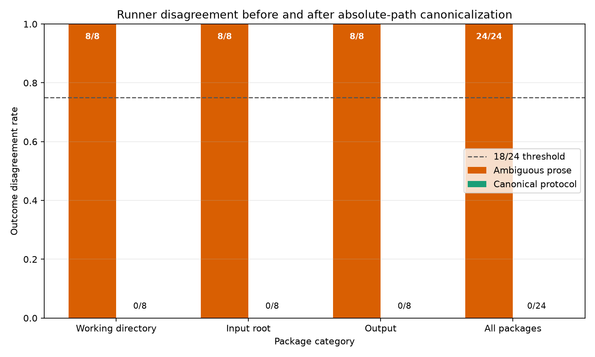

# Explicit Path Protocols Produce Cross-Runner Agreement in a Constructed Conformance Benchmark

## Abstract

This report describes a proof-of-concept conformance test of two fixed path-resolution policies applied to 24 deterministic synthetic package configurations. The configurations were deliberately constructed around ambiguity in working directories, input roots, and output destinations. Under the ambiguous prose, the package-relative and workspace-relative policies produced different complete outcome records for all 24 design points. When both runners were instead directed to execute the same explicit absolute working directory and argument vector, they produced matching outcomes and artifact hashes for all 24 design points.

These observations demonstrate that the two constructed policies disagree on these constructed cases and agree when forced to execute the same explicit invocation. They do not estimate the prevalence of path ambiguity in real artifacts, establish that absolute paths generally eliminate cross-runner disagreement, or show that the evaluated protocol is necessary, uniquely effective, portable, or superior to explicit relative paths with a declared root.

The original report characterized its criteria as preregistered, but no registration identifier, immutable timestamp, repository commit, archived protocol, or deviations statement is available. The preregistration claim is therefore withdrawn. The execution environment, runner implementations, raw records, and reported Python version also lack the provenance needed for independent verification. Accordingly, the numerical results below are reported as unverified observations from a deterministic implementation test rather than as independently reproducible empirical evidence.

## Background

Computational reproducibility depends not only on source code and data, but also on whether an executor can reconstruct the intended invocation. Controlled environments address interpreter, dependency, locale, and operating-system variation, but they do not by themselves resolve instructions such as “use `data`,” “place the result in `results`,” or “run from the supplied experiment files.” Such phrases leave open the directory against which relative paths should be interpreted.

This report isolates that path-resolution issue. It compares two policies:

1. Resolve relative path roles against the package directory.
2. Resolve relative path roles against the surrounding sandbox or workspace directory.

The benchmark does not establish that these policies are prevalent in actual tools or artifact evaluations. No externally sourced or blinded corpus was evaluated, and no examples from existing workflow specifications, build systems, container entrypoints, or artifact metadata standards were coded and tested. The benchmark therefore cannot support claims about how often real executors adopt these policies or disagree in practice.

The original report cited sources only as placeholders `[1]`–`[7]`, without authors, titles, venues, years, identifiers, or URLs. Those placeholders are insufficient to identify the literature and are not retained as evidentiary citations in this revision. Because complete bibliographic information was not supplied and may not be invented, the contribution cannot be rigorously positioned here against specific workflow specifications, build systems, container standards, or artifact metadata standards. This is a documentation limitation rather than evidence of novelty.

The appropriate contribution is narrower: a constructed conformance test illustrating three possible consequences of unresolved path roles—preflight failure, different input selection, and different output placement—and a same-command sanity check showing agreement when policy choice is removed from execution.

## Hypothesis

The original report stated the following hypothesis:

> Across 24 deterministic synthetic packages whose prose instructions ambiguously specify either the working directory, relative input root, or output destination, two fixed and reasonable runner interpretations will disagree on preflight or artifact outcome in at least 18 cases; after replacing each ambiguous instruction with an equivalent canonical machine-readable command and absolute role mapping, the same runners will agree on all 24 outcomes and artifact hashes.

No verifiable preregistration accompanies this statement. There is also no evidence establishing that the 18-of-24 threshold was fixed before the results were observed. The threshold has no sampling-based interpretation and no supplied theoretical justification. It is therefore treated only as a historical decision rule from the original report, not as a preregistered test or evidentiary threshold.

The 24 packages are hand-designed test points, not independent observations sampled from a defined population. Eight variants were assigned to each of three deliberately constructed categories. Consequently, counts such as 24 of 24 describe coverage of these design points but cannot be used to infer the prevalence, probability, or robustness of disagreement outside the benchmark.

The revised conformance questions are therefore:

1. Do the two specified path-resolution policies produce different complete records on the 24 constructed ambiguous configurations?
2. When both runners are given the same explicit absolute working directory and argument vector, do their records and artifact hashes match on those configurations?

The second question is intentionally modest. Agreement under an identical execution specification checks implementation consistency and deterministic execution. It does not establish that absolute paths are uniquely effective or preferable to portable alternatives such as project-root-relative, instruction-file-relative, or repository-root-relative paths with an explicitly declared root.

## Method

The original execution account reported Python 3.14.6 and stated that the protocol required Python 3.11 or newer. It also reported that `matplotlib` was the only external dependency. However, the experiment date, operating system, architecture, interpreter distributor or build provenance, complete `python --version` or `sys.version` output, dependency versions, package installer metadata, environment lockfile, and container or virtual-machine digest were not supplied. The Python 3.14.6 claim therefore cannot be verified from the available materials and should not be treated as a substantiated environment specification.

The reported controls were a global seed of `20250308`, with child processes receiving `PYTHONHASHSEED=0`, `LC_ALL=C`, and `TZ=UTC`. The report also stated that network access was prohibited after dependency installation. No logs or environment definition are available to verify those controls.

No complete reproducibility package accompanies this report. In particular, the available material does not include the benchmark-generation code, all 24 package definitions, either runner implementation, protocol files, raw outcome records, subprocess standard-output and standard-error logs, artifact files, a hash index, figure-generation code, an environment lockfile, a container digest, or the exact commands used to generate the reported tables and figure. The method can consequently be described, but the reported execution cannot be independently reproduced or audited from the report alone.

### Benchmark construction

The benchmark was reported to contain 24 isolated sandbox configurations:

- `wd01`–`wd08`: working-directory design points.
- `input01`–`input08`: relative-input-root design points.
- `output01`–`output08`: relative-output-destination design points.

Each sandbox contained a directory named `package`. Result paths in outcome records were represented relative to the sandbox root so that temporary-directory prefixes would not directly affect record comparison. Although the sandboxes were isolated during execution, the 24 configurations should not be described as statistically independent samples. They are repeated, hand-designed variants within three categories.

Every generated CSV was reported to contain the columns `id,value` and exactly 64 data rows. For one-based package index \(i\), values were generated using `random.Random(20250308+i)` and `randint(-10000,10000)`, with IDs from 0 through 63. Files used UTF-8 encoding and `\n` line endings. When both package-root and workspace-root candidate inputs were present, the workspace-root copy was produced by replacing each package-root value \(v\) with \(v+100000+i\). This construction guaranteed that the two candidate files had the same tabular structure but different values.

Each `task.py` was reported to compute:

- `row_count`
- `sum_value`
- `min_value`
- `max_value`
- `weighted_sum = sum((id+1)*value)`
- the SHA-256 hash of the exact input CSV bytes
- the package ID

The script reportedly wrote compact, key-sorted JSON using `json.dumps(record, sort_keys=True, separators=(',',':'))`, followed by one newline. Artifacts excluded timestamps, absolute paths, host information, and random values. Output parents were created before writing, while invalid arguments or unreadable inputs caused a nonzero exit code.

Only one generated instance of each package design was executed. The package-specific seeds varied across the 24 configurations, but there were no repeated executions of the same template under additional seeds. Additional seeds would not provide external validity, but they could reveal accidental dependence on particular generated values or other implementation defects.

### Ambiguous instruction cases

For the working-directory category, `task.py` took no arguments, read `data/input.csv`, and wrote `results/artifact.json`, both relative to its current working directory. The instruction was:

> Run task.py from the supplied experiment files; it reads data/input.csv and writes results/artifact.json.

Packages `wd01`–`wd04` contained only `package/data/input.csv`. Packages `wd05`–`wd08` also contained a distinct transformed input at sandbox-root `data/input.csv`.

The original report specified different working directories for the two runners but did not document exactly how the executable `task.py` was located in these cases. In particular, it did not provide the complete argument vectors needed to determine whether `task.py` was resolved from the selected working directory, fixed to `sandbox/package/task.py`, or located by some shared harness rule. This omission prevents verification that every path role followed consistently from the prose. It also leaves open the possibility that the script role was fixed externally while only the data and output roles were allowed to vary.

For the input-root category, the script required `--input-root` and `--output`, read `<input-root>/input.csv`, and wrote to the supplied output path. The instruction was:

> Run package/task.py using data as the input root and write the result to the OUTPUT_ARTIFACT path supplied by the runner.

Packages `input01`–`input04` contained different candidate inputs under both `package/data` and sandbox-root `data`. Packages `input05`–`input08` contained only `package/data/input.csv`. Both runners received the same reported absolute `OUTPUT_ARTIFACT`, `sandbox/outputs/artifact.json`. Thus, the output role was externally fixed while the input-root role was interpreted differently.

For the output category, the script required `--input` and `--output-dir`, read the supplied input, and wrote `<output-dir>/artifact.json`. The instruction was:

> Run package/task.py with the supplied INPUT_FILE and place the result in results.

Only `package/data/input.csv` was created. Both runners received that file as the same reported absolute `INPUT_FILE`. Thus, the script and input roles were externally fixed while the relative output-directory role was interpreted differently.

These constructions deliberately populated or omitted candidate paths so that the two policies would either select different inputs, encounter different preflight conditions, or write to different locations. The benchmark therefore tests whether the implementation realizes those intended distinctions; it is not an uncontrolled empirical test of whether disagreement emerges naturally.

### Runner interpretations

Runner A, **package-relative**, was described as resolving relative working directories, input paths, and output paths against `sandbox/package`:

- Working-directory cases used `cwd=sandbox/package`.
- Input cases passed `--input-root sandbox/package/data`.
- Output cases passed `--output-dir sandbox/package/results`.

Runner B, **workspace-relative**, was described as resolving those relative roles against the sandbox root:

- Working-directory cases used `cwd=sandbox`.
- Input cases passed `--input-root sandbox/data`.
- Output cases passed `--output-dir sandbox/results`.

The report stated that both runners used an absolute `task.py` path “where required,” but it did not provide complete argument vectors for every case. As noted above, the working-directory category remains insufficiently specified.

The original report called the runners independent interpretations, but it supplied no source code or development history showing that they were independently implemented. It is unknown whether they were separate implementations, branches within one shared harness, or parameterizations of a single path-resolution function. This revision therefore describes them as two policies rather than independent implementations. Without source code or manually derived expected records for every package, shared implementation errors cannot be excluded.

Both runners were reported to perform these preflight checks in order:

1. The working directory existed and was a directory.
2. The script existed and was a file.
3. The interpreted input existed and was a file.
4. The output parent could be created.

The first reported failure was recorded as `MISSING_CWD`, `MISSING_SCRIPT`, `MISSING_INPUT`, or `OUTPUT_PARENT_ERROR`, and execution did not proceed. Otherwise, execution reportedly used `subprocess.run` with `shell=False`, the fixed environment, and a 10-second timeout. Nonzero exits were recorded as `RUNTIME_ERROR`, and timeouts as `TIMEOUT`.

Each package-runner combination was reportedly executed in a separate fresh copy. An outcome record contained status, preflight error or null, exit code or null, and a sorted manifest of every produced file named `artifact.json`. Each manifest entry recorded the sandbox-relative POSIX path, byte count, and SHA-256 hash. Two records were classified as different if they differed in status, error code, exit code, artifact path, artifact size, or artifact hash.

No manually derived expected record is available for any package. Therefore, the benchmark reports pairwise runner agreement or disagreement, but does not independently establish that either runner’s record was correct under a separately validated specification.

### Canonical protocol

The original report called the second-phase representation “canonical.” That term is not justified by a canonicalization algorithm, a uniqueness property, or a comparison with alternative equivalent representations. This revision retains the section heading for structural continuity but refers to the representation as the **explicit absolute-path protocol**.

Each `instruction.txt` was reportedly replaced with `protocol.json`. The documented portion of the schema was:

- `schema_version`: the integer `1`.
- `cwd`: an absolute path intended to identify the process working directory.
- `argv`: a nonempty ordered sequence whose first element was the absolute `sys.executable` path and whose script element was an absolute path to `task.py`.
- `roles`: an object containing absolute paths for the task’s input and output roles.

The category-specific role semantics were:

- **Working-directory cases:** the input role denoted the file `sandbox/package/data/input.csv`, and the output role denoted `sandbox/package/results/artifact.json`.
- **Input-root cases:** the input role denoted the directory `sandbox/package/data`, and the output role denoted the file `sandbox/outputs/artifact.json`.
- **Output-destination cases:** the input role denoted the file `sandbox/package/data/input.csv`, and the output role denoted the directory `sandbox/package/results`.

The reported invocations were:

- Working-directory cases: `cwd=sandbox/package`, input `sandbox/package/data/input.csv`, and output `sandbox/package/results/artifact.json`.
- Input-root cases: `cwd=sandbox/package`, `--input-root sandbox/package/data`, and `--output sandbox/outputs/artifact.json`.
- Output-destination cases: `cwd=sandbox/package`, `--input sandbox/package/data/input.csv`, and `--output-dir sandbox/package/results`.

Both runners reportedly checked that `cwd`, path-bearing `argv` entries, and role paths were absolute, then used `cwd` and `argv` verbatim without applying their relative-path policies. The available account further implies the following validation behavior:

- `cwd` had to exist and be a directory.
- The script had to exist and be a file.
- Required input files had to exist and be files.
- An input-root role had to resolve to a directory containing `input.csv`.
- An output file itself could be nonexistent before execution, provided its parent could be created.
- An output-directory role could be created before execution.
- A successful run was expected to produce an `artifact.json`.
- The outcome manifest included every file named `artifact.json`, although the tasks were designed to produce one.

Several schema behaviors were not specified and cannot be reconstructed from the report:

- Whether symlinks were permitted, resolved, preserved, or required to remain within the sandbox.
- Whether path normalization rejected `..`, redundant separators, case aliases, or paths that escaped the sandbox.
- How duplicate or conflicting role declarations were handled.
- Whether multiple declared outputs were supported.
- Whether undeclared outputs were validation failures.
- How a missing output after an otherwise successful process was classified.
- Whether `argv` and `roles` were checked for semantic consistency.
- Whether the absolute interpreter had to equal the interpreter used by the runner.
- Whether protocol files were regenerated after each sandbox was copied.

Because absolute paths embed the location of a particular fresh copy, they would need to be regenerated or rewritten for each copied sandbox unless every copy occupied the same path. The report does not archive the protocol files or generation code, so it cannot verify which procedure was used. The absolute `sys.executable` entry is likewise machine-specific and is not a portable interpreter specification.

No project-root-relative, instruction-file-relative, or repository-root-relative baseline was executed or reported. In particular, the study did not test a protocol that declares a project root and resolves all path roles relative to that root. There are consequently no data comparing the absolute protocol with these alternatives in portability, validation behavior, artifact agreement, or ease of relocation. Adding such results would require new executions and cannot be done by revising the prose alone.

The original four decision criteria were:

1. At least 18 of 24 ambiguous-prose pairs disagreed.
2. Both explicit-protocol runners succeeded on all 24 packages.
3. All 24 explicit-protocol outcome records matched pairwise.
4. All 24 explicit-protocol artifact hashes matched pairwise.

These criteria are reported historically. They are not described as preregistered, and the 18-of-24 rule is not treated as a statistically meaningful threshold.

## Results

The reported ambiguous-prose records differed between the two policies for all 24 constructed design points. The explicit absolute-path records reportedly matched for all 24 design points.

| Category | Ambiguous outcome disagreements | Explicit-protocol outcome disagreements |
|---|---:|---:|
| Working directory | 8/8 | 0/8 |
| Input root | 8/8 | 0/8 |
| Output destination | 8/8 | 0/8 |
| All packages | 24/24 | 0/24 |

The figure expresses these counts as within-category fractions. Those plotted fractions are descriptive summaries of hand-designed test coverage, not estimated population rates. The dashed line at 0.75 represents the original 18-of-24 decision rule. Because no sampling model or verifiable preregistration is available, the line has no inferential significance.

The reported forms of disagreement were:

- **Working-directory ambiguity:** Both runners succeeded in four of eight pairs. Four pairs had a preflight disagreement, and four had an artifact-hash disagreement. No pair produced two successful artifacts with agreeing hashes.
- **Input-root ambiguity:** Both runners succeeded in four of eight pairs. Four pairs had a preflight disagreement, and four had an artifact-hash disagreement. No pair produced two successful artifacts with agreeing hashes.
- **Output-destination ambiguity:** Both runners succeeded in all eight pairs, and their artifact hashes agreed in all eight. The complete records nevertheless differed because the artifacts appeared at different sandbox-relative paths.

Across the 24 ambiguous design points, the reported counts were:

- Both runners succeeded for 16 design points.
- A preflight disagreement occurred for 8 design points.
- Artifact manifests differed for 16 design points.
- Artifact hashes differed for 8 design points.
- Artifact hashes agreed for 8 design points despite different artifact locations.
- The remaining 8 design points did not yield two successful artifacts for pairwise hash comparison.
- Complete outcome records differed for all 24 design points.

These outcomes instantiate the failure modes built into the benchmark. In some configurations, one policy selected a nonexistent path and failed preflight. In others, both policies selected existing but deliberately different input files. In the output category, both policies processed the same input but placed equal artifact bytes at deliberately different locations. The result therefore confirms that the implementations distinguished the constructed path roles in the intended ways, subject to the missing source code and raw records.

Under the explicit absolute-path protocol, the reported counts were:

- Both runners succeeded for all 24 design points.
- No preflight records differed.
- No artifact manifests differed.
- No complete outcome records differed.
- Artifact hashes matched for all 24 design points.

The same reported pattern held within each category: all eight pairs succeeded, had matching complete records, and had matching artifact hashes.

The historical decision-rule table is:

| Decision criterion | Historical requirement | Reported observation |
|---|---:|---:|
| Ambiguous outcome disagreements | At least 18/24 | 24/24 |
| Explicit-protocol pairs with both runners successful | 24/24 | 24/24 |
| Explicit-protocol pairwise outcome agreements | 24/24 | 24/24 |
| Explicit-protocol pairwise artifact-hash agreements | 24/24 | 24/24 |

The original report concluded that its hypothesis was “supported.” The warranted conclusion is narrower: according to the unarchived records summarized in the report, the two specified policies disagreed on every deliberately differentiating design point, while executions using the same explicit absolute invocation agreed on every design point. This is a deterministic implementation and schema sanity check. It does not establish an empirical disagreement rate, causal necessity, external validity, protocol superiority, or general elimination of cross-runner disagreement.

## Limitations

- **No reproducibility package:** The benchmark generator, runner source code, package archive, 24 package definitions, protocol files, raw records, subprocess logs, artifacts, hash index, figure-generation code, table-generation commands, and exact end-to-end reproduction commands were not supplied. The reported counts and hashes cannot be independently checked. A complete release would be required to resolve this limitation, but these materials are not available in the source report and cannot be reconstructed without risking fabrication.

- **No verifiable preregistration:** There is no registration identifier, immutable timestamp, archived protocol, repository commit, or deviations statement. The preregistration claim has therefore been removed. The report cannot establish whether its threshold or decision criteria were selected before the results were observed.

- **Unverified execution environment:** Python 3.14.6 was reported, but the experiment date, operating system, architecture, interpreter provenance, full version output, build flags, dependency versions, environment lockfile, and container digest were omitted. The interpreter claim and execution environment are not independently verifiable.

- **Runner independence is unestablished:** No implementation source or development history shows that the policies were independently implemented. If they were branches of a shared harness, a shared error could affect both. No manually derived expected outcome record is provided for any of the 24 packages.

- **Insufficient executable-selection documentation:** The complete invocation used to locate `task.py` in the working-directory cases was not reported. This prevents verification that script, input, output, and working-directory roles were all interpreted consistently from the prose rather than partially fixed by the harness.

- **Constructed and outcome-directed benchmark:** Candidate paths were deliberately populated or omitted so that the two predefined policies would disagree. The explicit phase then caused both runners to use the same working directory and argument vector. The central result is therefore largely guaranteed by construction if the implementation follows the design.

- **Design points are not population samples:** The 24 configurations are repeated hand-designed variants in three categories, not independent observations drawn from a defined population. Counts and plotted fractions have no statistical interpretation beyond the tested configurations. The original 18-of-24 threshold is arbitrary on the available record.

- **No real-artifact corpus:** No blinded or externally sourced instructions were collected and coded before execution. The study does not show that the two policies commonly arise or disagree outside adversarial synthetic constructions. Novelty and empirical claims must remain limited to the benchmark and protocol sanity check.

- **No nontrivial path baselines:** Explicit project-root-relative, instruction-file-relative, and repository-root-relative protocols were not evaluated. The study cannot compare their portability, validation behavior, or agreement with that of absolute paths.

- **Absolute paths are not portable:** Absolute sandbox paths and an absolute `sys.executable` encode a machine-specific layout. They may have to be regenerated after copying a package or moving it to another host. The report does not document whether regeneration occurred for each fresh sandbox.

- **Incomplete protocol semantics:** Symlink handling, sandbox escape, normalization, duplicate roles, multiple outputs, missing declared outputs, undeclared outputs, interpreter substitution, and consistency checks between `argv` and `roles` were not specified. The representation is explicit for the tested cases but is not a complete formal workflow specification.

- **No demonstrated canonicalization property:** The protocol was called canonical without a uniqueness rule or normalization algorithm. Multiple absolute invocations could be behaviorally equivalent, and no evidence shows that the selected representation is canonical, necessary, or uniquely correct.

- **Single generated instance per design:** The benchmark did not repeat each design under multiple seeds. Additional seeds would not establish external validity, but they could expose accidental data-dependent behavior or implementation mistakes.

- **Narrow task family:** The tasks were small deterministic CSV reductions. The benchmark did not cover long-running, concurrent, interactive, distributed, nondeterministic, shell-dependent, or platform-dependent workloads.

- **Narrow ambiguity classes:** Environment variables, configuration precedence, globbing, shell expansion, permissions, dependency resolution, filesystem case sensitivity, mount behavior, and platform-specific path syntax were not tested.

- **Location-aware outcome definition:** Complete outcomes differed when artifact paths differed even if artifact bytes matched. That definition is suitable for a location-aware manifest test, but a content-only definition would classify the eight output-destination cases as agreements.

- **No cross-platform evaluation:** Because the platform was not documented and no second environment was tested, the report provides no evidence about behavior across operating systems, filesystems, interpreters, or container runtimes.

- **Incomplete related-work record:** The original citations were placeholders rather than complete bibliographic references. Without their identities, the contribution cannot be reliably compared with existing workflow specifications, build systems, container entrypoints, reproducible-environment systems, or artifact metadata standards.

## Follow-up questions

- How often do package-relative, workspace-relative, instruction-file-relative, repository-root-relative, and declared-project-root policies arise in a blinded or externally sourced corpus of real artifact instructions coded before execution?

- Can the full benchmark, runner implementations, manually derived expected records, protocol files, raw logs, artifact hashes, figure code, environment lockfile, and exact table-generation commands be archived under an immutable release identifier?

- Would two independently implemented runners, or runners validated against manually derived expected records for every package, reproduce the reported conformance results?

- How do an absolute-path protocol and a project-root-relative protocol compare in relocation portability, validation behavior, copied-sandbox handling, artifact agreement, and interpreter portability?

- What formal schema rules should govern path normalization, symlinks, sandbox escape, nonexistent outputs, multiple outputs, undeclared outputs, executable identity, and consistency between declared roles and command-line arguments?

- If artifact identity is defined separately as byte equality, semantic-record equality, and location-aware manifest equality, how do classifications differ across a larger set of output-placement tasks?

- Do additional seeds reproduce the expected records for every package design and reveal any accidental dependence on generated values?

- Do explicit `cwd`, `argv`, and role mappings remain sufficient when tasks involve environment variables, symlinks, multiple outputs, glob patterns, shell commands, configuration files, or concurrent file creation?

- Which existing workflow, build, container, and artifact-metadata standards already provide equivalent root declaration, entrypoint, input-role, output-role, validation, and portability semantics?

- Under what conditions does an explicit relative-path protocol with a declared root provide the same agreement as an absolute-path invocation without embedding machine-specific locations?
