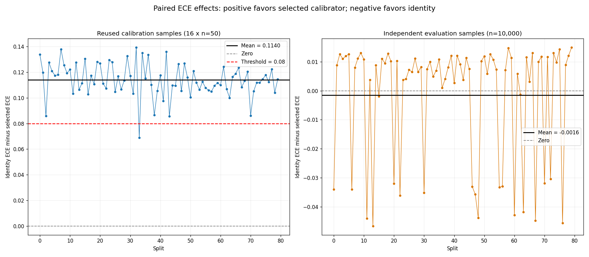

# A Fixed-Bin ECE Effect Dominated by Three Constant Predictors Under a Calibrated Null

## Abstract

This experiment examined selection from a locked \(21\times21\) affine-logit grid using mean 15-bin ECE on small reused samples. Across 80 deterministic splits, each selection objective averaged 16 samples of \(n=50\), followed by independent evaluation on \(n=10{,}000\) observations per split. The mean reused-sample paired ECE reduction relative to identity was \(0.11404\). The mean independent paired reduction was \(-0.00155\), with a descriptive 95% interval containing zero.

All selected candidates were constants: \((0,0)\), \((0,0.2)\), or \((0,-0.2)\). Consequently, a constants-only search—and even a locked three-candidate grid containing only those candidates—would reproduce the reported selections and aggregate ECE results on these samples. The observed effect therefore cannot be attributed to searching 441 candidates rather than three. Its primary interpretation is prediction-dependent finite-sample behavior of fixed-bin ECE: identity distributes observations across many bins and accumulates absolute within-bin sampling deviations, whereas a constant predictor occupies one bin.

Both identity and the constant-\(0.5\) predictor are perfectly calibrated in the population under this data-generating process, although the constant predictor discards predictive refinement and has worse population Brier score and log loss. The requested empirical constant-\(0.5\) baseline, candidate-stratified reductions, proper-score simulations, smaller grids not logically recoverable from the selected candidates, and additional independent replications cannot be reconstructed from the aggregate results retained in the original report. Accordingly, the revised report supports the exact reused-sample result for this grid and metric but does not support a distinct 441-candidate multiplicity effect or a conclusive claim of independent-evaluation harm.

## Background

Calibration reliability and predictive quality are not interchangeable. A predictor is calibrated under the usual reliability definition when

\[
E[Y\mid P]=P.
\]

A predictor can satisfy this condition while discarding information about differences in outcome risk. Proper scoring rules such as Brier score and log loss account for predictive information in a way that fixed-bin ECE does not.

Under the present data-generating process, the identity predictor \(P=q\) is perfectly calibrated because

\[
E[Y\mid q]=q.
\]

It is not, however, the unique calibrated predictor. The constant predictor \(P=0.5\), corresponding to \((a,b)=(0,0)\), is also perfectly calibrated because

\[
E[Y\mid P=0.5]=E[Y]=E[q]=0.5.
\]

More generally, an \(a=0\) candidate predicts the constant

\[
p_b=\operatorname{sigmoid}(b).
\]

Its population calibration error under the usual reliability definition is

\[
|E[Y]-p_b|=|0.5-p_b|.
\]

Thus, the selected candidates \((0,0.2)\) and \((0,-0.2)\) have nonzero population calibration error, whereas both identity and \((0,0)\) have zero population calibration error.

Fixed-bin empirical ECE can nevertheless favor the constant-\(0.5\) predictor over identity in finite samples. A constant prediction places every observation in one bin, reducing its empirical ECE to

\[
\left|\overline{Y}-0.5\right|.
\]

Identity predictions are spread over many bins. Although the identity predictor is calibrated in every bin at the population level, empirical ECE sums the absolute sampling deviations from multiple occupied bins. Absolute values prevent positive and negative within-bin deviations from canceling. The resulting finite-sample bias therefore depends on the predictions and their induced bin occupancy; it is not comparable across candidates merely because the same ECE formula is applied to each.

This mechanism materially changes the interpretation of the experiment. Candidate selection is present, but the reported design does not isolate generic hyperparameter-search or multiplicity effects from the finite-sample geometry of fixed-bin ECE. In particular, the dominant candidate was the prespecified grid point \((0,0)\), not an obscure configuration discovered only through a large search.

The original report referred to sources as placeholders \([1\text{–}10]\) but did not provide their bibliographic identities. Those placeholders have been removed rather than converted into invented citations. A defensible literature positioning against prior work on histogram-ECE bias, prediction-dependent bin occupancy, calibration estimation, proper scoring rules, and post-selection evaluation requires the missing source metadata or a new literature review.

## Hypothesis

The original hypothesis was:

> Across 80 deterministic splits from a perfectly calibrated null data-generating process, selecting from a locked \(21\times21\) affine-logit grid using mean 15-bin ECE over exactly 16 calibration seeds of \(n=50\) will produce an average reused-sample paired ECE reduction of at least \(0.08\). On independent samples of \(n=10{,}000\), the mean paired reduction will be no greater than zero, and mean ECE will favor the identity calibrator.

The original support rule used three conditions:

\[
A=\operatorname{mean}(R_{\mathrm{reuse},s})\geq 0.08,
\]

\[
B=\operatorname{mean}(R_{\mathrm{eval},s})\leq 0,
\]

and

\[
\operatorname{mean}(E_{\mathrm{id},s})
<
\operatorname{mean}(E_{\mathrm{sel},s}).
\]

The second and third conditions are algebraically redundant because

\[
\operatorname{mean}(R_{\mathrm{eval},s})
=
\operatorname{mean}(E_{\mathrm{id},s})
-
\operatorname{mean}(E_{\mathrm{sel},s}).
\]

Therefore, they do not constitute two independent evidentiary checks. Moreover, using only the observed sign of a noisy mean is insufficient for a substantive claim that selection causes independent-evaluation harm.

The revised interpretation separates three distinct questions:

1. **Exact reused-sample effect:** Did the locked procedure produce a mean reused-sample reduction of at least \(0.08\)?
2. **Independent degradation:** Is a negative independent mean established with adequate uncertainty, rather than only by its observed sign?
3. **Large-grid attribution:** Does the evidence distinguish the 441-candidate search from constants-only or smaller locked searches on the same samples?

For the second question, a substantive claim of independent degradation would require an uncertainty-based criterion, such as a confidence interval for the mean paired reduction lying entirely below zero, or enough independently seeded replications to estimate the sign adequately. The reported interval does not meet that criterion.

For the third question, the observed selections provide a direct nested-grid control: because every full-grid winner belonged to the three-candidate set

\[
\{(0,-0.2),(0,0),(0,0.2)\},
\]

a locked search over only these three candidates, with the same relative tie order, would select exactly the same candidate on every reported split. A constants-only search over all 21 values with \(a=0\) would also reproduce every full-grid selection. Thus, the current results do not establish an incremental effect from expanding the search from three candidates to 441.

## Method

The experiment used Python 3.11, NumPy 1.26.4, and Matplotlib 3.8.4, without external data or network resources after installation.

### Data-generating process

For each observation,

\[
q\sim\operatorname{Uniform}(0,1),\qquad X=q,
\]

and

\[
Y=\mathbf{1}\{U<q\},\qquad U\sim\operatorname{Uniform}(0,1),
\]

with \(U\) independent of \(q\). Consequently,

\[
q=P(Y=1\mid X).
\]

The marginal event probability is

\[
E[Y]=E[q]=0.5.
\]

It follows that both the identity predictor and the constant-\(0.5\) predictor are perfectly calibrated in the population. Off-center constant predictors have population calibration error equal to their distance from \(0.5\).

### Locked candidate grid

The parameter grid was fixed before data generation:

```python
A = np.linspace(0.0, 2.0, 21)
B = np.linspace(-2.0, 2.0, 21)
```

Candidates were ordered by ascending \(a\), followed by ascending \(b\), yielding 441 ordered pairs. Each candidate transformed \(q\) according to

\[
c_{a,b}(q)
=
\operatorname{sigmoid}
\left[
a\operatorname{logit}
\left\{\operatorname{clip}(q,10^{-12},1-10^{-12})\right\}
+b
\right].
\]

The identity calibrator, \((a,b)=(1,0)\), and the constant-\(0.5\) calibrator, \((a,b)=(0,0)\), were included. No adaptive refinement or modification of the grid was permitted.

The original experiment did not separately save the reused and independent ECE results for the constant-\(0.5\) candidate on every split. It therefore cannot provide the requested empirical fixed-baseline means without rerunning the seeded simulation. This comparator should be included explicitly in any executable replication.

Two smaller-grid controls can nevertheless be determined from the retained selection counts:

- A **constants-only grid** containing the 21 candidates with \(a=0\) would reproduce all full-grid selections.
- A **three-candidate nested grid** containing only \((0,-0.2)\), \((0,0)\), and \((0,0.2)\) would also reproduce all full-grid selections.

This follows because the minimizer selected from the full grid was always in both subsets. Restricting the objective to a subset that contains the full-grid minimizer cannot replace it with a candidate having a lower objective, and the candidates retain the same relative order for tie resolution.

Other smaller or nested grids—for example, grids excluding one or more of these three constants, or grids excluding \(a=0\)—cannot be evaluated from the aggregate outputs alone and require a rerun while holding the samples fixed.

### ECE definition

ECE used 15 fixed equal-width bins on \([0,1]\). Prediction \(p_i\) was assigned to bin

\[
k_i=\min(\lfloor 15p_i\rfloor,14).
\]

For each nonempty bin \(k\), the contribution was

\[
\frac{n_k}{n}
\left|
\overline{Y}_k-\overline{p}_k
\right|,
\]

and ECE was the sum of these contributions. The experiment did not use adaptive, quantile, debiased, pooled, or cross-fitted bins.

For the constant-\(0.5\) predictor, all observations occupy one bin and empirical ECE is

\[
\operatorname{ECE}(0.5,Y)=|\overline{Y}-0.5|.
\]

For identity, observations are generally spread across all 15 bins. The expected positive absolute sampling deviation is then accumulated over multiple occupied bins. This prediction-dependent bin occupancy is central to the revised interpretation.

### Calibration selection

There were 80 splits, indexed by \(s=0,\ldots,79\). Each split contained 16 independent calibration samples, indexed by \(j=0,\ldots,15\), with \(n=50\) per sample. Random-number generators were initialized as

```python
np.random.Generator(
    np.random.PCG64(
        np.random.SeedSequence([20250308, s, 0, j])
    )
)
```

For every candidate, ECE was computed separately on each of the 16 samples and then averaged. The 800 observations were not pooled. The candidate with the smallest mean ECE was selected, with exact float64 ties resolved by the fixed candidate order through `numpy.argmin`.

The reused-sample paired reduction for split \(s\) was

\[
R_{\mathrm{reuse},s}
=
\frac{1}{16}
\sum_{j=0}^{15}
\left[
\operatorname{ECE}_{s,j}(\mathrm{identity})
-
\operatorname{ECE}_{s,j}(\mathrm{selected})
\right].
\]

Identity ECE was recomputed from the original \(q\) predictions on the same sample.

A fixed constant-\(0.5\) comparison would analogously be

\[
R_{0.5,\mathrm{reuse},s}
=
\frac{1}{16}
\sum_{j=0}^{15}
\left[
\operatorname{ECE}_{s,j}(\mathrm{identity})
-
\operatorname{ECE}_{s,j}(0.5)
\right].
\]

This quantity was not retained in the aggregate results. It equals the selected reduction on the 62 splits in which \((0,0)\) was selected, but the missing values from the other 18 splits prevent calculation of its overall mean.

### Independent evaluation

Each split received a separate evaluation sample of \(n=10{,}000\), generated with

```python
np.random.Generator(
    np.random.PCG64(
        np.random.SeedSequence([20250308, s, 1, 0])
    )
)
```

These observations were not used for candidate selection. For each split,

\[
E_{\mathrm{id},s}=\operatorname{ECE}(q,Y),
\]

\[
E_{\mathrm{sel},s}
=
\operatorname{ECE}(c_{\hat a_s,\hat b_s}(q),Y),
\]

and

\[
R_{\mathrm{eval},s}
=
E_{\mathrm{id},s}-E_{\mathrm{sel},s}.
\]

The corresponding requested constant-\(0.5\) comparison is

\[
R_{0.5,\mathrm{eval},s}
=
E_{\mathrm{id},s}-\operatorname{ECE}(0.5,Y).
\]

Those split-level values were not retained for splits selecting an off-center constant, so the empirical independent mean for the fixed \(0.5\) baseline cannot be reconstructed.

Sample standard deviations were computed across the 80 split-level reductions. Descriptive normal-approximation intervals used

\[
\overline{R}\pm1.96\frac{\operatorname{SD}(R)}{\sqrt{80}}.
\]

No ex ante precision or power calculation was reported for 80 splits or for evaluation samples of \(n=10{,}000\). The use of deterministic seeds makes the calculation reproducible for that seed family but does not eliminate simulation uncertainty when conclusions are intended to extend to other independent seed families.

### Proper-score comparison

The simulation did not retain empirical Brier scores or log losses. Population values can nevertheless be derived exactly from the stated data-generating process.

For identity, population Brier score is

\[
E[(Y-q)^2]
=
E[q(1-q)]
=
\frac{1}{6}.
\]

For a constant predictor \(p\),

\[
E[(Y-p)^2]
=
\frac{1}{4}+(p-0.5)^2.
\]

Thus, the calibrated constant-\(0.5\) predictor has population Brier score

\[
\frac{1}{4},
\]

which is worse than identity’s \(\frac{1}{6}\). Off-center constants are worse still.

For log loss, identity has population loss

\[
E[-Y\log q-(1-Y)\log(1-q)]
=
\frac{1}{2},
\]

whereas the constant-\(0.5\) predictor has population loss

\[
\log 2.
\]

These proper scores distinguish calibration reliability from refinement and sharpness: constant \(0.5\) is reliable but discards the predictive information in \(q\). No debiased or cross-fitted calibration-error estimator was computed in the original experiment.

## Results

The mean reused-sample paired ECE reduction was

\[
A=0.1140409836.
\]

This exceeded the original threshold of \(0.08\) by approximately \(0.03404\). Its split-level sample standard deviation was \(0.0128290\), and its descriptive normal-approximation 95% interval was

\[
[0.1112297,\ 0.1168523].
\]

The exact procedure therefore produced a substantial reused-sample ECE advantage for the selected candidate.

On independent evaluation data, the mean paired reduction was

\[
B=-0.0015542039.
\]

The split-level sample standard deviation was \(0.0200417\), and the descriptive normal-approximation 95% interval was

\[
[-0.0059460,\ 0.0028376].
\]

The observed mean was negative, but the interval includes zero. The negative mean is therefore descriptive and inconclusive; it does not establish independent degradation under an uncertainty-based criterion.

Mean independent-evaluation ECE was:

- **Identity:** \(0.0123859454\)
- **Selected calibrator:** \(0.0139401494\)

Their difference equals the mean paired reduction:

\[
0.0123859454-0.0139401494=-0.0015542039.
\]

These two summaries are the same evidentiary comparison, not separate support conditions.



The left panel shows that the exact locked procedure produced reused-sample reductions above the original \(0.08\) threshold. The right panel shows substantially greater split-to-split variability on independent evaluation, with values on both sides of zero. The figure supports a large reused-sample effect and an independently evaluated mean near zero; it does not establish that selection harms independent ECE.

Identity had lower independent-evaluation ECE in 20 of 80 splits, a win rate of \(0.25\). This direction-only statistic can differ from the sign of the mean paired reduction because the latter incorporates magnitudes. Neither statistic, by itself, resolves how independent results differ among the three selected parameter pairs.

The identity candidate was never selected. Only three parameter pairs were selected:

| Selected \((a,b)\) | Count | Frequency |
|---|---:|---:|
| \((0.0,0.0)\) | 62 | 0.775 |
| \((0.0,0.2)\) | 12 | 0.150 |
| \((0.0,-0.2)\) | 6 | 0.075 |

The requested candidate-stratified decomposition cannot be calculated from the aggregate values in the original report:

| Selected \((a,b)\) | Count | Mean reused reduction | Mean evaluation reduction | Independent win rate |
|---|---:|---:|---:|---:|
| \((0.0,0.0)\) | 62 | Not retained | Not retained | Not retained |
| \((0.0,0.2)\) | 12 | Not retained | Not retained | Not retained |
| \((0.0,-0.2)\) | 6 | Not retained | Not retained | Not retained |

These quantities require split-level selected parameters and paired ECE values. Their absence is consequential: the aggregate negative evaluation mean could reflect different behavior for the calibrated constant-\(0.5\) candidate and the two population-miscalibrated off-center constants, but the retained summaries cannot determine that decomposition.

All selected candidates had \(a=0\), so their predictions were constant. This yields two exact controls from the available information:

| Locked search | Number of candidates | Relationship to reported full-grid result |
|---|---:|---|
| Full affine-logit grid | 441 | Reported result |
| Constants-only grid, \(a=0\) | 21 | Same selected candidate on every split |
| \((0,-0.2),(0,0),(0,0.2)\) only | 3 | Same selected candidate on every split |
| Constant \(0.5\) only | 1 | Empirical aggregate not recoverable |

Because the 21-candidate and three-candidate searches reproduce the full-grid winners, they also reproduce the reported mean reused reduction, mean independent reduction, mean selected ECE, and overall win count. The observed effect therefore cannot be attributed to the additional 420 nonconstant candidates or to searching 441 rather than three candidates.

The fixed constant-\(0.5\) baseline is scientifically central but empirically incomplete in the retained output. It was the selected candidate in 62 of 80 splits, so on those splits its reused and independent results equal the corresponding selected-candidate results. Its aggregate reused and independent reductions relative to identity cannot be calculated without the missing results from the remaining 18 splits.

The revised evidentiary assessment is:

| Distinct criterion | Result | Assessment |
|---|---:|:---:|
| Mean reused reduction at least \(0.08\) | \(0.1140409836\) | Met |
| Independent degradation established with uncertainty | 95% interval \([-0.0059460,0.0028376]\) | Not met |
| Incremental effect attributable to 441 rather than a small constants grid | Three candidates reproduce all selections | Not met |

Accordingly, the exact reused-sample numerical result is **SUPPORTED** for the specified fixed-bin ECE procedure. A broader claim that a 441-candidate search caused or amplified the effect is **NOT SUPPORTED**, and independent-evaluation harm is **INCONCLUSIVE**.

The main interpretation is prediction-dependent finite-sample bias and bin-occupancy behavior of fixed-bin ECE. The calibrated constant-\(0.5\) predictor can receive lower empirical ECE than calibrated identity because it concentrates all observations in one bin, even though it loses refinement and has worse population Brier score and log loss.

## Limitations

- **Missing constant-\(0.5\) aggregate results:** The original aggregate output does not contain the constant-\(0.5\) reused and independent ECE values for the 18 splits that selected an off-center constant. Its overall empirical reductions relative to identity therefore cannot be reported without rerunning the simulation.
- **Missing candidate-stratified results:** Mean reused reduction, mean evaluation reduction, and win rate separately for \((0,0)\), \((0,0.2)\), and \((0,-0.2)\) cannot be reconstructed from the reported aggregate means and counts.
- **No new smaller-grid simulations:** Constants-only and three-candidate controls are exactly determined because they contain every reported full-grid winner. Results for other locked smaller or nested grids, including grids excluding constants, require rerunning all candidates on the same samples.
- **No isolated 441-candidate effect:** The full-grid result is exactly reproducible by a three-candidate constants grid. The study therefore does not show that 441-candidate multiplicity caused or amplified the observed reduction.
- **Prediction-dependent ECE bias:** Fixed-bin empirical ECE has different finite-sample behavior across prediction sets. Identity occupies many bins, while a constant occupies one. The comparison is therefore affected by estimator geometry rather than representing a candidate-independent measure of calibration quality.
- **Nonunique population calibration:** Identity and constant \(0.5\) are both perfectly calibrated under the reliability definition. The off-center constants have population calibration error \(|\operatorname{sigmoid}(b)-0.5|\).
- **Loss of refinement:** ECE alone does not penalize the constant-\(0.5\) predictor for discarding information. Population Brier score and log loss favor identity, but empirical split-level proper-score results were not recorded.
- **No debiased or cross-fitted estimator:** The original experiment used only ordinary fixed-bin ECE. It did not include a debiased, sample-split, or cross-fitted calibration-error estimator capable of reducing reuse or histogram-bias concerns.
- **Independent result is inconclusive:** The independent mean reduction was negative, but its interval includes zero. The report therefore does not claim established independent harm.
- **No ex ante precision justification:** No power or precision target justified 80 splits or \(n=10{,}000\) evaluation observations. The evaluation standard deviation was large relative to the reported mean, and more independently seeded splits are needed to estimate its sign precisely.
- **Deterministic seeds do not remove simulation uncertainty:** The exact numbers are deterministic conditional on the stated seed family. Generalization beyond those seeds remains a simulation-inference question.
- **Specific data-generating process:** The experiment used only \(q\sim\operatorname{Uniform}(0,1)\) with Bernoulli outcomes. Results need not generalize to other probability distributions.
- **Specific calibration design:** Selection always used 16 independent samples of \(n=50\), with candidate ECEs averaged rather than observations pooled.
- **Specific ECE estimator:** Results concern 15 fixed equal-width bins. Different bin counts, adaptive bins, debiased estimators, or continuous calibration metrics may behave differently.
- **No executable audit package:** The original report did not supply executable code, split-level outputs, candidate-level objective summaries, software-environment files, or figure-generation instructions beyond the partial method description. A proper release should include, for every split, the selected parameters, identity and selected reused ECEs, fixed-\(0.5\) ECE, identity and candidate evaluation ECEs, reused and evaluation reductions, and proper scores.
- **Incomplete references:** The original placeholders \([1\text{–}10]\) did not identify authors, titles, venues, or years. A full reference list and reliable positioning against prior work cannot be reconstructed without inventing citations, which this revision does not do.

## Follow-up questions

- What are the reused and independent paired ECE reductions for the fixed constant-\(0.5\) predictor relative to identity across all splits?
- Within each selected-parameter stratum—\((0,0)\), \((0,0.2)\), and \((0,-0.2)\)—what are the mean reused reduction, mean independent reduction, uncertainty interval, and win rate?
- How do locked grids of 1, 3, 21, 25, 81, 121, 441, and 1,681 candidates compare when every grid is evaluated on exactly the same calibration and evaluation samples?
- Does any grid-size effect remain after excluding \(a=0\), or after requiring \(a\geq0.5\)?
- How do fixed-bin ECE results compare with Brier score, log loss, and a prespecified debiased or cross-fitted calibration-error estimator?
- How many independently seeded splits are required to estimate an independent mean reduction of the observed scale with a prespecified precision?
- Does the finite-sample advantage of constant \(0.5\) persist across 10, 15, and 30 fixed bins and across calibration sample sizes \(n\in\{50,100,250,500\}\)?
- How much of the result is explained by the number of occupied bins, and can an occupancy-matched comparison separate histogram geometry from post-selection reuse?
- Can an executable replication release include complete split-level outputs, candidate-level objectives, the constant-\(0.5\) baseline, proper scores, software versions, environment files, tests for seed reproduction, and commands that regenerate `workspace/figures/paired_calibration_effects.png`?
- How does the revised finding relate to identified prior work on finite-sample bias and prediction-dependent behavior of histogram ECE once a complete, auditable bibliography is assembled?
