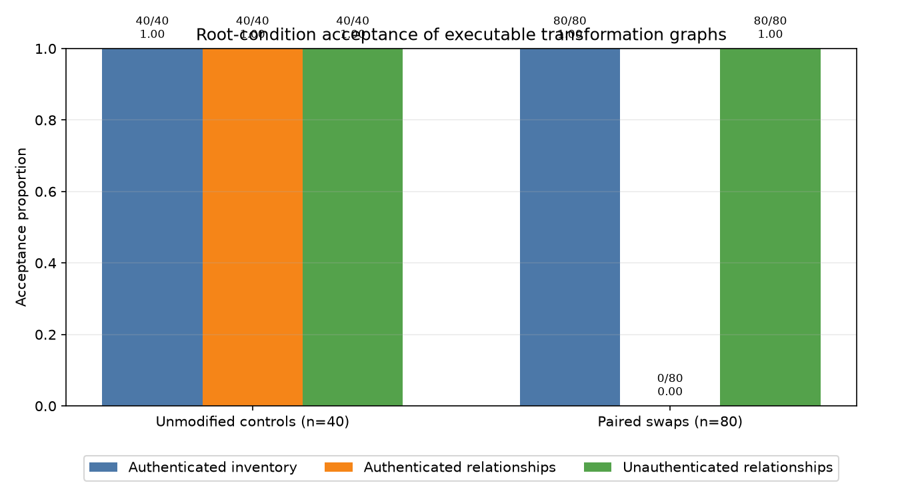

# A Worked Counterexample: Inventory Roots Accept Same-Operation Paired-Edge Swaps in a Synthetic Provenance Model

## Abstract

This report presents a formal counterexample and implementation validation, not a statistical experiment establishing a population-level effect. In the synthetic model, an inventory root commits only to artifact records and is therefore invariant under relationship permutations that leave those records unchanged. A relationship root additionally commits to canonical tuples of unit, operation, source edge, and output edge; absent a hash collision, it changes whenever that canonical tuple sequence changes.

The implementation instantiated this construction in 40 deterministic synthetic baseline graphs. Two deterministic same-operation paired-edge mutations were derived from each baseline, producing 80 altered candidates, together with 40 unmodified controls. All 80 mutations exchanged complete source-output pairs, preserved the artifact inventory, and passed schema, integrity, reference, context, and re-execution checks. The authenticated inventory root accepted all 80 mutations, while the authenticated relationship root rejected all 80 and accepted all 40 controls. These exhaustive outcomes validate that the implementation behaved according to the commitment definitions for this constructed mutation class. They do not estimate a population-level security effect or establish that the proposed tuple root is sufficient against other provenance attacks.

## Background

Provenance systems seek to establish not only which artifacts exist, but also how they were produced, related, and transformed. Prior work has considered authenticated media provenance [2], standards-based combinations of metadata, watermarking, and cryptography [3], non-repudiable provenance [5], and provenance serializations for scientific workflows [7]. Secure software supply-chain design likewise emphasizes that security depends on which properties are cryptographically established rather than merely recorded [4].

The central principle examined here is standard rather than novel: a cryptographic commitment authenticates only the fields included in it. An inventory commitment can establish that a particular set of source and output objects is present, but it does not establish which source and output belong to each unit unless those assignments are also committed. If relationship records remain mutable, intact artifacts can sometimes be reassigned while preserving local integrity checks and successful execution. This concern relates to broader work on desynchronized provenance and authentication state [1] and to tampering that preserves superficially valid representations [6].

Executable validation is stronger than metadata validation alone because a named transformation can be rerun on a referenced source and compared byte-for-byte with the referenced output. Nevertheless, re-execution establishes only that the selected source-output pair is valid for the selected operation. It does not, by itself, establish that this pair was originally assigned to a particular unit. The worked construction isolates that distinction by exchanging complete, valid source-output pairs between two units that name the same operation.

### Formal proposition

Let \(A\) be the artifact-record dictionary and \(U\) the unit records. Define:

\[
I(A)=H\!\left(D_I \,\|\, C(\operatorname{sort}(P(A)))\right),
\]

where \(H\) is SHA-256, \(D_I\) is the inventory-root domain separator, \(C\) is canonical JSON encoding, and \(P(A)\) projects every artifact record to:

\[
[\text{artifact\_id},\text{kind},\text{size},\text{content\_sha256}].
\]

Define the relationship commitment as:

\[
R(A,U)=H\!\left(D_R \,\|\, C\left(
\left\{
\begin{array}{l}
\text{"inventory\_root"}:I(A),\\
\text{"tuples"}:\operatorname{sort}(T(U))
\end{array}
\right\}\right)\right),
\]

where \(D_R\) is the relationship-root domain separator and each relationship tuple is:

\[
[\text{unit\_id},\text{operation},\text{source\_id},\text{output\_id}].
\]

**Proposition.**

1. If a candidate leaves \(A\) unchanged, then its inventory commitment \(I(A)\) is unchanged under any permutation or reassignment of unit relationships.
2. If \(I(A)\) remains unchanged but the canonical relationship tuple sequence changes, then the relationship commitment changes, provided no SHA-256 collision occurs.

**Proof.**

For the first statement, \(I\) is a function only of the projected artifact records \(P(A)\). If \(A'=A\), then \(P(A')=P(A)\). Sorting and canonical encoding are deterministic, so the bytes supplied to SHA-256 are identical and therefore \(I(A')=I(A)\). Unit relationships do not occur in this input and cannot affect the result.

For the second statement, suppose \(I(A')=I(A)\) but the canonical tuple sequence for \(U'\) differs from that for \(U\). The relationship-root objects then differ in their `tuples` member. Deterministic canonical JSON produces different byte strings for those distinct objects. SHA-256 therefore produces different roots unless the two different inputs form a hash collision. Under the stated collision-resistance assumption, constructing such a collision is treated as infeasible. \(\square\)

The same-operation paired-edge swap used here changes the tuple sequence because stable unit identifiers remain fixed while distinct source and output identifiers are reassigned between them. It leaves the artifact dictionary unchanged. Acceptance by the inventory root and rejection by the relationship root are therefore consequences of the definitions, not empirical discoveries that depend on the number or variability of generated graphs. One valid example plus the proposition establishes the logical counterexample. The 40 baselines and 80 mutations serve only as repeated implementation checks.

### Scope of the contribution

The report is limited to a worked demonstration of same-operation paired source-and-output swaps in a deterministic, single-stage synthetic model. It does not demonstrate a surprising cryptographic bypass, propose a new commitment construction, or show behavior in a realistic production provenance system. It also does not establish that the particular relationship tuple is sufficient against output-only swaps, source-only swaps, cross-stage substitutions, parent reordering, operation-parameter substitution, parser disagreement, rollback, or other provenance attacks.

The broader research topic may include output-only swaps, source-only swaps, cross-stage substitutions, reordered parent lists, schema substitutions or downgrades, path aliases, manifest replacement, and separate authenticated- and unauthenticated-root conditions. The executed implementation directly tested only two fixed same-operation paired-edge mutations per synthetic baseline. Manifest replacement and authenticated versus unauthenticated relationship roots were included as validation conditions; the other mutation classes were not tested.

## Hypothesis

The original report described the following as a prespecified hypothesis:

> For 80 paired source-and-output swaps that import a valid source-output pair from another unit while leaving the global artifact inventory unchanged and preserving successful transformation re-execution, an authenticated root committing only to the unordered artifact inventory will accept all 80 altered graphs, whereas an authenticated root also committing to canonical tuples of unit, operation, source edge, and output edge will reject all 80 and accept all 40 unmodified controls.

No preregistration record, timestamped protocol, source archive, generated candidates, trusted-root objects, result CSV, or cryptographic checksums accompanied the submitted material. The claimed prespecification therefore cannot be independently evaluated and is not used as evidentiary support in this revision.

The claim evaluated here is instead a deterministic implementation-conformance claim:

1. Every constructed mutation should leave the artifact records and inventory root unchanged.
2. Every constructed mutation should change the canonical relationship tuple sequence and, absent a hash collision, the relationship root.
3. Every complete source-output pair should remain executable under the receiving unit’s unchanged same-operation label.
4. An immutable authenticated inventory root should accept the mutations.
5. An immutable authenticated relationship root should reject them.
6. A candidate-replaceable relationship declaration should accept them after the candidate declaration is recomputed.

These are deterministic consequences of the construction if the implementation follows the stated definitions. No statistical hypothesis test is needed or appropriate. The generated candidates are not independent observations sampled from a population: each control and its two mutations share a baseline, and both mutations are fixed transformations selected by the implementation.

## Method

The implementation was described as using Python 3.11 or later, the standard library, Matplotlib, and SciPy. Matplotlib used the `Agg` backend. SciPy was used only for the Fisher exact test in the original analysis; that test has been removed because inferential statistics are inappropriate for these deterministic, baseline-clustered candidates. Exact Python, Matplotlib, and SciPy versions were not recorded in the submitted report and cannot be reconstructed without the original environment or dependency lock file.

All pseudorandom bytes came from the sole generator `random.Random(20250308)`; no other randomness or timestamps were used.

Canonical JSON was defined as UTF-8 bytes produced by:

```python
json.dumps(
    value,
    sort_keys=True,
    separators=(",", ":"),
    ensure_ascii=True
).encode("utf-8")
```

Every digest was lowercase hexadecimal SHA-256. Four deterministic byte transformations were implemented:

```python
reverse_v1(x) = x[::-1]
xor_a5_v1(x)  = bytes(b ^ 0xA5 for b in x)
add_17_v1(x)  = bytes((b + 17) % 256 for b in x)
rol1_v1(x)    = bytes(((b << 1) & 255) | (b >> 7) for b in x)
```

Forty baseline graphs were generated, indexed from 0 through 39. Each graph contained 16 units, indexed from 0 through 15:

- Units 0–3 used `reverse_v1`.
- Units 4–7 used `xor_a5_v1`.
- Units 8–11 used `add_17_v1`.
- Units 12–15 used `rol1_v1`.

Unit identifiers followed the format `g{g:02d}_u{u:02d}`. Each unit received a unique 256-byte source. The first eight bytes encoded the graph and unit indices as unsigned four-byte big-endian integers; the remaining 248 bytes came from consecutive calls to `rng.getrandbits(8)`. The unit output was obtained by applying its assigned transformation.

Every source and output was stored as a separate artifact, yielding 32 artifacts per graph. Artifact identifiers were computed as:

```text
sha256(
    b"artifact-v1\0" +
    kind.encode("ascii") +
    b"\0" +
    content
).hexdigest()
```

Here, `kind` was exactly `source` or `output`. Each artifact record contained its `artifact_id`, `kind`, byte `size`, `content_sha256`, and base64-encoded content. Artifact IDs were asserted to be unique within each graph.

Each unit record contained exactly:

- `unit_id`
- `operation`
- `source_id`
- `output_id`
- `context`

The context recorded `source_size`, `output_size`, `source_sha256`, and `output_sha256`, derived from the currently referenced artifacts.

Two roots were calculated. The **inventory root** projected each artifact as:

```text
[artifact_id, kind, size, content_sha256]
```

The rows were sorted lexicographically by all fields, and the root was:

```text
sha256(b"inventory-root-v1\0" + canonical_json(rows))
```

The **relationship root** created one tuple per unit:

```text
[unit_id, operation, source_id, output_id]
```

Tuples were sorted by `unit_id`, and the root was:

```text
sha256(
    b"relationship-root-v1\0" +
    canonical_json({
        "inventory_root": inventory_root,
        "tuples": tuples
    })
)
```

Thus, the relationship root committed to both the artifact inventory and the labeled assignment of one source edge and one output edge to each unit and operation.

Each baseline graph’s inventory and relationship roots were placed in a separate trusted-roots object, treated by the model as authenticated, immutable, fresh, and available out of band. Candidates could not modify it. Candidate manifests also contained a `declared_relationship_root`, but this field was deliberately unauthenticated.

One unmodified control was copied from each baseline, producing 40 controls. Two deterministic mutations were derived from each shared baseline, producing 80 altered candidates:

- Mutation A exchanged both `source_id` and `output_id` between units 0 and 1.
- Mutation B exchanged both IDs between units 8 and 9.

These mutations were not independently sampled or independently constructed observations. They were fixed transformations of the same baseline. The units in each exchanged pair used the same operation. Consequently, each moved source-output pair remained internally valid for the receiving unit’s named operation.

After every exchange, context metadata for the two affected units was recomputed from the newly referenced artifacts. The artifact inventory was not changed, added to, removed from, or reordered. The candidate relationship root was recomputed and written to the unauthenticated `declared_relationship_root`, modeling candidate-controlled manifest replacement. Neither trusted baseline root was changed.

Common validation required all of the following:

1. Valid schema and field types.
2. Successful decoding of every artifact.
3. Recalculation and verification of every artifact ID, size, and content hash.
4. Resolution of all source and output references.
5. Recalculation and verification of every context field.
6. Re-execution of each named operation on the referenced source bytes.
7. Exact byte equality between each re-executed result and its referenced output.

Three root conditions were evaluated, each in conjunction with common validation:

- **`AUTH_INVENTORY`** required the candidate’s recomputed inventory root to equal the immutable trusted baseline inventory root.
- **`AUTH_RELATIONSHIP`** required the candidate’s recomputed relationship root to equal the immutable trusted baseline relationship root.
- **`UNAUTH_RELATIONSHIP`** compared the recomputed relationship root only with the candidate-provided `declared_relationship_root`, without consulting the trusted relationship root.

For every altered candidate, the implementation additionally checked exact equality of the baseline and candidate artifact-record dictionaries, equality of inventory roots, inequality of relationship roots, successful re-execution of all 16 units, and exactly four changed edge fields: `source_id` and `output_id` in each of the two exchanged units.

The implementation was described as writing all 120 candidates to `candidate_results.csv`, with one row per candidate. However, the executable source code, generated candidate objects, trusted-root objects, `candidate_results.csv`, dependency lock file, and cryptographic checksums were not included in the submitted material. The exact implementation-level results therefore cannot be independently reproduced or audited from this report alone.

### Threat model

The worked model assumes an attacker with the following capabilities:

- The attacker can modify candidate unit records, source and output references, context metadata, and unauthenticated manifest fields.
- The attacker can recompute all candidate-controlled metadata and the candidate-declared relationship root.
- The attacker can select and reassign intact artifacts already present in the authenticated inventory.
- The attacker knows the validation rules and operations.
- The attacker seeks a candidate that passes schema, integrity, reference, context, and re-execution validation.

The attacker is assumed not to have the following capabilities:

- The attacker cannot modify the authenticated trusted-roots object.
- The attacker cannot substitute an older trusted root or cause the verifier to use the wrong baseline.
- The attacker cannot compromise the root distribution channel or trusted root store.
- The attacker cannot induce SHA-256 collisions.
- The attacker cannot change the verifier’s canonicalization, operation dispatcher, parser, or root-comparison code.
- The attacker cannot exploit disagreement between different verifier implementations.

The model treats `unit_id` as a stable identity with security meaning. A relationship root can bind edges to a unit identifier only if that identifier remains stable across creation, storage, distribution, and verification. If an attacker can rename units or if different systems assign different meanings to the same identifier, the tuple commitment does not by itself resolve that ambiguity.

Root freshness and rollback resistance are assumed rather than implemented. The verifier is assumed to possess the correct trusted root for the intended graph version and security domain. The model does not include signatures, key rotation, transparency logs, counters, epochs, timestamps, revocation, or mechanisms preventing an attacker from presenting an authentic but obsolete root.

Operation names are also treated as stable references to exact deterministic implementations. The four names contain a `v1` suffix, but no separate operation-version field, implementation digest, runtime identity, environment commitment, or parameter object is authenticated. The operations take no external parameters. Consequently, the construction does not test parameter substitution, version ambiguity, hidden state, or cases in which two verifiers resolve an operation name differently.

The trusted computing base includes:

- Canonical JSON serialization and sorting.
- JSON parsing and schema enforcement.
- Base64 decoding.
- SHA-256 and artifact-ID calculation.
- The operation-name dispatcher and operation implementations.
- Context calculation.
- Trusted-root storage, selection, and comparison.
- The mechanism that establishes unit and operation identity.
- Any out-of-band authentication and freshness mechanism for trusted roots.

A compromise or semantic disagreement in any of these components may invalidate the modeled guarantees.

### Commitment coverage and alternatives

For the exact paired swap used here, the full tuple:

```text
[unit_id, operation, source_id, output_id]
```

is more than the minimum needed to distinguish the baseline from the constructed candidate. Because distinct source and output identifiers are exchanged between stable unit identifiers, committing to either the unit-to-source assignment or the unit-to-output assignment would detect these particular mutations, assuming identifiers are unique and no collision occurs. That narrower observation does not establish that either field alone is sufficient for provenance authentication generally.

A more complete commitment design may need to address:

- **Operation parameters.** Parameters that affect outputs must be authenticated, either directly in the relationship record or indirectly through a committed operation specification.
- **Operation identity and versioning.** A name such as `reverse_v1` is meaningful only if all verifiers resolve it to the same code and semantics. An implementation digest, package identity, version, runtime, or environment commitment may be required.
- **Ordered versus unordered parent edges.** For operations where parent order is semantically meaningful, the commitment must preserve that order. For semantically unordered inputs, a canonical multiset or role-labeled representation may be preferable. The present single-parent model does not exercise this distinction.
- **Edge roles.** Multi-input operations may require role labels such as `left`, `right`, `config`, or `training_data`; merely committing to an unordered set of parent identifiers may lose relevant semantics.
- **Graph-stage identity.** Unit identity alone may be insufficient if the same unit identifier can occur in multiple stages, runs, namespaces, tenants, or workflow versions. Stage, run, and graph identity may need to be committed.
- **Root version and domain separation.** The strings `inventory-root-v1\0` and `relationship-root-v1\0` provide basic domain separation. They do not authenticate deployment domain, graph namespace, epoch, policy version, or freshness.
- **Adjacency commitments.** A graph may be committed as canonical adjacency lists keyed by stable node identifiers. This can represent fan-in and fan-out more directly than the single-source tuple used here.
- **Merkle structures.** Merkle trees or authenticated maps can support partial proofs and incremental updates while binding the same relationship semantics. Their security still depends on complete leaf definitions, canonical ordering, domain separation, and authenticated roots.
- **Whole-manifest commitments.** Committing to a fully canonical manifest can cover more fields, but it may also bind irrelevant serialization details unless the semantic projection is carefully defined.
- **Content-addressed operation and environment records.** Unit tuples can refer to separately committed operation specifications, parameter records, environments, or execution attestations.

The present implementation compares only an inventory list with one flat relationship-root construction. It does not experimentally compare these alternatives or establish a minimal commitment schema for realistic provenance systems.

## Results

The following are exhaustive counts over the generated corpus described in the report, not estimates from independent samples.

All 80 altered candidates reportedly had the intended mutation shape. In every case:

- The candidate and baseline artifact-record dictionaries were exactly equal: 80/80.
- The inventory root was preserved: 80/80.
- The relationship root changed: 80/80.
- All 16 transformations re-executed successfully: 80/80.
- Exactly four edge fields changed relative to baseline: 80/80.
- Full common validation passed: 80/80.

Common validation also passed for all 40 unmodified controls.

The reported acceptance outcomes were:

| Root condition | Unmodified controls | Paired swaps |
|---|---:|---:|
| Authenticated inventory | 40/40 (1.0) | 80/80 (1.0) |
| Authenticated relationships | 40/40 (1.0) | 0/80 (0.0) |
| Unauthenticated relationships | 40/40 (1.0) | 80/80 (1.0) |



The referenced figure was not included in the submitted material, so its rendering and correspondence to the reported counts could not be independently checked. The table states the complete reported result without requiring statistical interpretation.

Inventory authentication did not distinguish the altered candidates from controls. This follows directly from the proposition: the mutations changed unit relationships but left every artifact record unchanged, and unit relationships were absent from the inventory commitment.

Authenticated relationship validation accepted all 40 controls and rejected all 80 mutations. This is also the expected deterministic result. Stable unit identifiers remained fixed, distinct source and output identifiers were exchanged, and those fields were included in the canonical tuple sequence. The candidate relationship-root input therefore differed from the trusted baseline input.

The unauthenticated relationship condition accepted all 80 mutations and all 40 controls. This validates a separate implementation point: recalculating a relationship digest provides no authentication when a candidate can replace both the relationship data and the declaration against which the digest is checked. Detection in this model depended on comparison with immutable authenticated baseline state.

No Fisher exact test, odds ratio, or \(p\)-value is reported. Such inference is not scientifically meaningful for this construction because:

- Outcomes are deterministic consequences of the commitment definitions.
- Candidates were deliberately generated to satisfy the relevant invariants.
- Two mutations and one control were derived from each shared baseline.
- The 80 mutations are not independent samples from a target population.
- The conclusion does not depend on sampled graph variability or sample size.

The descriptive control-minus-mutation acceptance difference under authenticated relationship validation was \(1.0\), but this is simply another representation of the exhaustive counts \(40/40\) and \(0/80\), not an estimated population effect.

The sound conclusion is narrow: these particular inventory commitments omit the relationships changed by these constructed same-operation paired-edge swaps, so the swaps preserve the inventory root; the tested relationship commitment includes every changed edge field, so it rejects the swaps when compared with the correct immutable baseline root. The repeated cases indicate that the reported implementation matched those definitions throughout the generated corpus. They do not establish that the relationship tuple is sufficient against other provenance attacks.

## Limitations

- **Missing reproducibility package.** The executable source code, exact dependency versions, generated baseline and candidate objects, trusted-root objects, `candidate_results.csv`, figure file, and cryptographic checksums were not supplied with the submitted material. They cannot be recreated byte-for-byte from the report without independently reimplementing the procedure, and an independent reimplementation would not verify that the reported outputs came from the original implementation. The implementation claims and claimed prespecification therefore remain unaudited.

- **Formal result dominates the generated sample.** The inventory-root result follows immediately because relationships are omitted from the inventory commitment. The relationship-root result follows because the mutation changes fields explicitly included in the relationship commitment. Forty graphs and 80 mutations add implementation coverage but little logical evidence beyond one valid counterexample and the proposition.

- **Narrow substitution class.** The implementation tested only complete source-and-output exchanges between units using the same operation. It did not test output-only swaps, source-only swaps, cross-operation or cross-stage swaps, reordered multi-parent lists, schema substitutions, schema downgrades, path aliases, parameter changes, environment changes, or graph rewrites.

- **Only two fixed mutations per baseline.** Units 0 and 1 were exchanged in one mutation, and units 8 and 9 in the other. The implementation did not exhaust all same-operation pairs, all graph permutations, or all relationship-preserving and relationship-changing mutations.

- **Shared-baseline dependence.** Each control and two mutations were derived from the same baseline. They are clustered deterministic cases, not independent observations. No population-level inference is justified.

- **Synthetic single-stage structure.** Each graph had exactly 16 single-source, single-output units and 32 artifacts. There were no multi-stage dependencies, parent-child chains, fan-in, fan-out, cycles, iteration records, subgraphs, external dependencies, or workflow-stage identities.

- **Simple deterministic transformations.** The four byte transformations are total, deterministic, bijective, and inexpensive. They do not model failures, environment-sensitive computation, floating-point variation, nondeterminism, hidden state, network services, parser behavior, partial artifacts, or operations whose outputs cannot be reproduced exactly.

- **Same-operation exchanges favor executable validity.** Swaps were deliberately restricted to pairs sharing an operation. This demonstrates that re-execution does not establish original unit assignment, but it does not show how often interchangeable valid pairs occur in realistic systems.

- **No broader sufficiency result.** The tested tuple root rejects mutations that change `source_id` and `output_id` under stable `unit_id` and `operation` fields. It has not been shown sufficient against renaming, operation substitution, parameter changes, multi-parent ambiguity, stage substitution, replay, rollback, manifest ambiguity, or verifier disagreement.

- **Unit identity is assumed stable.** The model assumes that `unit_id` identifies the same security-relevant unit in the baseline and candidate. It does not define how unit identities are issued, authenticated, namespaced, migrated, or protected from reuse and renaming.

- **Operation representation is incomplete.** Operation names contain a version-like suffix, but the root does not separately commit to implementation code, parameters, runtime, dependencies, environment, or execution policy. The model assumes that a name resolves identically for every verifier.

- **Parent ordering is untested.** Every unit has one source. The design therefore provides no evidence about ordered versus unordered multi-parent edges, duplicate parents, edge roles, or canonicalization of equivalent adjacency structures.

- **Root freshness and rollback are assumed.** Trusted roots were treated as immutable, correctly distributed, current, and associated with the intended graph. The study did not implement key management, signatures, transparency logs, rollback protection, root selection, revocation, or authenticated version negotiation. These operational assumptions substantially narrow the practical contribution.

- **Authentication was modeled, not attacked.** The study did not test compromise of the root store, authenticated channel, verifier, operation dispatcher, or canonicalization implementation. Candidate rejection depends on all of those components behaving correctly.

- **No comparison with alternative commitments.** The implementation did not compare flat tuples with adjacency commitments, authenticated maps, Merkle structures, whole-manifest commitments, or separate commitments to operations, parameters, environments, and stages.

- **Single deterministic seed.** All generated content came from one seed, `20250308`. The formal conclusion does not depend on random sampling, but the implementation was exercised on only one generated corpus.

- **No performance or timeout conclusions.** The results report correctness and acceptance counts but no execution times, resource measurements, proof sizes, update costs, or timeout behavior.

- **No collision or canonicalization adversaries.** SHA-256 was assumed collision resistant, and all tested records followed one fixed canonical JSON procedure. Alternative encodings, duplicate-key behavior, Unicode normalization, numeric representation, parser discrepancies, and implementation-level canonicalization errors were outside scope.

- **No realistic deployment semantics.** The model does not cover multiple organizations, policy changes, partial disclosure, redaction, artifact availability, distributed verification, concurrent graph versions, or long-term archival verification.

## Follow-up questions

- Can a complete reproducibility package be published containing executable source code, an exact dependency lock file, all generated baselines and candidates, trusted-root objects, `candidate_results.csv`, the referenced figure, and SHA-256 checksums for every file?

- Can evaluation be broadened to realistic multi-stage provenance graphs with fan-in, fan-out, role-labeled edges, operation parameters, versioned environments, and external dependencies?

- Can output-only swaps, source-only swaps, cross-operation swaps, and cross-stage substitutions pass common validation, and which authenticated fields are minimally sufficient to reject each class?

- For the exact paired-edge mutation, is binding `unit_id` to only `source_id` or only `output_id` sufficient under the intended artifact-uniqueness assumptions, and what additional fields are required for broader provenance semantics?

- How should stable unit, graph, run, stage, tenant, and workflow-version identities be defined and authenticated?

- Should operation commitments include source code or package digests, parameters, runtime versions, environment state, nondeterminism declarations, and execution policy?

- In multi-stage graphs, does a direct-edge commitment detect cross-stage substitutions that preserve valid execution along an entire subgraph, or must stage and transitive structure also be authenticated?

- How should ordered, unordered, role-labeled, and duplicate parent edges be represented canonically without treating semantically equivalent graphs as different or semantically different graphs as equivalent?

- How do flat tuple commitments compare with canonical adjacency lists, authenticated maps, Merkle trees, and whole-manifest commitments in security coverage, proof size, update cost, and partial-verification support?

- What root-version, deployment-domain, graph-namespace, epoch, and policy fields are needed for adequate domain separation?

- How should root freshness, rollback prevention, revocation, key rotation, and trusted-root distribution be implemented and tested?

- Can schema downgrades, path aliases, manifest replacement, duplicate JSON keys, Unicode variations, or parser disagreement bypass relationship authentication when verifiers differ about canonicalization or root-version authority?
