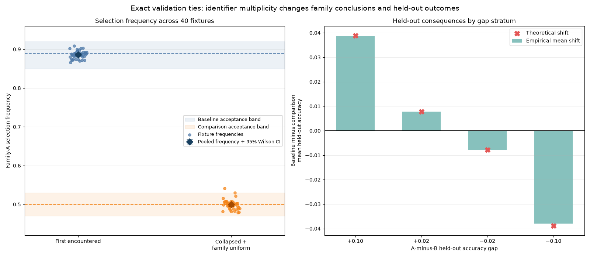

# First-Encounter Tie-Breaking Selects Families in Proportion to Redundant Identifiers Under Exact Validation Ties

## Abstract

This formal and methodological note analyzes first-encounter tie-breaking when exact validation ties include redundant or semantically duplicate identifiers. If tied family \(j\) contributes \(m_j\) identifiers and identifiers are encountered in uniformly random order, its selection probability is exactly

\[
\Pr(J=j)=\frac{m_j}{\sum_{\ell=1}^{k}m_\ell}.
\]

Thus, identifier multiplicity changes family-selection frequencies even when the added identifiers do not represent genuinely distinct semantic configurations. The corresponding frequency differences, odds ratios, and identifier-only instability follow algebraically from the family multiplicities.

A synthetic 8-to-1 example was used only as a software verification of this analytic result. Across 40,000 randomized orders, identifier-level first encounter selected family A 88.62% of the time, close to the exact probability \(8/9\). Semantic collapse followed by uniform family selection selected A 49.94% of the time, close to \(1/2\). The estimated probability that two independent identifier-level draws both selected A but reported different redundant A identifiers was 68.72%, close to the exact value \(56/81\). All reported intervals quantify conditional Monte Carlo variation under the constructed mechanism, not uncertainty across datasets or operational pipelines. The verdict **SUPPORTED** applies only to the narrowly specified implementation check; it is not broad evidence about real hyperparameter optimization, optimizer-family quality, or larger grids of genuinely distinct configurations.

## Background

Validation and cross-validation are widely used for model and hyperparameter selection, but their statistical interpretation and uncertainty require care [1,2]. The distinction between selecting a single model and accounting for uncertainty across competitive models also appears in work comparing model selection and model averaging [3]. More broadly, hyperparameter-optimization research has developed online, gradient-based, stabilized bi-level, ranking-ensemble, and amortized methods for searching configuration spaces [4–7,10].

The issue considered here is narrower. In a scan that replaces the incumbent only on strict improvement, candidates with exactly equal validation scores are resolved by encounter order. Suppose \(k\) tied families contribute multiplicities \(m_1,\ldots,m_k\), with

\[
M=\sum_{\ell=1}^{k}m_\ell
\]

tied identifiers in total. Under a uniformly random permutation of those identifiers, every identifier is equally likely to appear first. Because family \(j\) owns \(m_j\) of the \(M\) possible first positions,

\[
\Pr(J=j)=\frac{m_j}{M}.
\]

This is an elementary probability result rather than an empirical hypothesis about unknown populations. The labels, prediction arrays, fixtures, and model-selection scan are useful only for checking that a concrete implementation exhibits the stipulated mechanism.

The result should not be interpreted as showing that larger configuration grids generally receive an improper advantage. If a family contributes additional configurations that are genuinely distinct, weighting by semantic configuration may be appropriate for some estimands. The specific concern is that redundant identifiers—or multiple identifiers that collapse to the same semantic configuration—receive separate opportunities to be encountered first despite adding no distinct validation result or predictive configuration.

Tie-breaking policy must also be distinguished from semantic deduplication. Let family \(j\) have \(s_j\) genuinely distinct tied semantic configurations after duplicate identifiers are collapsed, and let \(S=\sum_\ell s_\ell\). Four relevant policies are:

1. **Identifier-level first encounter under uniformly randomized order:** selects family \(j\) with probability \(m_j/M\).
2. **Semantic-configuration-level first encounter under uniformly randomized order:** selects family \(j\) with probability \(s_j/S\).
3. **Uniform semantic-configuration selection:** also selects family \(j\) with probability \(s_j/S\).
4. **Uniform family selection:** selects family \(j\) with probability \(1/k\).

Policies 2 and 3 have the same family-level distribution under exact ties and uniform ordering, although they are operationally different procedures. Policy 4 generally differs from both when families contain different numbers of genuinely distinct semantic configurations.

No single policy is universally normative. If the target is a uniformly selected tied semantic configuration, policies 2 or 3 preserve the contribution of genuinely distinct configurations. If the target is an equally weighted comparison among families, policy 4 is the direct implementation of that estimand. Identifier-level weighting is difficult to justify when multiplicity comes only from redundant names, but it may coincide with semantic-configuration weighting when every identifier represents one genuinely distinct configuration and encounter order is uniform.

The present note derives these distinctions and verifies one exact two-family, one-semantic-configuration-per-family case. It does not estimate the prevalence of exact ties, duplicate identifiers, or associated effects in deployed systems.

## Hypothesis

The general analytic proposition was that, under an exact tie and a uniformly random identifier order, first encounter selects family \(j\) with probability

\[
p_j=\frac{m_j}{M}.
\]

Relative to semantic-configuration-level selection, whose family probability is

\[
q_j^{\mathrm{semantic}}=\frac{s_j}{S},
\]

the family-frequency difference is

\[
\Delta_j^{\mathrm{identifier-semantic}}
=
\frac{m_j}{M}-\frac{s_j}{S}.
\]

Relative to uniform family selection, the difference is

\[
\Delta_j^{\mathrm{identifier-family}}
=
\frac{m_j}{M}-\frac{1}{k}.
\]

For any comparison policy assigning family \(j\) probability \(q_j\), the identifier-level versus comparison odds ratio is

\[
\operatorname{OR}_j
=
\frac{m_j/(M-m_j)}{q_j/(1-q_j)}.
\]

Consequently, the odds ratio relative to semantic-configuration-level selection is

\[
\operatorname{OR}_j^{\mathrm{identifier-semantic}}
=
\frac{m_j(S-s_j)}{s_j(M-m_j)},
\]

and the odds ratio relative to uniform family selection is

\[
\operatorname{OR}_j^{\mathrm{identifier-family}}
=
\frac{m_j(k-1)}{M-m_j}.
\]

For two independent identifier-level draws, the unconditional probability that both select family \(j\) but report different identifiers from that family is

\[
p_j^2-\sum_{i=1}^{m_j}\left(\frac{1}{M}\right)^2
=
\frac{m_j(m_j-1)}{M^2}.
\]

Summing over all families gives the overall probability of retaining the same family while changing only the selected identifier:

\[
\sum_{j=1}^{k}\frac{m_j(m_j-1)}{M^2}.
\]

Conditional on both draws selecting family \(j\), the probability that their identifiers differ is \(1-1/m_j\).

The implemented case contained eight validation-tied identifiers from family A and one from family B, so \(m_A=8\), \(m_B=1\), and \(M=9\). Both families had one distinct semantic configuration, so \(s_A=s_B=1\), \(S=2\), and \(k=2\). The exact family-A probabilities were therefore \(8/9\) under identifier-level first encounter and \(1/2\) under each of the other three policies. The exact frequency difference was

\[
\frac{8}{9}-\frac{1}{2}=\frac{7}{18},
\]

the exact odds ratio was 8, and family A’s identifier-only instability was

\[
\frac{8(8-1)}{9^2}=\frac{56}{81}.
\]

The simulation was specified as a software implementation check. For 40 deterministic fixtures and 1,000 randomized orders per fixture, the reported acceptance criteria required identifier-level first encounter to select A in 85%–92% of repetitions, semantic collapse followed by uniform family selection to select A in 47%–53%, and their frequency difference to be at least 0.32. Because the exact targets were already known and the acceptance bands were wide relative to expected Monte Carlo error, passing these criteria primarily checks permutation, tie-handling, collapse, and sampling logic; it does not independently establish the analytic proposition or its prevalence in real workflows.

## Method

The reported implementation required Python 3.11 or later with NumPy, pandas, and matplotlib. The global master-seed metadata was `20250308`; all random generation used `numpy.random.default_rng` with step-specific seeds, and no network data were used. Exact package versions, an executable source artifact, machine-readable generated outputs, and a verifiable timestamped preregistration record were not preserved with the report. The available methodological description and numerical outputs are therefore reported below, but complete independent execution cannot be guaranteed from the manuscript alone.

Forty binary-classification fixtures were generated and indexed from 0 through 39. Fixture \(f\) used seed \(10000+f\) and contained independently sampled binary labels for 100 validation examples and 200 held-out examples.

Each fixture contained two labeled families:

- Family A: identifiers `A_0` through `A_7`, all assigned semantic signature `A_semantic_0`.
- Family B: identifier `B_0`, assigned semantic signature `B_semantic_0`.

These labels did not correspond to implemented optimizers, training algorithms, or separately learned models. They indexed constructed prediction arrays used to exercise selection code. All eight A identifiers referenced byte-for-byte identical validation and held-out prediction arrays. They therefore differed only in identifier string and represented one semantic configuration, not eight genuinely distinct predictive configurations.

For validation, a random permutation of the 100 indices was generated. Family A predictions flipped the labels at the first 20 permuted indices, whereas family B predictions flipped indices 20 through 39. Every candidate was thereby constrained to have exactly \(80/100=0.80\) validation accuracy, although A and B had different prediction arrays. Assertions checked the exact scores, equality of all A prediction arrays, and difference between the A and B arrays. These arrays and assertions checked fixture construction and code paths; once the exact tie was imposed, they did not alter the analytic selection probabilities.

Held-out family A accuracy was fixed at 0.80 in every fixture by flipping 40 of 200 labels. Family B accuracy was stratified by fixture:

- Fixtures 0–9: B accuracy 0.70, giving an A-minus-B gap of \(+0.10\).
- Fixtures 10–19: B accuracy 0.78, giving a gap of \(+0.02\).
- Fixtures 20–29: B accuracy 0.82, giving a gap of \(-0.02\).
- Fixtures 30–39: B accuracy 0.90, giving a gap of \(-0.10\).

A fresh held-out permutation was used, and assertions checked all intended accuracies exactly. These held-out values were imposed rather than estimated from repeated data-generating processes.

The implemented identifier-level first-encounter policy used the candidate list `[A_0, A_1, ..., A_7, B_0]`. For each fixture, an RNG initialized with seed \(20000+f\) generated 1,000 fresh uniform permutations of the nine candidates. Each permutation was scanned from first to last. The incumbent was replaced only when validation accuracy was strictly greater than the current best score; ties did not replace it. Because every candidate had validation accuracy 0.80, the first candidate in each permutation was necessarily selected. Retaining the full scan checked the implementation’s strict-improvement tie behavior, but the outcome was mathematically equivalent to inspecting the first element of each permutation.

The implemented comparison used seed \(30000+f\) for each fixture. Candidates were collapsed by semantic signature, with an explicit check that all eight A identifiers formed one semantic configuration. Both A and B attained the maximum validation accuracy after collapse. For each of 1,000 repetitions, one family was sampled uniformly using `rng.choice` over the sorted list `[A, B]`; `A_0` and `B_0` served as canonical reporting identifiers.

This comparison combined semantic collapse with uniform family selection. The other two conceptual baselines—semantic-configuration-level first encounter under randomized order and uniform semantic-configuration selection—were not separately simulated. In this particular design they have the same \(1/2\) family-A probability as uniform family selection because each family contains exactly one semantic configuration. In richer designs with unequal \(s_j\), semantic-configuration selection would yield \(s_j/S\), whereas uniform family selection would yield \(1/k\).

Each implemented method produced 40,000 selections, for 80,000 repetition-level records in total. These repetitions provide Monte Carlo draws conditional on the stipulated multiplicities, exact ties, seeds, and policies. The 40 fixtures are not independent scientific replications of the selection mechanism: after exact ties and multiplicities were imposed, their differing labels and prediction arrays had no effect on family-selection probabilities.

Pooled and per-fixture family-A selection frequencies were calculated. Pooled 95% Wilson binomial intervals used \(z=1.959963984540054\). These are conditional Monte Carlo intervals for finite random sampling under the constructed mechanism. They are not confidence intervals over datasets, model-fitting procedures, search pipelines, or the prevalence of the mechanism in practice.

Family-A identifier-only instability for the implemented baseline was calculated as

\[
p_A^2-\sum_{i=0}^{7}p_{A_i}^2,
\]

using empirical identifier frequencies. Its exact target under uniform ordering was \(56/81\), or approximately 0.69136.

The family-frequency effect was defined as the identifier-level family-A frequency minus the uniform-family comparison frequency. The odds ratio compared the corresponding odds of selecting A.

The held-out consequences were also determined algebraically. For two families with held-out accuracies \(h_A\) and \(h_B\), a policy selecting A with probability \(p\) has expected held-out accuracy

\[
p h_A+(1-p)h_B.
\]

Comparing policies with A-selection probabilities \(p\) and \(q\) therefore gives

\[
[p h_A+(1-p)h_B]-[q h_A+(1-q)h_B]
=
(p-q)(h_A-h_B).
\]

Accordingly, the expected held-out shifts in this design were the imposed A-minus-B gaps multiplied by the exact selection-probability difference \(7/18\). The simulated held-out results check that the implementation propagated selected-family frequencies correctly; they are not independent evidence that such performance relationships occur in real applications.

The reported verdict was **SUPPORTED** if and only if all fixture-integrity assertions passed, identifier-level family-A selection was between 0.85 and 0.92 inclusive, uniform-family selection after collapse was between 0.47 and 0.53 inclusive, and the frequency difference was at least 0.32. This verdict criterion concerned only the specified implementation check.

## Results

All fixture-integrity assertions passed, including exact validation accuracy of 0.80 for every candidate. The Python version requirement was also reported as met. These checks confirmed the intended construction but did not provide independent scientific replications of the underlying probability result.

Across 40,000 identifier-level first-encounter selections, family A was selected 35,448 times, for a pooled frequency of **0.8862**. The conditional 95% Wilson Monte Carlo interval was **[0.88305, 0.88928]**. The observed frequency was close to the exact target

\[
\frac{m_A}{M}=\frac{8}{9}=0.88889
\]

and within the reported acceptance band of 0.85–0.92.

After semantically identical identifiers were collapsed and tied families were sampled uniformly, family A was selected 19,976 times out of 40,000, for a pooled frequency of **0.4994**. The conditional 95% Wilson Monte Carlo interval was **[0.49450, 0.50430]**. This was close to the exact value \(1/2\) and within the reported acceptance band of 0.47–0.53.

The left panel shows the 40 per-fixture family-A frequencies for both implemented procedures, together with pooled estimates, conditional Monte Carlo Wilson intervals, exact reference lines at \(8/9\) and \(1/2\), and the specified acceptance bands. Variation among fixtures reflects finite randomized-order sampling, not differing scientific effects of their labels or prediction arrays. Given the imposed exact ties, identifier-level first encounter should operate as identifier-proportional selection, while collapse followed by uniform family selection should assign probability \(1/2\) to each family.

The right panel shows the held-out shifts. Their direction and expected magnitude were algebraically induced by the imposed A-minus-B held-out gaps and the change in family-selection probability. The agreement with the theoretical markers verifies implementation of that calculation; it does not demonstrate an independently arising relationship between validation ties and held-out performance.

The observed family-A frequency difference was

\[
0.8862-0.4994=\mathbf{0.3868},
\]

close to the exact difference

\[
\frac{8}{9}-\frac{1}{2}
=
\frac{7}{18}
=
0.38889.
\]

This exceeded the required minimum of 0.32.

The observed odds ratio for selecting family A under identifier-level first encounter versus uniform family selection was **7.8061**. Analytically,

\[
\operatorname{OR}_A
=
\frac{(8/9)/(1/9)}{(1/2)/(1/2)}
=
8.
\]

The finite Monte Carlo estimate was therefore close to its exact target.

The identifier-level selection frequencies were:

| Identifier | Selection frequency |
|---|---:|
| `A_0` | 0.108650 |
| `A_1` | 0.110850 |
| `A_2` | 0.111075 |
| `A_3` | 0.109500 |
| `A_4` | 0.110375 |
| `A_5` | 0.111900 |
| `A_6` | 0.110700 |
| `A_7` | 0.113150 |
| `B_0` | 0.113800 |

No individual A identifier dominated. Each identifier had exact first-position probability \(1/9\); family A had probability \(8/9\) only because it occupied eight of the nine tied identifier positions.

The empirical family-A identifier-only instability was **0.68717**. This estimates the unconditional probability that two independent identifier-level draws both select A but report different redundant A identifiers. The exact value is

\[
\left(\frac{8}{9}\right)^2
-
8\left(\frac{1}{9}\right)^2
=
\frac{56}{81}
=
0.69136.
\]

Conditional on both draws selecting A, the exact probability of differing identifiers is

\[
1-\frac{1}{8}=\frac{7}{8}.
\]

The held-out results were:

| A-minus-B held-out gap | Mean baseline-minus-comparison shift | Theoretical shift |
|---:|---:|---:|
| \(+0.10\) | +0.038760 | +0.038889 |
| \(+0.02\) | +0.007828 | +0.007778 |
| \(-0.02\) | −0.007758 | −0.007778 |
| \(-0.10\) | −0.038030 | −0.038889 |

For each stratum, the theoretical shift was

\[
\left(\frac{8}{9}-\frac{1}{2}\right)(h_A-h_B)
=
\frac{7}{18}(h_A-h_B).
\]

Thus, the positive and negative shifts were consequences of the imposed held-out gaps. When A was assigned higher held-out accuracy, selecting A more often increased expected held-out accuracy; when A was assigned lower held-out accuracy, the same selection mechanism decreased it.

Across the four deliberately balanced strata, the overall signed shift was **+0.00020**, near the constructed theoretical value of zero. The overall mean absolute fixture-level shift was **0.023094**, close to the theoretical value of 0.023333. Neither quantity estimates a real-world performance effect because both the family-selection probabilities and held-out gaps were fixed by design.

All reported implementation criteria were satisfied:

1. Identifier-level family-A frequency was within 0.85–0.92.
2. Uniform-family frequency after semantic collapse was within 0.47–0.53.
3. Their difference, 0.3868, was at least 0.32.
4. The reported fixture-integrity assertions passed.

The narrow verdict for the specified software implementation check is therefore **SUPPORTED**. This verdict means that the seeded simulation behaved consistently with the known analytic probabilities and the stipulated fixture construction. It should not be read as broad support for claims about real hyperparameter-optimization pipelines, the comparative quality of optimizer families, or larger grids whose additional configurations are genuinely distinct.

## Limitations

This is primarily a formal and methodological note. The central result follows directly from elementary probability: among \(M\) exactly tied identifiers in a uniformly random order, each identifier has probability \(1/M\) of appearing first, so a family with \(m_j\) identifiers has probability \(m_j/M\) of being selected. The simulation adds only a software verification of this result for one implementation and multiplicity pattern.

The experiment used only two labeled families, one semantic configuration per family, and an 8-to-1 identifier imbalance. It did not study multiple multiplicity ratios, three or more families, partial duplication, nonuniform encounter order, rounded ties, tolerance-based ties, or near-ties. Claims of empirical generality are therefore not warranted. The analytic formulas cover arbitrary multiplicities under exact ties and uniformly random order, but extensions involving nonuniform ordering or nonexact ties require additional assumptions.

The conclusion applies specifically to redundant or semantically duplicate identifiers. It does not show that a larger grid of genuinely distinct configurations receives an improper advantage. If all additional identifiers correspond to genuinely distinct semantic configurations, selection proportional to configuration count may be appropriate when the estimand is a uniformly selected tied semantic configuration. Uniform family selection instead answers an equally weighted family-level question and can itself be inappropriate if within-family semantic diversity is substantively relevant.

The implemented comparison combined semantic collapse with uniform family selection. Semantic-configuration-level first encounter, uniform semantic-configuration selection, and uniform family selection all yield \(1/2\) in the present design because each family has one semantic configuration. They were therefore not empirically distinguishable here. In richer search spaces, the first two yield \(s_j/S\), whereas uniform family selection yields \(1/k\); choosing between them requires specifying whether semantic configurations or families are the intended units of comparison.

All validation ties were exact by construction. Scores that are merely equal after rounding, equal within a numerical tolerance, or close but unequal internally may reach different branches of a selection procedure. Floating-point behavior, stochastic training, resampling, and nondeterministic hardware were not studied.

The 40 fixtures are not independent scientific replications of the tie mechanism. Once exact validation ties and the 8-to-1 multiplicity were imposed, fixture labels and prediction arrays were irrelevant to family-selection probability. Pooling 40,000 selections provides conditional Monte Carlo precision for the constructed random-order procedure, not evidence about external datasets, search systems, or the frequency of semantic duplication.

For the same reason, the conditional Monte Carlo Wilson intervals have limited inferential scope. They describe finite-draw uncertainty around the simulated proportions given this mechanism. Because the exact probabilities were known in advance, the intervals mainly quantify how closely the finite simulation approached those targets. They do not quantify uncertainty about real pipelines or justify population-level generalization.

The reported acceptance bands were wide relative to expected Monte Carlo error, and their targets followed analytically from the design. The criteria were therefore weakly falsifiable as scientific hypotheses. Failure could have exposed implementation errors, nonuniform sampling, incorrect tie handling, or faulty semantic collapse; success mainly confirms that those operations were implemented approximately as specified.

The family labels did not represent implemented optimizers, training procedures, or learned models. Referring to a family-level conclusion is consequently an abstraction about labels attached to constructed prediction arrays, not an empirical optimizer comparison.

The held-out findings were predetermined by construction. For each stratum, the expected shift was the imposed A-minus-B accuracy gap multiplied by the analytically known change in A-selection probability. No repeated data-generating processes, realistic search logs, stochastic fitting procedures, or independently varying validation-to-held-out relationships were included. The held-out calculations therefore verify propagation of selection probabilities rather than establish a substantive generalization-performance effect.

The design used only one specified collection of deterministic seeds. Additional seeds would assess software stability but would not alter the exact combinatorial expectation. More importantly, the report does not preserve executable code, exact NumPy, pandas, and matplotlib versions, machine-readable generated outputs, or a verifiable preregistration record or timestamped protocol. The listed seeds and procedural description improve transparency but are insufficient for complete independent reproduction or verification of every assertion and count.

The available outputs also omit runtime, operating-system, hardware, dependency-lock, and timeout information. Robustness to package-version differences, interrupted execution, or resource constraints cannot be assessed.

Finally, the note does not establish novelty beyond formalizing and illustrating a direct consequence of uniform random ordering. It does not determine how often exact tied duplicates occur, whether they materially alter reported conclusions in realistic workflows, or which tie policy practitioners currently use.

## Follow-up questions

- How do identifier-level, semantic-configuration-level, and family-level policies compare across multiplicity ratios such as 2:1, 4:1, 16:1, and 32:1 and across three or more tied families?
- How should policy comparisons be designed when families contain both redundant identifiers and multiple genuinely distinct semantic configurations?
- Under nonuniform encounter order, what family-selection probabilities replace \(m_j/M\), and how do deterministic list construction and search scheduling affect those probabilities?
- In real hyperparameter-search logs, what proportion of validation ties are exact internal ties, rounded-score ties, tolerance-based ties, or semantically duplicate configurations?
- When validation scores are nearly tied rather than exactly tied, how do strict comparison, rounded-score comparison, tolerance-based tie detection, and uncertainty-aware selection affect family frequencies?
- Which estimand is appropriate in a given application: uniform selection over tied semantic configurations, uniform selection over families, deterministic secondary criteria, or model averaging?
- Across repeated data splits, stochastic model fits, and realistic search logs, do redundant identifiers materially change reported family conclusions or held-out performance when held-out relationships are not fixed by design?
- Can a fully executable artifact with dependency locking, machine-readable outputs, automated integrity checks, and a verifiable timestamped protocol reproduce the reported counts and extend the implementation check to broader tie structures?
