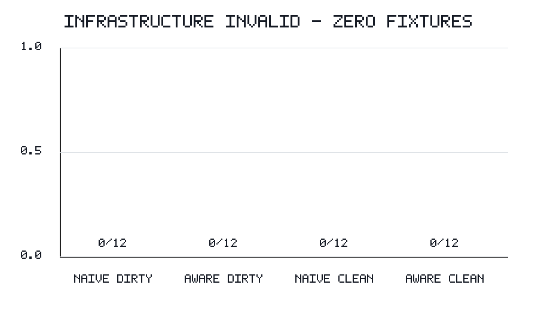

# Aborted Docker Endpoint Preflight Prevented the 24-Execution Completion Test

## Abstract

This protocol was intended to determine whether six dirty synthetic fixtures, six matched clean controls, and identical replays—24 sequential container executions in total—could complete within a 1,200-second timed section after `docker info`, `docker version`, `docker ps`, and a smoke container passed. The planned comparison was between parent-exit monitoring and process-tree- and declared-output-aware monitoring.

The experiment did not begin. All three Docker command gates exited with code 1 because the daemon was inaccessible at the protocol-mandated endpoint, `unix:///var/run/docker.sock`. The fixture image was not built or identified, the smoke test was not run, the timed section was not started, and zero fixtures were scheduled. Outcomes that required fixture execution—including monitor acceptance, replay agreement, and timed-section success—are therefore reported as **not applicable**, not as zero or false.

This aborted preflight provides no evidence for or against the monitoring hypothesis, completion semantics, replay consistency, or 1,200-second feasibility. It is retained only as an infrastructure audit trail. A publishable evaluation requires a new run on infrastructure where all three exact-endpoint Docker gates and the smoke test pass, followed by all 24 planned executions.

## Background

A containerized environment can improve control over software dependencies, but successful reproduction also requires available infrastructure, a fully specified execution protocol, and sufficient records to independently verify what ran. Container lifecycle monitoring creates an additional completion question: a designated parent process may exit successfully while a descendant continues computing or retains an open handle to a declared output.

The planned protocol separated infrastructure validation from a bounded experimental section so that Docker availability failures would not be confused with monitor behavior or execution timeout. It also called for an exact Docker endpoint, immutable image identification, fixed seeds, sequential execution, per-container timeouts, and primary/replay comparison.

The exact endpoint requirement was a protocol-control decision rather than a claim that `unix:///var/run/docker.sock` is scientifically necessary for every Docker installation. Fixing the endpoint can prevent an experiment from silently using a different daemon or context between runs. However, Docker Desktop may expose its daemon through a platform- or installation-specific socket rather than the native-Linux path `/var/run/docker.sock`. The available materials do not justify why the native-Linux socket path had to be used on this `darwin/arm64` host instead of recording and pinning Docker Desktop’s actual endpoint. A revised execution protocol must either make the required path resolve to the intended daemon or document a scientifically justified, immutable endpoint appropriate to the target platform before the run begins.

The original report used numbered citations [1]–[7], but the corresponding bibliographic metadata was not supplied. Those citation markers have therefore been removed rather than retained as unverifiable references. Complete references would be required in a publishable version.

## Hypothesis

The planned hypothesis was that, for six dirty synthetic fixtures in which the designated parent exits successfully while a descendant continues computing or retains an open declared output:

- a naive monitor would accept each dirty execution at successful parent exit;
- a process-tree- and output-aware monitor would not accept a dirty execution at that instant and would accept it only after all tracked descendants had terminated and all declared outputs were closed; and
- both monitors would accept six matched clean controls at successful parent exit.

Each dirty fixture and clean control was to run once in a primary sequence and once in an identical replay, yielding 12 dirty and 12 clean executions.

This should be treated as a planned **deterministic conformance test**, not as a statistical experiment. The intended observations were exact pass/fail relationships for specified synthetic process and output topologies. Six fixture pairs cannot support statistical generalization to the broader population of containerized programs, operating systems, runtimes, daemon configurations, or process behaviors.

The available report does not define the individual behaviors of D1–D6 or C1–C6. It states only that D1–D6 were intended to involve a continuing descendant or an open declared output and that C1–C6 were matched clean controls. Consequently, neither the claimed topology coverage nor the adequacy of the six pairs can be assessed from the supplied material. A completed conformance report must define each fixture and explain which distinct process-tree, reparenting, daemonization, output-lifetime, or race condition it covers.

## Method

A standard-library Python 3.12 harness was reportedly configured with `PYTHONHASHSEED=1729` and `random.seed(1729)`. The recorded interpreter version was Python 3.12.9. Runtime network access, external datasets, and image pulls were prohibited. The required Docker endpoint was fixed as:

```text
DOCKER_HOST=unix:///var/run/docker.sock
```

Before any fixture could be scheduled, the harness separately invoked the following commands with 30-second timeouts:

```text
docker info
docker version
docker ps
```

Each command was required to exit with code 0 from the final non-root harness process. A locally built fixture image and a smoke container printing exactly `1729` were then required before the timed section could begin. Failure of any gate required fail-closed behavior: schedule zero fixtures, classify the infrastructure as invalid, leave the timed-section clock unstarted, and make all execution-dependent outcomes not applicable.

The intended monitor predicates were only partially specified:

- **Naive monitor:** accept when the designated parent process exits successfully.
- **Aware monitor:** do not accept solely because the designated parent exits; accept only when every process classified as a tracked descendant has terminated and no declared output remains open.

The supplied material does not contain the operational details needed to implement or independently assess those predicates. In particular, it does not specify:

- how the initial process tree is discovered;
- how descendants created after initial discovery are detected;
- whether process identity is represented by PID alone or by PID plus a creation-time or namespace identity;
- how PID reuse is detected and prevented from corrupting tracking;
- how double-fork daemonization, subreapers, container init processes, reparenting, and orphan adoption are handled;
- whether descendants that escape the initial process group or session remain in scope;
- how declared outputs are enumerated and associated with each fixture;
- whether an output is considered open based on `/proc`, runtime metadata, filesystem observation, or another mechanism;
- how open files held by reparented descendants are detected;
- the polling cadence or whether event-driven monitoring is used;
- how process-exit and file-close races between observations are resolved;
- the timeout applied to each container and the classification assigned at timeout;
- whether a timeout terminates the complete container process tree and how that termination is verified;
- whether “parent exit” means the runtime-observed exit event, collection of exit status, or a later polling observation;
- the exact timestamp recorded for naive acceptance;
- the exact timestamp recorded for aware acceptance;
- how simultaneous parent exit, final descendant exit, and final output closure are ordered; and
- what clock source and timestamp precision are used.

No implementation code for D1–D6, C1–C6, either monitor, or the harness was supplied with the report. No fixture image definition, configuration, structured result file, complete command transcript, execution timestamps, immutable base-image identifier, immutable fixture-image identifier, generated artifact, or cryptographic artifact hash was supplied. The description therefore documents an intended protocol but does not establish that an independently verifiable deterministic harness existed or behaved as described.

During the retained preflight attempt, the Docker client identified itself as Docker 28.3.3 on `darwin/arm64`, using the default context. All three Docker commands reached the preflight gate but could not connect to the required Unix socket. `docker info` also emitted warnings about two missing CLI plugin executables. The decisive error reported for all three gates was:

```text
Cannot connect to the Docker daemon at unix:///var/run/docker.sock.
Is the docker daemon running?
```

The harness consequently did not select or build images, run the smoke container, schedule fixtures, or enter the timed section. D1–D6, C1–C6, and their replays were not executed. No parent process, descendant process, declared-output state, monitor decision, or acceptance timestamp was observed.

## Results

There is no principal experimental result because no experimental execution occurred. The following information is retained only as an audit trail of the aborted infrastructure preflight.

All three required Docker command gates executed, failed with exit code 1, and did not reach their 30-second timeout:

| Gate | Exit code | Timed out |
|---|---:|---|
| `docker info` | 1 | false |
| `docker version` | 1 | false |
| `docker ps` | 1 | false |

The experiment-level status was:

| Measurement | Result |
|---|---|
| Fixtures scheduled | 0 |
| Valid executions | 0 |
| Execution records | 0 |
| Timed section started | No |
| Timed-section duration | Not applicable |
| Timed-section pass | Not applicable |
| Infrastructure valid | No |
| Hypothesis evaluated | No |
| Replay matches | Not applicable |
| Recorded base image ID | Not applicable; no image was selected |
| Recorded fixture image ID | Not applicable; no fixture image was built or selected |
| Generated artifact hashes | Not applicable; no experimental artifacts were generated |

Zero is used above only for actual administrative counts: no fixtures were scheduled, no executions occurred, and no execution records were created. It is not used to encode unobserved monitor outcomes.

The status of all 24 planned executions was:

| Planned execution | Sequence | Scheduling status | Experimental outcome |
|---|---|---|---|
| D1 | Primary | Not scheduled | Not applicable |
| D2 | Primary | Not scheduled | Not applicable |
| D3 | Primary | Not scheduled | Not applicable |
| D4 | Primary | Not scheduled | Not applicable |
| D5 | Primary | Not scheduled | Not applicable |
| D6 | Primary | Not scheduled | Not applicable |
| C1 | Primary | Not scheduled | Not applicable |
| C2 | Primary | Not scheduled | Not applicable |
| C3 | Primary | Not scheduled | Not applicable |
| C4 | Primary | Not scheduled | Not applicable |
| C5 | Primary | Not scheduled | Not applicable |
| C6 | Primary | Not scheduled | Not applicable |
| D1 | Replay | Not scheduled | Not applicable |
| D2 | Replay | Not scheduled | Not applicable |
| D3 | Replay | Not scheduled | Not applicable |
| D4 | Replay | Not scheduled | Not applicable |
| D5 | Replay | Not scheduled | Not applicable |
| D6 | Replay | Not scheduled | Not applicable |
| C1 | Replay | Not scheduled | Not applicable |
| C2 | Replay | Not scheduled | Not applicable |
| C3 | Replay | Not scheduled | Not applicable |
| C4 | Replay | Not scheduled | Not applicable |
| C5 | Replay | Not scheduled | Not applicable |
| C6 | Replay | Not scheduled | Not applicable |

All monitor-dependent aggregates are undefined because their denominator—the number of executed fixtures—is zero:

- dirty naive accepts: not applicable;
- dirty aware accepts: not applicable;
- dirty aware rejects at parent exit: not applicable;
- clean naive accepts: not applicable; and
- clean aware accepts: not applicable.



The figure is an experiment-flow/status diagram rather than a rate plot. No acceptance or rejection rate can be calculated with zero executed fixtures, and no zero-denominator rate should be interpreted as an observed value.

The central timing question remains unanswered. The 1,200-second clock never started, so there is no timed-section duration and no timed-section pass/fail outcome. Likewise, there are no observations of parent exit, descendant termination, declared-output closure, monitor acceptance, replay agreement, completion ordering, or timeout behavior.

The retained run is classified as `infrastructure_invalid`, with an overall audit status of **broken**. That classification describes the preflight infrastructure and is not a substantive negative result about either monitor. The run neither supports nor refutes the monitoring hypothesis and provides no evidence that the planned suite can or cannot complete within 1,200 seconds.

## Limitations

- **The required completed experiment is unavailable:** The reviewer-requested rerun on infrastructure where all three exact-endpoint Docker gates and the smoke test pass was not supplied. It is therefore impossible to report measured outcomes for all 24 executions without inventing data. This report must not be treated as a publishable evaluation of the hypothesis.
- **Zero experimental executions:** None of the 24 planned containers ran. Parent exit, descendant lifetime, declared-output closure, safety lag, closure lag, monitor acceptance, acceptance timestamps, and eventual aware acceptance are all unobserved.
- **Undefined outcomes:** Timed-section success, replay agreement, and all monitor classifications are not applicable. They cannot be encoded as false or zero because no corresponding test was executed.
- **Infrastructure failure is not a hypothesis result:** Failure to contact the Docker daemon is an aborted experiment, not evidence that parent-exit monitoring is safe or unsafe, that aware monitoring succeeds or fails, or that the planned runtime bound is feasible.
- **Premise not satisfied:** The intended evaluation was conditional on `docker info`, `docker version`, `docker ps`, and the smoke test passing. The tested runner failed the first three gates at the mandated endpoint, and the smoke test was not reached.
- **Endpoint rationale is incomplete:** Fixing an endpoint can control daemon identity, but the supplied protocol does not establish why `/var/run/docker.sock` is the scientifically appropriate endpoint on Docker Desktop. The record does not establish whether Docker Desktop was stopped, whether its active socket was elsewhere, or whether `/var/run/docker.sock` failed to resolve to that socket.
- **Fixture definitions are absent:** D1–D6 and C1–C6 are not individually defined. Their source code, commands, process topologies, output declarations, expected events, and matching relationships are unavailable.
- **Coverage rationale is absent:** The available materials do not explain why six fixture pairs cover the relevant classes of descendant behavior, daemonization, reparenting, process escape, output retention, or observation races. The suite must be framed as deterministic conformance testing, with an explicit coverage matrix, rather than as a statistical sample supporting generality.
- **Monitor algorithms are underspecified:** Process discovery, descendant tracking, PID reuse defenses, daemonization handling, output-open detection, polling cadence, race resolution, timeout behavior, clock selection, and exact acceptance timestamps are not operationally defined.
- **Harness is not independently verifiable:** No harness source, configuration, fixture image definition, D1–D6 or C1–C6 implementation, structured log, complete transcript, timestamp record, or generated result file was supplied.
- **No immutable image identification:** The base and fixture image identifiers are not empty measured strings; they are not applicable because image selection and construction were never reached. No immutable digest was recorded.
- **No artifact hashes:** No experimental artifacts were generated, and no cryptographic hashes are available. A future release must include hashes for the harness bundle, image definition, structured results, logs, figures, and other generated artifacts.
- **No smoke-test evidence:** The smoke container was not run, so the availability and suitability of the intended image and container runtime were not tested.
- **No replay assessment:** Although seed 1729 was reportedly configured, no fixture consumed it. Primary/replay consistency is therefore unobserved.
- **No timed-section evidence:** The clock was never started. Neither the 1,200-second timed limit nor the stated 30-minute full-run limit was meaningfully tested.
- **Platform scope:** The preflight identified a `darwin/arm64` Docker client. Even a successful run on that environment would establish conformance only for the documented platform, daemon, image digests, and harness version; it would not by itself establish identical behavior on Linux or other architectures.
- **Plugin warnings remain unresolved:** `docker info` reported missing `docker-dev` and `docker-feedback` plugin executables. The available record attributes the gate failures to daemon connectivity, so those warnings cannot be identified as causal.
- **References are unavailable:** Complete bibliographic records for the original citations [1]–[7] were not supplied. Providing reference details would require information not present in the original report, so no replacement citations have been fabricated.

## Follow-up questions

- Can the experiment be rerun on infrastructure where `docker info`, `docker version`, and `docker ps` all pass from the final non-root process through the explicitly recorded endpoint, followed by a smoke container that prints exactly `1729`?
- On Docker Desktop, should the protocol require `/var/run/docker.sock` to resolve to the intended daemon, or should it pin and record Docker Desktop’s actual socket endpoint and daemon identity?
- What are the complete source definitions, commands, process topologies, declared outputs, and expected event sequences for D1–D6 and C1–C6?
- Which distinct lifecycle conditions does each fixture cover, and what important descendant, daemonization, reparenting, process-escape, output-retention, or race topologies remain outside the conformance suite?
- How does the aware monitor discover descendants, defend against PID reuse, handle daemonization and reparenting, detect open declared outputs, poll or subscribe to events, resolve observation races, and assign exact acceptance timestamps?
- Can the complete harness, fixture image definition, fixture and control implementations, immutable base and fixture image identifiers, configuration, structured logs, command transcript, timestamps, generated artifacts, and cryptographic hashes be released?
- Once all preconditions pass, do all 24 sequential primary and replay executions complete within 1,200.000 seconds?
- In that completed run, do all 12 dirty executions produce naive acceptance at parent exit and aware non-acceptance at that instant, followed by aware acceptance only after tracked descendants terminate and declared outputs close?
- Do both monitors accept all 12 clean executions at successful parent exit?
- Do primary and replay executions produce identical classifications and completion ordering under the fully specified deterministic protocol?
- After conformance is established on the target `darwin/arm64` environment, do independently executed runs using the same immutable artifacts produce the same results on a documented Linux runner?
