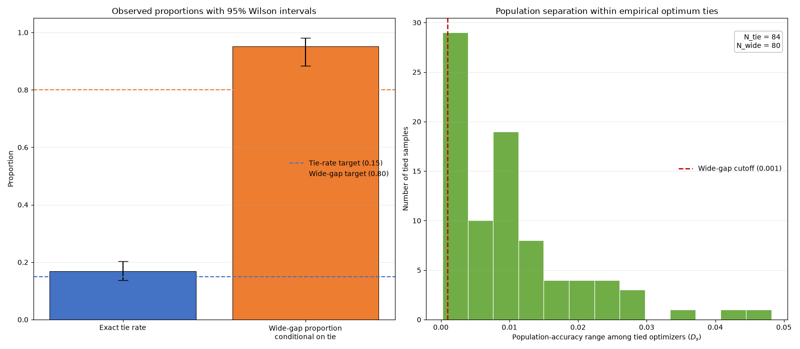

# Exact Validation-Accuracy Ties Despite a Unique Population-Optimal Classifier

## Abstract

This retrospective simulation report examines exact empirical-optimum ties among 11 fixed probability-threshold classifiers whose quadrature-based population accuracies were reported to be pairwise distinct. In the recorded fixed-seed run, 500 validation samples of size 300 were generated from an asymmetric one-dimensional logistic model and evaluated using integer correct-classification counts. The supplied aggregate record reports 84 tied samples (16.8%), of which 80 (95.24%) contained empirical optimizers whose population accuracies differed by more than 0.001.

These counts pass the study’s operational thresholds of at least 75 ties and at least \(\lceil0.80N_{\text{tie}}\rceil\) wide-gap ties. That outcome is a fixed-run protocol check, not strong population-level confirmation that the underlying tie probability exceeds 0.15. In particular, the reported 95% Wilson interval for the tie probability, \([0.1378,0.2033]\), includes 0.15, and the count rule was not calibrated as a hypothesis test. The values 0.15, 0.80, and 0.001 should be understood as demonstration thresholds rather than substantively validated standards.

No timestamped preregistration, original source files, historical environment lock, complete population-accuracy table, or sample-level output accompanied the supplied report. Consequently, claims that the seed and specifications were fixed before inspection, that no rerunning occurred, and that the aggregate counts exactly arose from a particular stateful RNG call sequence cannot be independently verified. This revision supplies a complete executable reconstruction, an explicit RNG call order and array-shape specification, artifact schemas, and figure-generation code. Because the original RNG assignment was not documented, the reconstruction cannot be certified as the exact historical implementation until it is executed and compared with the original files.

## Background

Hyperparameter and model selection often compare candidates using empirical validation scores. When the score is a count of correct classifications, its possible values are discrete. Distinct classifiers can therefore receive exactly the same empirical score even when their population accuracies differ. An empirical tie consequently does not, by itself, imply multiple population-risk minimizers or genuine equivalence among candidates.

That elementary observation is not new. The contribution of this experiment is more limited: it provides a constructed numerical illustration in which a fixed grid reportedly has a unique population-optimal classifier and pairwise-distinct population accuracies, yet exact ties occur at the empirical optimum in one finite, fixed-seed simulation. The experiment also records whether the tied empirical optimizers are separated by more than an operational population-accuracy threshold.

The construction does not show that score discretization alone caused the observed optimizer structure. The ties arise from the joint effect of finite-sample outcome and predictor variation, integer-valued accuracy scores, and strongly correlated predictions from nested threshold classifiers. Nor does one data-generating process establish how prevalent such ties are in model tuning generally.

The original report used numbered citations [1–10] but did not provide authors, titles, venues, years, or other information sufficient to identify those sources reliably. Those unsupported citation markers have therefore been removed rather than replaced by guessed references. A complete bibliography cannot be reconstructed from the supplied material without inventing citations. This missing provenance is recorded as a limitation and should be corrected in any archival version by recovering the original reference list.

## Hypothesis

The original operational hypothesis was:

> Across 500 samples of size \(n=300\) from the specified asymmetric one-dimensional logistic data-generating process, tuning 11 fixed probability-threshold classifiers with distinct population accuracies would produce an exact validation-accuracy tie for the empirical optimum in at least 15% of samples. Moreover, at least 80% of those tie events would contain candidates whose population accuracies differed by more than 0.001.

The associated count rule was:

- at least \(75\) tied samples among \(500\) samples; and
- at least \(\lceil0.80N_{\text{tie}}\rceil\) wide-gap ties, where a wide-gap tie had an optimizer population-accuracy range greater than \(0.001\).

No timestamped preregistration or external protocol record was supplied. The study is therefore relabeled as a **retrospective simulation with a recorded operational decision rule**, not a preregistered confirmatory experiment. Statements that the hypothesis, seed, grid, thresholds, and decision rule were fixed before results were inspected are historical claims from the original report, not independently established facts. Without an external timestamp or immutable record, seed shopping, grid tuning, and post-exploration threshold selection cannot be ruled out.

Two estimands or claims must be distinguished:

1. **Fixed-run protocol estimand.** For the exact deterministic output produced by a specified implementation and the stream initialized by `PCG64(20250308)`, did the resulting counts cross the operational thresholds? This is a reproducibility and computation claim. According to the supplied aggregate record, the answer is yes.

2. **Underlying-probability estimand.** Let
   \[
   p_{\text{tie}}
   =
   \Pr\!\left(|O_s|\ge2\right)
   \]
   for a new modeled-i.i.d. sample of 300 observations from the specified data-generating process, and let
   \[
   p_{\text{wide}\mid\text{tie}}
   =
   \Pr\!\left(D_s>0.001\mid |O_s|\ge2\right).
   \]
   The observed proportions estimate these probabilities, but the raw count rule is not a calibrated test of \(p_{\text{tie}}>0.15\). The reported 95% Wilson interval for \(p_{\text{tie}}\) includes 0.15, so the present data do not establish at the conventional 95% level that the underlying tie probability is greater than 0.15.

The values 0.15, 0.80, and 0.001 have no supplied domain-specific or decision-theoretic justification. They are retained as arbitrary operational demonstration thresholds:

- \(0.15\) defines the recorded tie-count reference level;
- \(0.80\) defines the recorded conditional wide-gap reference level; and
- \(0.001\) defines a numerical population-accuracy separation of one-tenth of one percentage point.

Crossing these thresholds does not by itself demonstrate scientific or practical importance. In particular, the event \(N_{\text{tie}}\ge75\) has substantial probability when the true tie probability is exactly 0.15, so it is weak evidence for a rate strictly above 0.15.

## Method

The predictor distribution was defined by

\[
a=5,\qquad \delta=\frac{a}{\sqrt{1+a^2}},
\]

with independent modeled random variables \(U,V\sim N(0,1)\), and

\[
X=-1+1.5\left(\delta |U|+\sqrt{1-\delta^2}\,V\right).
\]

Thus, \(X\) has a skew-normal distribution with shape 5, location \(-1\), and scale \(1.5\). Given \(X=x\),

\[
Y\mid X=x\sim\operatorname{Bernoulli}(\operatorname{expit}(x)),
\]

implemented as

\[
Y=\mathbf 1[R<\operatorname{expit}(X)],
\qquad R\sim\operatorname{Uniform}(0,1).
\]

The logistic intercept is 0, the slope is 1, and the Bayes probability cutoff is 0.5.

Exactly 11 fixed candidate classifiers are evaluated at

\[
q_j=0.30+0.04j,\qquad j=0,\ldots,10,
\]

giving

\[
[0.30,0.34,0.38,0.42,0.46,0.50,0.54,0.58,0.62,0.66,0.70].
\]

Candidate \(j\) predicts

\[
h_j(x)=\mathbf 1[\operatorname{expit}(x)\ge q_j]
      =\mathbf 1[x\ge\operatorname{logit}(q_j)].
\]

For \(t_j=\operatorname{logit}(q_j)\), \(z=(x+1)/1.5\), and

\[
f(x)=\frac{2\phi(z)\Phi(5z)}{1.5},
\]

the population accuracy is

\[
A_j=
\int_{-\infty}^{t_j}
[1-\operatorname{expit}(x)]f(x)\,dx
+
\int_{t_j}^{\infty}
\operatorname{expit}(x)f(x)\,dx.
\]

The reconstructed implementation evaluates the two integrals separately using `scipy.integrate.quad` with `epsabs=1e-12`, `epsrel=1e-12`, and `limit=500`. It requires all 11 accuracies to be finite, every pair to differ by more than \(10^{-8}\), and \(q=0.50\) to be the sole population-accuracy maximizer.

For sample \(s\) and candidate \(j\), the score is the integer number of correct classifications,

\[
C_{sj}=\sum_{i=1}^{300}\mathbf 1[h_j(X_{si})=Y_{si}].
\]

Let

\[
M_s=\max_j C_{sj},\qquad
O_s=\{j:C_{sj}=M_s\}.
\]

A tie occurs when \(|O_s|\ge2\). For a tied sample,

\[
D_s=\max_{j\in O_s} A_j-\min_{j\in O_s} A_j.
\]

A wide-gap tie is defined operationally as \(D_s>0.001\).

### RNG interpretation, call order, and array shapes

The 500 modeled samples are independent and identically distributed under the mathematical data-generating process. Their computer representation is nevertheless generated deterministically from one pseudorandom stream. One seed does not independently validate robustness, and rows from a pseudorandom array should not be confused with separate physical randomization procedures.

The historical report did not say whether random values were drawn jointly, one sample at a time, or one observation at a time. Those choices consume a stateful RNG differently and can produce different fixed-seed results. The following call order is therefore an explicit **reconstructed implementation**, not a verified description of the unavailable original code:

1. Initialize exactly one generator:
   ```python
   rng = numpy.random.Generator(numpy.random.PCG64(20250308))
   ```
2. Make one call for
   ```python
   U = rng.standard_normal(size=(500, 300))
   ```
   producing 150,000 values with shape `(500, 300)`.
3. Make one call for
   ```python
   V = rng.standard_normal(size=(500, 300))
   ```
   producing the next 150,000 values with shape `(500, 300)`.
4. Make one call for
   ```python
   R = rng.random(size=(500, 300))
   ```
   producing the next 150,000 values with shape `(500, 300)`.
5. Derive, without further RNG calls:
   - `X`: shape `(500, 300)`;
   - `P`: shape `(500, 300)`;
   - `Y`: shape `(500, 300)`;
   - `predictions`: shape `(500, 300, 11)`;
   - `scores`: shape `(500, 11)`;
   - `optimizer_mask`: shape `(500, 11)`.

All population quadrature is deterministic and occurs before RNG initialization in the supplied code. There are no RNG calls during quadrature, analysis, CSV creation, JSON creation, or figure generation.

If the original program instead used a loop such as `U_s`, then `V_s`, then `R_s` for each sample, the fixed-seed arrays and aggregate counts would generally differ. Reproducing the exact historical counts therefore requires either the original source code, the original RNG state transitions, or the original generated arrays.

### Executable reconstruction and artifact generation

The following single-file program computes all 11 population accuracies, generates all sample-level score vectors and optimizer sets, calculates every population gap, writes a summary JSON, records the runtime software versions, and generates the referenced figure.

Save it as `run_tuning_tie_simulation.py` and execute it from the directory in which the `workspace` folder should be created.

```python
#!/usr/bin/env python3

import csv
import hashlib
import json
import math
import platform
import sys
from importlib.metadata import version
from pathlib import Path

import matplotlib
import matplotlib.pyplot as plt
import numpy as np
import pandas as pd
import scipy
from scipy.integrate import quad
from scipy.special import expit, logit, ndtr


SEED = 20250308
N_SAMPLES = 500
N_OBS = 300
SHAPE_A = 5.0
LOCATION = -1.0
SCALE = 1.5

CUTOFFS = np.array(
    [0.30, 0.34, 0.38, 0.42, 0.46, 0.50,
     0.54, 0.58, 0.62, 0.66, 0.70],
    dtype=np.float64,
)

PAIRWISE_DISTINCT_TOL = 1e-8
TIE_RATE_REFERENCE = 0.15
WIDE_RATE_REFERENCE = 0.80
WIDE_GAP_THRESHOLD = 0.001

ARTIFACT_DIR = Path("workspace/artifacts")
FIGURE_DIR = Path("workspace/figures")
FIGURE_PATH = FIGURE_DIR / "tuning_tie_results.png"


def normal_pdf(z):
    return np.exp(-0.5 * z * z) / math.sqrt(2.0 * math.pi)


def skew_normal_pdf(x):
    z = (x - LOCATION) / SCALE
    return 2.0 * normal_pdf(z) * ndtr(SHAPE_A * z) / SCALE


def population_accuracy(q):
    threshold = float(logit(q))

    def lower_integrand(x):
        return (1.0 - expit(x)) * skew_normal_pdf(x)

    def upper_integrand(x):
        return expit(x) * skew_normal_pdf(x)

    lower_value, lower_error = quad(
        lower_integrand,
        -np.inf,
        threshold,
        epsabs=1e-12,
        epsrel=1e-12,
        limit=500,
    )
    upper_value, upper_error = quad(
        upper_integrand,
        threshold,
        np.inf,
        epsabs=1e-12,
        epsrel=1e-12,
        limit=500,
    )

    return (
        float(lower_value + upper_value),
        float(lower_error),
        float(upper_error),
    )


def wilson_interval(successes, trials, confidence=0.95):
    if trials <= 0:
        return (None, None)

    # 1.959963984540054 is the 97.5th percentile of N(0,1).
    # The program uses confidence=0.95 only.
    if confidence != 0.95:
        raise ValueError("This implementation supports confidence=0.95 only.")

    z = 1.959963984540054
    p_hat = successes / trials
    denominator = 1.0 + z * z / trials
    center = (p_hat + z * z / (2.0 * trials)) / denominator
    half_width = (
        z
        * math.sqrt(
            p_hat * (1.0 - p_hat) / trials
            + z * z / (4.0 * trials * trials)
        )
        / denominator
    )
    return (center - half_width, center + half_width)


def json_ready(value):
    if isinstance(value, dict):
        return {str(k): json_ready(v) for k, v in value.items()}
    if isinstance(value, (list, tuple)):
        return [json_ready(v) for v in value]
    if isinstance(value, np.ndarray):
        return value.tolist()
    if isinstance(value, np.integer):
        return int(value)
    if isinstance(value, np.floating):
        if np.isnan(value):
            return None
        return float(value)
    if isinstance(value, Path):
        return str(value)
    return value


def sha256_file(path):
    digest = hashlib.sha256()
    with path.open("rb") as handle:
        for block in iter(lambda: handle.read(1024 * 1024), b""):
            digest.update(block)
    return digest.hexdigest()


def main():
    ARTIFACT_DIR.mkdir(parents=True, exist_ok=True)
    FIGURE_DIR.mkdir(parents=True, exist_ok=True)

    # ---------------------------------------------------------------
    # 1. Deterministic population calculations; no RNG is used here.
    # ---------------------------------------------------------------
    population_rows = []
    population_accuracies = np.empty(len(CUTOFFS), dtype=np.float64)

    for j, q in enumerate(CUTOFFS):
        accuracy, lower_error, upper_error = population_accuracy(float(q))
        population_accuracies[j] = accuracy
        population_rows.append(
            {
                "candidate_index": j,
                "cutoff": float(q),
                "logit_threshold": float(logit(q)),
                "population_accuracy": accuracy,
                "quad_lower_error": lower_error,
                "quad_upper_error": upper_error,
            }
        )

    if not np.all(np.isfinite(population_accuracies)):
        raise RuntimeError("At least one population accuracy is non-finite.")

    pairwise_differences = np.abs(
        population_accuracies[:, None] - population_accuracies[None, :]
    )
    upper_triangle = np.triu_indices(len(CUTOFFS), k=1)
    minimum_pairwise_difference = float(
        pairwise_differences[upper_triangle].min()
    )

    if minimum_pairwise_difference <= PAIRWISE_DISTINCT_TOL:
        raise RuntimeError(
            "Population accuracies are not pairwise distinct at the "
            f"{PAIRWISE_DISTINCT_TOL} tolerance."
        )

    population_best_index = int(np.argmax(population_accuracies))
    population_maximizer_count = int(
        np.sum(population_accuracies == population_accuracies.max())
    )

    if population_maximizer_count != 1:
        raise RuntimeError("The population maximizer is not unique.")

    if population_best_index != 5 or not np.isclose(CUTOFFS[5], 0.50):
        raise RuntimeError("The unique population maximizer is not q=0.50.")

    population_best_accuracy = float(
        population_accuracies[population_best_index]
    )

    for row in population_rows:
        row["deficit_from_population_best"] = (
            population_best_accuracy - row["population_accuracy"]
        )
        row["is_population_best"] = (
            row["candidate_index"] == population_best_index
        )

    population_df = pd.DataFrame(population_rows)
    population_path = ARTIFACT_DIR / "population_accuracies.csv"
    population_df.to_csv(
        population_path,
        index=False,
        float_format="%.17g",
        quoting=csv.QUOTE_MINIMAL,
    )

    # ---------------------------------------------------------------
    # 2. Sole RNG initialization and exact RNG call order.
    # ---------------------------------------------------------------
    rng = np.random.Generator(np.random.PCG64(SEED))

    # RNG call 1: shape (500, 300), 150,000 standard-normal draws.
    U = rng.standard_normal(size=(N_SAMPLES, N_OBS))

    # RNG call 2: shape (500, 300), next 150,000 standard-normal draws.
    V = rng.standard_normal(size=(N_SAMPLES, N_OBS))

    # RNG call 3: shape (500, 300), next 150,000 U[0,1) draws.
    R = rng.random(size=(N_SAMPLES, N_OBS))

    # No further RNG calls occur below.
    delta = SHAPE_A / math.sqrt(1.0 + SHAPE_A * SHAPE_A)

    X = LOCATION + SCALE * (
        delta * np.abs(U) + math.sqrt(1.0 - delta * delta) * V
    )
    P = expit(X)
    Y = R < P

    # Shapes:
    # X, P, Y: (500, 300)
    # predictions: (500, 300, 11)
    # scores: (500, 11)
    predictions = P[:, :, None] >= CUTOFFS[None, None, :]
    scores = np.sum(predictions == Y[:, :, None], axis=1, dtype=np.int64)

    if X.shape != (N_SAMPLES, N_OBS):
        raise RuntimeError(f"Unexpected X shape: {X.shape}")
    if P.shape != (N_SAMPLES, N_OBS):
        raise RuntimeError(f"Unexpected P shape: {P.shape}")
    if Y.shape != (N_SAMPLES, N_OBS):
        raise RuntimeError(f"Unexpected Y shape: {Y.shape}")
    if predictions.shape != (N_SAMPLES, N_OBS, len(CUTOFFS)):
        raise RuntimeError(f"Unexpected prediction shape: {predictions.shape}")
    if scores.shape != (N_SAMPLES, len(CUTOFFS)):
        raise RuntimeError(f"Unexpected score shape: {scores.shape}")

    maximum_scores = scores.max(axis=1)
    optimizer_mask = scores == maximum_scores[:, None]
    optimizer_counts = optimizer_mask.sum(axis=1)
    tie_mask = optimizer_counts >= 2

    gap_values = np.full(N_SAMPLES, np.nan, dtype=np.float64)
    optimizer_population_min = np.full(
        N_SAMPLES, np.nan, dtype=np.float64
    )
    optimizer_population_max = np.full(
        N_SAMPLES, np.nan, dtype=np.float64
    )

    for s in range(N_SAMPLES):
        selected_accuracies = population_accuracies[optimizer_mask[s]]
        optimizer_population_min[s] = float(selected_accuracies.min())
        optimizer_population_max[s] = float(selected_accuracies.max())
        if tie_mask[s]:
            gap_values[s] = float(
                selected_accuracies.max() - selected_accuracies.min()
            )

    wide_gap_mask = tie_mask & (gap_values > WIDE_GAP_THRESHOLD)

    population_best_in_optimizer = optimizer_mask[:, population_best_index]
    empirical_rank_population_best = (
        1
        + np.sum(
            scores > scores[:, population_best_index, None],
            axis=1,
        )
    )

    sample_rows = []
    for s in range(N_SAMPLES):
        optimizer_indices = np.flatnonzero(optimizer_mask[s]).astype(int)
        optimizer_cutoffs = CUTOFFS[optimizer_indices]
        optimizer_accuracies = population_accuracies[optimizer_indices]

        row = {
            "sample_index": s,
            "maximum_correct_count": int(maximum_scores[s]),
            "maximum_empirical_accuracy": float(
                maximum_scores[s] / N_OBS
            ),
            "optimizer_count": int(optimizer_counts[s]),
            "is_tie": bool(tie_mask[s]),
            "optimizer_indices_json": json.dumps(
                optimizer_indices.tolist(),
                separators=(",", ":"),
            ),
            "optimizer_cutoffs_json": json.dumps(
                optimizer_cutoffs.tolist(),
                separators=(",", ":"),
            ),
            "optimizer_population_accuracies_json": json.dumps(
                optimizer_accuracies.tolist(),
                separators=(",", ":"),
            ),
            "optimizer_population_accuracy_min": float(
                optimizer_population_min[s]
            ),
            "optimizer_population_accuracy_max": float(
                optimizer_population_max[s]
            ),
            "optimizer_population_accuracy_gap": (
                float(gap_values[s]) if tie_mask[s] else np.nan
            ),
            "is_wide_gap_tie": bool(wide_gap_mask[s]),
            "population_best_in_optimizer_set": bool(
                population_best_in_optimizer[s]
            ),
            "population_best_empirical_rank": int(
                empirical_rank_population_best[s]
            ),
            "score_vector_json": json.dumps(
                scores[s].astype(int).tolist(),
                separators=(",", ":"),
            ),
        }

        for j, q in enumerate(CUTOFFS):
            row[f"score_count_q_{q:.2f}"] = int(scores[s, j])
            row[f"is_optimizer_q_{q:.2f}"] = bool(optimizer_mask[s, j])

        sample_rows.append(row)

    sample_df = pd.DataFrame(sample_rows)
    sample_path = ARTIFACT_DIR / "sample_results.csv"
    sample_df.to_csv(
        sample_path,
        index=False,
        float_format="%.17g",
        quoting=csv.QUOTE_MINIMAL,
    )

    score_matrix_path = ARTIFACT_DIR / "score_matrix.csv"
    score_matrix_df = pd.DataFrame(
        scores,
        columns=[f"q_{q:.2f}" for q in CUTOFFS],
    )
    score_matrix_df.insert(0, "sample_index", np.arange(N_SAMPLES))
    score_matrix_df.to_csv(score_matrix_path, index=False)

    optimizer_matrix_path = ARTIFACT_DIR / "optimizer_matrix.csv"
    optimizer_matrix_df = pd.DataFrame(
        optimizer_mask.astype(np.int8),
        columns=[f"q_{q:.2f}" for q in CUTOFFS],
    )
    optimizer_matrix_df.insert(0, "sample_index", np.arange(N_SAMPLES))
    optimizer_matrix_df.to_csv(optimizer_matrix_path, index=False)

    n_ties = int(tie_mask.sum())
    n_wide = int(wide_gap_mask.sum())
    tie_rate = n_ties / N_SAMPLES
    wide_rate = n_wide / n_ties if n_ties else float("nan")

    tie_interval = wilson_interval(n_ties, N_SAMPLES)
    wide_interval = wilson_interval(n_wide, n_ties)

    required_ties = math.ceil(TIE_RATE_REFERENCE * N_SAMPLES)
    required_wide = math.ceil(WIDE_RATE_REFERENCE * n_ties)

    population_best_sole = int(
        np.sum(
            population_best_in_optimizer
            & (optimizer_counts == 1)
        )
    )
    population_best_tied = int(
        np.sum(
            population_best_in_optimizer
            & tie_mask
        )
    )
    population_best_absent = int(
        np.sum(~population_best_in_optimizer)
    )

    software = {
        "python": platform.python_version(),
        "python_implementation": platform.python_implementation(),
        "platform": platform.platform(),
        "numpy": np.__version__,
        "scipy": scipy.__version__,
        "pandas": pd.__version__,
        "matplotlib": matplotlib.__version__,
    }

    summary = {
        "study_label": "retrospective simulation reconstruction",
        "seed": SEED,
        "bit_generator": "PCG64",
        "rng_call_order": [
            {
                "call": 1,
                "method": "standard_normal",
                "target": "U",
                "shape": [N_SAMPLES, N_OBS],
            },
            {
                "call": 2,
                "method": "standard_normal",
                "target": "V",
                "shape": [N_SAMPLES, N_OBS],
            },
            {
                "call": 3,
                "method": "random",
                "target": "R",
                "shape": [N_SAMPLES, N_OBS],
            },
        ],
        "array_shapes": {
            "U": list(U.shape),
            "V": list(V.shape),
            "R": list(R.shape),
            "X": list(X.shape),
            "P": list(P.shape),
            "Y": list(Y.shape),
            "predictions": list(predictions.shape),
            "scores": list(scores.shape),
            "optimizer_mask": list(optimizer_mask.shape),
        },
        "n_samples": N_SAMPLES,
        "sample_size": N_OBS,
        "cutoffs": CUTOFFS,
        "population_accuracies": population_accuracies,
        "minimum_pairwise_population_accuracy_difference":
            minimum_pairwise_difference,
        "population_best_index": population_best_index,
        "population_best_cutoff": float(CUTOFFS[population_best_index]),
        "population_best_accuracy": population_best_accuracy,
        "population_maximizer_count": population_maximizer_count,
        "tie_count": n_ties,
        "tie_rate": tie_rate,
        "tie_rate_wilson_95": tie_interval,
        "tie_count_requirement": required_ties,
        "wide_gap_threshold": WIDE_GAP_THRESHOLD,
        "wide_gap_tie_count": n_wide,
        "wide_gap_rate_conditional_on_tie": wide_rate,
        "wide_gap_rate_wilson_95": wide_interval,
        "wide_gap_count_requirement": required_wide,
        "fixed_run_protocol_check_passed": bool(
            n_ties >= required_ties and n_wide >= required_wide
        ),
        "population_best_sole_optimizer_count": population_best_sole,
        "population_best_tied_optimizer_count": population_best_tied,
        "population_best_absent_count": population_best_absent,
        "software": software,
        "interpretation": {
            "thresholds_are_demonstration_thresholds": True,
            "tie_count_rule_is_a_calibrated_hypothesis_test": False,
            "establishes_tie_probability_above_0_15_at_95_percent": bool(
                tie_interval[0] is not None
                and tie_interval[0] > TIE_RATE_REFERENCE
            ),
        },
    }

    summary_path = ARTIFACT_DIR / "summary.json"
    with summary_path.open("w", encoding="utf-8") as handle:
        json.dump(
            json_ready(summary),
            handle,
            indent=2,
            sort_keys=True,
            allow_nan=False,
        )
        handle.write("\n")

    environment_path = ARTIFACT_DIR / "environment.txt"
    with environment_path.open("w", encoding="utf-8") as handle:
        for key, value in software.items():
            handle.write(f"{key}=={value}\n")

    requirements_path = ARTIFACT_DIR / "requirements.in"
    requirements_path.write_text(
        "numpy\nscipy\npandas\nmatplotlib\n",
        encoding="utf-8",
    )

    # ---------------------------------------------------------------
    # 3. Figure generation; no RNG calls.
    # ---------------------------------------------------------------
    fig, axes = plt.subplots(1, 2, figsize=(11, 4.5))

    observed = np.array([tie_rate, wide_rate], dtype=float)
    references = np.array(
        [TIE_RATE_REFERENCE, WIDE_RATE_REFERENCE],
        dtype=float,
    )
    intervals = [tie_interval, wide_interval]

    lower_errors = np.array(
        [observed[i] - intervals[i][0] for i in range(2)]
    )
    upper_errors = np.array(
        [intervals[i][1] - observed[i] for i in range(2)]
    )

    x_positions = np.arange(2)
    axes[0].bar(
        x_positions,
        observed,
        color=["#4C78A8", "#F58518"],
        width=0.65,
    )
    axes[0].errorbar(
        x_positions,
        observed,
        yerr=np.vstack([lower_errors, upper_errors]),
        fmt="none",
        ecolor="black",
        capsize=5,
        linewidth=1.2,
    )

    for i, reference in enumerate(references):
        axes[0].hlines(
            reference,
            i - 0.36,
            i + 0.36,
            colors="black",
            linestyles="--",
            linewidth=1.2,
        )

    axes[0].set_xticks(
        x_positions,
        ["Exact tie rate", "Wide gap | tie"],
    )
    axes[0].set_ylim(0.0, 1.05)
    axes[0].set_ylabel("Proportion")
    axes[0].set_title("Observed proportions and 95% Wilson intervals")

    tied_gaps = gap_values[tie_mask]
    axes[1].hist(
        tied_gaps,
        bins="auto",
        color="#72B7B2",
        edgecolor="white",
    )
    axes[1].axvline(
        WIDE_GAP_THRESHOLD,
        color="black",
        linestyle="--",
        linewidth=1.2,
        label=f"Threshold = {WIDE_GAP_THRESHOLD:g}",
    )
    axes[1].set_xlabel("Population-accuracy range among optimizers")
    axes[1].set_ylabel("Tied samples")
    axes[1].set_title("Population gaps within empirical ties")
    axes[1].legend()

    fig.tight_layout()
    fig.savefig(FIGURE_PATH, dpi=200, bbox_inches="tight")
    plt.close(fig)

    # Hash all generated artifacts except the checksum file itself.
    checksum_path = ARTIFACT_DIR / "SHA256SUMS.txt"
    artifact_paths = sorted(
        [
            population_path,
            sample_path,
            score_matrix_path,
            optimizer_matrix_path,
            summary_path,
            environment_path,
            requirements_path,
            FIGURE_PATH,
        ],
        key=lambda path: str(path),
    )
    with checksum_path.open("w", encoding="utf-8") as handle:
        for path in artifact_paths:
            handle.write(f"{sha256_file(path)}  {path.as_posix()}\n")

    print(json.dumps(json_ready(summary), indent=2, sort_keys=True))


if __name__ == "__main__":
    main()
```

The program creates the following artifact set:

```text
workspace/
├── artifacts/
│   ├── population_accuracies.csv
│   ├── sample_results.csv
│   ├── score_matrix.csv
│   ├── optimizer_matrix.csv
│   ├── summary.json
│   ├── environment.txt
│   ├── requirements.in
│   └── SHA256SUMS.txt
└── figures/
    └── tuning_tie_results.png
```

The files have the following roles:

- `population_accuracies.csv` contains all 11 cutoffs, logit thresholds, population accuracies, quadrature error estimates, deficits from the population-best accuracy, and population-best indicators.
- `sample_results.csv` contains all 500 score vectors, optimizer indices, optimizer cutoffs, optimizer population accuracies, optimizer gaps, tie indicators, wide-gap indicators, participation of \(q=0.50\), and the empirical rank of \(q=0.50\).
- `score_matrix.csv` contains the complete \(500\times11\) matrix of integer correct-classification counts.
- `optimizer_matrix.csv` contains the complete \(500\times11\) binary optimizer-membership matrix.
- `summary.json` contains the population values, aggregate counts, intervals, thresholds, RNG specification, array shapes, interpretation flags, and runtime software versions.
- `environment.txt` records versions imported during the new execution.
- `requirements.in` lists direct dependencies without asserting unavailable historical versions.
- `SHA256SUMS.txt` provides checksums for audit and transfer.
- `workspace/figures/tuning_tie_results.png` is generated from the same arrays used for the CSV and JSON files.

The following commands provide a reproducible workflow once a compatible Python environment has been selected:

```bash
python -m venv .venv
. .venv/bin/activate
python -m pip install --upgrade pip
python -m pip install numpy scipy pandas matplotlib
python run_tuning_tie_simulation.py
python -m pip freeze > workspace/artifacts/environment-lock.txt
```

On Windows, the activation command is:

```powershell
.venv\Scripts\Activate.ps1
```

The original software claims—Python 3.14.6, NumPy 2.5.1, SciPy 1.18.0, pandas 3.0.3, and Matplotlib 3.11.1—were not supported by an environment file or runtime record in the supplied material and cannot be verified here. They are therefore not repeated as established execution facts. An exact historical lock file cannot be reconstructed without the original environment metadata. The revised code records the versions actually used in any new run, after which `pip freeze` can provide a concrete lock snapshot.

For comparison with a rerun, the supplied aggregate record corresponds to the following partial audit target:

```json
{
  "n_samples": 500,
  "sample_size": 300,
  "population_best_cutoff": 0.5,
  "population_best_accuracy": 0.6610934887717801,
  "minimum_pairwise_population_accuracy_difference": 0.0002548756324741719,
  "tie_count": 84,
  "tie_rate": 0.168,
  "tie_rate_wilson_95": [
    0.1378,
    0.2033
  ],
  "tie_count_requirement": 75,
  "wide_gap_threshold": 0.001,
  "wide_gap_tie_count": 80,
  "wide_gap_rate_conditional_on_tie": 0.9524,
  "wide_gap_rate_wilson_95": [
    0.8839,
    0.9813
  ],
  "wide_gap_count_requirement": 68,
  "population_best_sole_optimizer_count": 100,
  "population_best_tied_optimizer_count": 35,
  "population_best_absent_count": 365
}
```

This partial JSON records only values present in the original report. Missing population accuracies and sample-level values are not filled with invented numbers.

## Results

The following results are the aggregate values stated in the supplied report. Because the original CSV, JSON, code, RNG trace, and environment were not supplied, they should be treated as a reported computational record pending reproduction, not as independently verified outputs.

The population checks were reported to have passed. All 11 quadrature-based population accuracies were described as finite and pairwise distinct. The reported minimum pairwise difference was

\[
0.0002548756324741719,
\]

which exceeds the operational \(10^{-8}\) tolerance. The sole reported population maximizer was the classifier with \(q=0.50\), with population accuracy

\[
0.6610934887717801.
\]

The remaining ten population accuracies were not included in the supplied material and cannot be reproduced in this text without executing the reconstruction or recovering the original `population_accuracies.csv`. The program above produces the complete table in a new run.

Under the stated population checks, an empirical tie cannot be attributed to exactly equal quadrature-based population accuracies. It does not follow that discretization alone caused the ties. Finite-sample variation, integer scoring, and the correlated and nested structure of the threshold classifiers jointly determine which candidates share the maximum count.

Among the 500 validation samples, the supplied aggregate record reports:

- **84** exact empirical-optimum ties;
- an observed tie proportion of **0.168**, or **16.8%**;
- a descriptive 95% Wilson interval of **[0.1378, 0.2033]**;
- an operational requirement of at least 75 tied samples; and
- an excess of 9 tied samples above that operational count threshold.

The observed count therefore passes the fixed-run threshold \(84\ge75\). It does not establish at the 95% level that the underlying probability \(p_{\text{tie}}\) exceeds 0.15, because the reported interval includes 0.15. The count threshold itself is not calibrated as a one-sided statistical test and should not be interpreted as strong evidence against \(p_{\text{tie}}=0.15\).

Of the 84 reported tie events:

- **80** had \(D_s>0.001\);
- the conditional observed proportion was **0.9524**, or **95.24%**;
- its descriptive 95% Wilson interval was **[0.8839, 0.9813]**;
- the operational requirement was
  \[
  \lceil0.80\times84\rceil=68;
  \]
- the reported count exceeded that requirement by 12; and
- 4 tied samples did not cross the 0.001 threshold.

The reported conditional interval lies above 0.80. However, this analysis was not supported by a timestamped inferential protocol, and the 0.80 and 0.001 values lack substantive justification. The result should therefore be interpreted as descriptive evidence within this constructed configuration, not as proof of a generally important effect.



The left panel compares the observed exact-tie proportion and conditional wide-gap proportion with the operational reference levels 0.15 and 0.80. The error bars are descriptive Wilson intervals. The tie-rate interval crosses 0.15; the conditional wide-gap interval does not cross 0.80.

The right panel is intended to display all \(D_s\) values for tied samples, with a vertical reference at 0.001. The underlying sample-level gaps and the original figure-generation code were not supplied with the report. The executable reconstruction above generates this panel directly from the computed optimizer sets and writes the figure to the same required path.

For the unique reported population-best candidate, \(q=0.50\), the aggregate record states:

- it was the **sole empirical optimizer in 100 samples** (20.0%);
- it was **among tied empirical optimizers in 35 samples** (7.0%); and
- it was **absent from the empirical optimizer set in 365 samples** (73.0%).

These categories total 500. Among the 84 reported ties, \(q=0.50\) participated in 35, leaving 49 reported ties involving only population-suboptimal candidates. The complete optimizer sets and empirical ranks were not supplied, so these aggregate claims cannot be traced to individual samples from the original material. The revised program writes those data to `sample_results.csv` and `optimizer_matrix.csv`.

According to the supplied aggregate values,

\[
N_{\text{tie}}=84\ge75
\]

and

\[
N_{\text{wide}}=80\ge
\lceil0.80\times84\rceil=68.
\]

The appropriate verdict is therefore:

> **The reported fixed-seed run passed the recorded operational protocol check.**

It is not appropriate to describe this result as confirmatory population-level support for a true tie rate above 0.15. The present data do not establish \(p_{\text{tie}}>0.15\) at the conventional 95% level, and the experiment does not estimate the prevalence of empirical-optimum ties across model-tuning problems generally.

## Limitations

- **Retrospective rather than preregistered:** No timestamped protocol, repository commit, registration record, or other external evidence was supplied. The original claim of prespecification cannot be independently verified, and post-exploration seed, grid, or threshold selection cannot be ruled out.

- **Unverified historical RNG assignment:** A stateful RNG can generate different fixed-seed outputs depending on whether arrays are drawn jointly, by sample, or by observation. The original call order was absent. This revision gives a precise call order for an executable reconstruction, but it cannot establish that the historical run used that same order.

- **Missing original artifacts:** The original 11-value population-accuracy table, complete \(500\times11\) score matrix, sample-level optimizer sets, population-gap calculations, JSON summary, CSV files, source code, and checksums were not supplied. The revised code generates these artifacts prospectively, but the missing historical values cannot be reconstructed in the report without execution or source recovery.

- **Aggregate claims remain pending reproduction:** The claims of 84 ties, 80 wide-gap ties, and the reported participation counts for \(q=0.50\) cannot be independently checked against sample-level records. If executing the explicit reconstruction does not produce those values, the discrepancy must be investigated rather than resolved by changing the seed, call order, grid, or thresholds after seeing the output.

- **“No rerunning” is not independently established:** The original report stated that no sample was rerun, discarded, replaced, or selected conditionally. In the absence of source-control history, logs, or immutable outputs, that statement is an unverifiable historical assertion. The supplied reconstruction performs one deterministic run and contains no result-dependent rerunning logic.

- **Historical software versions are unverified:** The unusual version claims in the original report were unsupported by a lock file or environment record. This revision does not substitute guessed versions. The program records actual runtime versions, and a new lock snapshot can be generated, but the exact historical environment cannot be recovered from the supplied text.

- **No complete bibliography:** The original numbered citations were not accompanied by enough bibliographic information to identify their sources. A complete bibliography cannot be created without inventing citations. An archival revision requires recovery of the original reference list or a new documented literature review.

- **Uncalibrated count rule:** The condition \(N_{\text{tie}}\ge75\) is an operational threshold, not a calibrated one-sided test. Crossing it is weak evidence for a true rate above 0.15 because the event has substantial probability when the true rate is exactly 0.15.

- **Tie-rate uncertainty:** The reported 95% Wilson interval \([0.1378,0.2033]\) includes 0.15. The current data therefore do not establish at the 95% level that the underlying tie probability exceeds 0.15.

- **Arbitrary demonstration thresholds:** No substantive rationale was supplied for 0.15, 0.80, or 0.001. These values define operational categories for this illustration but do not establish scientific or practical significance.

- **Single data-generating process:** The result applies directly only to the specified skew-normal predictor distribution, logistic response model, and threshold grid. It does not establish prevalence across symmetric distributions, other skewness levels, different slopes or intercepts, multidimensional predictors, or misspecified models.

- **Single sample size:** Only \(n=300\) was studied. Tie behavior can depend strongly on the validation size because accuracy is restricted to \(n+1\) possible count values.

- **Single candidate grid:** Only one 11-candidate grid was considered. Grid spacing, range, density, and nesting affect score correlations and optimizer multiplicity.

- **One deterministic pseudorandom stream:** The modeled samples are i.i.d., but their computer values are deterministic functions of one generator state. One seed does not demonstrate robustness across alternative full Monte Carlo realizations or implementations.

- **Conditional wide-gap estimate:** The denominator for the wide-gap proportion is the random number of ties. Its interpretation is conditional on a tie occurring, and the reported interval does not address uncertainty from choosing the grid, DGP, or gap threshold.

- **Constructed example rather than general evidence:** The experiment demonstrates a possible pattern in one configuration. It does not support a broad conclusion about model tuning without results across multiple prespecified sample sizes, grids, DGP configurations, and independently assigned streams.

- **Limited novelty:** Exact ties under discrete scoring are an elementary finite-sample possibility. The experiment’s value is illustrative and computational rather than theoretical. Its additional descriptive feature is that many reported ties span an operational population-accuracy gap despite a unique reported population optimizer.

- **Causal attribution is limited:** Pairwise-distinct population accuracies rule out exact population equality as the explanation for a tie, but they do not show that discretization alone caused the observed optimum structure. Sampling noise and correlated, nested candidate predictions are also essential.

- **Validation accuracy only:** The conclusions concern equality of integer correct-classification counts. Continuously valued criteria such as log loss or Brier score, and rank-based or cost-sensitive criteria, can behave differently.

- **No training or fold construction:** The candidates were fixed and only evaluated. The experiment excludes fitting instability, fold dependence, repeated cross-validation, data-dependent hyperparameter grids, and selection-induced dependence present in realistic tuning pipelines.

## Follow-up questions

- Can the complete retrospective result first be reproduced from the explicit array-level RNG protocol above, with all generated CSV, JSON, environment, checksum, and figure files archived before any specifications are changed?

- If the reconstructed counts differ from 84 and 80, can the original source code or RNG call order be recovered to explain the discrepancy without searching over alternative implementations for one that matches the aggregate record?

- How do exact-optimum tie rates and conditional wide-gap proportions change at prospectively registered validation sizes
  \[
  n\in\{100,300,1000,3000\},
  \]
  using an externally timestamped protocol and independently assigned streams?

- Holding the DGP and \(n=300\) fixed, how do tie rates change for prospectively specified grids containing 5, 11, 21, or 41 equally spaced cutoffs over the same probability range?

- Do the findings persist across a timestamped factorial design of skew-normal shapes, logistic slopes, predictor locations, and intercepts, with all configurations retained and reported?

- What decision-theoretic or application-specific considerations would justify a population-accuracy gap of 0.001 as practically meaningful?

- If the inferential target is \(p_{\text{tie}}>0.15\), what sample size and one-sided testing procedure should be prospectively selected to provide adequate power while controlling type-I error at the boundary \(p_{\text{tie}}=0.15\)?

- How often do exact or near ties arise when candidates are compared using continuous proper scoring rules such as log loss or Brier score, with numerical tolerances fixed before simulation?

- How do training instability, fold overlap, repeated cross-validation, and data-dependent candidate construction alter optimizer multiplicity relative to this fixed-classifier evaluation example?

- Can a broader study separate the effects of integer-score discretization, sampling noise, candidate correlation, grid density, and population-performance spacing through a prospectively registered factorial simulation?
