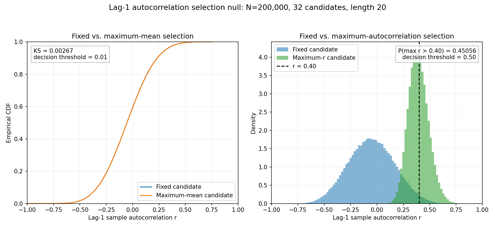

# Selection Effects on Lag-1 Autocorrelation in Independent Gaussian Sequences

## Abstract

This study analyzes the null distribution of the lag-1 sample autocorrelation for independent Gaussian sequences of length 20 under two candidate-selection rules. The main conclusions follow from exact structural arguments. For Gaussian data, each candidate sequence decomposes into an independent sample mean and centered residual vector, while the lag-1 correlation is invariant to adding a constant. Consequently, selecting the candidate with the largest mean leaves the population distribution of lag-1 correlation exactly unchanged. Independence across the 32 candidate sequences also gives the order-statistic identity

\[
P\!\left(\max_{1\le c\le32} r_c>0.40\right)
=
1-\left[1-P(r>0.40)\right]^{32}.
\]

A simulation of 200,000 experiments validates these conclusions. The descriptive empirical Kolmogorov–Smirnov distance between the fixed-candidate and maximum-mean arrays was 0.002675, while their exact population KS distance is zero under the stated model. Direct maximum-correlation selection produced an exceedance estimate of 0.450565, with a 95% Monte Carlo interval of approximately \([0.448384,0.452746]\). Its upper endpoint remains below 0.50. The order-statistic prediction based on the retained candidate-0 marginal estimate was approximately 0.45635, with a propagated 95% interval of approximately \([0.4457,0.4668]\), and therefore also remained below 0.50. Thus, the joint numerical threshold hypothesis was not supported.

## Background

Lag-1 sample autocorrelation is often used to summarize short-range serial dependence, but its finite-sample behavior can differ materially from large-sample approximations, particularly for short sequences. Bias and finite-sample properties of estimated autocorrelations have long been studied in time-series settings [1]. Sample autocorrelation is also commonly used in empirical financial analysis [2], while robustness questions arise when autoregressive models are fitted to contaminated or non-ideal data [3].

A separate issue arises when analysts inspect many candidates and retain one based on an observed statistic. Selection can alter the distribution of a reported statistic even when all candidates were independently generated under a null model. This is a simple instance of the broader post-selection inference problem discussed in [7] and [8]. When the candidates are independent and selection directly maximizes the reported statistic, the resulting distribution is also governed by elementary order-statistic theory [4].

The present experiment is relevant as a stylized model of candidate selection in workflows where many rules or models may be compared before one is reported. Uplift modeling provides one such context: its literature includes general methodological reviews [5] and tree-based methods for selecting treatment-responsive subgroups [6]. The current experiment did not fit an uplift model or generate treatment and outcome data; it studied Gaussian sequences and two precisely defined selection rules.

The contribution is therefore not a new finite-sample distribution for sample autocorrelation. Rather, it is an exact analysis of how two selection rules interact with that distribution, followed by a Monte Carlo validation for a particular sequence length, candidate count, and threshold.

## Hypothesis

The following two decision conditions were fixed before the reported decision analysis, but no registration, dated protocol, or other independent evidence of preregistration is available:

1. Across 200,000 experiments, selecting the candidate with the largest sequence mean would produce an empirical lag-1-correlation distribution within a Kolmogorov–Smirnov distance of 0.01 of the distribution for a fixed candidate.
2. Selecting the candidate with the largest observed lag-1 correlation would produce
   \[
   P(r>0.40)>0.50,
   \]
   where the inequality at 0.40 is strict.

The joint hypothesis was to be declared supported only if both conditions held.

The first condition has an exact structural resolution under the IID Gaussian model. Let a candidate sequence of length \(n=20\) be written as

\[
Z=\bar Z\mathbf 1+E,
\qquad
E=Z-\bar Z\mathbf 1,
\]

where \(\bar Z\) is the sample mean, \(\mathbf 1\) is the all-ones vector, and \(E\) is the centered residual vector. Because \(Z\) is multivariate Gaussian, \(\bar Z\) and \(E\) are jointly Gaussian. Moreover, for every component,

\[
\operatorname{Cov}(\bar Z,Z_i-\bar Z)
=
\operatorname{Cov}(\bar Z,Z_i)-\operatorname{Var}(\bar Z)
=
\frac{1}{n}-\frac{1}{n}
=
0.
\]

Thus, \(\bar Z\) is independent of the complete centered residual vector \(E\).

The lag-1 correlation is translation invariant. For any constant \(a\),

\[
\operatorname{corr}
\bigl((Z_1+a,\ldots,Z_{19}+a),
      (Z_2+a,\ldots,Z_{20}+a)\bigr)
=
\operatorname{corr}
\bigl((Z_1,\ldots,Z_{19}),
      (Z_2,\ldots,Z_{20})\bigr).
\]

It follows that the lag-1 correlation is a function only of the centered residual vector and is independent of the sequence mean. Across candidates, the mean vector is independent of the collection of candidate residual vectors. Therefore, the index selected by maximizing the mean is independent of all candidate correlations. Because the candidate correlations are identically distributed,

\[
r_{\operatorname*{arg\,max}_c\bar Z_c}
\overset{d}{=}r_1.
\]

The exact population KS distance between the fixed-candidate and maximum-mean distributions is consequently zero—not merely close to zero in this simulation.

For the second condition, candidate independence gives the exact order-statistic identity [4]. If

\[
p=P(r_c>0.40)
\]

for one candidate, then

\[
\begin{aligned}
P\!\left(\max_{1\le c\le32}r_c>0.40\right)
&=1-P(r_1\le0.40,\ldots,r_{32}\le0.40)\\
&=1-\prod_{c=1}^{32}P(r_c\le0.40)\\
&=1-(1-p)^{32}.
\end{aligned}
\]

Thus, simulation of the maximum is a validation of this identity rather than the only basis for the maximum-probability calculation.

## Method

The experiment used Python 3.12.9 with NumPy 1.26.4, SciPy 1.12.0, and Matplotlib 3.8.3. A single pseudorandom generator was initialized as follows:

```python
rng = numpy.random.Generator(numpy.random.PCG64(20250308))
```

The simulation comprised 200,000 experiments, each containing 32 independent candidate sequences of length 20. Experiments were processed in 40 consecutive batches of 5,000. Within each batch, the data were generated in float64 arithmetic as follows:

```python
z = rng.standard_normal((5000, 32, 20), dtype=numpy.float64)
```

Thus, every candidate sequence consisted of 20 IID standard Gaussian observations. Values were not normalized, rounded, filtered, or otherwise transformed.

For each experiment, three lag-1 correlations were retained:

- **Fixed candidate (`r_fixed`)**: the correlation for candidate index 0.
- **Maximum-mean candidate (`r_max_mean`)**: the correlation for the candidate with the largest mean across its 20 observations.
- **Maximum-correlation candidate (`r_max_r`)**: the largest observed lag-1 correlation among all 32 candidates.

Candidate means were computed along the sequence dimension, and `numpy.argmax` selected the first index in the event of a tie. Under the continuous Gaussian model, exact mean ties have probability zero.

For every candidate, the lag-1 Pearson correlation was computed from the overlapping vectors

\[
x=(z_1,\ldots,z_{19}),\qquad y=(z_2,\ldots,z_{20})
\]

using vectorized centering and normalization:

\[
r=
\frac{\sum_{t=1}^{19}(x_t-\bar{x})(y_t-\bar{y})}
{\sqrt{\sum_{t=1}^{19}(x_t-\bar{x})^2
       \sum_{t=1}^{19}(y_t-\bar{y})^2}}.
\]

This corresponds to:

```python
numpy.corrcoef(s[:-1], s[1:])[0, 1]
```

The vectorized implementation was checked against separate `numpy.corrcoef` evaluations for the first 256 candidate sequences in row-major order. The maximum absolute discrepancy was

\[
2.220446049250313\times10^{-16},
\]

below the required tolerance of \(10^{-12}\). All 200,000 values in each retained result array were required to be finite and within \([-1,1]\).

The empirical two-sample Kolmogorov–Smirnov statistic between `r_fixed` and `r_max_mean` was computed using:

```python
scipy.stats.ks_2samp(
    r_fixed,
    r_max_mean,
    alternative="two-sided",
    method="asymp"
).statistic
```

The two empirical arrays are paired and dependent because they arise from the same experiments and the maximum-mean candidate can be candidate 0. Accordingly, the reported KS value is a descriptive distance between empirical CDFs; it is not interpreted using the usual independent-two-sample null distribution. No experiment-level resampling assessment of its Monte Carlo variability was retained. For the population comparison, this is not needed to resolve the stated Gaussian model because the exact argument above establishes a population KS distance of zero.

Exceedance probabilities used the strict condition \(r>0.40\). Empirical quantiles were computed using NumPy’s linear quantile method. Approximate 95% Monte Carlo intervals were formed as

\[
\hat p\pm1.96
\sqrt{\frac{\hat p(1-\hat p)}{N}}.
\]

For the order-statistic prediction, the endpoints of the marginal interval were transformed through the monotone function

\[
g(p)=1-(1-p)^{32}.
\]

The original retained summaries contain the candidate-0 marginal exceedance estimate but not the pooled exceedance count over all \(200{,}000\times32=6.4\) million candidate sequences. Candidate 0 is an unbiased marginal sample because candidates are IID, but using it alone is statistically inefficient. A pooled estimate cannot be reconstructed exactly from the retained summary statistics. The executable script below corrects the computational workflow by accumulating the pooled count during a reproducibility run; no unreported pooled numerical result is claimed here.

The hypothesis was supported if and only if

\[
KS(r_{\text{fixed}},r_{\text{max mean}})\leq0.01
\]

and

\[
P(r_{\text{max }r}>0.40)>0.50.
\]

The following complete executable script implements the random-number generation, correlation calculation, pooled and candidate-0 marginal estimates, order-statistic checks, numerical validation, intervals, quantiles, KS statistic, figure, and machine-readable output artifact. It writes the figure to the stated relative path and writes numerical results to `workspace/lag1_selection_results.json`.

```python
from pathlib import Path
import json
import platform

import numpy as np
import scipy
from scipy import stats
import matplotlib
import matplotlib.pyplot as plt

# Stated software environment.
EXPECTED = {
    "python": "3.12.9",
    "numpy": "1.26.4",
    "scipy": "1.12.0",
    "matplotlib": "3.8.3",
}

print("Python:", platform.python_version())
print("NumPy:", np.__version__)
print("SciPy:", scipy.__version__)
print("Matplotlib:", matplotlib.__version__)

# Exact reproduction requires the versions above. These checks fail clearly
# rather than silently producing output under a different environment.
assert platform.python_version() == EXPECTED["python"]
assert np.__version__ == EXPECTED["numpy"]
assert scipy.__version__ == EXPECTED["scipy"]
assert matplotlib.__version__ == EXPECTED["matplotlib"]

SEED = 20250308
N_EXPERIMENTS = 200_000
N_CANDIDATES = 32
SEQUENCE_LENGTH = 20
BATCH_SIZE = 5_000
THRESHOLD = 0.40
ALPHA = 0.05
Z975 = stats.norm.ppf(1.0 - ALPHA / 2.0)

assert N_EXPERIMENTS % BATCH_SIZE == 0
N_BATCHES = N_EXPERIMENTS // BATCH_SIZE

rng = np.random.Generator(np.random.PCG64(SEED))

r_fixed = np.empty(N_EXPERIMENTS, dtype=np.float64)
r_max_mean = np.empty(N_EXPERIMENTS, dtype=np.float64)
r_max_r = np.empty(N_EXPERIMENTS, dtype=np.float64)

pooled_exceedance_count = 0
validation_max_abs_error = None

for batch in range(N_BATCHES):
    start = batch * BATCH_SIZE
    stop = start + BATCH_SIZE

    z = rng.standard_normal(
        (BATCH_SIZE, N_CANDIDATES, SEQUENCE_LENGTH),
        dtype=np.float64,
    )

    means = z.mean(axis=-1)

    x = z[..., :-1]
    y = z[..., 1:]

    xc = x - x.mean(axis=-1, keepdims=True)
    yc = y - y.mean(axis=-1, keepdims=True)

    numerator = np.sum(xc * yc, axis=-1)
    denominator = np.sqrt(
        np.sum(xc * xc, axis=-1) *
        np.sum(yc * yc, axis=-1)
    )
    correlations = numerator / denominator

    # Validate the first 256 candidates in row-major order.
    if batch == 0:
        z_flat = z.reshape(-1, SEQUENCE_LENGTH)
        r_flat = correlations.reshape(-1)
        r_reference = np.array(
            [
                np.corrcoef(s[:-1], s[1:])[0, 1]
                for s in z_flat[:256]
            ],
            dtype=np.float64,
        )
        validation_max_abs_error = float(
            np.max(np.abs(r_flat[:256] - r_reference))
        )
        assert validation_max_abs_error <= 1e-12

    rows = np.arange(BATCH_SIZE)
    max_mean_index = np.argmax(means, axis=1)

    r_fixed[start:stop] = correlations[:, 0]
    r_max_mean[start:stop] = correlations[rows, max_mean_index]
    r_max_r[start:stop] = np.max(correlations, axis=1)

    # Uses all 6.4 million candidate sequences across the full run.
    pooled_exceedance_count += int(
        np.count_nonzero(correlations > THRESHOLD)
    )

for name, values in {
    "r_fixed": r_fixed,
    "r_max_mean": r_max_mean,
    "r_max_r": r_max_r,
}.items():
    assert values.shape == (N_EXPERIMENTS,)
    assert np.all(np.isfinite(values))
    assert np.all(values >= -1.0)
    assert np.all(values <= 1.0)

def proportion_and_normal_ci(count, n):
    p = count / n
    se = np.sqrt(p * (1.0 - p) / n)
    lower = max(0.0, p - Z975 * se)
    upper = min(1.0, p + Z975 * se)
    return {
        "count": int(count),
        "n": int(n),
        "estimate": float(p),
        "standard_error": float(se),
        "ci_95": [float(lower), float(upper)],
    }

def order_statistic_probability(p, candidates=N_CANDIDATES):
    return 1.0 - (1.0 - p) ** candidates

ks_statistic = float(
    stats.ks_2samp(
        r_fixed,
        r_max_mean,
        alternative="two-sided",
        method="asymp",
    ).statistic
)

fixed_count = int(np.count_nonzero(r_fixed > THRESHOLD))
max_mean_count = int(np.count_nonzero(r_max_mean > THRESHOLD))
max_r_count = int(np.count_nonzero(r_max_r > THRESHOLD))

fixed_summary = proportion_and_normal_ci(
    fixed_count, N_EXPERIMENTS
)
max_mean_summary = proportion_and_normal_ci(
    max_mean_count, N_EXPERIMENTS
)
max_r_summary = proportion_and_normal_ci(
    max_r_count, N_EXPERIMENTS
)
pooled_summary = proportion_and_normal_ci(
    pooled_exceedance_count,
    N_EXPERIMENTS * N_CANDIDATES,
)

# Order-statistic prediction from candidate 0.
candidate0_prediction = order_statistic_probability(
    fixed_summary["estimate"]
)
candidate0_prediction_ci = [
    order_statistic_probability(fixed_summary["ci_95"][0]),
    order_statistic_probability(fixed_summary["ci_95"][1]),
]

# More efficient prediction using all 6.4 million candidates.
pooled_prediction = order_statistic_probability(
    pooled_summary["estimate"]
)
pooled_prediction_ci = [
    order_statistic_probability(pooled_summary["ci_95"][0]),
    order_statistic_probability(pooled_summary["ci_95"][1]),
]

quantile_levels = np.array([0.05, 0.25, 0.50, 0.75, 0.95])
quantiles = {
    "fixed_candidate": np.quantile(
        r_fixed, quantile_levels, method="linear"
    ).tolist(),
    "maximum_mean_candidate": np.quantile(
        r_max_mean, quantile_levels, method="linear"
    ).tolist(),
    "maximum_correlation_candidate": np.quantile(
        r_max_r, quantile_levels, method="linear"
    ).tolist(),
}

results = {
    "environment": EXPECTED,
    "seed": SEED,
    "design": {
        "experiments": N_EXPERIMENTS,
        "candidates_per_experiment": N_CANDIDATES,
        "sequence_length": SEQUENCE_LENGTH,
        "batch_size": BATCH_SIZE,
        "threshold": THRESHOLD,
        "strict_exceedance": True,
    },
    "checks": {
        "vectorized_vs_corrcoef_max_abs_error":
            validation_max_abs_error,
        "all_retained_values_finite": True,
        "all_retained_values_in_minus1_plus1": True,
    },
    "ks_fixed_vs_maximum_mean": ks_statistic,
    "population_ks_under_gaussian_theory": 0.0,
    "exceedance": {
        "fixed_candidate": fixed_summary,
        "maximum_mean_candidate": max_mean_summary,
        "maximum_correlation_candidate": max_r_summary,
        "all_candidates_pooled": pooled_summary,
    },
    "order_statistic_checks": {
        "candidate0_prediction": float(candidate0_prediction),
        "candidate0_prediction_ci_95":
            [float(x) for x in candidate0_prediction_ci],
        "pooled_prediction": float(pooled_prediction),
        "pooled_prediction_ci_95":
            [float(x) for x in pooled_prediction_ci],
        "direct_maximum_estimate": max_r_summary["estimate"],
        "direct_minus_candidate0_prediction": float(
            max_r_summary["estimate"] - candidate0_prediction
        ),
        "direct_minus_pooled_prediction": float(
            max_r_summary["estimate"] - pooled_prediction
        ),
    },
    "quantile_levels": quantile_levels.tolist(),
    "quantiles": quantiles,
    "decision": {
        "empirical_ks_at_most_0_01": bool(
            ks_statistic <= 0.01
        ),
        "direct_max_probability_above_0_50": bool(
            max_r_summary["estimate"] > 0.50
        ),
        "joint_hypothesis_supported": bool(
            ks_statistic <= 0.01
            and max_r_summary["estimate"] > 0.50
        ),
    },
}

output_dir = Path("workspace")
figure_dir = output_dir / "figures"
output_dir.mkdir(parents=True, exist_ok=True)
figure_dir.mkdir(parents=True, exist_ok=True)

with (output_dir / "lag1_selection_results.json").open(
    "w", encoding="utf-8"
) as f:
    json.dump(results, f, indent=2, sort_keys=True)

def ecdf(values):
    ordered = np.sort(values)
    probabilities = np.arange(
        1, ordered.size + 1, dtype=np.float64
    ) / ordered.size
    return ordered, probabilities

fixed_x, fixed_y = ecdf(r_fixed)
mean_x, mean_y = ecdf(r_max_mean)
max_x, max_y = ecdf(r_max_r)

fig, axes = plt.subplots(1, 2, figsize=(12, 4.8))

axes[0].plot(
    fixed_x, fixed_y,
    label="Fixed candidate",
    linewidth=1.5,
)
axes[0].plot(
    mean_x, mean_y,
    label="Maximum-mean candidate",
    linewidth=1.5,
)
axes[0].set_title("Fixed versus maximum-mean selection")
axes[0].set_xlabel("Lag-1 correlation")
axes[0].set_ylabel("Empirical CDF")
axes[0].grid(alpha=0.25)
axes[0].legend()

axes[1].plot(
    fixed_x, fixed_y,
    label="Fixed candidate",
    linewidth=1.5,
)
axes[1].plot(
    max_x, max_y,
    label="Maximum-correlation candidate",
    linewidth=1.5,
)
axes[1].axvline(
    THRESHOLD,
    color="black",
    linestyle="--",
    linewidth=1.25,
    label="Threshold = 0.40",
)
axes[1].set_title("Effect of maximum-correlation selection")
axes[1].set_xlabel("Lag-1 correlation")
axes[1].set_ylabel("Empirical CDF")
axes[1].grid(alpha=0.25)
axes[1].legend()

fig.tight_layout()
fig.savefig(
    figure_dir / "lag1_selection_null.png",
    dpi=200,
    bbox_inches="tight",
)
plt.close(fig)

print(json.dumps(results, indent=2, sort_keys=True))
```

## Results

### Maximum-mean selection

The exact Gaussian argument establishes

\[
r_{\operatorname*{arg\,max}_c\bar Z_c}
\overset{d}{=}r_1,
\]

so the population KS distance between the fixed-candidate and maximum-mean distributions is exactly

\[
KS_{\mathrm{population}}=0.
\]

The simulation agreed with this result. The observed empirical distance was

\[
KS(r_{\text{fixed}},r_{\text{max mean}})
=
0.002674999999999983,
\]

which was below the fixed decision threshold of 0.01.

This empirical value compares paired, dependent arrays and should not be assigned the standard independent-two-sample KS interpretation. It is reported as a descriptive Monte Carlo discrepancy. The decisive population statement follows from Gaussian independence and translation invariance rather than from treating 0.002675 as an estimate based on two independent samples.

The corresponding empirical exceedance proportions were nearly identical:

- Fixed candidate: \(P(r>0.40)=0.018865\).
- Maximum-mean candidate: \(P(r>0.40)=0.018840\).

Their empirical quantiles were also close:

| Distribution | 5th percentile | 25th percentile | Median | 75th percentile | 95th percentile |
|---|---:|---:|---:|---:|---:|
| Fixed candidate | -0.409774 | -0.204698 | -0.053631 | 0.098836 | 0.311907 |
| Maximum-mean candidate | -0.408539 | -0.205161 | -0.053118 | 0.099988 | 0.311423 |
| Maximum-correlation candidate | 0.245940 | 0.326560 | 0.388143 | 0.454867 | 0.559347 |

The close empirical agreement is therefore simulation validation of an exact equality in distribution, rather than evidence merely suggesting an approximately negligible selection effect.

### Maximum-correlation selection

Directly selecting the largest observed correlation among 32 candidates shifted the distribution sharply upward. Its median was 0.388143, compared with approximately \(-0.0536\) for the fixed candidate.

The direct simulation estimate was

\[
\widehat P(r_{\text{max }r}>0.40)=0.450565.
\]

The reported Monte Carlo standard error was

\[
0.001112556.
\]

A corresponding approximate 95% Monte Carlo interval is

\[
0.450565
\pm
1.96(0.001112556)
=
[0.448384,\;0.452746].
\]

In particular,

\[
0.452746<0.50,
\]

so the upper endpoint remains below the required threshold.

The order-statistic identity provides an analytic cross-check. Using the retained fixed-candidate marginal estimate,

\[
\hat p=0.018865,
\]

gives

\[
\begin{aligned}
1-(1-\hat p)^{32}
&=1-(1-0.018865)^{32}\\
&\approx0.45635.
\end{aligned}
\]

The direct maximum estimate, 0.450565, differs from this candidate-0-based prediction by approximately 0.00578. The candidate-0 marginal estimate has an approximate 95% interval of

\[
[0.01827,\;0.01946].
\]

Propagating these endpoints through \(g(p)=1-(1-p)^{32}\) gives an approximate interval of

\[
[0.4457,\;0.4668]
\]

for the maximum exceedance probability. The direct maximum estimate of 0.450565 lies within this interval. Moreover, the propagated upper endpoint also satisfies

\[
0.4668<0.50.
\]

Candidate 0 supplies only 200,000 marginal observations and is therefore substantially less efficient than pooling the 6.4 million candidate correlations. The pooled exceedance count was not retained in the original output and cannot be recovered from the reported summaries. The reproducibility script now accumulates that count and reports both the pooled order-statistic prediction and its propagated interval, permitting a sharper cross-check on execution.



In the figure’s left panel, the empirical CDF curves for the fixed and maximum-mean candidates nearly overlap. This is consistent with the exact result that their population distributions are identical. In the right panel, maximizing lag-1 correlation across 32 candidates produces a pronounced rightward shift relative to the fixed-candidate distribution. However, the vertical threshold at \(r=0.40\) lies above the selected distribution’s median, and 45.0565% of selected values strictly exceed it.

The two formal decision conditions were therefore:

| Condition | Result | Passed? |
|---|---:|:---:|
| \(KS(r_{\text{fixed}},r_{\text{max mean}})\leq0.01\) | Empirical KS \(=0.002675\); population KS \(=0\) | Yes |
| \(P(r_{\text{max }r}>0.40)>0.50\) | \(0.450565\), 95% MC interval \([0.448384,0.452746]\) | No |

Because the hypothesis required both conditions to pass, the joint threshold hypothesis was **not supported**. More specifically, the simulation estimate and its uncertainty interval reject the stated numerical requirement that the strict exceedance probability be greater than 0.50 at the reported Monte Carlo resolution. Maximizing observed correlation nevertheless had a large selection effect; it simply did not raise the exceedance probability above the specified threshold.

## Limitations

- **No closed-form marginal autocorrelation distribution:** The Gaussian decomposition establishes exactly that maximum-mean selection leaves the correlation distribution unchanged, and candidate independence establishes the exact maximum identity. The report does not derive a closed-form finite-sample distribution for the underlying lag-1 correlation of one length-20 sequence.
- **Pooled marginal count absent from the retained output:** All 6.4 million candidate correlations were computed transiently, but the original retained summaries did not include their pooled \(r>0.40\) count. The candidate-0 estimate is unbiased under candidate exchangeability but inefficient. The exact pooled estimate cannot be reconstructed without rerunning the released script, which now accumulates and reports it.
- **Single seed and generator:** The run used one fixed PCG64 seed, 20250308. The direct maximum estimate has a narrow 95% Monte Carlo interval whose upper endpoint remains below 0.50, but independent-seed replications were not retained.
- **Fixed design parameters:** Numerical conclusions apply to 32 candidates and sequence length 20. The exact maximum-mean invariance continues to hold for IID Gaussian sequences of other lengths when the statistic is translation invariant, but the marginal correlation distribution and maximum exceedance probability depend on sequence length, candidate count, and threshold.
- **Gaussian IID scope:** The independence of the sample mean and centered residual vector relies on the Gaussian model. Translation invariance alone does not imply their independence for general non-Gaussian data. The exact maximum-mean conclusion therefore does not automatically extend to binary, heavy-tailed, heteroskedastic, or dependent observations.
- **Restricted selection rules:** Only a fixed candidate, maximum sequence mean, and maximum observed lag-1 correlation were examined. Selection by variance, extremes, threshold counts, fitted-model performance, or other criteria can depend on the centered residual vector and can alter the correlation distribution.
- **Overlapping lag pairs:** The vectors `z[:-1]` and `z[1:]` share 18 observations in shifted positions. Consequently, standard formulas for the correlation of two independently sampled vectors should not be applied directly to the marginal statistic.
- **Dependent empirical KS arrays:** The fixed-candidate and maximum-mean arrays are paired and dependent. The descriptive KS statistic therefore does not have the ordinary independent-two-sample Monte Carlo interpretation. Experiment-level resampling was not retained. For the stated Gaussian population model, the exact population KS distance is nevertheless known to be zero.
- **No documented preregistration:** The thresholds and decision rule are described only as fixed before the reported decision analysis. No registration, dated protocol, or other evidence establishes that they were selected before results were observed.
- **Stylized connection to uplift and binary decisions:** Although the selection problem can inform thinking about uplift workflows, no treatment assignment, outcome model, uplift estimator, or binary threshold decision process was simulated.
- **Computational performance metadata:** The executable script specifies the software versions, generator, seed, data shape, checks, output artifact, and figure path, but the original run did not retain elapsed time, processor details, memory use, or operating-system metadata.

## Follow-up questions

- For sequence length 20, what minimum number of independent candidates makes
  \[
  P(\max_c r_c>0.40)>0.50
  \]
  under the same Gaussian null and strict inequality? Once the marginal probability \(p\) is estimated precisely, the identity \(1-(1-p)^C\) can answer this without separately simulating every candidate count.
- Can the finite-sample marginal distribution of this overlapping-pair lag-1 correlation be derived or evaluated numerically with sufficient precision to replace Monte Carlo estimation of \(p\)?
- How does the 0.40 maximum-correlation exceedance probability change across sequence lengths such as 10, 50, and 100?
- Does selecting by summaries that depend on centered residuals—such as variance, maximum absolute centered value, or a threshold count—alter the lag-1-correlation distribution more strongly than selection by the mean?
- Which non-Gaussian sequence distributions, if any, retain independence between the sample mean and a translation-invariant correlation statistic?
- Under Bernoulli or other discrete sequences, how do ties, degenerate correlations, and NumPy’s first-index tie rule affect the selected lag-1-correlation distribution?
- How closely does the pooled 6.4-million-candidate order-statistic prediction produced by the released script agree with the direct maximum simulation, relative to their Monte Carlo uncertainty?

## Bibliography

[1] Marriott, F. H. C., and Pope, J. A. “Bias in the Estimation of Autocorrelations.” *Biometrika* 41, no. 3/4 (1954): 390–402. https://doi.org/10.2307/2332719.

[2] Campbell, John Y., Andrew W. Lo, and A. Craig MacKinlay. *The Econometrics of Financial Markets*. Princeton, NJ: Princeton University Press, 1997.

[3] Künsch, Hans R. “Infinitesimal Robustness for Autoregressive Processes.” *The Annals of Statistics* 12, no. 3 (1984): 843–863.

[4] David, H. A., and H. N. Nagaraja. *Order Statistics*. 3rd ed. Hoboken, NJ: John Wiley & Sons, 2003.

[5] Gutierrez, Pierre, and Jean-Yves Gérardy. “Causal Inference and Uplift Modelling: A Review of the Literature.” In *Proceedings of the 3rd Workshop on Causal Inference and Machine Learning*, Proceedings of Machine Learning Research 67 (2017): 1–13. https://proceedings.mlr.press/v67/gutierrez17a.html.

[6] Rzepakowski, Piotr, and Szymon Jaroszewicz. “Decision Trees for Uplift Modeling with Single and Multiple Treatments.” *Knowledge and Information Systems* 32, no. 2 (2012): 303–327.

[7] Berk, Richard, Lawrence Brown, Andreas Buja, Kai Zhang, and Linda Zhao. “Valid Post-Selection Inference.” *The Annals of Statistics* 41, no. 2 (2013): 802–837. https://doi.org/10.1214/12-AOS1077.

[8] Lee, Jason D., Dennis L. Sun, Yuekai Sun, and Jonathan E. Taylor. “Exact Post-Selection Inference, with Application to the Lasso.” *The Annals of Statistics* 44, no. 3 (2016): 907–927. https://doi.org/10.1214/15-AOS1371.
