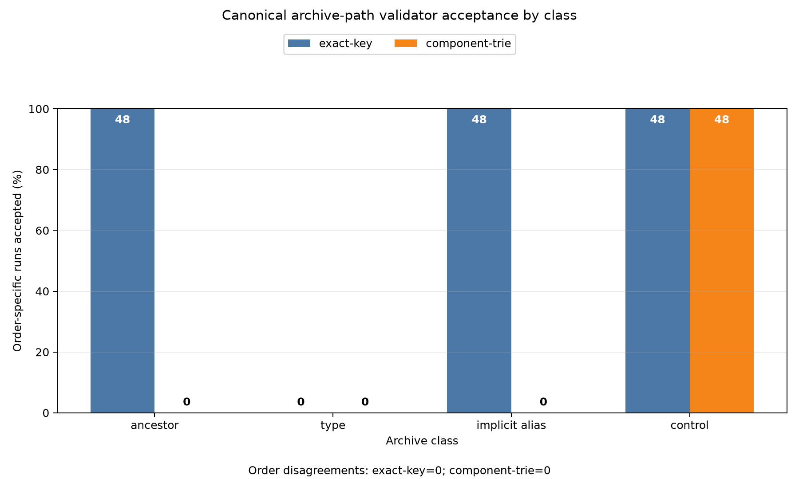

# Canonical Path Grammar and Trie-Based Archive Validation

## Abstract

This study compared two archive-name validation policies on a specified synthetic corpus: an exact-key duplicate detector and an order-independent component trie. Both used the same canonical path parser. The corpus contained 96 manually constructed two-entry manifests, serialized in both entry orders as 192 in-memory PAX tar streams. Under the study’s policy definitions, the component trie rejected all 72 designated conflict archives in both orders and accepted all 24 controls; the exact-key validator accepted 48 of the 72 designated conflict archives while accepting every control.

These results demonstrate conformance on this corpus: the implemented trie policy distinguishes the designated ancestor, type, and implicit-directory alias cases, whereas exact complete-key comparison cannot represent the ancestor and implicit-prefix distinctions used in the labels. They do not establish that the trie is generally secure, complete, practical under adversarial load, or appropriate for every archive format, extractor, filesystem, or canonicalization contract. No complete reproducible artifact, independent implementation, filesystem extraction study, property-based test suite, or performance evaluation accompanied the experiment.

## Background

Archive entry names are often interpreted as hierarchical paths rather than opaque strings. Separator handling, component boundaries, canonicalization, entry types, and ancestor relationships can therefore affect extraction. For example, a regular file at `p` cannot simultaneously act as the directory needed to create `p/child.txt` in an ordinary tree-shaped namespace. Similarly, two raw spellings may be distinct on one filesystem but map to one name under a validator’s case and normalization rules.

The security significance of these conditions depends on an explicit extraction contract. Deterministic canonical merging can be valid when every consumer is required to apply the same transformation before any filesystem operation and when merging is an intended part of the format. Conversely, an archive becomes ambiguous when the validator, archive reader, extractor, and target filesystem do not agree about whether two spellings denote one object or several. Different member orders may then cause overwriting, extraction failure, directory replacement, or writes beneath a path that another component treats as a non-directory.

This study adopted a conservative validation contract for its labeled cases:

1. validation occurs before any extraction;
2. canonical paths define the namespace examined by the validators;
3. a regular file or symbolic link cannot have descendants in that namespace;
4. incompatible explicit types cannot occupy the same canonical path; and
5. when two descendants independently imply the same canonical directory through different raw prefix spellings, the trie policy rejects rather than silently coalescing those spellings.

The fifth condition is a policy choice, not a universal filesystem fact. Canonical merging could be acceptable under a tightly specified canonicalizing extractor. The reason for rejecting it here is to avoid relying on identical alias behavior across downstream consumers. The experiment did not test an extractor or demonstrate that every implicit-directory alias in the corpus causes a real exploit.

Using a component trie for ancestor and descendant checks is a standard data-structure application. The study does not claim that the trie itself is novel. Its limited contribution is a direct comparison between two implemented policy definitions on one constructed corpus. No substantiated comparison with prior archive-validation, path-sanitization, filesystem-alias, or extraction-safeguard work was possible because the source details for the original report’s numbered references were not included. The revised report therefore does not rely on those incomplete citations or make a literature-based novelty claim.

## Hypothesis

The prespecified hypothesis was:

> On the specified 96-manifest corpus, a component trie implementing the stated predicates will reject all 72 manifests labeled as conflicts in both entry orders; an exact-key-only detector will accept at least 48 of those conflict manifests in both orders; and both validators will accept all 24 controls.

The three designated conflict classes were:

- a regular file or symbolic link at canonical path `p` together with an entry below `p`;
- a directory and a regular file or symbolic link at the same canonical path `p`; and
- two differently spelled implicit directory prefixes that map to the same canonical prefix under the parser.

These thresholds were prespecified within the experiment as acceptance criteria. There was no cited timestamped preregistration, immutable protocol, or external registration record, so they should not be described as independently verifiable preregistration.

The exact-key threshold was largely implied by corpus construction. In the ancestor and implicit-alias classes, the complete canonical keys were deliberately different, and the baseline was defined to compare only complete keys. Its expected acceptance of those classes therefore demonstrates a straightforward representational limitation, not a surprising empirical discovery or a competitive advantage of the trie over practical archive validators.

## Method

The experiment used Python 3.11 or later, the standard library, and `matplotlib`. It set `random.seed(20250308)`, although corpus construction was fully enumerated and did not otherwise use randomness. No archive was extracted to a filesystem.

No complete reproducible artifact accompanied the report. In particular, the report did not provide the source code, machine-readable copies of the 96 manifests, the 37 parser-oracle cases, a stream-generation script, the per-run outcome table, a frozen environment description, the Python patch version, the Unicode database version, figure-generation code, or cryptographic hashes. Consequently, the numerical results below cannot be independently regenerated or authenticated from the report alone. A complete artifact would need to contain all of those materials, identify every software and Unicode version, and provide hashes for the source corpus, generated streams, raw results, and figure.

### Entry model and canonical path grammar

Each manifest entry was represented as `(raw_name, type)`, where `type` was exactly `regular`, `directory`, or `symlink`. Regular files contained the single byte `b'x'`; directory entries had no data; and symbolic links used the inert target `safe-target`. Neither validator resolved symbolic links.

Both validators used the same parser. For each entry name, it:

1. Converted backslashes to `/`.
2. Rejected:
   - an empty name;
   - a name beginning with `/`, checked both before and after separator conversion;
   - an ASCII drive prefix matching `^[A-Za-z]:`;
   - any colon;
   - NUL, C0 controls U+0001 through U+001F, or DEL U+007F;
   - any empty component, including one caused by repeated or trailing separators.
3. Transformed every component with:

   ```text
   unicodedata.normalize("NFKC", component).casefold().rstrip(" .")
   ```

4. Rejected a component if the transformed result was empty, `.` or `..`.
5. Took the substring before the first `.` and rejected it if it was one of:
   - `con`, `prn`, `aux`, or `nul`;
   - `com1` through `com9`;
   - `lpt1` through `lpt9`.
6. Joined the transformed components with `/` to obtain the canonical path.

The parser also retained a raw-component tuple: the original Unicode components after backslashes were converted to `/`, but before normalization, case folding, or trimming. This tuple allowed the trie validator to compare raw spellings associated with implicit canonical directory prefixes.

The transformation was an implementation-specific sequence, not a validated implementation of a documented Unicode caseless-matching standard. In particular, the experiment did not test whether case folding could produce sequences requiring normalization afterward, did not compare the result with a standard caseless-matching construction, and did not record the Unicode database version used by `unicodedata`. It also did not derive adversarial tests from Unicode normalization or case-fold data files. Thus, passing the selected Unicode examples establishes only agreement with those examples.

Before corpus validation, the parser was checked against a fixed oracle containing ten accepted inputs and 27 rejected inputs. Accepted cases covered ordinary paths, backslash conversion, case folding, composed and decomposed `é`, fullwidth compatibility characters, trailing periods and spaces, German sharp-s case folding, and punctuation within otherwise valid components. Rejected cases covered empty and absolute names, drive paths, UNC-like paths, traversal components including fullwidth forms, repeated separators, components reduced to empty strings, colons, control characters, and reserved device names. Exact agreement was required.

The oracle was authored from the same specification as the parser and contained only 37 selected cases. It was therefore a conformance smoke test, not independent validation of Unicode correctness or malformed-name safety.

### Validators

The `exact-key` baseline parsed every entry and rejected the entire archive if any parser error occurred. After parsing, it rejected only when two entries had the same complete canonical path, irrespective of type. It did not inspect ancestor relationships, descendants, or raw spellings of directory prefixes.

The `component-trie` validator first parsed all entries and then performed an archive-wide analysis. It constructed a trie keyed by canonical path components and recorded:

- all explicit entry types at each complete path; and
- the corresponding raw-prefix tuple whenever a node served as a proper directory prefix of an entry.

It rejected an archive if:

- a complete canonical path occurred more than once;
- a node contained both a directory and a regular-file or symlink entry;
- an explicit regular file or symlink had any proper descendant; or
- a canonical node used as a proper prefix had more than one distinct raw-prefix tuple.

All predicates were evaluated after all entries had been collected, avoiding irreversible first-entry-wins decisions.

The conflict predicates corresponded to the following threat model and extraction consequences:

- **Exact duplicate:** two members claim the same canonical object. An extractor may overwrite, preserve only one version, combine metadata inconsistently, or make the result depend on order. Rejection avoids selecting an overwrite rule.
- **File or symlink ancestor:** a regular file or symlink at `p` cannot also be the directory required for `p/child.txt` under the assumed tree semantics. Depending on the extractor, one member may fail, replace another, or cause a descendant operation to follow a link. Rejection avoids relying on member order or link handling. The experiment itself did not resolve links or extract them.
- **File-directory type conflict:** a directory and a non-directory at the same canonical path cannot coexist as distinct objects in the assumed namespace. Deterministic selection would discard or replace one entry’s type and possibly its contents. Rejection preserves the rule that the archive must describe one unambiguous type per path.
- **Implicit-directory alias conflict:** two descendants independently imply a directory whose raw components differ but whose canonical components are equal. A canonicalizing extractor could intentionally merge them, but another reader or filesystem could keep them separate or apply a different equivalence relation. The implemented policy rejects to avoid that cross-consumer ambiguity. The study did not establish that merging is always unsafe.

The raw-prefix predicate covered only nodes observed as proper prefixes of entries. An explicit directory’s own raw spelling was not separately recorded as a competing raw-prefix observation merely because an entry existed at that node. Consequently, an archive containing explicit directory `Alpha/` and descendant `alpha/file` would not, under the stated implementation, obtain two raw-prefix tuples solely from those two names. It would be accepted if no other rejection predicate applied.

That behavior marks a deliberate boundary of the implemented rule: it detects divergent spellings contributed by multiple implicit directory derivations, not every explicit-versus-implicit spelling difference. Under a canonical-first extraction contract, the explicit directory can be treated as establishing the canonical directory subsequently traversed by the descendant. Under noncanonicalizing extraction, however, the same pair could create separate directories. This interaction was not included in the corpus, so the report does not claim that the rule completely addresses explicit-versus-implicit aliases.

No stronger baseline was implemented. In particular, the study did not compare:

- a sorted canonical-path prefix scan;
- a validator that tracks explicit directory types and ancestor conflicts without rejecting raw-spelling differences;
- a canonical-merging policy;
- representative archive libraries;
- built-in extraction filters or path-sanitization safeguards; or
- independently implemented readers and validators.

The comparison therefore isolates the difference between the two stated definitions but does not establish superiority over practical alternatives. A sorted canonical-path prefix check, for example, could detect many ancestor conflicts without using a trie.

### Corpus

The corpus contained 96 two-entry manifests:

- **24 ancestor conflicts:** a regular file or symlink at `p` and a regular file at `p/child.txt`;
- **24 type conflicts:** a directory at `p` and either a regular file or symlink at the same `p`;
- **24 implicit-directory alias conflicts:** two distinct descendant paths whose parent components used aliases drawn from:
  - `Alpha` and `alpha`;
  - composed `café` and decomposed `cafe` plus U+0301;
  - `Ａlpha` and `Alpha`;
  - `data.` and `data`;
  - `data ` and `data`;
  - `Straße` and `STRASSE`.

Each alias pair was tested in four contexts: the root, `outer`, `outer/deep`, and `x/y/z`. The two complete canonical file paths remained different, but their canonical parent paths were equal and their raw parent tuples differed.

The remaining **24 controls** covered:

- an explicit directory with a regular descendant;
- component-wise sibling names such as `node` and `node2/child.txt`; and
- two files sharing identically spelled implicit directories.

The labels were derived directly from the validator predicates and the extraction contract above. The corpus was therefore primarily a conformance test of definitions against examples constructed from those definitions. It did not provide independent evidence that the labels are universally correct, that the policy is complete against archive attacks, or that every rejected alias would produce an unsafe real-world extraction.

Every manifest was serialized as an in-memory tar archive using `tarfile.PAX_FORMAT`, once in listed order and once in reverse order. This yielded 192 streams: 144 conflict streams and 48 control streams. Each stream was read back with `tarfile`, preserving member order, and the decoded names and types were checked against the source manifest before validation.

Using Python `tarfile` for both serialization and reading established only same-implementation PAX round-trip agreement. It did not provide differential assurance from an independently implemented archive reader and did not test malformed PAX metadata, alternate tar dialects, special tar member types, or parser disagreements.

Both validators processed all 192 decoded streams. Outcomes were recorded for each validator and stream, including archive ID, class, order, acceptance status, and rejection reason. The analysis computed order-specific acceptance, archive-level acceptance in both orders, and disagreements between forward and reverse order. The raw per-run table was not included in the report.

The prespecified outcome criteria were parser-oracle agreement of 100%; no accepted conflict runs for the component trie; at least 96 accepted conflict runs for exact-key with no order disagreement; all control runs accepted by both validators; and zero component-trie order disagreements. These criteria were internal to the experiment and were not externally preregistered.

No generated multi-entry corpus, property-based test, or exhaustive bounded enumeration was performed. Reversing each two-entry manifest checked only the two possible orders for that manifest. It did not test arbitrary permutations of three or more interacting members or establish order invariance as a general property.

For the trie itself, let \(E\) be the number of entries, \(D\) the maximum component depth, and \(C\) the total number of parsed component occurrences across the archive. Ignoring the internal costs of Unicode transformation and hash-table operations, inserting and examining all paths requires one trie traversal per component, giving expected time proportional to \(C\) with dictionary-backed child maps and storage proportional to the number of distinct canonical prefix nodes plus recorded observations. The exact-key policy stores complete canonical keys and performs one lookup per entry after parsing.

These are only structural observations, not measured guarantees. Unicode normalization and case folding may expand strings, hash tables have implementation-dependent behavior, raw-prefix observations consume additional memory, and very deep or long paths can create resource pressure. The implementation reported no explicit limits for entry count, path depth, component length, total canonicalized bytes, Unicode expansion, or trie nodes, and no defined fail-closed behavior for exceeding such limits. No stress measurements were performed.

## Results

The parser matched all 37 oracle cases: ten valid mappings and 27 required rejections. Parser-oracle agreement was therefore **100%** on the selected oracle. All 192 streams read through Python `tarfile` also preserved the source names and entry types according to the same-implementation round-trip check.



The figure reports accepted order-specific runs out of 48 for each class. The class-level outcomes were:

| Class | Exact-key accepted runs | Component-trie accepted runs |
|---|---:|---:|
| Ancestor conflict | 48/48 | 0/48 |
| Type conflict | 0/48 | 0/48 |
| Implicit alias conflict | 48/48 | 0/48 |
| Control | 48/48 | 48/48 |

The exact-key detector rejected the type-conflict archives because their two entries had the same complete canonical path. It accepted every ancestor-conflict run because the ancestor and descendant had different complete keys. It also accepted every implicit-alias run because the descendant filenames made the complete canonical paths distinct, even though their parent components mapped to the same canonical directory under the parser.

Across all three designated conflict classes, exact-key accepted **96 of 144 runs**, corresponding to **48 of 72 conflict archives accepted in both orders**. It accepted all **48 of 48 control runs**, or all 24 control archives in both orders. Because the baseline was defined to examine only complete canonical-key equality, its results on the ancestor and implicit-alias classes follow directly from the corpus design.

The component trie accepted **0 of 144 designated conflict runs** and rejected all **72 designated conflict archives in both orders**. It rejected all 24 ancestor-conflict archives, all 24 file-directory type-conflict archives, and all 24 implicit-directory spelling-collision archives. It accepted all **48 of 48 control runs**, corresponding to all 24 controls in both orders.

Neither validator produced an order disagreement among the two permutations of each two-entry manifest. The observed outcomes matched the prespecified criteria:

- parser oracle: **37/37 matched**;
- component-trie designated conflicts: **0/144 accepted**;
- exact-key designated conflicts: **96/144 accepted**, representing 48 archives in both orders;
- component-trie controls: **48/48 accepted**;
- exact-key controls: **48/48 accepted**;
- component-trie order disagreements: **0**.

The supported conclusion is narrow: **on this specified synthetic corpus, the implemented component-trie policy distinguished all designated cases in both tested orders, while exact-key duplicate detection did not distinguish the designated ancestor and implicit-directory alias cases.**

The results do not show that a trie is the uniquely appropriate archive policy, that raw-spelling rejection is preferable for every extraction contract, or that the implementation is reliable across arbitrary archives, Unicode inputs, archive formats, libraries, filesystems, entry types, or resource constraints. They also do not establish an advantage over sorted-prefix checks, explicit-type-aware validators, established extraction safeguards, or other practical policies, because those alternatives were not evaluated.

## Limitations

- The corpus contained 96 deliberately constructed two-entry manifests. It did not include generated or adversarial multi-entry archives, overlapping conflict types, duplicate directories, explicit-directory spelling aliases, aliases at multiple depths simultaneously, nonconflicting near misses beyond the listed controls, hard links, special tar entry types, malformed PAX metadata, conflicting link entries, or archives with three or more interacting members.
- The labels were derived from the same predicates the validators were designed to implement. Rejection of all labeled examples is therefore evidence of conformance to the specification, not independent evidence of security, completeness, or real-world reliability.
- The implicit-directory alias label depends on a conservative extraction contract. If a consumer intentionally canonicalizes every path before extraction and specifies deterministic merging, two spellings mapping to one directory may be valid rather than conflicting. No extractor, filesystem experiment, or demonstrated exploit established that every labeled alias must be rejected.
- Raw spellings of explicit directory entries did not independently participate in the raw-prefix collision rule. As specified, `Alpha/` plus `alpha/file` can be accepted. This explicit-versus-implicit interaction was not tested, and its safety depends on extraction semantics.
- Only the exact-key detector and the component trie were implemented. There was no sorted canonical-path prefix baseline, no explicit-directory-type validator without raw-spelling rejection, no canonical-merging baseline, and no evaluation of representative archive libraries or extraction safeguards. The exact-key baseline was intentionally unable to represent prefix conflicts and is therefore weak as a competitive baseline.
- Only tar archives written and read by Python’s `tarfile` module in PAX format were tested. No independently implemented reader was used, so the round-trip check provides limited differential assurance. Other tar implementations, legacy tar variants, ZIP archives, and formats with different encoding or metadata rules may behave differently.
- No entries were extracted. Representative filesystem and extractor behavior was not evaluated in controlled sandboxes on Windows, macOS, or Linux. The report therefore cannot establish which aliases actually merge, split, fail, overwrite, or traverse links on those systems.
- Unicode handling was limited to Python’s `unicodedata` and the sequence `NFKC`, then `casefold`, then trimming. It was not validated against a documented Unicode caseless-matching standard; the need for post-fold normalization was not tested; the Unicode database version was not recorded; and no adversarial corpus was generated from Unicode normalization or case-fold data.
- The parser oracle contained only 37 specification-derived cases. Perfect agreement is a smoke test and does not prove safe handling of arbitrary Unicode, malformed names, unusual metadata, or version-dependent transformations.
- Symbolic links used an inert target and were not resolved. The study did not address link-target traversal, absolute or relative link targets, hard links, link cycles, conflicting link entries, or interactions between links and later members.
- Testing listed and reversed order exhausted the two permutations of each two-entry manifest, but no property-based or exhaustive bounded testing was conducted. No generation strategy, bounds, invariant suite, or minimized counterexamples are available.
- No asymptotic stress measurements were performed for entry count, path depth, component length, total input size, Unicode expansion, or number of trie nodes. No explicit resource limits or failure behavior were specified, so denial-of-service resistance and practicality are unestablished.
- The random seed did not contribute variation because the corpus was fully enumerated. It does not provide randomized-testing evidence.
- The thresholds were prespecified within the experiment but were not supported by an external preregistration record, timestamp, or immutable protocol. In addition, the exact-key threshold was substantially determined by the construction of the ancestor and implicit-alias classes.
- No complete reproducible artifact was supplied. The source code, 96 manifests, parser-oracle cases, generated-stream procedure, per-run results, environment details, Unicode version, figure-generation code, and cryptographic hashes are unavailable from the report. The reported results therefore cannot be independently verified from the provided material.
- The source metadata for the original numbered citations was not available, so a reliable bibliography could not be reconstructed without inventing references. As a result, this report does not substantively position the implementation against specific prior archive-validation, path-sanitization, filesystem-alias, or Unicode-security publications.
- A component trie for ancestor and descendant detection is a standard technique. The study did not establish algorithmic novelty or compare its policy with the broader archive-security literature.

## Follow-up questions

- Can a complete, immutable artifact be published containing the validator and parser source, all 96 original manifests, the 37 oracle cases, generated PAX streams or deterministic generation code, raw per-run results, exact environment and Unicode versions, figure-generation code, and cryptographic hashes?
- How do sorted canonical-path prefix checks, explicit-type-aware validators without raw-spelling rejection, canonical-merging policies, representative archive libraries, and built-in extraction safeguards compare on the same corpus?
- What explicit extraction contracts justify rejecting or merging implicit-directory aliases, and which outcomes occur when representative extractors and filesystems are tested in controlled Windows, macOS, and Linux sandboxes?
- How should explicit directory spellings participate in alias detection? In particular, should `Alpha/` plus `alpha/file` be rejected, merged canonically, or interpreted according to the target filesystem?
- Can generated and adversarial corpora cover duplicate directories, explicit-versus-implicit aliases, aliases at several depths, overlapping conflict types, hard links, symbolic-link interactions, special entry types, malformed PAX metadata, and nonconflicting near misses?
- Can property-based or exhaustive bounded testing establish core invariants such as permutation invariance, monotonic rejection under added conflicts, equivalence between trie and sorted-prefix formulations, and preservation of nonconflicting controls? What bounds and minimized counterexamples result?
- Does the canonical grammar agree with a documented Unicode caseless-matching construction when normalization is repeated after folding where required? How do results vary across Unicode database versions and adversarial cases derived from normalization and case-fold data?
- Does the grammar produce the same decisions when independently implemented in Python, Rust, Go, Java, and C#, and when archives are decoded by independently implemented readers?
- What measured time and memory behavior occurs as entry count, path depth, component length, total name bytes, and Unicode expansion increase? Which explicit limits permit fail-closed behavior without introducing order dependence?
- How should the policy be positioned against established archive-validation, extraction-sandboxing, path-sanitization, Unicode-security, and filesystem-alias work once complete bibliographic source information is available?
