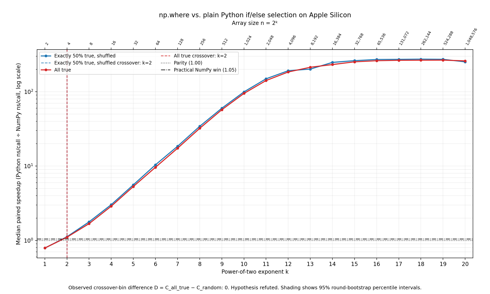

# Earliest Measured Practical Win for NumPy `where` Was at Four Elements on Apple M3 Pro

## Abstract

This experiment compared `np.where(mask, a, b)` with an element-by-element Python `if/else` loop over precomputed `float64` arrays on Apple Silicon. Fifteen paired timing rounds were described for power-of-two sizes from 2 through 1,048,576, using an all-true mask and a single deterministic pseudorandom mask containing exactly 50% true values at each size. At \(n=2\), Python was faster for both masks. The earliest documented practical NumPy win was at the next measured size, \(n=4\), where the all-true median speedup was 1.1071 with a reported 95% bootstrap percentile interval of 1.0909–1.1127. Because \(n=3\) was not tested, the experiment does not establish that the integer-size crossover itself occurs at four elements.

The supplied summary reports crossover bin \(k=2\) for both masks and reports a bootstrap crossover-bin difference of zero. However, the underlying results needed to audit that conclusion are incomplete: the random-mask median and interval at \(k=2\), the random-mask observation at \(k=20\), most intermediate-bin results, all round-level absolute timings, pilot timings, and repetition counts were not supplied. It is therefore not possible to verify from the available data that either mask remained above the 1.05 threshold at every measured bin from \(k=2\) through \(k=20\). The stable-crossover claim is consequently withdrawn. The bootstrap summary is interpreted only as showing that round-level resampling found no crossover-bin difference under this dataset, grid, and statistic—not as decisive evidence of exact equality.

## Background

Vectorized NumPy operations execute their inner loops in compiled code, but each call still incurs fixed costs, including Python dispatch, argument handling, output allocation, and ndarray setup. At very small array sizes, these fixed costs can outweigh the cost of a short loop written directly in Python. The resulting crossover is not universal: it may depend on the NumPy operation, data type, allocation behavior, hardware, Python and NumPy versions, input arrays, system state, and the implementation chosen as the baseline.

Selection is a useful benchmark case because the NumPy and Python implementations perform the same logical operation. The tested all-true and shuffled 50% masks also differ in regularity. Nevertheless, this experiment is not a focused measurement of branch prediction. The Python baseline performs NumPy ndarray scalar indexing, Boolean scalar conversion or truth testing, scalar reads, and scalar assignment on every iteration, in addition to executing the conditional branch. Those costs may dominate or confound any effect of branch predictability. The benchmark should therefore be understood as a comparison of two complete implementations rather than as an isolated test of processor branch behavior.

Only one deterministic shuffled, exactly balanced mask realization was tested at each size. Accordingly, any result attributed to the “random” condition applies only to those particular seeded mask realizations. It does not estimate variation across independently seeded masks or robustly characterize pseudorandom mask structure in general. All-false, alternating, clustered, and multiple independently shuffled masks were not tested.

No external sources were gathered for this report. The study is therefore best viewed as a limited single-machine benchmark note rather than broad evidence about NumPy performance or branch structure across systems.

## Hypothesis

The preregistered hypothesis was:

> For selecting between two precomputed `float64` arrays, `np.where(mask, a, b)` will reach its stable crossover against a Python `if/else` loop at least one power-of-two size bin earlier with a deterministic 50% pseudorandom mask than with an all-true mask.

The stable crossover for mask type \(m\), \(C_m\), was defined as the smallest measured exponent \(k\) for which the median paired speedup was at least 1.05 at \(k\) and every subsequent measured bin through \(k=20\). The crossover difference was defined as

\[
D=C_{\text{all-true}}-C_{\text{random}}.
\]

Thus, the hypothesis required \(D\geq 1\), together with the specified bootstrap support criteria.

This definition requires complete results at every bin from a proposed crossover through \(k=20\). The supplied report does not contain the random-mask result at \(k=2\), the random-mask result at \(k=20\), or complete results for many intervening bins. Consequently, the reported stable crossovers cannot be independently reconstructed or verified from the available observations. The supplied summary does not support the hypothesized one-bin advantage, but the stronger assertion that both stable crossovers were definitively \(k=2\) is withdrawn pending release of the complete data.

## Method

The benchmark was recorded as running natively on an Apple M3 Pro in the following environment:

| Component | Recorded value |
|---|---:|
| Architecture | `arm64` |
| CPU | Apple M3 Pro |
| macOS | 26.5.2 |
| Python | 3.12.9 |
| NumPy | 2.1.3 |
| Matplotlib | 3.9.2 |

The `arm64` architecture check was reported as passing. Before NumPy was imported, `OMP_NUM_THREADS`, `OPENBLAS_NUM_THREADS`, `MKL_NUM_THREADS`, and `VECLIB_MAXIMUM_THREADS` were each reportedly set to 1.

The recorded macOS value, `26.5.2`, is unusual and was not accompanied by the command or API used to obtain it. The supplied materials do not permit the value to be verified or corrected. Processor subtype and core configuration, memory capacity, power source, macOS power mode, thermal state, terminal command used for the architecture check, Python distribution provenance, NumPy installation provenance, BLAS configuration, package-lock output, and a complete environment capture were not supplied.

Array sizes were \(n_k=2^k\) for every integer \(k\) from 1 through 20, giving sizes from 2 to 1,048,576. For each size, two C-contiguous `float64` arrays, `a` and `b`, were described as being generated with `np.random.default_rng(20000 + k).standard_normal(...)` and retained for the benchmark.

Two Boolean masks were constructed for each size:

- **All true:** `np.ones(n_k, dtype=np.bool_)`.
- **Random 50%:** An initially false mask whose first half was set to true and then shuffled using `np.random.default_rng(10000 + k)`. Each mask therefore contained exactly 50% true entries and was deterministic.

The “random 50%” condition used one seeded realization per size. It should more precisely be called the **single deterministic shuffled 50% mask condition**. No independently seeded replicates of the mask realization were run at a given size.

The compared implementation functions were reported as:

```python
def numpy_select(mask, a, b):
    return np.where(mask, a, b)
```

```python
def python_select(mask, a, b):
    out = np.empty_like(a)
    for i in range(a.size):
        if mask[i]:
            out[i] = a[i]
        else:
            out[i] = b[i]
    return out
```

Both implementations allocated and returned one `float64` ndarray per call. Their outputs were reportedly checked with `np.array_equal` for every size and mask type, followed by three untimed warm-up calls per implementation. The exact executable benchmark program and its complete correctness-check records were not supplied, so these procedural statements cannot be independently reproduced from the report alone.

Timing used `time.perf_counter_ns`. Python garbage collection was described as disabled only during timed execution and restored afterward. Three one-call pilot timings were reportedly taken for each implementation-size-mask condition. Their median determined a repetition count according to

\[
R=\max\left(1,\min\left(200000,\left\lceil\frac{20000000}{t_{\text{pilot}}}\right\rceil\right)\right),
\]

with a nominal target of approximately 20 ms per block for calls shorter than 20 ms.

Because pilots were described as being collected separately for each implementation-size-mask condition, the protocol as written implies **implementation-specific repetition counts**. Thus, the NumPy and Python blocks for the same size and mask could have used different \(R\) values and could have differed in duration and temporal exposure. The exact pilot observations, resulting repetition counts, and measured block durations were not supplied, and the executable code is unavailable, so this interpretation cannot be verified. Pilot noise may also have changed repetition counts near rounding boundaries.

Fifteen timing rounds were described. Within each round, all 40 size-mask conditions were shuffled using a persistent generator seeded with 314159. The same generator selected which implementation was timed first for each condition. Each timed block executed its assigned number of consecutive calls, assigning every return value to `last`. Calls within a block are repeated executions, not independent statistical observations. The analysis appropriately described the 15 rounds—not the individual repeated calls—as the resampling units. Large repetition counts reduce timer granularity and amortize block-level timing overhead, but they do not create an equivalent number of independent samples.

After each block, the first and last elements of the final returned output were reportedly added to a checksum. The final checksum was recorded as `-404.8741928236628`. In ordinary CPython, assigning the returned object already prevents omission of the calls by an optimizing compiler. Moreover, checking only two elements of the last output does not validate every timed result. The checksum is therefore a limited diagnostic rather than comprehensive evidence of correctness.

For each condition and round, the paired speedup was defined as

\[
S_r(k,m)=
\frac{\text{Python ns per call}}
     {\text{NumPy ns per call}}.
\]

The reported speedup \(S(k,m)\) was the median of the 15 paired ratios. Values above 1 favored NumPy, and values at or above 1.05 were classified as practically meaningful NumPy wins.

Uncertainty was described as being estimated with 10,000 bootstrap replicates using seed 271828. Each replicate sampled the 15 round indices with replacement, applying the same sampled indices to every size and both masks. Median speedups and stable crossovers were then recomputed. This bootstrap represents variation among the 15 observed rounds under the particular machine session, arrays, mask realizations, benchmark-order sequence, size grid, and crossover statistic. It does not represent uncertainty across machines, sessions, thermal states, input arrays, mask realizations, benchmark-order seeds, or software environments.

The recorded fixed seeds were 20000 plus \(k\) for data, 10000 plus \(k\) for masks, 314159 for benchmark order, and 271828 for bootstrapping. Fixed seeds alone are insufficient for reproduction because the complete executable code, environment-capture commands, raw measurements, pilot values, repetition counts, and package provenance were not supplied.

No absolute Python or NumPy nanoseconds per call were included in the available results. Nor were pilot timings, realized block durations, or repetition counts reported for any implementation-size-mask condition. The total runtime was also not supplied, so compliance with the stated 30-minute runtime limit cannot be confirmed.

## Results

At the smallest measured size, \(k=1\), or \(n=2\), Python was faster for both tested masks:

| Mask | Median speedup at \(n=2\) | 95% bootstrap percentile interval |
|---|---:|---:|
| Single deterministic shuffled 50% mask | 0.7907 | 0.7802–0.7943 |
| All true | 0.7914 | 0.7810–0.7964 |

Because speedup is Python time divided by NumPy time, values below 1 mean that `np.where` took longer than the Python loop. These ratios indicate that the Python loop took approximately 79% as long as NumPy at two elements under both tested conditions.

For the all-true mask, the median speedup was 1.1071 at \(k=2\), or \(n=4\), with a reported bootstrap interval of 1.0909–1.1127. This exceeded the 1.05 practical-win threshold. Therefore, four elements was the earliest **measured and numerically documented** practical-win size in the supplied results. Because \(n=3\) was not tested, the experiment establishes only that \(n=2\) favored Python while the all-true condition at \(n=4\) favored NumPy. The integer-size crossover could have occurred at three or four elements.

The random-mask median speedup and bootstrap interval at \(k=2\) were not supplied. That omission is essential because a claimed random-mask stable crossover at \(k=2\) requires the random condition to meet the 1.05 threshold at \(k=2\) itself. The random-mask observation at \(k=20\) was also truncated, and complete later-bin results were not provided for either mask.

The following table gives every measured grid point from \(k=1\) through \(k=20\) and reproduces all numerical median speedups and intervals available in the original report. “Not supplied” means that no value was present and no value has been inferred or fabricated.

| \(k\) | \(n\) | Shuffled 50% median speedup | Shuffled 50% interval | All-true median speedup | All-true interval |
|---:|---:|---:|---:|---:|---:|
| 1 | 2 | 0.7907 | 0.7802–0.7943 | 0.7914 | 0.7810–0.7964 |
| 2 | 4 | Not supplied | Not supplied | 1.1071 | 1.0909–1.1127 |
| 3 | 8 | Not supplied | Not supplied | Not supplied | Not supplied |
| 4 | 16 | Not supplied | Not supplied | Not supplied | Not supplied |
| 5 | 32 | Not supplied | Not supplied | Not supplied | Not supplied |
| 6 | 64 | Not supplied | Not supplied | Not supplied | Not supplied |
| 7 | 128 | Not supplied | Not supplied | Not supplied | Not supplied |
| 8 | 256 | Not supplied | Not supplied | Not supplied | Not supplied |
| 9 | 512 | Not supplied | Not supplied | Not supplied | Not supplied |
| 10 | 1,024 | 99.55 | Not supplied | 94.97 | Not supplied |
| 11 | 2,048 | Not supplied | Not supplied | Not supplied | Not supplied |
| 12 | 4,096 | 191.62 | Not supplied | 184.20 | Not supplied |
| 13 | 8,192 | Not supplied | Not supplied | Not supplied | Not supplied |
| 14 | 16,384 | 248.28 | Not supplied | 232.28 | Not supplied |
| 15 | 32,768 | Not supplied | Not supplied | Not supplied | Not supplied |
| 16 | 65,536 | 271.54 | Not supplied | 261.11 | Not supplied |
| 17 | 131,072 | Not supplied | Not supplied | Not supplied | Not supplied |
| 18 | 262,144 | 274.47 | Not supplied | 265.41 | Not supplied |
| 19 | 524,288 | 273.10 | Not supplied | 266.24 | Not supplied |
| 20 | 1,048,576 | Not supplied; original value truncated | Not supplied | Not supplied | Not supplied |

The 15 round-level Python timings, 15 round-level NumPy timings, 15 paired ratios, absolute nanoseconds per call, pilot measurements, repetition counts, and block durations were not supplied for any row. Consequently, this revision cannot provide the requested complete raw table without inventing data.

The original completed summary reported:

| Quantity | Single deterministic shuffled 50% mask | All-true mask |
|---|---:|---:|
| Reported stable crossover bin | \(C_{\text{random}}=2\) | \(C_{\text{all-true}}=2\) |
| Reported stable crossover size | 4 elements | 4 elements |

It therefore reported

\[
D=C_{\text{all-true}}-C_{\text{random}}=2-2=0.
\]

The supplied bootstrap summary was:

| Bootstrap statistic for \(D\) | Reported result |
|---|---:|
| 2.5th percentile | 0 bins |
| Median | 0 bins |
| 97.5th percentile | 0 bins |
| Replicates with both crossovers finite | 10,000 of 10,000 |
| Finite-crossover fraction | 1.0 |

These summary values indicate that resampling the 15 rounds found no crossover-bin difference under this dataset, power-of-two grid, and thresholded crossover definition. They do not establish exact equality of the underlying crossovers, nor do they show an absence of uncertainty beyond the sampled rounds. With only 15 rounds, a coarse size grid, and a discontinuous statistic determined by whether medians cross a 1.05 threshold, a degenerate bootstrap distribution can reflect insensitivity of the data and statistic rather than decisive evidence that the two conditions are identical.

More importantly, the bootstrap crossover calculation cannot be audited from the supplied report because the required round-level observations and several condition summaries are absent. In particular, the random-mask result at \(k=2\) and the random-mask result at \(k=20\) are unavailable. It is therefore impossible to verify directly that both masks satisfy the 1.05 threshold at every bin from \(k=2\) through \(k=20\). The stable-crossover table above is retained only as a record of the original completed summary, not as a result established by the data reproduced in this report.



The supplied figure visually presents a transition from a Python advantage at \(k=1\) to a claimed NumPy advantage beginning at \(k=2\), with coincident crossover markers. Without the complete numerical data behind the plot, however, the figure cannot substitute for the missing round-level observations or verify persistence through \(k=20\). Its bootstrap ribbons likewise represent only resampling among the 15 timing rounds under the fixed dataset and benchmark session.

At larger sizes, the selected supplied medians show substantial NumPy advantages:

| \(k\) | \(n\) | Shuffled 50% median speedup | All-true median speedup |
|---:|---:|---:|---:|
| 10 | 1,024 | 99.55 | 94.97 |
| 12 | 4,096 | 191.62 | 184.20 |
| 14 | 16,384 | 248.28 | 232.28 |
| 16 | 65,536 | 271.54 | 261.11 |
| 18 | 262,144 | 274.47 | 265.41 |
| 19 | 524,288 | 273.10 | 266.24 |

These selected results show that NumPy was much faster at those particular sizes in the recorded session. They do not establish uninterrupted threshold compliance at every intervening bin. Differences between the two mask columns also cannot be attributed specifically to branch predictability because only one shuffled mask realization was used per size and the Python implementation includes substantial ndarray scalar-access and assignment overhead.

The preregistered hypothesis of a random-mask crossover at least one power-of-two bin earlier than the all-true crossover was not supported by the supplied summary: the reported difference was zero, and round-level bootstrap resampling also produced a reported difference of zero. The appropriate conclusion is narrower than the original claim. Python was faster for both masks at the measured size \(n=2\), and the all-true condition showed a practical NumPy win at the next measured size, \(n=4\). The random-mask \(n=4\) result and persistence for both masks through \(k=20\) cannot be verified from the available data, so no stable-crossover claim is made.

## Limitations

- **The complete results are unavailable.** The report does not include all 15 round-level Python and NumPy timings, paired ratios, medians, and bootstrap intervals for either mask at every \(k\) from 1 through 20. Most condition summaries are absent, and no round-level observations are available. The requested complete raw table therefore cannot be reconstructed without new data or access to the original result files.

- **The random-mask \(k=2\) result is missing.** Its median speedup and interval are essential to deciding whether the random condition first met the 1.05 threshold at \(n=4\). They were not supplied.

- **The random-mask \(k=20\) result is truncated.** Because the stable-crossover definition requires threshold compliance through \(k=20\), the random-mask stable crossover cannot be verified. Complete later-bin results are also missing for both masks. The original stable-crossover claim has therefore been withdrawn.

- **The integer-size crossover was not measured.** Only powers of two were tested. The available results show that \(n=2\) favored Python and that the all-true condition at \(n=4\) favored NumPy. Since \(n=3\) was not benchmarked, the actual crossover could be at three or four elements.

- **Absolute timings are unavailable.** No Python or NumPy nanoseconds per call were reported. This prevents assessment of timer overhead, call-level cost near the crossover, drift in absolute performance, and whether the ratios were driven by changes in one or both implementations.

- **Pilot values, repetition counts, and block durations are unavailable.** The written protocol implies implementation-specific repetition counts because separate pilots were used, but the exact code and resulting values were not supplied. Actual exposure and block-duration balance between implementations cannot be assessed, and the approximately 20 ms target cannot be verified.

- **Repeated calls are not independent samples.** Calls within a timing block reduce timing granularity but do not increase the number of independent statistical observations. The effective resampling units were the 15 rounds.

- **Bootstrap uncertainty is narrow in scope.** The bootstrap resampled only the 15 observed rounds. It does not capture variation across machines, benchmark sessions, arrays, independently seeded masks, thermal states, power modes, software installations, or benchmark-order seeds. The reported degenerate distribution for \(D\) should not be interpreted as decisive evidence of exact equality.

- **Only one deterministic shuffled mask was used at each size.** The study cannot estimate variation among balanced pseudorandom masks. Its random-mask statements apply only to the particular realization generated with seed \(10000+k\).

- **Mask structure was sampled too narrowly.** All-false, alternating, clustered, and multiple independently shuffled masks were not tested. Strong conclusions about branch structure would require those conditions and repeated mask realizations.

- **The benchmark is not an isolated branch-prediction experiment.** The Python baseline includes ndarray scalar indexing, NumPy Boolean truth testing or conversion, scalar extraction, and scalar assignment. These costs confound interpretation of differences between regular and shuffled masks. The experiment compares complete implementations, not branch predictability alone.

- **Only one operation was tested.** The benchmark measured selection via `np.where` and cannot establish crossover behavior for arithmetic, comparisons, transcendental functions, clipping, or other elementwise operations.

- **Only one incompletely documented environment was measured.** The result applies, at most, to the recorded Apple M3 Pro, CPython 3.12.9, and NumPy 2.1.3 session. Processor configuration, memory, power mode, thermal state, and package provenance were not captured in the supplied materials.

- **The macOS version is unverified.** The recorded value was `26.5.2`, but the command or API used to obtain it was not supplied. It cannot be confirmed or corrected from the available information.

- **The complete executable benchmark was not supplied.** The two implementation functions and procedural description are insufficient to reproduce the exact benchmark. Missing materials include setup and environment-capture code, architecture checks, data and mask creation in context, pilot and repetition logic, randomized scheduling, raw-result serialization, bootstrap implementation, plotting code, package provenance, and invocation command.

- **Total runtime and limit compliance are unknown.** No numerical total runtime was supplied. Compliance with the stated 30-minute runtime limit cannot be confirmed.

- **The checksum provides limited validation.** It accessed only the first and last elements of the final output from each block and did not validate every timed call or every element. In ordinary CPython, it also adds little protection against optimization because these function calls cannot normally be optimized away.

- **Allocation is part of both measurements.** Both implementations allocated an output ndarray on every call. A benchmark using reusable output storage or a different Python baseline could produce a different crossover.

- **The baseline is narrow.** The result concerns an indexed Python loop operating on NumPy arrays. It does not apply to Python lists, comprehensions, direct iteration, preallocated outputs, Numba, Cython, or other implementation strategies.

- **Novelty and generality are limited.** A carefully documented single-machine crossover benchmark can be useful as a benchmark note, but the incomplete data, single operation, single system, single session, and single shuffled realization per size do not support broad methodological or scientific conclusions.

## Follow-up questions

- What are the median speedups and bootstrap intervals at every integer size from 1 through 64, particularly \(n=3\), when the full round-level data and absolute timings are retained?
- Does the practical-win threshold remain satisfied at every measured bin through \(k=20\) when the missing random-mask \(k=2\) and \(k=20\) observations and all intermediate results are recovered or rerun?
- How much do crossover estimates vary across multiple independently seeded, exactly balanced shuffled masks at each size?
- How do all-false, all-true, alternating, clustered, and multiple shuffled masks compare when the analysis is explicitly framed as a full-implementation benchmark rather than a direct branch-prediction test?
- How do results change when the Python baseline uses Python lists, direct iteration, or preallocated output, thereby reducing or separating ndarray scalar-access and assignment costs?
- What stable crossover bins are obtained for elementwise addition, multiplication, comparison, absolute value, clipping, and a transcendental operation such as `np.exp` under the same allocation rules?
- How stable are the results across independent benchmark sessions, benchmark-order seeds, input arrays, thermal states, and macOS power modes?
- How does the crossover change across Apple M1, M2, M3, and M4 systems when Python, NumPy, thread settings, and the complete executable protocol are held fixed?
- Can a reproducibility archive provide the exact executable benchmark, raw results, pilot measurements, repetition counts, block durations, total runtime, environment-capture output, package provenance, processor details, architecture checks, power settings, and the command or API used to record the macOS version?
